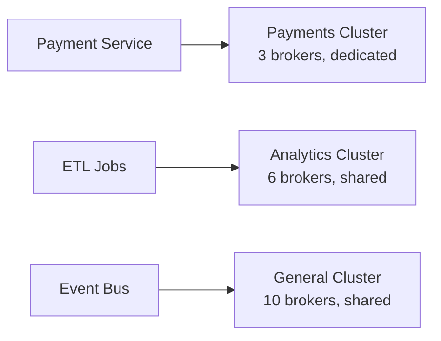
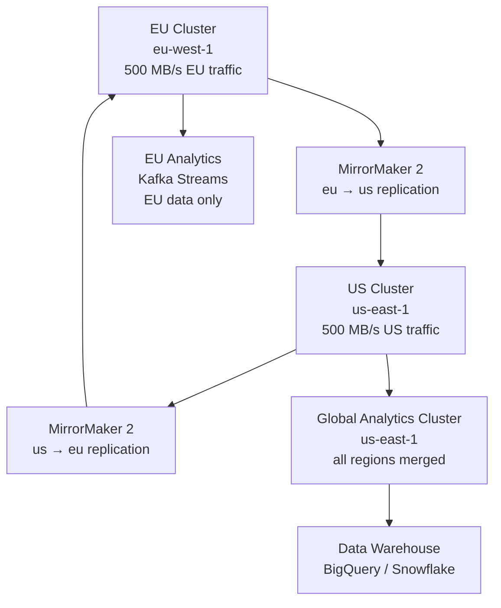

# Scenario Questions — Kafka Performance Tuning

<article data-difficulty="junior">

## 🟢 Junior: Producer Is Too Slow

**Scenario:** Your team's Python producer is sending 10,000 messages per second but the business requires 100,000 messages per second. The messages are 500 bytes each. The broker cluster has plenty of capacity (CPU, disk, network). What changes do you make to the producer configuration?

<details>
<summary>💡 Hint</summary>

The bottleneck is almost certainly batching. At 10,000 msg/s × 500 bytes = 5 MB/s, each message is probably being sent in its own batch (linger.ms=0). Think about how to increase batch sizes and compression to increase throughput without changing the message rate.
</details>

<details>
<summary>✅ Solution</summary>

**Diagnosis:** With `linger.ms=0` (default), each `produce()` call immediately flushes a batch — even if the batch is mostly empty. Each small batch requires a full network round-trip. At 10,000 msg/s, that's 10,000 round-trips per second.

**Solution:** Increase batching:

```python
from confluent_kafka import Producer

# Before (slow):
slow_config = {
    'bootstrap.servers': 'broker:9092',
    'linger.ms': 0,           # immediate send
    'batch.size': 16384,      # 16 KB max batch (default)
    'compression.type': 'none',
}

# After (optimized for throughput):
fast_config = {
    'bootstrap.servers': 'broker:9092',
    'linger.ms': 50,          # wait 50ms to accumulate records
    'batch.size': 524288,      # 512 KB max batch
    'compression.type': 'lz4', # fast compression
    'buffer.memory': 134217728, # 128 MB accumulator
    'acks': '1',               # leader-only ack (faster)
}

producer = Producer(fast_config)
```

**Expected result:**
- With `linger.ms=50`: batches fill with ~500 msgs × 500 bytes = ~250 KB before sending
- Compression (lz4, ~2:1 ratio): ~125 KB on wire per batch
- Result: ~2 large batches per second instead of 10,000 small ones
- Throughput: easily achieves 100,000 msg/s on a well-specced cluster

**Verification:**
```python
# Check batch-size-avg metric — should be near batch.size
# If batch-size-avg << batch.size: records are arriving too fast, batch fills before linger.ms
# If batch-size-avg = batch.size: good batching
# Check compression-rate-avg < 1.0: confirms compression is working
```

**Additional considerations:**
- If 100K msg/s still not enough: add more producer instances (each producer goes to a subset of partitions)
- Verify topic has enough partitions for parallel producers (one partition per producer thread)
</details>

</article>

<article data-difficulty="mid-level">

## 🟡 Mid-Level: Broker Request Handler Saturation

**Scenario:** Your Kafka cluster serves a mix of workloads: batch ETL jobs (10 GB/s bursts for 2 hours daily), real-time payment processing (5,000 events/s, p99 latency SLA of 50ms), and analytics consumers. During ETL batch windows, payment producer latency spikes to 300-500ms p99.

**Question:** Diagnose the root cause and design a solution that keeps payment latency within SLA even during ETL bursts.

<details>
<summary>💡 Hint</summary>

The ETL burst is consuming broker request handler capacity, leaving less for real-time payment requests. Think about quotas (throttle ETL producers), request prioritization, or architectural separation. Also consider whether the ETL and payment topics are on the same brokers.
</details>

<details>
<summary>✅ Solution</summary>

**Root Cause Diagnosis:**

```bash
# During ETL window, check request handler idle %
# Expected: drops from 60% to < 10% → request handler saturated
# Payment requests queue behind ETL requests → latency spike

kafka-topics.sh --bootstrap-server broker:9092 \
  --describe --topic payments
# Check: are payment partitions on the same brokers as ETL topics?
```

**Solution 1: ETL Producer Quotas (Immediate Fix)**

```bash
# Throttle ETL producers to 2 GB/s (was 10 GB/s)
# Leaves capacity for payment requests
kafka-configs.sh --bootstrap-server broker:9092 \
  --alter \
  --add-config 'producer_byte_rate=2147483648' \
  --entity-type clients --entity-name etl-batch-producer

# Verify throttle is applied
# Metric: kafka.producer:type=producer-metrics,name=produce-throttle-time-avg
# Should be > 0 during ETL window, meaning broker is throttling the ETL producer
```

**Solution 2: Broker-Level Request Prioritization**

Kafka does not natively prioritize requests by topic. Workaround: dedicated listener for payments:

```properties
# In broker server.properties — dedicated listener for high-priority clients
listeners=PLAINTEXT://:9092,PAYMENTS://:9093
listener.security.protocol.map=PLAINTEXT:PLAINTEXT,PAYMENTS:PLAINTEXT
num.network.threads=8
# Assign more threads to PAYMENTS listener via custom thread pool (3.x feature)
```

**Solution 3: Partition Reassignment (Longer-Term)**

Ensure ETL topics and payment topics are on different brokers:

```bash
# Check current assignment
kafka-topics.sh --bootstrap-server broker:9092 --describe --topic etl-large-topic
# Note which brokers host ETL partitions

kafka-topics.sh --bootstrap-server broker:9092 --describe --topic payments
# Note which brokers host payment partitions

# If they overlap: generate a reassignment plan to move ETL to dedicated brokers
kafka-reassign-partitions.sh --bootstrap-server broker:9092 \
  --topics-to-move-json-file etl-topics.json \
  --broker-list "4,5,6" \   # dedicated ETL brokers
  --generate > reassignment.json

# Apply reassignment (throttled to not impact production)
kafka-reassign-partitions.sh --bootstrap-server broker:9092 \
  --reassignment-json-file reassignment.json \
  --execute --throttle 52428800   # 50 MB/s reassignment throttle
```

**Solution 4: Architecture — Dedicated Clusters**

For truly critical workloads, separate clusters:



**Tradeoffs:**

| Solution | Effort | Effectiveness | Cost |
|---------|--------|---------------|------|
| Quotas | Low | Medium (limits ETL speed) | None |
| Partition reassignment | Medium | High | None |
| Dedicated listener | Medium | Low | None |
| Dedicated cluster | High | Very High | Additional cluster |

**Recommendation**: Apply quotas immediately (< 1 hour), then execute partition reassignment over the next week. If ETL patterns are persistent and payment SLA is critical, plan for dedicated clusters in next quarter.
</details>

</article>

<article data-difficulty="senior">

## 🔴 Senior: Designing a Multi-Region Kafka Architecture for Global Low Latency

**Scenario:** Your company is expanding globally. Currently, you have a single Kafka cluster in `us-east-1`. You need to:
1. Serve European users (EU) with < 20ms message latency
2. Keep a global view of all events for analytics
3. Handle 500 MB/s total produce rate across regions
4. Meet GDPR requirements (EU data stays in EU initially)

**Question:** Design the multi-region Kafka architecture. Discuss replication strategies, consistency models, and performance tradeoffs.

<details>
<summary>✅ Solution</summary>

**Architecture Overview:**



**Component Design:**

**1. Regional Clusters (Active-Active)**

```properties
# EU Cluster (eu-west-1)
# 6 brokers, i3en.3xlarge (7.5 TB NVMe each)
bootstrap.servers=eu-broker1:9092,eu-broker2:9092
default.replication.factor=3
min.insync.replicas=2
num.partitions=100  # per topic (supports 500 MB/s at 5 MB/s per partition)
```

```properties
# US Cluster (us-east-1)  
# 6 brokers, same spec
bootstrap.servers=us-broker1:9092,us-broker2:9092
default.replication.factor=3
min.insync.replicas=2
```

**2. MirrorMaker 2 Configuration**

```yaml
# mm2.properties — bidirectional replication
clusters = eu, us

eu.bootstrap.servers = eu-broker1:9092
us.bootstrap.servers = us-broker1:9092

# EU → US replication (for global analytics)
eu->us.enabled = true
eu->us.topics = eu\..*  # only replicate eu-prefixed topics
eu->us.replication.factor = 3
eu->us.sync.topic.configs.enabled = true

# US → EU replication (for EU consumers needing US data)
us->eu.enabled = true
us->eu.topics = us\..*
us->eu.replication.factor = 3

# Remote topics appear as: eu.topic-name in US cluster
# This preserves data origin tracking (GDPR compliance)
```

**3. Topic Naming and Routing**

```python
# Producers route to their local cluster
def get_producer(user_region: str, bootstrap_map: dict) -> Producer:
    """Route producer to local cluster based on user region."""
    bootstrap = bootstrap_map.get(user_region, bootstrap_map['us'])
    return Producer({
        'bootstrap.servers': bootstrap,
        'linger.ms': 5,
        'batch.size': 131072,
        'compression.type': 'lz4',
        'acks': 'all',
        'enable.idempotence': True,
    })

# Topic naming: {region}.{service}.{event-type}
# EU producer: writes to eu.payments.order-placed
# US producer: writes to us.payments.order-placed
# MM2 replicates eu.* topics to US cluster as eu.eu.payments.order-placed
```

**4. GDPR Compliance**

```python
class GDPRCompliantProducer:
    """Routes EU personal data to EU cluster only initially."""

    def produce(self, event: dict, user_region: str):
        contains_pii = event.get('email') or event.get('ip_address')

        if user_region == 'EU' and contains_pii:
            # PII data stays in EU until explicitly migrated
            self.eu_producer.produce('eu.user-events', ...)
            # MM2 will NOT replicate pii-tagged topics to US
        else:
            local_producer = self.get_producer(user_region)
            local_producer.produce(f'{user_region.lower()}.user-events', ...)
```

**5. Global Analytics Aggregation**

```python
# Kafka Streams on US cluster reads from both local and replicated EU topics
from confluent_kafka.streams import StreamsBuilder

builder = StreamsBuilder()

# Global orders stream: merge US and EU events
us_orders = builder.stream("us.payments.order-placed")
eu_orders = builder.stream("eu.eu.payments.order-placed")  # MM2 remote topic

global_orders = us_orders.merge(eu_orders)

# Aggregate globally
global_revenue = global_orders \
    .groupBy(lambda k, v: v['region']) \
    .windowedBy(TimeWindows.ofSizeWithNoGrace(Duration.ofHours(1))) \
    .aggregate(...)

global_revenue.to("global.revenue-by-region-hourly")
```

**Performance Analysis:**

| Metric | Target | Design Achievement |
|--------|--------|-------------------|
| EU producer latency | < 20ms | ~2ms (local cluster, eu-west-1) |
| US→EU replication lag | < 100ms | ~80ms (cross-Atlantic via MM2) |
| Total throughput | 500 MB/s | 250 MB/s per cluster, 6 brokers each |
| Global analytics delay | < 5 min | ~2 min (MM2 lag + Streams processing) |

**Failure Mode Handling:**

| Failure | Impact | Mitigation |
|---------|--------|-----------|
| EU cluster down | EU producers fail | Fallback to US cluster (sacrifice GDPR compliance temporarily) |
| MM2 replication stalled | Analytics delayed | Alert on MM2 lag > 5 min; auto-restart MM2 |
| Cross-region network partition | Replication stalls | Clusters operate independently; replay when reconnected |

**Cost Estimate:**
- EU cluster: 6 × i3en.3xlarge = $6/hr × 24 × 30 = $4,320/month
- US cluster: same = $4,320/month
- MM2 instances: 2 × m5.2xlarge = $300/month
- Cross-region data transfer: 500 MB/s × 86400 × 30 × $0.02/GB ≈ $25,920/month
- **Total: ~$35,000/month**

The cross-region data transfer cost dominates. Mitigations: compress aggressively (MM2 uses source compression), replicate only necessary topics (not raw click events), use topic filtering in MM2.
</details>

</article>

---

## ⚡ Quick-fire Q&A

**Q: What are the most impactful producer settings for throughput optimization?**
A: `batch.size` (larger batches = fewer requests), `linger.ms` (wait time to fill batches before sending), `compression.type` (snappy/lz4 reduces network and disk I/O), and `buffer.memory` (total memory for buffering). These settings trade latency for throughput.

**Q: How does increasing partition count improve Kafka throughput?**
A: More partitions enable more parallel producers writing and more parallel consumers reading. Each partition is handled by one broker leader and consumed by one consumer in a group. More partitions increase parallelism but add overhead: more open file handles, more replication traffic, and longer leader election time.

**Q: What is the impact of replication factor on performance?**
A: Each additional replica adds write latency because producers with `acks=all` must wait for all ISRs to acknowledge. Higher replication increases fault tolerance but increases broker network I/O and disk usage. The default of 3 balances durability and performance for most workloads.

**Q: How does `acks` setting affect producer performance and durability?**
A: `acks=0` is fastest (fire and forget, data loss possible), `acks=1` waits for leader acknowledgment (leader failure may lose data), `acks=all` (-1) waits for all ISRs (highest durability, highest latency). Choose based on your data loss tolerance.

**Q: What is log compaction and how does it affect performance?**
A: Log compaction removes older records with the same key, retaining only the latest value. It reduces disk usage for changelog-style topics but adds background I/O for the compaction process. Compaction threads compete with normal I/O — tune `log.cleaner.threads` to balance.

**Q: How does consumer fetch tuning improve throughput?**
A: Increase `fetch.min.bytes` and `fetch.max.wait.ms` so consumers fetch larger batches less frequently, reducing per-request overhead. Increase `max.partition.fetch.bytes` to allow larger per-partition fetches. These settings reduce network round trips at the cost of slightly higher latency.

**Q: What is page cache and why is it critical to Kafka performance?**
A: Kafka relies heavily on the OS page cache for read performance — brokers write to disk sequentially and consumers typically read recent data still in the page cache, avoiding disk reads entirely. Dedicated Kafka brokers should have ample RAM for page cache, and data on disk should not exceed page cache size for hot topics.

**Q: How do you diagnose and resolve a slow broker in Kafka?**
A: Check under-replicated partitions (ISR shrink signals the slow broker), broker disk I/O saturation, network throughput, GC pause times (JVM), and request handler thread pool saturation. Remediate by rebalancing partitions off the hot broker, tuning JVM heap, or adding capacity.

---

## 💼 Interview Tips

- Know the producer batching triangle: batch.size + linger.ms + compression.type together control producer throughput. Tuning one in isolation is less effective than understanding how they interact.
- Be ready to discuss the partition count trade-off: more partitions = more parallelism but also more overhead. The "10x your consumer count" rule of thumb is a starting point, not a formula — show you'd benchmark your specific workload.
- Page cache is Kafka's most underappreciated performance lever — mentioning it proactively shows you understand Kafka's I/O architecture, not just configuration knobs.
- Discuss acks in terms of the durability/latency trade-off explicitly — never recommend `acks=0` without acknowledging data loss risk. Senior interviewers want to see you connect settings to their operational consequences.
- For senior roles, discuss partition rebalancing with kafka-reassign-partitions.sh — knowing how to move partitions to relieve a hot broker without downtime demonstrates operational maturity.
- Avoid saying "just add more brokers" as a first response to performance issues — diagnose the bottleneck (network, disk, CPU, consumer lag) before prescribing infrastructure changes.
