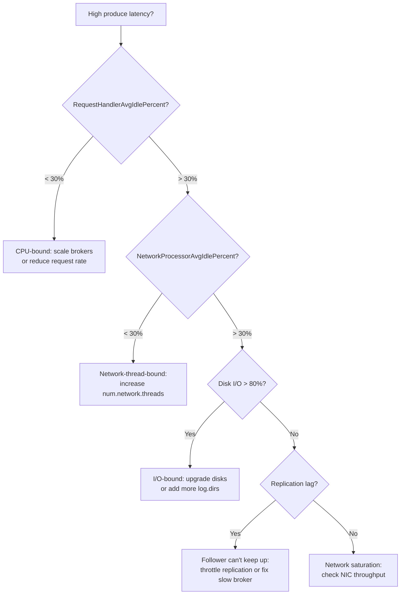
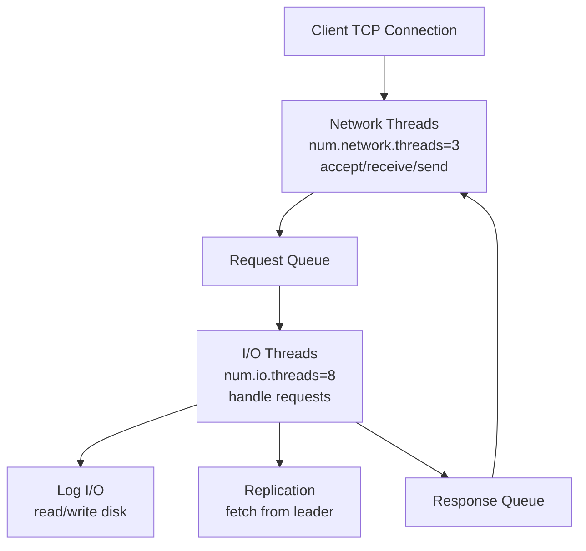
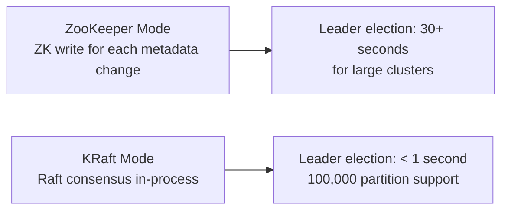

# Kafka Performance Tuning — Senior Deep Dive

## Identifying Bottlenecks Systematically

Before tuning, identify where the bottleneck is:



### Bottleneck Metrics Reference

| Metric | Location | Saturation Signal |
|--------|----------|------------------|
| `RequestHandlerAvgIdlePercent` | Broker JMX | < 30% idle |
| `NetworkProcessorAvgIdlePercent` | Broker JMX | < 30% idle |
| `node_disk_io_time_seconds` | Prometheus/node_exporter | > 80% utilization |
| `node_network_transmit_bytes` | Prometheus/node_exporter | > 80% NIC capacity |
| `kafka.network:name=RequestQueueSize` | Broker JMX | > 50 sustained |
| `replica.lag.time.max.ms` | Broker JMX | Growing = follower slow |

## Broker Thread Model

Understanding thread allocation helps tune concurrency:



```properties
# Tuning thread counts
num.network.threads=8     # default 3; increase for high-connection-count brokers
num.io.threads=16         # default 8; increase for I/O-heavy workloads
num.replica.fetchers=4    # default 1; increase for fast replication catch-up
background.threads=10     # default 10; handles leader election, log cleanup
```

**Tuning guidance:**
- `num.network.threads`: number of vCPUs ÷ 4 to ÷ 2
- `num.io.threads`: 2× the number of disks, or match number of vCPUs
- `num.replica.fetchers`: increase when followers are consistently lagging

## Advanced Producer Pipelining

### Max In-Flight Requests

```python
# Without idempotence: up to 5 requests in flight per connection
# Each in-flight request is an unacknowledged ProduceRequest batch
# More in-flight = higher throughput (less idle time waiting for ACK)

producer = Producer({
    'bootstrap.servers': 'broker:9092',
    # Without idempotence: can use up to 10+ in-flight for throughput
    # With idempotence: max 5 (enforced by Kafka for ordering guarantee)
    'max.in.flight.requests.per.connection': 10,   # only without idempotence
    'enable.idempotence': False,
    'acks': '1',
})
```

### Producer Throughput Benchmarking

```bash
# Kafka built-in producer benchmark
kafka-producer-perf-test.sh \
  --topic perf-test \
  --num-records 10000000 \
  --record-size 1024 \
  --throughput -1 \  # unlimited (max throughput test)
  --producer-props \
    bootstrap.servers=broker:9092 \
    acks=1 \
    linger.ms=50 \
    batch.size=131072 \
    compression.type=lz4

# Output:
# 10000000 records sent, 1250000.00 records/sec (1192.09 MB/sec),
# 3.55 ms avg latency, 250.00 ms max latency,
# 1 ms 50th, 2 ms 95th, 4 ms 99th, 8 ms 99.9th.
```

### Consumer Throughput Benchmarking

```bash
kafka-consumer-perf-test.sh \
  --bootstrap-server broker:9092 \
  --topic perf-test \
  --messages 10000000 \
  --threads 4 \
  --fetch-size 1048576 \  # 1 MB fetch size
  --from-latest
```

## KRaft Mode Performance (Kafka 3.3+)

KRaft (ZooKeeper-free Kafka) improves performance in several ways:



```properties
# KRaft broker config
process.roles=broker,controller
node.id=1
controller.quorum.voters=1@controller1:9093,2@controller2:9093,3@controller3:9093
listeners=PLAINTEXT://:9092,CONTROLLER://:9093
inter.broker.listener.name=PLAINTEXT
```

**KRaft performance improvements:**
- Controller failover: seconds (vs minutes with ZK)
- Metadata propagation: direct to brokers (vs ZK watch)
- Supports 1M+ partitions per cluster (vs ~200K with ZK)

## Network and Storage Advanced Tuning

### Network Buffer Sizing

```bash
# Increase send/receive buffers for high-throughput brokers
# In server.properties:
socket.send.buffer.bytes=1048576    # 1 MB (default 100 KB)
socket.receive.buffer.bytes=1048576  # 1 MB (default 100 KB)
socket.request.max.bytes=104857600   # 100 MB max request size

# Linux kernel-level:
sysctl -w net.core.somaxconn=16384   # max pending connections
sysctl -w net.ipv4.tcp_max_syn_backlog=16384
```

### RAID vs JBOD for Kafka

| Storage | Pros | Cons |
|---------|------|------|
| RAID 10 | Redundancy + performance | Cost, rebuild time risks data |
| JBOD (Just a Bunch of Disks) | Simple, native Kafka replication handles durability | No hardware-level redundancy |

**Recommendation**: JBOD with multiple disks and `log.dirs` pointing to each. Kafka's replication provides durability better than RAID. RAID10 on SSDs adds cost without benefit since Kafka already replicates.

```properties
# Multiple JBOD disks
log.dirs=/ssd1/kafka,/ssd2/kafka,/ssd3/kafka,/ssd4/kafka

# Kafka distributes new partitions across directories using a disk-space-aware
# algorithm (chooses the directory with the most free space)
```

## Optimization for Specific Hardware

### Cloud (AWS EC2)

```
Recommended instance types:
- i3en.3xlarge: 7.5 TB NVMe, 12 vCPU, 96 GB RAM — best storage
- r5.2xlarge: 64 GB RAM, good for page cache heavy workloads
- m5.4xlarge: balanced; 16 vCPU, 64 GB RAM

EBS vs Instance Store:
- Instance Store: lowest latency, lost on stop/terminate
- EBS gp3: 16,000 IOPS, 1000 MB/s bandwidth, persistent
- EBS io2: up to 64,000 IOPS — for extreme I/O workloads
```

### MSK Instance Sizing

```
kafka.m5.large:   2 vCPU, 8 GB  → dev/test
kafka.m5.2xlarge: 8 vCPU, 32 GB → small production
kafka.m5.4xlarge: 16 vCPU, 64 GB → medium production
kafka.m5.8xlarge: 32 vCPU, 128 GB → large production

MSK EBS storage: 1 TB to 16 TB per broker (resize without restart)
```

## Performance Anti-Patterns

| Anti-Pattern | Problem | Fix |
|-------------|---------|-----|
| Too many small topics/partitions | Excessive file handles; slow leader election | Consolidate topics; use partitioning within topics |
| Synchronous fsync | 100x throughput reduction | Remove `log.flush.interval.*` settings |
| ZGC on Kafka brokers | Not optimized for Kafka's allocation pattern | Use G1GC |
| Heap > 8 GB | Long GC pauses | 6 GB heap; let OS manage page cache |
| RAID5/RAID6 on Kafka | Write amplification; slow rebuild | JBOD with Kafka replication |
| Compression=gzip | High CPU overhead | Use lz4 or zstd |
| Under-partitioned topics | Producer throughput bottleneck | Add partitions (before you're in trouble) |

## Interview Tips

> **Tip 1:** The bottleneck identification flowchart is what separates performance experts from guessers. Start with `RequestHandlerAvgIdlePercent` — if it's high (> 70%), the broker isn't CPU-bound and you should look at network or disk. This systematic approach impresses interviewers.

> **Tip 2:** KRaft (ZooKeeper-free Kafka) is the future. Know that it achieves < 1-second controller failover vs 30+ seconds with ZooKeeper. For large clusters (10,000+ partitions), this difference is significant in incident response.

> **Tip 3:** JBOD vs RAID: Kafka's own replication makes RAID redundancy unnecessary. RAID10 on Kafka actually makes things worse in some failure scenarios (a RAID rebuild can impact broker I/O). Recommend JBOD with 4+ disks and multiple `log.dirs`.

> **Tip 4:** The heap size cap at 6-8 GB is counter-intuitive. Larger heaps mean longer GC pauses, not better performance. The page cache (OS RAM) is more valuable to Kafka than heap. Show you understand this Linux memory architecture detail.

> **Tip 5:** Benchmarking with `kafka-producer-perf-test.sh` and `kafka-consumer-perf-test.sh` is how you validate tuning changes. Always benchmark before and after tuning to demonstrate actual improvement, not just theoretical reasoning.
