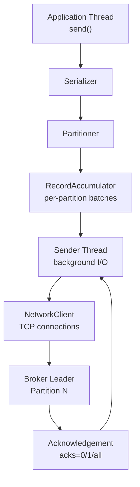
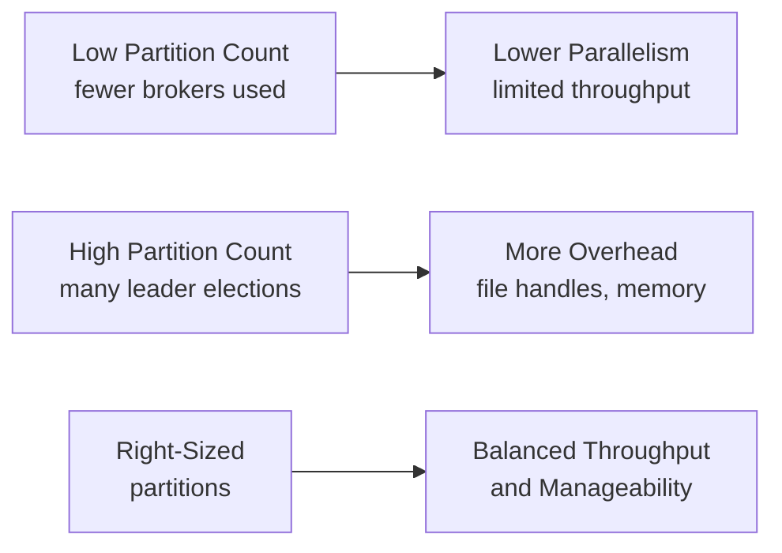
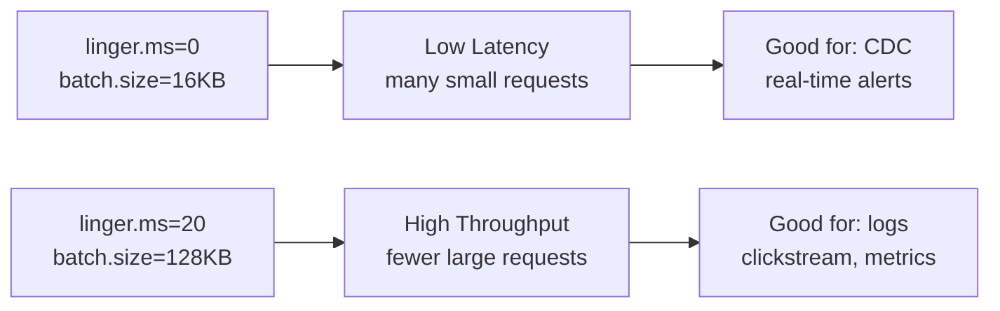

# Kafka Producers — Intermediate

## Producer Internals: The Full Pipeline

Understanding the producer internals beyond basic configuration lets you tune throughput and reliability for production workloads.



### RecordAccumulator and Batching

The `RecordAccumulator` buffers records into `ProducerBatch` objects keyed by `TopicPartition`. The Sender thread drains these batches and sends them as `ProduceRequest` calls.

Key parameters that interact:
- `batch.size` — maximum bytes per batch (default 16 KB)
- `linger.ms` — how long to wait for more records before flushing (default 0)
- `buffer.memory` — total memory available to the accumulator (default 32 MB)
- `max.block.ms` — how long `send()` blocks when buffer is full (default 60 s)

```python
from confluent_kafka import Producer

producer = Producer({
    'bootstrap.servers': 'broker1:9092,broker2:9092',
    'batch.size': 65536,          # 64 KB — larger batches for throughput
    'linger.ms': 10,              # wait up to 10 ms to fill batches
    'buffer.memory': 67108864,    # 64 MB accumulator buffer
    'compression.type': 'snappy',
    'acks': 'all',
    'enable.idempotence': True,
})
```

## Compression Deep Dive

Compression happens at the batch level, not per-record. Larger batches compress more effectively.

| Codec    | CPU Cost | Compression Ratio | Latency Impact | Best For               |
|----------|----------|-------------------|----------------|------------------------|
| none     | Zero     | 1x                | None           | Low-latency, small msgs |
| gzip     | High     | 4-6x              | Medium         | Archive topics          |
| snappy   | Low      | 2-3x              | Low            | General purpose         |
| lz4      | Very Low | 2-3x              | Very Low       | High throughput         |
| zstd     | Medium   | 4-5x              | Low            | Best ratio/CPU tradeoff |

### Compression in Practice

```python
# zstd for best compression ratio with acceptable CPU
producer = Producer({
    'bootstrap.servers': 'broker:9092',
    'compression.type': 'zstd',
    'compression.level': 3,    # 1-22, default 3; higher = better ratio
    'batch.size': 131072,      # 128 KB; larger = better compression
    'linger.ms': 20,
})
```

Broker-side decompression: consumers receive data compressed; they decompress. Brokers decompress only for validation or when `compression.type` differs.

## Partitioning Strategies

### Default Partitioner (Kafka 2.4+)

The sticky partitioner batches records to the same partition until `batch.size` is reached or `linger.ms` elapses, then switches. This improves batching efficiency over the old round-robin.

```python
# Keyed messages → hash(key) % num_partitions (consistent routing)
producer.produce('orders', key='user-123', value='{"amount": 99.99}')

# Null key → sticky round-robin
producer.produce('events', value='{"type": "click"}')
```

### Custom Partitioner

```python
from confluent_kafka import Producer

def my_partitioner(key, all_partitions, available_partitions):
    """Route VIP customers to dedicated partition."""
    if key and key.startswith(b'vip-'):
        return 0   # VIP partition
    # hash remaining keys across partitions 1..N
    return (hash(key) % (len(all_partitions) - 1)) + 1

producer = Producer({
    'bootstrap.servers': 'broker:9092',
    'on_delivery': lambda err, msg: print(f"Delivered to {msg.partition()}"),
})
```

### Partition Count Considerations



Rule of thumb: target **10–100 MB/s per partition**. Over-partitioning wastes file handles (each partition = 1 segment file open).

## Idempotent Producer

Idempotence prevents duplicate writes during retries by assigning each producer a **Producer ID (PID)** and a **sequence number** per partition.

```python
producer = Producer({
    'bootstrap.servers': 'broker:9092',
    'enable.idempotence': True,
    # These are auto-set when idempotence is enabled:
    # acks = all
    # retries = INT_MAX
    # max.in.flight.requests.per.connection = 5
})
```

When the broker receives a duplicate (same PID + sequence), it deduplicates silently. The producer epoch increments on restart, preventing zombie producers from duplicating after a crash.

## Error Handling and Retries

### Retriable vs Non-Retriable Errors

| Error Type | Examples | Retry? |
|------------|----------|--------|
| Retriable | `LEADER_NOT_AVAILABLE`, `NOT_ENOUGH_REPLICAS` | Yes (automatic) |
| Non-retriable | `MESSAGE_TOO_LARGE`, `INVALID_TOPIC` | No (surface to app) |
| Transient network | Connection reset, timeout | Yes |

```python
from confluent_kafka import Producer, KafkaError

def delivery_report(err, msg):
    if err is not None:
        if err.retriable():
            print(f"Retriable error — producer will retry: {err}")
        else:
            print(f"Fatal error — record dropped: {err}")
            # Alert / dead-letter logic here
    else:
        print(f"Delivered to {msg.topic()} [{msg.partition()}] @ {msg.offset()}")

producer = Producer({
    'bootstrap.servers': 'broker:9092',
    'enable.idempotence': True,
    'retry.backoff.ms': 100,
    'retry.backoff.max.ms': 1000,  # exponential backoff cap
    'delivery.timeout.ms': 120000, # total time including retries
})

producer.produce('my-topic', value=b'data', on_delivery=delivery_report)
producer.flush()
```

### Back-pressure and `max.block.ms`

When the accumulator buffer is full, `send()` blocks for up to `max.block.ms`. After that it throws `BufferExhaustedException`. Solutions:

1. Increase `buffer.memory`
2. Increase `linger.ms` + `batch.size` to improve throughput
3. Apply producer-side back-pressure (throttle your source)

## Transactions (Producer Side)

Transactional producers enable exactly-once semantics across partitions. They require a unique `transactional.id`.

```python
producer = Producer({
    'bootstrap.servers': 'broker:9092',
    'transactional.id': 'my-service-producer-1',
    'enable.idempotence': True,   # automatically enabled with transactions
})

producer.init_transactions()

try:
    producer.begin_transaction()
    producer.produce('output-topic', key='k1', value='v1')
    producer.produce('output-topic', key='k2', value='v2')
    producer.commit_transaction()
except Exception as e:
    producer.abort_transaction()
    raise
```

The broker uses a two-phase commit (prepare → commit marker) across partitions. Consumers using `isolation.level=read_committed` only see committed transactions.

## Monitoring Producer Health

Key JMX metrics to watch:

| Metric | Description | Alert Threshold |
|--------|-------------|-----------------|
| `record-error-rate` | Failed deliveries per second | > 0 |
| `record-retry-rate` | Retries per second | Sustained > 10/s |
| `batch-size-avg` | Average batch size in bytes | Near `batch.size` = good batching |
| `produce-throttle-time-avg` | Broker throttling ms | > 0 = quota hit |
| `buffer-exhausted-rate` | Blocking send() calls | > 0 = back-pressure |
| `request-latency-avg` | Round-trip to broker | > 500 ms worth investigating |

```python
# Programmatic monitoring with confluent-kafka
import threading

def poll_metrics(producer, interval=10):
    while True:
        stats = producer.poll(0)
        # confluent-kafka exposes stats via stats_cb
        threading.Event().wait(interval)

producer = Producer({
    'bootstrap.servers': 'broker:9092',
    'statistics.interval.ms': 10000,
    'stats_cb': lambda stats_json: print(stats_json),
})
```

## Throughput vs Latency Tradeoffs



Config presets for common use cases:

```python
# Low-latency (payment events, alerts)
low_latency_config = {
    'linger.ms': 0,
    'batch.size': 16384,
    'acks': '1',
    'compression.type': 'none',
}

# High-throughput (logs, metrics ingestion)
high_throughput_config = {
    'linger.ms': 50,
    'batch.size': 131072,
    'acks': 'all',
    'compression.type': 'lz4',
    'enable.idempotence': True,
}
```

## Interview Tips

> **Tip 1:** When asked about producer performance, always connect `linger.ms` and `batch.size` together — they're co-dependent. Setting `linger.ms=0` with a large `batch.size` rarely helps because batches never fill at zero wait.

> **Tip 2:** Explain idempotence using PID + sequence numbers. Mention that `max.in.flight.requests.per.connection ≤ 5` is required because idempotence only deduplicates in-order sequences per partition.

> **Tip 3:** For the "how do you prevent data loss" question, lead with `acks=all` + `min.insync.replicas=2` on the broker side, and `enable.idempotence=True` + `retries=MAX_INT` on the producer side.

> **Tip 4:** Know the difference between idempotent producers (dedup per session) and transactional producers (atomic multi-partition writes). Idempotence does NOT survive producer restarts without transactions.

> **Tip 5:** Compression happens at the batch level — larger batches compress better. This is why `linger.ms > 0` often improves compression ratios significantly in production.
