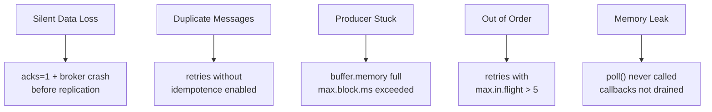

# Kafka Producers — Real World Patterns

## Pattern 1: Reliable Event Producer with Dead-Letter Queue

Production producers must handle failures gracefully. Non-retriable errors must not silently drop data.

```python
import json
import logging
from confluent_kafka import Producer, KafkaError
from dataclasses import dataclass
from typing import Optional

logger = logging.getLogger(__name__)

@dataclass
class ProducerEvent:
    topic: str
    key: str
    value: dict
    headers: Optional[dict] = None

class ReliableProducer:
    def __init__(self, bootstrap_servers: str, dlq_topic: str):
        self.dlq_topic = dlq_topic
        self.producer = Producer({
            'bootstrap.servers': bootstrap_servers,
            'enable.idempotence': True,
            'acks': 'all',
            'compression.type': 'snappy',
            'linger.ms': 5,
            'batch.size': 65536,
            'delivery.timeout.ms': 30000,
            'statistics.interval.ms': 60000,
            'stats_cb': self._on_stats,
        })

    def send(self, event: ProducerEvent) -> None:
        headers = [(k, v.encode()) for k, v in (event.headers or {}).items()]
        self.producer.produce(
            topic=event.topic,
            key=event.key.encode(),
            value=json.dumps(event.value).encode(),
            headers=headers,
            on_delivery=lambda err, msg: self._on_delivery(err, msg, event),
        )
        # Poll to trigger callbacks; non-blocking
        self.producer.poll(0)

    def _on_delivery(self, err, msg, original_event: ProducerEvent):
        if err is None:
            logger.debug("Delivered %s to %s[%d]@%d",
                         original_event.key, msg.topic(), msg.partition(), msg.offset())
            return

        if not err.retriable():
            logger.error("Non-retriable error for %s: %s — sending to DLQ",
                         original_event.key, err)
            self._send_to_dlq(original_event, str(err))
        else:
            # retriable errors are retried automatically by the producer
            logger.warning("Retriable error (will retry): %s", err)

    def _send_to_dlq(self, event: ProducerEvent, error_reason: str):
        dlq_payload = {
            'original_topic': event.topic,
            'original_key': event.key,
            'original_value': event.value,
            'error': error_reason,
        }
        self.producer.produce(
            topic=self.dlq_topic,
            key=event.key.encode(),
            value=json.dumps(dlq_payload).encode(),
        )

    def _on_stats(self, stats_json: str):
        import json
        stats = json.loads(stats_json)
        txn_msgs = stats.get('txn_msgs', 0)
        logger.info("Producer stats: msgs_in_flight=%d", txn_msgs)

    def flush(self, timeout: float = 10.0) -> int:
        return self.producer.flush(timeout)

    def __enter__(self):
        return self

    def __exit__(self, *args):
        remaining = self.flush()
        if remaining > 0:
            logger.warning("%d messages not delivered on close", remaining)
```

## Pattern 2: Transactional Producer for ETL Pipelines

A canonical pattern: consume from one topic, transform, produce to another — exactly once.

```python
from confluent_kafka import Producer, Consumer, TopicPartition

class TransactionalETL:
    """Read-process-write with exactly-once semantics."""

    def __init__(self, bootstrap: str, group_id: str, txn_id: str):
        self.consumer = Consumer({
            'bootstrap.servers': bootstrap,
            'group.id': group_id,
            'enable.auto.commit': False,   # manual commit via producer transaction
            'isolation.level': 'read_committed',
            'auto.offset.reset': 'earliest',
        })
        self.producer = Producer({
            'bootstrap.servers': bootstrap,
            'transactional.id': txn_id,
            'enable.idempotence': True,
        })
        self.producer.init_transactions()

    def run(self, input_topic: str, output_topic: str):
        self.consumer.subscribe([input_topic])

        while True:
            batch = self.consumer.consume(num_messages=100, timeout=1.0)
            if not batch:
                continue

            self.producer.begin_transaction()
            try:
                for msg in batch:
                    if msg.error():
                        continue
                    transformed = self._transform(msg.value())
                    self.producer.produce(
                        output_topic,
                        key=msg.key(),
                        value=transformed,
                    )

                # Send offsets as part of the transaction
                offsets = [
                    TopicPartition(m.topic(), m.partition(), m.offset() + 1)
                    for m in batch if not m.error()
                ]
                self.producer.send_offsets_to_transaction(
                    offsets,
                    self.consumer.consumer_group_metadata(),
                )
                self.producer.commit_transaction()

            except Exception as e:
                self.producer.abort_transaction()
                raise

    def _transform(self, value: bytes) -> bytes:
        # Your transformation logic
        import json
        data = json.loads(value)
        data['processed'] = True
        return json.dumps(data).encode()
```

## Pattern 3: Schema-Aware Producer with Confluent Schema Registry

```python
from confluent_kafka import Producer
from confluent_kafka.schema_registry import SchemaRegistryClient
from confluent_kafka.schema_registry.avro import AvroSerializer
from confluent_kafka.serialization import SerializationContext, MessageField

schema_str = """
{
  "type": "record",
  "name": "Order",
  "namespace": "com.example",
  "fields": [
    {"name": "order_id", "type": "string"},
    {"name": "amount",   "type": "double"},
    {"name": "currency", "type": "string"},
    {"name": "ts_ms",    "type": "long"}
  ]
}
"""

sr_client = SchemaRegistryClient({'url': 'http://schema-registry:8081'})
avro_serializer = AvroSerializer(sr_client, schema_str)

producer = Producer({'bootstrap.servers': 'broker:9092'})

def produce_order(order: dict, topic: str = 'orders'):
    producer.produce(
        topic=topic,
        key=order['order_id'],
        value=avro_serializer(
            order,
            SerializationContext(topic, MessageField.VALUE)
        ),
        on_delivery=lambda err, msg: print(f"err={err} offset={msg.offset() if not err else 'N/A'}"),
    )
    producer.poll(0)

produce_order({'order_id': 'ord-001', 'amount': 49.99, 'currency': 'USD', 'ts_ms': 1700000000000})
producer.flush()
```

## Pattern 4: High-Throughput Log Aggregation Producer

For log shipping at scale (millions of events/second), the producer must maximize batching and minimize overhead.

```python
import queue
import threading
from confluent_kafka import Producer

class AsyncBatchProducer:
    """Async producer with internal queue to decouple app from I/O."""

    def __init__(self, bootstrap: str, topic: str, workers: int = 4):
        self.topic = topic
        self.queue: queue.Queue = queue.Queue(maxsize=100000)
        self.producers = [
            Producer({
                'bootstrap.servers': bootstrap,
                'linger.ms': 50,
                'batch.size': 524288,        # 512 KB
                'compression.type': 'lz4',
                'acks': '1',               # sacrifice durability for throughput
                'buffer.memory': 134217728,  # 128 MB
            })
            for _ in range(workers)
        ]
        self._start_workers(workers)

    def _start_workers(self, n: int):
        for i, p in enumerate(self.producers):
            t = threading.Thread(target=self._worker, args=(p,), daemon=True)
            t.start()

    def _worker(self, producer: Producer):
        while True:
            try:
                record = self.queue.get(timeout=1)
                producer.produce(self.topic, value=record)
                producer.poll(0)
            except queue.Empty:
                producer.poll(0)   # drain callbacks even when idle

    def send(self, record: bytes):
        self.queue.put(record)   # blocks if queue full — natural back-pressure
```

## Pattern 5: Producer Health Dashboard

A production producer deployment should expose these metrics to Prometheus/Grafana:

```python
from prometheus_client import Counter, Histogram, Gauge
import json

delivered_total = Counter('kafka_producer_delivered_total', 'Delivered messages', ['topic'])
error_total = Counter('kafka_producer_errors_total', 'Delivery errors', ['topic', 'error'])
batch_size = Histogram('kafka_producer_batch_size_bytes', 'Batch size distribution',
                       buckets=[1024, 4096, 16384, 65536, 131072, 262144, 524288])
buffer_used = Gauge('kafka_producer_buffer_used_bytes', 'Buffer memory in use')

def stats_callback(stats_json: str):
    stats = json.loads(stats_json)
    buffer_used.set(stats.get('buf_grow', 0))
    for topic, tdata in stats.get('topics', {}).items():
        for part, pdata in tdata.get('partitions', {}).items():
            if part == '-1':
                continue
            batch_size.observe(pdata.get('batchsize', {}).get('avg', 0))
```

## Common Production Pitfalls



| Pitfall | Root Cause | Fix |
|---------|-----------|-----|
| Silent data loss | `acks=1`, broker crashes before ISR sync | Use `acks=all` + `min.insync.replicas=2` |
| Producer hangs | `buffer.memory` exhausted | Tune `buffer.memory`, add back-pressure |
| Callbacks not fired | `poll()` not called regularly | Call `poll(0)` after each `produce()` |
| Schema evolution breaks | No backward-compatible schema change | Use Schema Registry with BACKWARD policy |
| Partition hotspot | Null key + sticky partitioner | Use meaningful keys or explicit partitioner |

## Deployment Checklist

- [ ] `enable.idempotence=True` for all non-log producers
- [ ] `acks=all` with `min.insync.replicas=2` on broker
- [ ] `delivery.timeout.ms` tuned to SLA (not default 120 s for low-latency pipelines)
- [ ] Dead-letter topic configured and monitored
- [ ] `statistics.interval.ms` enabled with Prometheus scraping
- [ ] Schema Registry URL configured; schemas pre-registered in CI
- [ ] Graceful shutdown calls `flush()` before process exit
- [ ] Transactional ID unique per instance (use pod name / hostname)

## Interview Tips

> **Tip 1:** When describing the transactional ETL pattern, emphasize `send_offsets_to_transaction()` — this is what makes consumer offset commits atomic with the produce. Without it, you have at-least-once, not exactly-once.

> **Tip 2:** The `poll(0)` call is a common interview gotcha. In confluent-kafka (librdkafka), delivery callbacks are only triggered when you call `poll()`. Forgetting this leads to callback never firing and producer metric counters staying at zero.

> **Tip 3:** For high-throughput scenarios, `acks=1` is often acceptable for log data. Be explicit about the tradeoff: you accept a small window of data loss if a broker crashes after the leader acks but before followers replicate.

> **Tip 4:** Schema Registry with `BACKWARD` compatibility means new schema can read old data. Always register schemas in CI/CD — never let the producer auto-register in production (it bypasses review).

> **Tip 5:** Dead-letter queues are non-negotiable in production. Non-retriable errors (MESSAGE_TOO_LARGE, INVALID_TOPIC) must go somewhere observable. Show you have an operational mindset, not just a "happy path" one.
