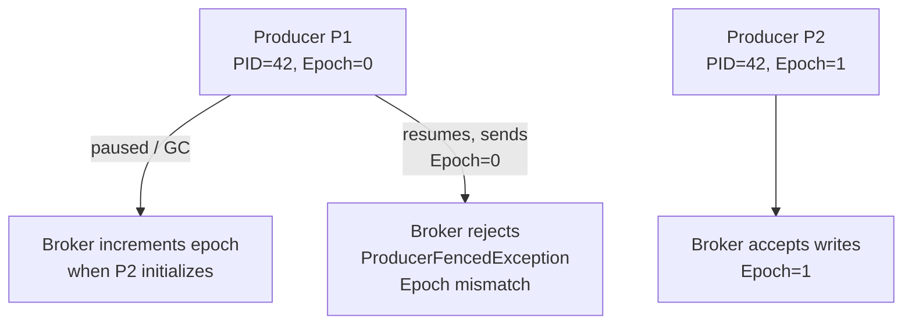
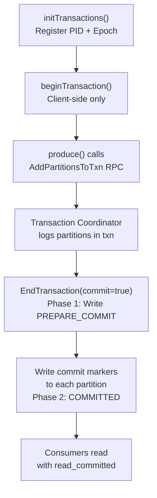
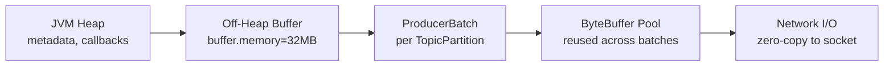

# Kafka Producers — Senior Deep Dive

## Producer Epoch and Fencing

The producer epoch is the mechanism that prevents "zombie producers" — old producer instances that recover from a pause and attempt to write stale data after a newer instance has taken over.



When a new producer calls `initTransactions()` with an existing `transactional.id`, the broker:
1. Bumps the epoch for that PID
2. Fences the old producer (any subsequent write from epoch=old is rejected)
3. Completes or aborts any pending transaction from the old epoch

This guarantees that at most one producer instance is active per `transactional.id` at any time.

## Sequence Numbers and Out-of-Order Detection

Each `(PID, TopicPartition)` pair maintains an independent sequence counter. The broker keeps the last 5 sequences (matching `max.in.flight.requests.per.connection=5`) and rejects:
- **Duplicate sequence**: same sequence received twice → silently drop
- **Out-of-order sequence**: gap detected → `OutOfOrderSequenceException` (non-retriable)

```python
# This is why you must NOT exceed 5 in-flight requests with idempotence
producer = Producer({
    'enable.idempotence': True,
    # confluent-kafka auto-sets this; do not override > 5
    'max.in.flight.requests.per.connection': 5,
    'acks': 'all',
    'retries': 2147483647,
})
```

If the broker detects a sequence gap, the `OutOfOrderSequenceException` surfaces to the application — this indicates a bug, not a transient failure.

## Two-Phase Commit Protocol in Kafka Transactions

Kafka's transaction protocol is a distributed 2PC coordinated by the **Transaction Coordinator** (a special broker partition from `__transaction_state`).



The **transaction log** (`__transaction_state`) is replicated with replication factor 3. If the transaction coordinator fails mid-commit, the new coordinator reads the log and completes (or aborts) the pending transaction.

### Transaction Timeout and Abort

```python
producer = Producer({
    'transactional.id': 'etl-pipeline-1',
    'transaction.timeout.ms': 60000,   # broker aborts if no commit within 60s
})
```

If the producer fails to commit within `transaction.timeout.ms`, the broker automatically aborts the transaction and bumps the epoch, fencing the producer.

## Message Ordering Guarantees

### Per-Partition Ordering

Kafka guarantees ordering only **within a partition**. Keyed messages with the same key always go to the same partition (using the default murmur2 hash), preserving order for that key.

```python
# All messages for order_id=123 land on same partition → ordered
producer.produce('orders', key=b'order-123', value=serialize(event))
```

### Cross-Partition Ordering — You Cannot Have It

If your use case requires global ordering (e.g., strict sequence of all financial transactions), you must use a single-partition topic — sacrificing parallelism.

### Ordering Under Retries

With `acks=all` and `retries>0` but without idempotence, a retry can overtake an in-flight batch, causing reordering:

```
Batch 1 (seq=0) → fails, queued for retry
Batch 2 (seq=1) → succeeds
Batch 1 retried → arrives at broker AFTER batch 2 → out-of-order!
```

Enabling idempotence prevents this: the broker rejects seq=0 if seq=1 is already committed.

## Advanced Partitioning: Consistent Hashing Under Partition Changes

When partition count increases, `hash(key) % new_n` maps keys to different partitions. This breaks ordering for in-flight consumers.

**Production approach:**
1. Never decrease partition count (Kafka disallows it)
2. Use a power-of-two partition count if routing logic depends on it
3. Use a custom partitioner backed by a consistent hash ring for zero-disruption scaling

```python
import hashlib

class ConsistentHashPartitioner:
    """Minimizes key remapping when partition count changes."""
    def __call__(self, key, all_partitions, available_partitions):
        if key is None:
            import random
            return random.choice(all_partitions)
        # Use jump consistent hash
        h = int(hashlib.md5(key).hexdigest(), 16)
        b, j = -1, 0
        n = len(all_partitions)
        while j < n:
            b = j
            h = ((h * 2862933555777941757) + 1) & 0xFFFFFFFFFFFFFFFF
            j = int((b + 1) * (1 << 31) / ((h >> 33) + 1))
        return all_partitions[b]
```

## Producer Quotas and Throttling

Brokers enforce per-client, per-user quotas in bytes/second:

```bash
# Set producer quota for a client
kafka-configs.sh --bootstrap-server broker:9092 \
  --alter --add-config 'producer_byte_rate=10485760' \
  --entity-type clients --entity-name my-producer
```

When a quota is exceeded, the broker delays the response by a calculated throttle time and signals this via the `throttle_time_ms` field. The producer backs off accordingly.

Metric to watch: `kafka.producer:type=producer-metrics,name=produce-throttle-time-avg`

## Large Message Handling

Kafka is optimized for messages < 1 MB. For larger payloads:

| Approach | Pros | Cons |
|----------|------|------|
| Increase `max.request.size` | Simple | Memory pressure, replication cost |
| Chunking in application | Full control | Application complexity |
| Claim-check pattern | Kafka stays lean | Extra store (S3, GCS) needed |
| Compression | No code change | Only helps compressible data |

```python
# Claim-check pattern: store payload in S3, send reference in Kafka
import boto3, uuid, json

s3 = boto3.client('s3')

def produce_large(producer, topic, payload: bytes):
    ref = f"payloads/{uuid.uuid4()}"
    s3.put_object(Bucket='my-bucket', Key=ref, Body=payload)
    producer.produce(topic, value=json.dumps({'s3_ref': ref}).encode())
    producer.flush()
```

## Producer Memory Architecture



The buffer pool reuses `ByteBuffer` objects to avoid GC pressure. When `buffer.memory` is exhausted and `max.block.ms` elapses, `BufferExhaustedException` is thrown. Tune `buffer.memory` based on:

```
buffer.memory ≥ num_partitions × batch.size × max.in.flight
```

## Exactly-Once from Producer Perspective

| Level | Config | Guarantee |
|-------|--------|-----------|
| At-most-once | `acks=0` or `retries=0` | May lose data |
| At-least-once | `acks=all`, `retries=MAX` | May duplicate |
| Idempotent delivery | `enable.idempotence=True` | No dup per session per partition |
| Exactly-once | `transactional.id` + consumer `read_committed` | Atomic multi-partition write |

## Broker-Side Validation

The broker validates:
1. **CRC check** on the message batch — detects corruption in transit
2. **Magic byte** — batch format version; must match broker's supported versions
3. **Sequence check** — idempotent dedup
4. **Epoch check** — transactional fencing
5. **Size check** — against `message.max.bytes`

## Interview Tips

> **Tip 1:** For "explain exactly-once semantics" — distinguish idempotent producers (single-session dedup) from transactions (atomic multi-partition). Most candidates conflate them. Exactly-once requires BOTH `enable.idempotence=True` AND `transactional.id` AND consumers using `isolation.level=read_committed`.

> **Tip 2:** When discussing producer ordering under retries, show you know the interaction: `acks=all` + `retries=MAX` without idempotence can reorder. Idempotence prevents reordering by enforcing sequence order at the broker.

> **Tip 3:** Producer epoch fencing is critical for preventing split-brain in distributed systems. Know when it triggers: new producer with same `transactional.id` calls `initTransactions()`.

> **Tip 4:** The "zombie producer" scenario is a classic senior-level question. The answer involves epoch bumping, not timeouts — the broker fences old epochs synchronously, not after a timeout.

> **Tip 5:** Know the formula for `buffer.memory` sizing. Under-sizing leads to `BufferExhaustedException`; over-sizing wastes memory. The formula `num_partitions × batch.size × max.in.flight` gives a practical lower bound.

## ⚡ Cheat Sheet

**Idempotence + Transaction Config Requirements**
```properties
enable.idempotence=true
acks=all                          # Forced when idempotence=true
max.in.flight.requests.per.connection=5  # Max with idempotence (not 1!)
retries=2147483647                # Integer.MAX_VALUE — retry forever
transactional.id=unique-per-instance   # Required for transactions
```

**Buffer Memory Formula**
- `buffer.memory ≥ num_partitions × batch.size × max.in.flight`
- Default: 32MB buffer, 16KB batch, 5 in-flight = covers ~400 partitions
- Under-sized → `TimeoutException: Failed to allocate memory within the configured max block time`

**Epoch / Fencing Sequence**
1. `initTransactions()` → broker increments producer epoch for `transactional.id`
2. Old producer sends with stale epoch → `ProducerFencedException` (non-retriable)
3. New producer has monopoly on that transactional.id
- Purpose: prevent zombie producer from completing old transactions

**Exception Handling Rules**
| Exception | Retriable | Action |
|---|---|---|
| `TimeoutException` | Yes | Automatic retry |
| `NetworkException` | Yes | Automatic retry |
| `OutOfOrderSequenceException` | NO | Restart producer — state corrupted |
| `ProducerFencedException` | NO | Crash — another instance owns the transactional.id |
| `CommitFailedException` | NO | Abort and restart |

**Claim-Check Pattern (Large Messages)**
```python
# For messages > 1MB (Kafka default max.message.bytes=1MB)
s3_key = upload_to_s3(large_payload)
producer.send(topic, key=event_id, value=json({"s3_key": s3_key, "metadata": ...}))
# Consumer: read pointer, download from S3
```

**Throughput Tuning**
- `linger.ms=5-20` — wait to batch more records before send
- `batch.size=65536` (64KB) — increase from 16KB for throughput
- `compression.type=lz4` or `zstd` — always compress in production
- `buffer.memory=67108864` (64MB) — increase for high partition count
