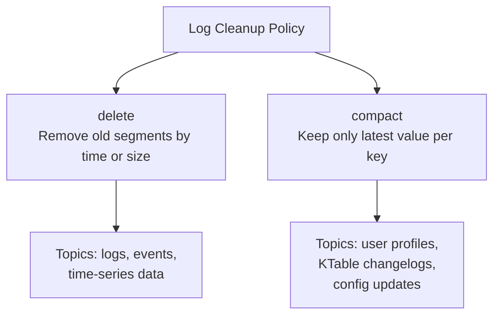
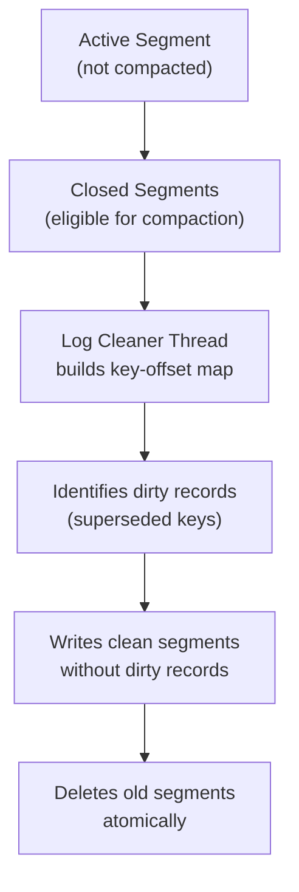

# Kafka Retention and Compaction — Fundamentals


## 🎯 Analogy

Think of Kafka retention like a DVR: time-based retention deletes old recordings after N days. Log compaction is like keeping only the most recent episode of a series — for each key, only the latest value survives.

---
## How Kafka Stores Data

Kafka stores messages in **log segments** — append-only files on disk. Each partition is a directory containing multiple segment files.

```
/var/kafka/data/orders-0/
  00000000000000000000.log    (active segment)
  00000000000000000000.index
  00000000000000000000.timeindex
  00000000000001000000.log    (closed segment)
  00000000000001000000.index
  ...
```

The filename is the **base offset** of the first record in the segment. Closed segments are eligible for cleanup.

## Retention Policies

Kafka offers two cleanup policies:



### Delete Policy (Default)

Segments are deleted when they exceed retention limits:

| Config | Default | Description |
|--------|---------|-------------|
| `retention.ms` | 7 days (604800000) | Retain segments for this long |
| `retention.bytes` | -1 (unlimited) | Max total size per partition |
| `segment.ms` | 7 days | Close active segment after this time |
| `segment.bytes` | 1 GB | Close active segment after this size |

```bash
# Set retention to 3 days and 100 GB max per partition
kafka-configs.sh --bootstrap-server broker:9092 \
  --alter \
  --add-config 'retention.ms=259200000,retention.bytes=107374182400' \
  --entity-type topics --entity-name orders
```

**Important**: the active (open) segment is never deleted regardless of age. Only closed segments are eligible for cleanup.

### Compact Policy

Log compaction retains the **latest message per key**. Older messages with the same key are removed — tombstones (null values) indicate deletions.

```
Before compaction:                After compaction:
key=A, value=1                    key=A, value=3  (latest)
key=B, value=1                    key=B, value=2  (latest)
key=A, value=2                    key=C, value=1  (only version)
key=A, value=3
key=B, value=2
key=C, value=1
```

### Mixed Policy (delete + compact)

```bash
# Compact AND delete old tombstones
kafka-configs.sh --bootstrap-server broker:9092 \
  --alter \
  --add-config 'cleanup.policy=compact,delete,retention.ms=86400000' \
  --entity-type topics --entity-name user-profiles
```

With `compact,delete`: records are compacted (deduped by key) AND old tombstones are eventually deleted.

## Configuring Retention at Topic vs Broker Level

```bash
# Broker-level defaults (apply to all topics without explicit config)
# In server.properties:
log.retention.hours=168          # 7 days
log.retention.bytes=-1           # unlimited
log.segment.bytes=1073741824     # 1 GB

# Topic-level override
kafka-configs.sh --bootstrap-server broker:9092 \
  --alter \
  --add-config 'retention.ms=3600000' \    # 1 hour
  --entity-type topics --entity-name metrics

# View current topic config
kafka-configs.sh --bootstrap-server broker:9092 \
  --describe --entity-type topics --entity-name metrics
```

## Retention Time Considerations

| Topic Type | Recommended Retention | Rationale |
|------------|----------------------|-----------|
| Operational logs | 24-72 hours | Short — high volume, limited replay need |
| Business events | 7-30 days | Medium — replay for debugging |
| Event sourcing | Unlimited or compact | Long — full history needed |
| KTable changelogs | Compact | Keep latest state forever |
| CDC (Debezium) | 7 days | Allow re-sync within a week |

## Tombstones (Delete Markers)

A **tombstone** is a record with a non-null key and a **null value**. It signals to the compaction algorithm that the key should eventually be deleted.

```python
from confluent_kafka import Producer

producer = Producer({'bootstrap.servers': 'broker:9092'})

# Send tombstone to delete key from compacted topic
producer.produce('user-profiles', key=b'user-123', value=None)
producer.flush()
```

Tombstones are retained for `delete.retention.ms` (default 24 hours) after compaction processes them. This gives consumers time to see the deletion before the record is gone.

## Log Compaction Process



The log cleaner runs in background threads (`log.cleaner.threads`, default 1). It maintains a ratio called **dirty ratio** — the fraction of the log that has been modified since last clean. Compaction triggers when dirty ratio exceeds `min.cleanable.dirty.ratio` (default 0.5 = 50%).


## ▶️ Try It Yourself

```bash
# Set time-based retention on a topic (7 days)
kafka-configs.sh --bootstrap-server localhost:9092 \
    --entity-type topics --entity-name orders \
    --alter --add-config retention.ms=604800000

# Enable log compaction (keep latest value per key)
kafka-configs.sh --bootstrap-server localhost:9092 \
    --entity-type topics --entity-name user-profiles \
    --alter --add-config cleanup.policy=compact

# View current topic config
kafka-configs.sh --bootstrap-server localhost:9092 \
    --entity-type topics --entity-name orders --describe
```

> **Run it:** Copy the snippet into a REPL or file and run it — no external services needed for the basic example.

---
## Interview Tips

> **Tip 1:** The most common misconception: retention policies apply to **closed segments**, not individual records. The active segment (currently being written to) is NEVER deleted. A topic with a 1-hour retention but only one active segment (no records for a day) still keeps that segment.

> **Tip 2:** Distinguish delete vs compact clearly: delete removes old records by time/size; compact removes superseded keys. Delete is for event streams; compact is for state stores and changelogs.

> **Tip 3:** Tombstones are the "delete" signal for compacted topics. Know that tombstones are not instantly removed — they persist for `delete.retention.ms` (default 24h) to allow consumers to observe the deletion.

> **Tip 4:** `cleanup.policy=compact,delete` is used for KTable changelogs with bounded history. The delete part removes old tombstones after `delete.retention.ms`.

> **Tip 5:** Kafka's log cleaner is background and asynchronous. Compaction does NOT happen immediately after a tombstone is written. There is no SLA on when compaction runs — only the dirty ratio threshold triggers it.
