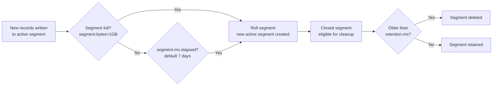
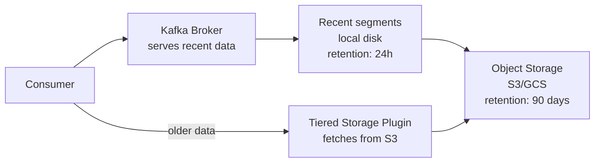
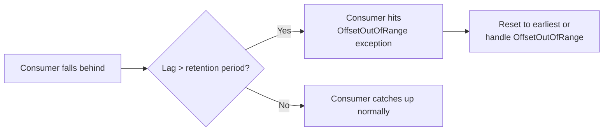

# Kafka Retention and Compaction — Intermediate

## Log Segment Lifecycle

Understanding segment rolling and cleanup is essential for sizing and performance.



### Segment Rolling

A segment rolls (closes) when:
1. `segment.bytes` reached (size-based, default 1 GB)
2. `segment.ms` elapsed since first write (time-based, default 7 days)
3. `segment.jitter.ms` random offset to prevent all segments rolling simultaneously

```bash
# For high-throughput topics: smaller segments for faster cleanup
kafka-configs.sh --bootstrap-server broker:9092 \
  --alter \
  --add-config 'segment.bytes=268435456,segment.ms=3600000' \
  --entity-type topics --entity-name high-volume-logs

# Result: segments roll every 1 hour or 256 MB (whichever comes first)
# Allows retention.ms to take effect more granularly
```

## Compaction Internals

### The Key-Offset Map

The log cleaner reads the "dirty" (recently written, uncompacted) portion of the log and builds an in-memory map:

```
key=user-1 → offset 150  (latest seen offset)
key=user-2 → offset 95
key=user-3 → offset 203
```

It then scans the "clean" (previously compacted) portion:
- If an old record's key maps to a higher offset → this record is stale → **skip it**
- If not in map → **retain it**

The result is written to new segment files, which replace the old ones atomically.

### Compaction Ratio

```
dirty ratio = dirty bytes / total log bytes

Compaction triggers when dirty ratio > min.cleanable.dirty.ratio (default 0.5)
```

Lowering `min.cleanable.dirty.ratio` triggers more frequent compaction (more CPU, less storage waste). Raising it delays compaction (less CPU, more stale records).

```bash
# More aggressive compaction for frequently-updated topics
kafka-configs.sh --bootstrap-server broker:9092 \
  --alter \
  --add-config 'min.cleanable.dirty.ratio=0.1,min.compaction.lag.ms=0' \
  --entity-type topics --entity-name user-profiles
```

### Compaction Lag

```bash
# min.compaction.lag.ms: records won't be compacted until this old
# Useful for: allowing consumers time to read before records are compacted away
kafka-configs.sh --bootstrap-server broker:9092 \
  --alter \
  --add-config 'min.compaction.lag.ms=3600000' \  # don't compact records < 1hr old
  --entity-type topics --entity-name changelogs
```

```bash
# max.compaction.lag.ms (Kafka 2.3+): ensure records are eventually compacted
# even if dirty ratio never reaches min.cleanable.dirty.ratio
kafka-configs.sh --bootstrap-server broker:9092 \
  --alter \
  --add-config 'max.compaction.lag.ms=86400000' \  # compact within 24h regardless
  --entity-type topics --entity-name user-profiles
```

## Storage Sizing

### Calculating Retention Storage

```
Storage per partition = produce_rate_bytes_per_sec × retention_seconds

Example:
- produce rate: 10 MB/s
- 4 partitions
- retention: 7 days (604800 s)
- per partition rate: 2.5 MB/s

Storage per partition = 2.5 MB/s × 604800 s = ~1.5 TB
Total storage = 1.5 TB × 4 partitions × replication_factor
             = 1.5 TB × 4 × 3 = 18 TB cluster storage
```

### Storage with `retention.bytes`

`retention.bytes` caps storage **per partition**, not per topic. For a 10-partition topic with `retention.bytes=10 GB`, total max storage is 100 GB × replication factor.

```bash
# Cap topic storage (per partition)
kafka-configs.sh --bootstrap-server broker:9092 \
  --alter \
  --add-config 'retention.bytes=10737418240' \  # 10 GB per partition
  --entity-type topics --entity-name large-events
```

## Tiered Storage (Kafka 3.6+)

Tiered storage moves older log segments to object storage (S3, GCS) while keeping recent segments local. Consumers transparently fetch from either.



```properties
# Enable tiered storage (requires plugin)
remote.log.storage.system.enable=true
remote.log.metadata.manager.class.name=org.apache.kafka.server.log.remote.storage.RemoteLogMetadataManager
remote.log.storage.manager.class.name=io.confluent.tiered.storage.TieredStorageManager
```

Benefits:
- Dramatically reduce broker disk requirements
- Long retention (months/years) at S3 cost ($0.023/GB vs $0.10/GB SSD)
- Brokers only store hot data locally

## Compacted Topic Patterns

### KTable Changelog Pattern

Kafka Streams writes KTable state to changelog topics with `compact` policy:

```bash
# Automatic creation by Kafka Streams, but you can tune it
kafka-configs.sh --bootstrap-server broker:9092 \
  --alter \
  --add-config 'cleanup.policy=compact,min.cleanable.dirty.ratio=0.01' \
  --entity-type topics --entity-name my-app-store-changelog
```

Low `min.cleanable.dirty.ratio=0.01` (1%) ensures very aggressive compaction, keeping the changelog small and state store restoration fast.

### Application Config / Feature Flags

```python
from confluent_kafka import Producer, Consumer

# Config service: publish config changes to compacted topic
config_producer = Producer({'bootstrap.servers': 'broker:9092'})

def update_config(service: str, key: str, value: str):
    config_producer.produce(
        'app-configs',   # compacted topic
        key=f"{service}/{key}".encode(),
        value=value.encode(),
    )
    config_producer.flush()

def delete_config(service: str, key: str):
    config_producer.produce(
        'app-configs',
        key=f"{service}/{key}".encode(),
        value=None,   # tombstone
    )
    config_producer.flush()

# Consuming all current configs on startup
config_consumer = Consumer({
    'bootstrap.servers': 'broker:9092',
    'group.id': f'config-loader-{service_name}',
    'auto.offset.reset': 'earliest',
})
config_consumer.assign([TopicPartition('app-configs', 0)])

configs = {}
while True:
    msg = config_consumer.poll(1.0)
    if msg is None:
        break   # EOF after consuming all current config
    if msg.value() is None:
        configs.pop(msg.key().decode(), None)   # tombstone: delete key
    else:
        configs[msg.key().decode()] = msg.value().decode()
```

## Retention and Replication

Retention policies apply independently on each replica. Followers apply the same retention logic as the leader. This means all replicas should have the same free space; lagging replicas still holding old segments don't block leader cleanup.

### Log Retention vs Consumer Lag



When a consumer's committed offset points to a deleted segment, it receives `OffsetOutOfRange`. Handling:

```python
from confluent_kafka import Consumer, KafkaError

consumer = Consumer({
    'bootstrap.servers': 'broker:9092',
    'group.id': 'my-group',
    'auto.offset.reset': 'latest',   # or 'earliest' based on requirements
})

while True:
    msg = consumer.poll(1.0)
    if msg is None:
        continue
    if msg.error():
        if msg.error().code() == KafkaError.OFFSET_OUT_OF_RANGE:
            # Offset was purged; seek to beginning
            consumer.seek_to_beginning([msg.topic_partition()])
        continue
    process(msg)
```

## Interview Tips

> **Tip 1:** The "segment rolls before cleanup can happen" insight is important. If `segment.ms=7 days` and `retention.ms=1 hour`, records from the last 7 days won't be cleaned because the segment hasn't rolled yet. Set `segment.ms` significantly less than `retention.ms`.

> **Tip 2:** Tiered storage is becoming the standard for long-retention topics. Know the architecture: recent segments on broker SSD, older segments in S3, transparent to consumers. Dramatically reduces broker storage costs.

> **Tip 3:** `min.compaction.lag.ms` and `max.compaction.lag.ms` work together: the former prevents compacting too-recent records; the latter ensures compaction eventually runs even if dirty ratio is low. Both are important for production.

> **Tip 4:** For KTable changelogs, aggressive compaction (`min.cleanable.dirty.ratio=0.01`) is desirable — it keeps the changelog small and makes Kafka Streams state restoration from scratch much faster.

> **Tip 5:** Know how to handle `OffsetOutOfRange` in consumers. It's the operational consequence of retention purging records before a slow consumer catches up. The correct response depends on the use case: seek to beginning (replay), seek to end (skip gap), or raise an alert.
