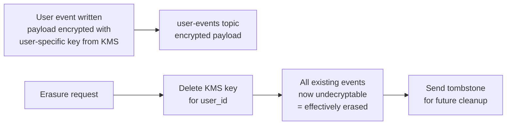

# Scenario Questions — Retention and Compaction

<article data-difficulty="junior">

## 🟢 Junior: Configuring Retention for Different Topic Types

**Scenario:** You're setting up Kafka for a new application. You have three topics:
1. `access-logs` — high volume, only needed for 24 hours for debugging
2. `user-profiles` — each user has exactly one profile; you always need the latest
3. `payment-events` — business events needed for 90 days for auditing

**Question:** What `cleanup.policy` and retention settings would you use for each?

<details>
<summary>💡 Hint</summary>

Think about the nature of each topic: access-logs are time-series (delete by age); user-profiles are state (compact — latest per user); payment-events are audit trail (delete by age, longer retention).
</details>

<details>
<summary>✅ Solution</summary>

**access-logs — Delete policy, short retention:**
```bash
kafka-configs.sh --bootstrap-server broker:9092 --alter \
  --add-config 'cleanup.policy=delete,
                retention.ms=86400000,
                segment.ms=3600000' \
  --entity-type topics --entity-name access-logs
```
- `retention.ms=86400000` = 24 hours
- `segment.ms=3600000` = 1-hour segments; segments close hourly so cleanup triggers within hours of expiry (critical: if segment.ms equals retention.ms, no cleanup happens!)

**user-profiles — Compact policy:**
```bash
kafka-configs.sh --bootstrap-server broker:9092 --alter \
  --add-config 'cleanup.policy=compact,
                min.cleanable.dirty.ratio=0.2,
                max.compaction.lag.ms=3600000,
                delete.retention.ms=86400000' \
  --entity-type topics --entity-name user-profiles
```
- Compaction keeps latest profile per user_id key
- `max.compaction.lag.ms=3600000` ensures compaction runs within 1 hour even if dirty ratio is low
- Tombstones (null values for deleted users) kept 24h before purging

**payment-events — Delete policy, long retention:**
```bash
kafka-configs.sh --bootstrap-server broker:9092 --alter \
  --add-config 'cleanup.policy=delete,
                retention.ms=7776000000,
                segment.ms=86400000' \
  --entity-type topics --entity-name payment-events
```
- `retention.ms=7776000000` = 90 days (90 × 24 × 3600 × 1000)
- `segment.ms=86400000` = daily segments; segments close daily enabling daily cleanup

**Key principle**: always set `segment.ms` significantly less than `retention.ms` so segments roll and become eligible for cleanup before the full retention period elapses.
</details>

</article>

<article data-difficulty="mid-level">

## 🟡 Mid-Level: Disk Space Emergency

**Scenario:** You receive a PagerDuty alert at 2 AM: Kafka broker disk usage has reached 92%. The cluster has 3 brokers, each with 2 TB disks. The highest-volume topic is `clickstream` with `retention.ms=7776000000` (90 days). Analysis shows `clickstream` alone uses 1.4 TB per broker. Current segment size: `segment.bytes=1073741824` (1 GB) and `segment.ms=604800000` (7 days).

**Question:** What immediate actions do you take to reduce disk usage? What long-term changes do you make?

<details>
<summary>💡 Hint</summary>

For immediate relief, reduce retention on the high-volume topic. But there's a compounding problem: with `segment.ms=7 days`, segments aren't rolling frequently enough for the cleanup to be effective at shorter retention periods. Think about how to make cleanup actually happen.
</details>

<details>
<summary>✅ Solution</summary>

**Immediate Actions (next 30 minutes):**

```bash
# Step 1: Reduce retention on clickstream (emergency)
kafka-configs.sh --bootstrap-server broker:9092 --alter \
  --add-config 'retention.ms=604800000' \  # 7 days (from 90)
  --entity-type topics --entity-name clickstream

# Step 2: Also reduce segment.ms so segments roll and cleanup can trigger
kafka-configs.sh --bootstrap-server broker:9092 --alter \
  --add-config 'segment.ms=3600000' \  # 1 hour
  --entity-type topics --entity-name clickstream
```

**Why segment.ms matters here:** With `segment.ms=7d`, even after reducing `retention.ms=7d`, the active segment (possibly 7 days old) doesn't roll. Cleanup can't delete a segment that hasn't rolled. Setting `segment.ms=1h` forces segments to roll hourly, enabling cleanup to delete everything older than 7 days.

**Estimated time for relief:**
- After `segment.ms=1h`: new segment rolls within 1 hour
- After segment rolls: log cleaner identifies expired segments within `log.cleaner.backoff.ms` (default 15s)
- Cleanup runs: typically within 15-30 minutes of trigger
- Disk relief: ~80% of 1.4 TB freed = ~1.1 TB freed per broker → disk drops to ~50%

**Monitoring the cleanup:**
```bash
# Watch log size decrease
kafka-log-dirs.sh --bootstrap-server broker:9092 \
  --topic-list clickstream \
  --describe | grep -oP 'size:\d+' | awk -F: '{sum+=$2} END {print "Total bytes: " sum}'

# Or watch via JMX:
# kafka.log:type=Log,name=Size,topic=clickstream,partition=0
```

**Long-Term Changes:**

```bash
# 1. Set appropriate segment.ms for all high-volume topics
#    Rule: segment.ms < retention.ms / 10
kafka-configs.sh --bootstrap-server broker:9092 --alter \
  --add-config 'segment.ms=3600000,retention.ms=7776000000' \
  --entity-type topics --entity-name clickstream

# 2. Add retention.bytes as a secondary guard
kafka-configs.sh --bootstrap-server broker:9092 --alter \
  --add-config 'retention.bytes=107374182400' \  # 100 GB per partition
  --entity-type topics --entity-name clickstream

# 3. Add disk monitoring with early warning
# Prometheus alert: node_filesystem_avail_bytes / node_filesystem_size_bytes < 0.3
# Page at 70%, emergency response at 85%

# 4. Evaluate tiered storage for 90-day retention requirement
# Local: 7 days on SSD | Remote: 90 days on S3
```

**Post-incident review questions to answer:**
- Why did 90-day retention get configured without disk capacity planning?
- What is the actual business requirement for 90 days? (Can we reduce to 30?)
- Is tiered storage available on this cluster?
- Add topic retention to the capacity planning process
</details>

</article>

<article data-difficulty="senior">

## 🔴 Senior: GDPR Erasure at Scale in a Compacted Event Sourcing System

**Scenario:** Your company uses Kafka as the event store for a CQRS/event sourcing architecture. The `user-events` topic is compacted (never deleted) and contains 3 years of user events with user_id as the key. 

A new GDPR requirement mandates that you must be able to delete all personal data for a given user within 72 hours of their erasure request. You have 50 million users, receive ~500 erasure requests per day, and the events contain embedded personal data (name, email, IP address) in the event payload, not just references.

**Question:** Design an erasure strategy that meets the 72-hour SLA. What are the tradeoffs?

<details>
<summary>✅ Solution</summary>

**The Core Problem:**

Tombstones on compacted topics initiate erasure but don't complete it. The time to actual erasure depends on when the log cleaner runs, which can be hours to days. Tombstones also only delete the key — but if personal data is embedded in the value, you need more than just tombstones.

**Three Approaches (each with tradeoffs):**

**Approach 1: Encryption-Based Erasure (Recommended)**



```python
import boto3
from cryptography.fernet import Fernet
import base64

class EncryptedEventProducer:
    def __init__(self, kms_client, key_store_topic: str):
        self.kms = kms_client
        # Per-user encryption keys stored in a compacted KV topic
        self.key_cache = {}

    def get_or_create_user_key(self, user_id: str) -> bytes:
        if user_id not in self.key_cache:
            # Generate and store user-specific data key
            response = self.kms.generate_data_key(
                KeyId='alias/kafka-user-data',
                KeySpec='AES_256'
            )
            self.key_cache[user_id] = response['Plaintext']
            # Store encrypted key in key-registry topic
            self._store_encrypted_key(user_id, response['CiphertextBlob'])
        return self.key_cache[user_id]

    def produce_event(self, user_id: str, event: dict):
        key = self.get_or_create_user_key(user_id)
        f = Fernet(base64.urlsafe_b64encode(key[:32]))
        encrypted_payload = f.encrypt(json.dumps(event).encode())
        # Produce encrypted event
        producer.produce('user-events', key=user_id.encode(), value=encrypted_payload)

class GDPREraser:
    def erase_user(self, user_id: str):
        # 1. Delete the KMS key (or mark as deleted)
        self.kms.schedule_key_deletion(KeyId=f'user/{user_id}', PendingWindowInDays=7)
        # Effect: all existing events are now encrypted with an inaccessible key = erased
        # The data bytes remain in Kafka but are meaningless without the key

        # 2. Send tombstone for future cleanup (optional, for log hygiene)
        producer.produce('user-events', key=user_id.encode(), value=None)
        producer.flush()

        # 3. Log the erasure for compliance audit
        audit_log.record_erasure(user_id, timestamp=now())
```

**Tradeoffs of Approach 1:**
- (+) Erasure is instant (key deletion = instant inaccessibility)
- (+) No dependency on Kafka compaction timing
- (-) Additional KMS costs per user (key storage + encryption calls)
- (-) Complex key management for 50M users
- (-) Key rotation adds complexity

**Approach 2: Reference Architecture (Claim Check)**

Don't store personal data in Kafka events — store only a reference to an external store:

```python
# Event contains reference, not PII
event = {
    "user_id": "usr-123",
    "event_type": "PURCHASE",
    "amount": 99.99,
    "pii_ref": "s3://pii-store/users/usr-123.json.enc"  # reference, not data
}

# Erasure: delete the S3 object
# Kafka events remain valid (no PII to delete)
s3.delete_object(Bucket='pii-store', Key='users/usr-123.json.enc')
```

**Tradeoffs of Approach 2:**
- (+) Simple erasure (delete S3 object)
- (+) Kafka events never contain PII
- (-) Requires architectural change (can't retrofit to existing events)
- (-) Every event read now requires S3 lookup (latency)
- (-) S3 object deletion must be verified

**Approach 3: Tombstone + Aggressive Compaction (Acceptable if SLA is relaxed)**

```bash
# Ultra-aggressive compaction configuration
kafka-configs.sh --bootstrap-server broker:9092 --alter \
  --add-config 'min.cleanable.dirty.ratio=0.01,
                max.compaction.lag.ms=3600000,
                delete.retention.ms=3600000' \
  --entity-type topics --entity-name user-events

# In broker server.properties (global):
log.cleaner.threads=4
log.cleaner.dedupe.buffer.size=536870912
```

With `max.compaction.lag.ms=1h`, records are guaranteed to be compacted within 1 hour. Combined with tombstones, erasure completes within ~2 hours — well within the 72-hour SLA.

**Tradeoffs of Approach 3:**
- (+) No architectural change to events
- (+) Within 72h SLA (compaction within 1-2h)
- (-) Tombstones in log until `delete.retention.ms` elapses (1h)
- (-) Aggressive compaction uses more CPU/IO on brokers
- (-) Not "cryptographic erasure" — bytes remain until compaction

**Recommendation for this scenario:**

Use **Approach 2** for new event types (forward-looking) and **Approach 1** for existing events (retrofit with encryption). Document the compliance timeline: "Erasure is cryptographically effective within 5 minutes (KMS key deletion); physical byte erasure via Kafka compaction within 2 hours (max.compaction.lag.ms=3600000)."

**Audit trail (mandatory):**
```python
# Every erasure request must be logged immutably
audit_producer.produce(
    'gdpr-audit-log',   # separate compacted topic with very long retention
    key=user_id.encode(),
    value=json.dumps({
        'action': 'ERASURE_COMPLETED',
        'user_id': user_id,
        'topics_affected': ['user-events'],
        'erasure_method': 'encryption_key_deletion',
        'request_id': erasure_request_id,
        'completed_at': datetime.utcnow().isoformat(),
    }).encode()
)
```
</details>

</article>

---

## ⚡ Quick-fire Q&A

**Q: What are the two retention modes in Kafka?**
A: Time-based retention (`log.retention.hours/ms`) deletes segments older than the configured duration. Size-based retention (`log.retention.bytes`) deletes older segments when the partition log exceeds a size limit. Both can be combined — whichever limit is reached first triggers deletion.

**Q: What is log compaction in Kafka?**
A: Log compaction is a retention policy that preserves at least the most recent value for each unique message key. Old records with the same key are removed, but the latest value is never deleted. This creates a compacted log suitable for changelog and state reconstruction use cases.

**Q: When would you use log compaction vs. time-based retention?**
A: Use time-based retention for event streams where historical records expire (e.g., clickstream, logs). Use log compaction for changelog topics (e.g., database CDC output, Kafka Streams state changelogs, user profile updates) where consumers need the current state of each key, not a complete history.

**Q: How does Kafka handle tombstone records in compacted topics?**
A: A tombstone is a message with a non-null key and a null value. It signals that the key should be deleted. After the `delete.retention.ms` period, the compaction cleaner removes the tombstone itself from the log, allowing the key to be fully purged.

**Q: What is the `min.cleanable.dirty.ratio` in compaction?**
A: It controls when the log cleaner compacts a partition — compaction begins when the ratio of dirty (uncompacted) bytes to total log bytes exceeds this threshold (default 0.5, meaning 50%). Lower values trigger more frequent compaction; higher values batch more before compacting.

**Q: How do retention settings affect consumer groups that fall behind?**
A: If a consumer group's committed offset falls behind the log start offset (due to data expiration), the consumer gets an `OffsetOutOfRangeException`. It must reset to the earliest or latest offset. This represents permanent data loss for that consumer — monitoring lag to prevent falling behind retention is critical.

**Q: How do you configure different retention policies per topic?**
A: Override retention at the topic level using `kafka-configs.sh --alter --entity-type topics --entity-name <topic> --add-config retention.ms=<value>`. Topic-level configs override broker defaults, allowing different retention windows for different data types on the same cluster.

**Q: What is the difference between log segment deletion and log compaction?**
A: Segment deletion (time/size retention) removes entire log segments based on age or size, potentially deleting many records at once. Compaction selectively removes individual records with duplicate keys within a segment, preserving the latest value per key — it is a more granular operation that runs continuously in the background.

---

## 💼 Interview Tips

- Know the two retention modes and their combination behavior — interviewers often ask which limit triggers first and what happens to consumers that fall behind. Having a precise answer signals operational depth.
- Explain log compaction use cases concretely: Kafka Streams changelog topics, Debezium CDC topics, and configuration/state topics are the canonical examples interviewers expect.
- Discuss tombstones as the delete mechanism in compacted topics — it's a subtle detail that distinguishes candidates who've used compacted topics from those who've only read about them.
- Warn about consumers falling behind retention explicitly — it's one of the most severe operational incidents in Kafka (irreversible data loss), and proactively mentioning monitoring for it shows production awareness.
- For senior roles, discuss compaction performance tuning: `log.cleaner.threads`, `log.cleaner.io.max.bytes.per.second` (throttle compaction I/O impact), and monitoring the log cleaner thread pool for saturation.
- Be ready to explain why compacted topics are not suitable for all use cases — they don't preserve historical records (multiple values per key), so they're wrong for audit trails, event sourcing, or any workload needing full history.
