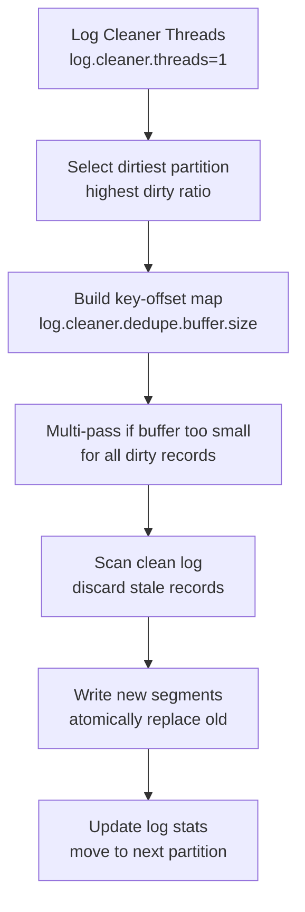
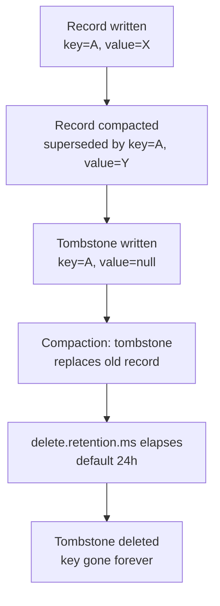
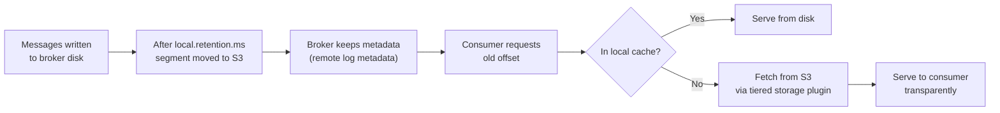

# Kafka Retention and Compaction — Senior Deep Dive

## Log Cleaner Architecture

The log cleaner is a set of background threads (`log.cleaner.threads`, default 1) per broker. Each thread manages one **CleanerConfig** with a buffer used for the key-offset map.



### Buffer Sizing

The deduplication buffer (`log.cleaner.dedupe.buffer.size`, default 128 MB per broker) holds the key-offset map. If the dirty log is larger than the buffer, the cleaner makes **multiple passes** — each pass covers a portion of the dirty log. Multiple passes are more CPU-intensive but still correct.

```bash
# Increase buffer for large compacted topics
# In broker server.properties:
log.cleaner.dedupe.buffer.size=536870912   # 512 MB
log.cleaner.io.buffer.size=524288          # 512 KB I/O buffer
log.cleaner.threads=2                       # parallel cleaning
```

### Compaction and IO Rate Limiting

```bash
# Throttle log cleaner to avoid competing with producer/consumer I/O
log.cleaner.io.max.bytes.per.second=52428800   # 50 MB/s max I/O
log.cleaner.backoff.ms=15000                    # sleep between passes if nothing to clean
```

## Exactly-Once and Compaction Interaction

Idempotent producer sequence numbers are stored in the partition's **producer state** (`*.snapshot` files). These are separate from the log segments and are not subject to compaction.

However, there's an important interaction: if a compacted topic has records from a transactional producer, the **transaction markers** (COMMIT/ABORT) must be retained until their associated records are compacted away. The `delete.retention.ms` setting controls how long tombstones (and their markers) are retained post-compaction.

## Mixed Policy: Compact + Delete

The `compact,delete` policy is the most operationally complex:



**Configuration:**
```bash
kafka-configs.sh --bootstrap-server broker:9092 \
  --alter \
  --add-config 'cleanup.policy=compact,delete,
                retention.ms=604800000,
                delete.retention.ms=86400000,
                min.compaction.lag.ms=3600000' \
  --entity-type topics --entity-name user-events
```

| Config | Effect |
|--------|--------|
| `cleanup.policy=compact,delete` | Enable both |
| `retention.ms=7d` | Delete segments older than 7 days |
| `delete.retention.ms=24h` | Keep tombstones for 24h after compaction |
| `min.compaction.lag.ms=1h` | Don't compact records less than 1h old |

## Producer State Expiration

Each partition tracks producer state (PID, epoch, sequence numbers) for idempotence. This state is stored in `.snapshot` files and in the log itself (via `PID_SNAPSHOT` control records).

```bash
# Producer state expires after this long of inactivity
# Default: 7 days (604800000 ms)
transactional.id.expiration.ms=604800000

# In broker server.properties:
producer.id.expiration.ms=86400000   # expire inactive PIDs after 24h
```

If a producer resumes after its PID expires, the broker treats it as a new producer — no deduplication based on old sequences. This means restartless long pauses can lead to duplicates if you rely on PID-based deduplication.

## Storage Architecture: Segment Files Deep Dive

For each partition, the data directory contains:
- `*.log`: message data (append-only)
- `*.index`: sparse index of offset → file position
- `*.timeindex`: sparse index of timestamp → offset
- `*.snapshot`: producer state snapshots
- `leader-epoch-checkpoint`: leader epoch history
- `partition.metadata`: topic ID and partition metadata

```bash
# Inspect segment content
kafka-dump-log.sh \
  --files /var/kafka/data/orders-0/00000000000000000000.log \
  --print-data-log \
  --deep-iteration \
  --max-message-size 10485760
```

### Index Sparseness

The offset index is **sparse** — it doesn't index every offset, only every `log.index.interval.bytes` (default 4 KB). Lookup requires:
1. Binary search in index to find nearest indexed entry
2. Linear scan from that entry to the target offset

For random access patterns (replaying from specific offset), denser indices reduce scan time but use more memory.

## Tiered Storage Deep Dive

With tiered storage (Confluent, AWS MSK, Warpstream), the local retention and remote retention are separate:

```properties
# local.retention.ms controls how long segments stay on broker
# remote.log.storage enables moving to S3/GCS
log.local.retention.ms=86400000       # keep 24h locally
log.local.retention.bytes=10737418240  # or 10 GB locally
# Remote storage: 90 days (configured per-topic)
```



Consumer-side behavior is transparent — consumers don't know if data comes from disk or S3.

## Cost Modeling: Delete vs Compact vs Tiered

| Approach | Storage Cost | CPU Cost | Data Freshness |
|----------|-------------|----------|---------------|
| Short retention (1 day) | Low (disk) | Low | Recent only |
| Long retention (90 days) | High (disk) | Low | Full history |
| Compaction | Low-medium | Medium | Latest per key |
| Tiered storage | Low (disk) + Low (S3) | Medium (S3 I/O) | Full history |

**Cost calculation for 90-day retention (100 MB/s produce rate):**

```
Daily data: 100 MB/s × 86400 s = 8.64 TB/day
90-day retention: 8.64 TB × 90 = 778 TB
With replication=3: 778 TB × 3 = 2.3 PB of broker disk

Tiered storage alternative:
- Local (7 days): 8.64 TB × 7 × 3 = 181 TB SSD (~$18,000/month at $0.10/GB)
- Remote (90 days): 8.64 TB × 90 = 778 TB S3 (~$17,900/month at $0.023/GB)
- Total: ~$36,000/month vs $230,000/month for full SSD retention
```

## Interview Tips

> **Tip 1:** The log cleaner's multi-pass behavior is a senior-level detail. When the dirty log exceeds `log.cleaner.dedupe.buffer.size`, the cleaner makes multiple passes, each compacting a portion. This increases CPU usage but is always correct.

> **Tip 2:** The compaction-EOS interaction: transaction markers must survive compaction until their data records are cleaned. `delete.retention.ms` controls how long tombstones (and their markers) survive. Setting it too low can cause markers to disappear before downstream consumers process them.

> **Tip 3:** Tiered storage is the key architectural evolution for cost-efficient long retention. The local retention stays on broker SSD for hot access; cold data moves to S3. Consumers are transparent to this. Know the cost math.

> **Tip 4:** Producer ID expiration (`producer.id.expiration.ms`) is a subtle correctness concern for long-running pipelines with infrequent production. After expiration, the broker forgets the producer's sequence state — a restarted producer gets a new PID but no dedup guarantee for in-flight records.

> **Tip 5:** Segment file naming is based on the base offset, not timestamp. This is why the `.timeindex` file exists — to enable offset lookup by timestamp without scanning the entire log. `kafka-dump-log.sh` is the debugging tool to inspect segment contents directly.

## ⚡ Cheat Sheet

**Retention vs Compaction Decision**
| Use Case | Policy | Config |
|---|---|---|
| Event log (time-bounded) | `delete` | `retention.ms=604800000` (7d) |
| CDC / changelog | `compact` | `min.cleanable.dirty.ratio=0.5` |
| CDC + time limit | `compact,delete` | Both `retention.ms` AND `min.compaction.lag.ms` |
- `compact,delete` = compaction applies within window; segments beyond `retention.ms` are deleted

**Log Cleaner Key Numbers**
- Default dedup buffer: 128MB → covers 128M/entry_size keys in one pass
- Buffer too small for partition → multi-pass (slower, partition stays dirty longer)
- Tune: `log.cleaner.dedupe.buffer.size` (per cleaner thread, not per partition)
- Cleaners: `log.cleaner.threads=1` default → increase for high-compaction workloads

**Tombstone Lifecycle Rule**
- Producer sends value=null with key K → tombstone written
- Broker retains tombstone for `delete.retention.ms` (default 86400000ms = 24h) after segment compaction
- All consumers must read past tombstone within that window or they'll never see the delete
- Consumer receives null value → delete the key from its state store

**Transaction Marker / Producer ID Expiry**
- `producer.id.expiration.ms=86400000` (24h): broker purges PID metadata after this idle time
- After expiry, same PID re-used → broker resets sequence → potential duplicate if old messages still present
- Increase for long-pause batch producers to prevent PID recycling

**Tiered Storage Cost Decision**
| Scenario | Decision |
|---|---|
| < 30TB retention | Local disks — no tiered storage overhead |
| 30TB–500TB, cold reads rare | Tiered storage (S3/GCS) saves 80-90% cost |
| Frequent random access to old data | Local SSD — tiered has download latency |
- Tiered storage: hot segments on broker, cold offloaded; transparent to consumers

**Compaction Lag Tuning**
```properties
min.compaction.lag.ms=3600000    # 1h: don't compact records newer than 1h (producers still updating)
max.compaction.lag.ms=86400000   # 1d: must compact records older than 1d (SLA for freshness)
min.cleanable.dirty.ratio=0.1    # Compact when 10% dirty (lower = more frequent, fresher)
```
