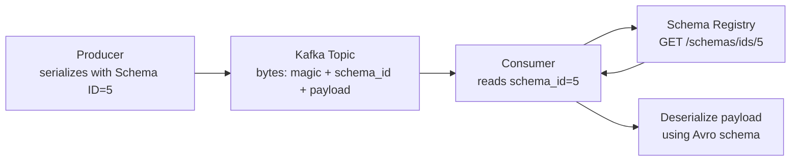

# Schema Registry — Fundamentals

## Why Schema Registry?

Kafka messages are raw bytes. Without a schema contract, producers and consumers must agree on format out-of-band. Schema Registry solves this by:

1. Storing schemas centrally
2. Embedding a **schema ID** (4 bytes) in every message
3. Enabling consumers to fetch the schema on demand
4. Enforcing **compatibility rules** when schemas evolve



## Schema Formats Supported

| Format | Description | Best For |
|--------|-------------|----------|
| **Avro** | Binary, compact, rich schema | High-volume event streaming |
| **Protobuf** | Binary, language-neutral, versioned fields | Cross-language, gRPC integration |
| **JSON Schema** | Human-readable, flexible | REST-friendly, less strict |

Avro is the most common in Kafka ecosystems.

## Wire Format

Every message serialized with the Confluent Schema Registry has this wire format:

```
Byte 0:     Magic byte (0x00)
Bytes 1-4:  Schema ID (big-endian int32)
Bytes 5+:   Avro-encoded payload
```

This allows consumers to always know which schema was used to write a message, regardless of the current schema version.

## Avro Schema Basics

```json
{
  "type": "record",
  "name": "Order",
  "namespace": "com.example.events",
  "fields": [
    {"name": "order_id",   "type": "string"},
    {"name": "user_id",    "type": "string"},
    {"name": "amount",     "type": "double"},
    {"name": "currency",   "type": "string", "default": "USD"},
    {"name": "created_at", "type": "long",   "logicalType": "timestamp-millis"}
  ]
}
```

**Avro type system:**
- Primitives: `null`, `boolean`, `int`, `long`, `float`, `double`, `bytes`, `string`
- Complex: `record`, `enum`, `array`, `map`, `union`, `fixed`
- Logical types: `date`, `timestamp-millis`, `decimal`, `uuid`

## Subject Naming Strategies

Schemas are stored under a **subject** in the registry. The subject determines the scope of compatibility checking.

| Strategy | Subject Name | Use Case |
|----------|-------------|----------|
| `TopicNameStrategy` (default) | `{topic}-value` / `{topic}-key` | One schema per topic |
| `RecordNameStrategy` | `{record.namespace}.{record.name}` | One schema per type (reuse across topics) |
| `TopicRecordNameStrategy` | `{topic}-{record.namespace}.{record.name}` | Per-topic, per-type |

```python
from confluent_kafka.schema_registry import SchemaRegistryClient
from confluent_kafka.schema_registry.avro import AvroSerializer
from confluent_kafka.serialization import SerializationContext, MessageField

sr = SchemaRegistryClient({'url': 'http://schema-registry:8081'})

# Default: TopicNameStrategy
# Subject will be "orders-value"
serializer = AvroSerializer(
    sr,
    schema_str=order_schema_str,
)
```

## Compatibility Modes

The compatibility mode controls what schema changes are allowed:

| Mode | What's Allowed |
|------|---------------|
| `BACKWARD` (default) | New schema can read old data (add fields with defaults) |
| `FORWARD` | Old schema can read new data (remove fields with defaults) |
| `FULL` | Both BACKWARD and FORWARD |
| `NONE` | Any change allowed |
| `BACKWARD_TRANSITIVE` | New schema compatible with ALL previous versions |
| `FORWARD_TRANSITIVE` | Old schema can read data from ANY newer version |
| `FULL_TRANSITIVE` | Full compatibility across all versions |

```bash
# Set compatibility mode for a subject
curl -X PUT \
  http://schema-registry:8081/config/orders-value \
  -H 'Content-Type: application/vnd.schemaregistry.v1+json' \
  -d '{"compatibility": "BACKWARD"}'

# Check current mode
curl http://schema-registry:8081/config/orders-value
```

## Registering and Using Schemas

### Python Example

```python
from confluent_kafka import Producer
from confluent_kafka.schema_registry import SchemaRegistryClient, Schema
from confluent_kafka.schema_registry.avro import AvroSerializer
from confluent_kafka.serialization import SerializationContext, MessageField

schema_str = """
{
  "type": "record",
  "name": "Order",
  "namespace": "com.example",
  "fields": [
    {"name": "order_id", "type": "string"},
    {"name": "amount",   "type": "double"}
  ]
}
"""

sr_client = SchemaRegistryClient({'url': 'http://schema-registry:8081'})
avro_serializer = AvroSerializer(sr_client, schema_str)

producer = Producer({'bootstrap.servers': 'broker:9092'})

order = {"order_id": "ord-001", "amount": 99.99}
producer.produce(
    topic='orders',
    value=avro_serializer(order, SerializationContext('orders', MessageField.VALUE)),
)
producer.flush()
```

### Consumer Deserialization

```python
from confluent_kafka import Consumer
from confluent_kafka.schema_registry import SchemaRegistryClient
from confluent_kafka.schema_registry.avro import AvroDeserializer
from confluent_kafka.serialization import SerializationContext, MessageField

sr_client = SchemaRegistryClient({'url': 'http://schema-registry:8081'})
avro_deserializer = AvroDeserializer(sr_client)

consumer = Consumer({
    'bootstrap.servers': 'broker:9092',
    'group.id': 'order-consumer',
    'auto.offset.reset': 'earliest',
})
consumer.subscribe(['orders'])

while True:
    msg = consumer.poll(1.0)
    if msg and not msg.error():
        order = avro_deserializer(
            msg.value(),
            SerializationContext(msg.topic(), MessageField.VALUE)
        )
        print(f"Order: {order}")
```

## Schema Registry REST API

```bash
# List all subjects
curl http://schema-registry:8081/subjects

# Get all versions of a subject
curl http://schema-registry:8081/subjects/orders-value/versions

# Get specific version
curl http://schema-registry:8081/subjects/orders-value/versions/1

# Get latest schema
curl http://schema-registry:8081/subjects/orders-value/versions/latest

# Register a new schema
curl -X POST \
  http://schema-registry:8081/subjects/orders-value/versions \
  -H 'Content-Type: application/vnd.schemaregistry.v1+json' \
  -d '{"schema": "{\"type\":\"record\",\"name\":\"Order\",...}"}'

# Check compatibility before registering
curl -X POST \
  http://schema-registry:8081/compatibility/subjects/orders-value/versions/latest \
  -H 'Content-Type: application/vnd.schemaregistry.v1+json' \
  -d '{"schema": "..."}'
```

## Interview Tips

> **Tip 1:** The magic byte (0x00) at the start of every Confluent-serialized message is a signal to consumers that this is a Schema Registry message. Without it, a consumer trying to Avro-decode a plain JSON message would crash.

> **Tip 2:** BACKWARD compatibility is the default and the most common requirement: producers evolve schemas, consumers should still be able to read old data. This means new fields MUST have defaults.

> **Tip 3:** The schema ID in the wire format means consumers don't need to know which schema version was used at write time — they look it up dynamically. Schema IDs are stable and never reused.

> **Tip 4:** Subject naming strategy matters for schema reuse. TopicNameStrategy (default) ties schemas to topics; RecordNameStrategy allows the same schema to be reused across topics (good for shared event types).

> **Tip 5:** Schema Registry is a Confluent component, but open-source alternatives exist (Apicurio, AWS Glue Schema Registry). Know that the wire format is proprietary to Confluent's implementation.
