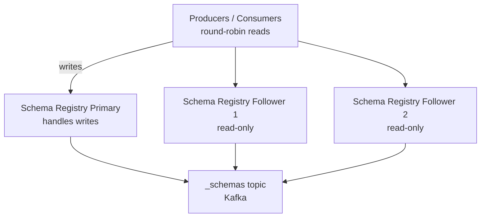

# Schema Registry — Intermediate

## Schema Evolution Rules

Schema evolution is the most common Schema Registry interview topic. Understanding which changes are allowed under each compatibility mode is essential.

### BACKWARD Compatible Changes (Safe)

New schema can read data written by OLD schema.

```json
// Version 1 (old)
{
  "type": "record", "name": "Order",
  "fields": [
    {"name": "order_id", "type": "string"},
    {"name": "amount",   "type": "double"}
  ]
}

// Version 2 (new — BACKWARD compatible)
{
  "type": "record", "name": "Order",
  "fields": [
    {"name": "order_id", "type": "string"},
    {"name": "amount",   "type": "double"},
    {"name": "currency", "type": "string", "default": "USD"},  // ← ADD with default: OK
    {"name": "status",   "type": {"type": "enum", "name": "Status",
                                  "symbols": ["PLACED", "SHIPPED"],
                                  "default": "PLACED"},
                         "default": "PLACED"}
  ]
}
```

| Change | BACKWARD? | FORWARD? | FULL? |
|--------|-----------|----------|-------|
| Add field with default | YES | NO | NO |
| Remove field with default | NO | YES | NO |
| Add optional field (union with null) | YES | YES | YES |
| Rename field | NO | NO | NO (use aliases) |
| Change type (int → long) | YES (widening) | NO | NO |
| Remove required field | NO | NO | NO |

### Using Aliases for Renaming

Avro aliases allow you to rename a field while maintaining compatibility:

```json
{
  "type": "record", "name": "Order",
  "fields": [
    {
      "name": "order_identifier",
      "aliases": ["order_id"],     // ← old name listed as alias
      "type": "string"
    }
  ]
}
```

Old data with `order_id` field will be read into `order_identifier` by the new schema.

## Protobuf Schemas

Protobuf has a different evolution model: fields are identified by **field numbers**, not names. This makes renaming safe.

```protobuf
// orders.proto
syntax = "proto3";
package com.example;

message Order {
  string order_id = 1;     // field number 1 is permanent
  double amount   = 2;
  string currency = 3;     // adding new field: safe
  // Never reuse field number 4 if it was previously removed
}
```

Protobuf advantages over Avro:
- Field numbers allow safe renaming (just change the name, not the number)
- Forward/backward compatible by default (missing fields get defaults)
- Native support for `oneof` (union types)

```python
from confluent_kafka.schema_registry.protobuf import ProtobufSerializer
from confluent_kafka.schema_registry import SchemaRegistryClient
import orders_pb2

sr = SchemaRegistryClient({'url': 'http://schema-registry:8081'})
serializer = ProtobufSerializer(orders_pb2.Order, sr)
```

## Schema Registry High Availability

Schema Registry uses Kafka as its backing store (topic `_schemas`). It supports a primary/follower setup for reads.



```yaml
# docker-compose snippet for HA Schema Registry
schema-registry-1:
  image: confluentinc/cp-schema-registry:7.5.0
  environment:
    SCHEMA_REGISTRY_KAFKASTORE_BOOTSTRAP_SERVERS: broker:9092
    SCHEMA_REGISTRY_HOST_NAME: schema-registry-1
    SCHEMA_REGISTRY_LEADER_ELIGIBILITY: "true"

schema-registry-2:
  image: confluentinc/cp-schema-registry:7.5.0
  environment:
    SCHEMA_REGISTRY_KAFKASTORE_BOOTSTRAP_SERVERS: broker:9092
    SCHEMA_REGISTRY_HOST_NAME: schema-registry-2
    SCHEMA_REGISTRY_LISTENERS: http://0.0.0.0:8082
```

## Schema Caching

Both producers and consumers cache schemas locally to avoid a REST call per message.

```python
# confluent-kafka caches schemas automatically
# Default cache size: unlimited
# To limit cache (avoid memory issues with many subjects):
sr_client = SchemaRegistryClient({
    'url': 'http://schema-registry:8081',
    'max.schemas.per.subject': 1000,   # limit cached versions per subject
})
```

The cache is keyed by schema ID (for deserialization) and by schema content hash (for serialization). First lookup hits the registry; subsequent lookups use the cache.

## Schema Normalization and Fingerprinting

Schema Registry uses a canonical form (normalized) of the schema for fingerprinting. Two schemas with different whitespace or field ordering produce the same fingerprint and are treated as identical.

```bash
# Check if a schema is already registered
curl -X POST \
  http://schema-registry:8081/subjects/orders-value \
  -H 'Content-Type: application/vnd.schemaregistry.v1+json' \
  -d '{"schema": "..."}'
# Returns the ID if already registered, otherwise registers it
```

## Schema Deletion and Soft Delete

```bash
# Soft delete — marks version as deleted but keeps schema data
curl -X DELETE \
  http://schema-registry:8081/subjects/orders-value/versions/2

# Hard delete — permanently removes (requires soft delete first)
curl -X DELETE \
  "http://schema-registry:8081/subjects/orders-value/versions/2?permanent=true"

# Delete entire subject
curl -X DELETE http://schema-registry:8081/subjects/orders-value
```

**Warning**: Hard-deleting a schema that is still referenced by stored Kafka messages causes deserialization failures. Only hard-delete schemas for topics that have been fully consumed or deleted.

## Schema Registry in CI/CD

A mature schema management workflow integrates schema validation into CI/CD:

```yaml
# GitHub Actions example
- name: Check schema compatibility
  run: |
    # Register schema against the pre-prod registry to validate
    result=$(curl -s -X POST \
      "$SR_URL/compatibility/subjects/$SUBJECT/versions/latest" \
      -H 'Content-Type: application/vnd.schemaregistry.v1+json' \
      -d "{\"schema\": $(cat schema.avsc | jq -c tostring)}")

    if echo "$result" | grep -q '"is_compatible":false'; then
      echo "Schema is NOT compatible!"
      exit 1
    fi
    echo "Schema is compatible"

- name: Register schema on merge to main
  if: github.ref == 'refs/heads/main'
  run: |
    curl -X POST \
      "$SR_URL/subjects/$SUBJECT/versions" \
      -H 'Content-Type: application/vnd.schemaregistry.v1+json' \
      -d "{\"schema\": $(cat schema.avsc | jq -c tostring)}"
```

## Avro vs Protobuf vs JSON Schema

| Feature | Avro | Protobuf | JSON Schema |
|---------|------|----------|-------------|
| Encoding | Binary | Binary | JSON text |
| Schema in message? | No (uses registry ID) | No (uses registry ID) | Optional |
| Field identity | Field name | Field number | Field name |
| Safe rename | Via aliases | Yes (name only) | No |
| Null handling | Explicit union | Optional fields | anyOf/nullable |
| Language support | JVM-focused | Broad | Broad |
| Compression ratio | Excellent | Excellent | Poor |
| Human readable | No | No | Yes |

## Interview Tips

> **Tip 1:** Always explain BACKWARD compatibility with a concrete example: "If I add a `currency` field with `default: 'USD'`, old consumers reading new data will just use the default. Old data with no `currency` field will also use the default — so both directions work."

> **Tip 2:** The schema cache is the reason Schema Registry can handle millions of messages per second without being a bottleneck. The registry is only called once per schema version, then cached locally. Mention this when discussing performance.

> **Tip 3:** Protobuf's field numbers make it the safer choice for long-lived schemas in large organizations where field renaming is common. Avro's alias mechanism is an afterthought; Protobuf's field numbers are first-class.

> **Tip 4:** Schema Registry uses Kafka (`_schemas` topic) as its durable store — it's not a standalone database. This means the registry's durability is Kafka's durability. High availability is achieved via multiple registry instances, all reading from the same topic.

> **Tip 5:** Know the CI/CD integration story. Registering schemas at deploy time (not at runtime) is the right approach. Show you'd check compatibility before any schema change merges to main.
