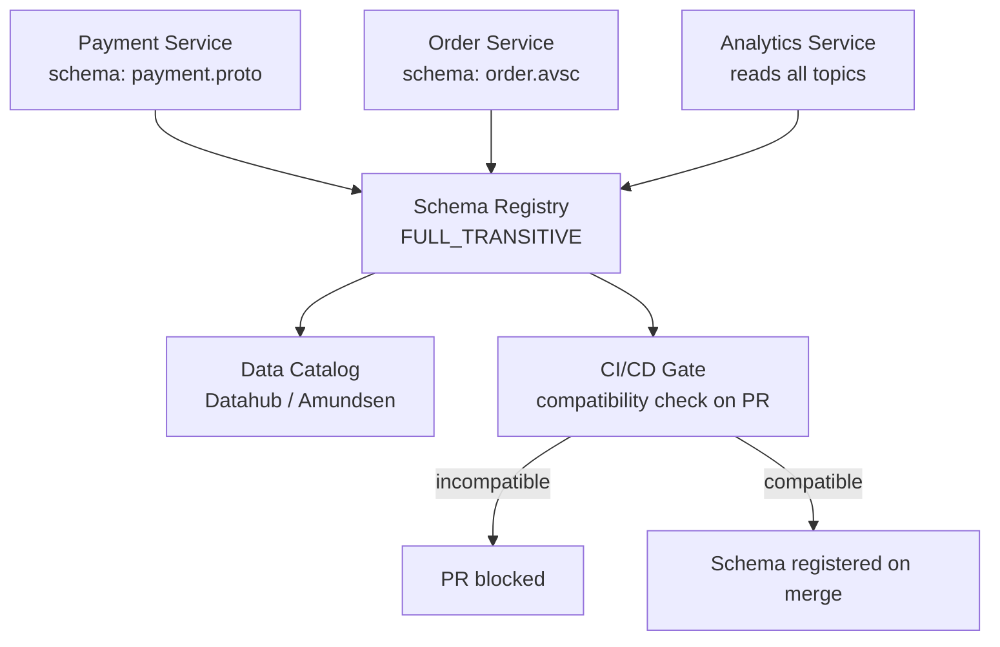

# Schema Registry — Real World Patterns

## Pattern 1: Schema Registry in a Microservices Platform

A platform team owns Schema Registry; product teams own their schemas.



**Workflow:**
1. Developer adds new field to Avro schema file in their repo
2. PR triggers CI job that checks compatibility against Schema Registry pre-prod
3. Incompatible changes block the PR with a descriptive error
4. On merge to main, CI registers the schema in prod Schema Registry
5. Application reads schema ID at startup (never auto-registers in prod)

```python
# ci_schema_check.py — runs in CI pipeline
import requests
import json
import sys

def check_compatibility(sr_url: str, subject: str, schema_file: str) -> bool:
    with open(schema_file) as f:
        schema_str = f.read()

    payload = json.dumps({"schema": schema_str})
    resp = requests.post(
        f"{sr_url}/compatibility/subjects/{subject}/versions/latest",
        headers={"Content-Type": "application/vnd.schemaregistry.v1+json"},
        data=payload,
        timeout=10,
    )

    if resp.status_code == 404:
        # First version — always compatible
        return True

    result = resp.json()
    return result.get("is_compatible", False)

if __name__ == "__main__":
    sr_url = sys.argv[1]
    subject = sys.argv[2]
    schema_file = sys.argv[3]

    if not check_compatibility(sr_url, subject, schema_file):
        print(f"ERROR: Schema in {schema_file} is NOT compatible with {subject}")
        sys.exit(1)

    print(f"OK: Schema is compatible with {subject}")
```

## Pattern 2: Multi-Format Topic — Avro + Protobuf Side by Side

In heterogeneous organizations, some teams use Avro (JVM) and others use Protobuf (Go/Python). Schema Registry supports both.

```python
# Producer A: Avro (Java team)
from confluent_kafka.schema_registry.avro import AvroSerializer
avro_serializer = AvroSerializer(sr_client, avro_schema_str)

# Producer B: Protobuf (Go team via Python bridge)
from confluent_kafka.schema_registry.protobuf import ProtobufSerializer
import orders_pb2
proto_serializer = ProtobufSerializer(orders_pb2.Order, sr_client)

# Both write to separate topics with their own subjects
# orders-avro  → subject: orders-avro-value (Avro)
# orders-proto → subject: orders-proto-value (Protobuf)
```

**Best practice**: standardize on ONE format per domain. Mixed formats multiply operational complexity (two deserializers, two schema management workflows, two compatibility models).

## Pattern 3: Schema Registry for Event Sourcing

Event sourcing requires reading events from ALL historical versions. `FULL_TRANSITIVE` compatibility is mandatory.

```bash
# Set FULL_TRANSITIVE for event-sourced topics
curl -X PUT \
  http://schema-registry:8081/config/user-events-value \
  -H 'Content-Type: application/vnd.schemaregistry.v1+json' \
  -d '{"compatibility": "FULL_TRANSITIVE"}'
```

```python
# Reader schema projection: read any historical version using latest schema
from confluent_kafka.schema_registry.avro import AvroDeserializer

# AvroDeserializer automatically handles writer schema (from message) vs
# reader schema (your application schema) resolution
deserializer = AvroDeserializer(
    sr_client,
    reader_schema_str=latest_user_event_schema,  # project to latest
)

# Old events with v1 schema are automatically projected to v3 schema
# Missing fields get their defaults
```

## Pattern 4: Schema Registry Disaster Recovery

Schema Registry stores all schemas in the `_schemas` Kafka topic. Your DR plan should include:

```bash
# Option 1: Mirror _schemas topic to DR cluster using MirrorMaker 2
# In MM2 config:
topics = _schemas, .*
sync.topic.configs.enabled = true

# Option 2: Periodic export/import
# Export all schemas
curl http://prod-sr:8081/subjects | jq -r '.[]' | while read subject; do
  versions=$(curl -s http://prod-sr:8081/subjects/$subject/versions | jq -r '.[]')
  for version in $versions; do
    schema=$(curl -s http://prod-sr:8081/subjects/$subject/versions/$version)
    echo "$subject:$version:$schema" >> schemas_backup.jsonl
  done
done

# Import to DR
cat schemas_backup.jsonl | while IFS=: read subject version schema_json; do
  curl -X POST http://dr-sr:8081/subjects/$subject/versions \
    -H 'Content-Type: application/vnd.schemaregistry.v1+json' \
    -d "$schema_json"
done
```

## Pattern 5: Schema Registry Metrics Pipeline

```python
# Prometheus exporter for Schema Registry health
from prometheus_client import Gauge, Counter, start_http_server
import requests
import time

schema_count = Gauge('schema_registry_subject_count', 'Total subjects')
version_count = Gauge('schema_registry_version_count', 'Total schema versions', ['subject'])
compat_failures = Counter('schema_registry_compat_failures_total', 'Compatibility check failures')

def collect_metrics(sr_url: str):
    subjects = requests.get(f"{sr_url}/subjects", timeout=5).json()
    schema_count.set(len(subjects))

    for subject in subjects:
        try:
            versions = requests.get(
                f"{sr_url}/subjects/{subject}/versions", timeout=5
            ).json()
            version_count.labels(subject=subject).set(len(versions))
        except Exception:
            pass

if __name__ == "__main__":
    start_http_server(8000)
    while True:
        collect_metrics("http://schema-registry:8081")
        time.sleep(60)
```

## Common Production Problems

| Problem | Symptom | Root Cause | Fix |
|---------|---------|-----------|-----|
| Deserialization failure | `SerializationException: schema id not found` | Schema hard-deleted while messages still exist | Restore from backup; never hard-delete active schemas |
| Registry unavailable | All producers/consumers fail at startup | SR down, cache cold | Enable SR cache; use `auto.register.schemas=false` with pre-cached IDs |
| Compatibility blocked | PR fails, can't add field | Missing `default` on new field | Add `"default": null` or appropriate default value |
| Schema drift | Different teams registered incompatible schemas | No CI/CD gate | Enforce compatibility check in CI; disable auto-register in prod |
| Slow startup | Services take minutes to start | Large `_schemas` topic, cache rebuild | Increase JVM heap; reduce schema churn |

## Interview Tips

> **Tip 1:** The CI/CD integration story is what separates senior candidates. Describe schema files in Git, PR-triggered compatibility checks, and only registering on merge. This shows you treat schemas as code, not runtime configuration.

> **Tip 2:** For event sourcing, always recommend `FULL_TRANSITIVE`. Explain why: you need to read events written by any historical schema version, and any consumer at any version must be able to read any event.

> **Tip 3:** The DR story for Schema Registry is often overlooked. Know that `_schemas` is a Kafka topic — DR means mirroring that topic (via MM2) or having a periodic export/import job.

> **Tip 4:** Auto-registration (`auto.register.schemas=true`) should be disabled in production. It allows any developer to accidentally register an incompatible schema by simply running their service. Gate schema registration via CI/CD only.

> **Tip 5:** Schema Registry startup time increases with the number of schemas (it reads the entire `_schemas` topic on start). In organizations with thousands of subjects, this can be minutes. Mention horizontal scaling (followers) and JVM heap tuning as mitigations.
