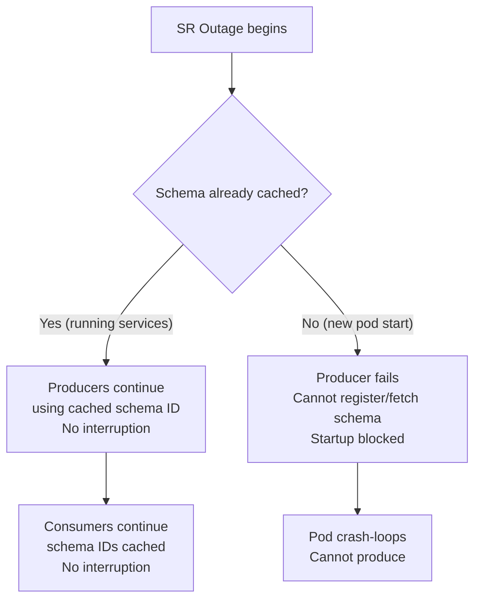
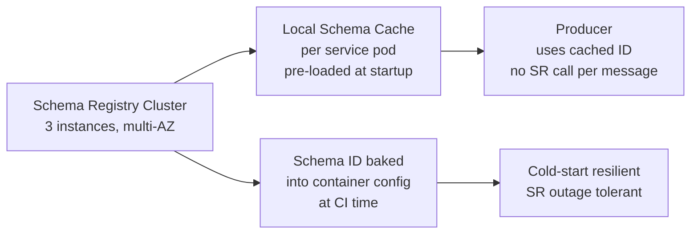

# Scenario Questions — Schema Registry

<article data-difficulty="junior">

## 🟢 Junior: Adding a New Field Safely

**Scenario:** Your team produces `UserEvent` messages to Kafka using Avro. The current schema has `user_id` (string) and `action` (string). You need to add a `session_id` field. Consumers are running in production and you cannot take downtime.

<details>
<summary>💡 Hint</summary>

Think about what BACKWARD compatibility means: new schema must be able to read data written by the old schema. If old messages don't have `session_id`, what must your new field have? Check whether your Schema Registry subject is configured with BACKWARD compatibility.
</details>

<details>
<summary>✅ Solution</summary>

Add `session_id` with a `default` value (null or empty string):

```json
{
  "type": "record",
  "name": "UserEvent",
  "namespace": "com.example",
  "fields": [
    {"name": "user_id",    "type": "string"},
    {"name": "action",     "type": "string"},
    {"name": "session_id", "type": ["null", "string"], "default": null}
  ]
}
```

**Deployment steps:**
1. Register new schema v2 (check compatibility passes)
2. Deploy new producers — they write `session_id`
3. Deploy new consumers — they read `session_id` (null for old messages)
4. Old consumers can still read new messages — they ignore the unknown field (Avro resolution)

**Why `["null", "string"]`?** This is an Avro union type. The `default` must match the first type in the union, which is `null`. This makes the field optional — old messages that lack `session_id` will deserialize with `null`.
</details>

</article>

<article data-difficulty="mid-level">

## 🟡 Mid-Level: Renaming a Field Without Downtime

**Scenario:** Your `Order` schema has a field named `order_id`. The data team wants to rename it to `order_identifier` to align with their naming conventions. Consumers reading the topic cannot be updated immediately — some will keep using `order_id` for 2 weeks.

**Question:** How do you perform this rename safely? What Schema Registry features help?

<details>
<summary>💡 Hint</summary>

Field renaming is not directly backward-compatible in Avro. Look at Avro's `aliases` mechanism. Also consider whether you need a new topic or can handle this in the schema registry. Think about the timeline: producers will switch first, then consumers.
</details>

<details>
<summary>✅ Solution</summary>

**Step 1: Add alias in new schema version**

```json
{
  "type": "record",
  "name": "Order",
  "namespace": "com.example",
  "fields": [
    {
      "name": "order_identifier",
      "aliases": ["order_id"],
      "type": "string"
    },
    {"name": "amount", "type": "double"}
  ]
}
```

The `aliases` field tells Avro that when reading data written with `order_id`, map it to `order_identifier`.

**Step 2: Verify compatibility**
```bash
curl -X POST \
  http://schema-registry:8081/compatibility/subjects/orders-value/versions/latest \
  -H 'Content-Type: application/vnd.schemaregistry.v1+json' \
  -d '{"schema": "..."}'
# Should return: {"is_compatible": true}
```

**Step 3: Rollout**
- Register v2 schema with aliases
- Deploy new producers writing `order_identifier`
- Old consumers reading v2 messages: Avro maps `order_identifier` → no alias match → **field missing** — this is a problem!

**The catch:** Aliases are for **reader schema to understand writer schema**, not the other way. Old consumer schemas (with `order_id`) reading new data (with `order_identifier`) won't find a match.

**Correct approach for old consumers:**
- Keep the old field name in producer data during the transition
- OR use a dual-write / transformation layer
- OR accept the 2-week window where old consumers get null for renamed field (only safe if they handle null gracefully)

**Timeline:**
```
Week 1: Register v2 with alias; deploy producers (still write order_id for compatibility)
Week 2: All consumers updated to read order_identifier
Week 3: Producers switch to writing order_identifier only; register v3 without alias
```
</details>

</article>

<article data-difficulty="senior">

## 🔴 Senior: Schema Registry Outage During Peak Traffic

**Scenario:** It's Black Friday. Your Schema Registry cluster goes down due to a bug in a new deployment. Kafka is fully operational. You have:
- 50 producer services still running
- 100 consumer services still running
- Schema Registry is unreachable for 45 minutes

**Questions:**
1. What happens to producers and consumers during the outage?
2. How do you recover without data loss?
3. What architectural changes prevent this scenario?

<details>
<summary>💡 Hint</summary>

Think about the Schema Registry client's caching behavior. Producers need to look up schema IDs; what happens if the ID is already cached? Consumers need to look up schemas by ID; same question. Consider what "cold start" means in this context. For prevention, think about circuit breakers and offline/cached schema modes.
</details>

<details>
<summary>✅ Solution</summary>

**What happens during the 45-minute outage:**



**Impact matrix:**

| Service State | SR Outage Impact |
|--------------|-----------------|
| Running producer (schema cached) | No impact — cached schema ID used |
| Running consumer (schema cached) | No impact — cached schema used |
| New pod starting | Fails — cannot resolve schema |
| Kafka Connect (cold start) | Fails — cannot fetch schema |

**Immediate recovery actions:**
1. Roll back SR deployment immediately (Kubernetes: `kubectl rollout undo deployment/schema-registry`)
2. If rollback not possible: scale SR to 0, then back to previous version image
3. SR rebuilds cache from `_schemas` topic on startup (~1-2 min for modest schema counts)
4. New pods will succeed once SR is reachable

**Zero data loss verification:**
- Running producers: continued writing (schema IDs were cached) — no gap
- Running consumers: continued reading — no gap
- Failed new pods: never wrote data — no corruption
- Verify with `kafka-consumer-groups.sh --describe` for any lag increases

**Architectural changes to prevent future impact:**

```python
# 1. Configure local schema file fallback
sr_client = SchemaRegistryClient({
    'url': 'http://schema-registry:8081',
})

# 2. Pre-serialize schema ID at startup with retry + circuit breaker
from tenacity import retry, stop_after_attempt, wait_exponential

@retry(stop=stop_after_attempt(10), wait=wait_exponential(multiplier=1, max=60))
def get_schema_id(sr_client, subject: str, schema_str: str) -> int:
    return sr_client.register_schema(subject, Schema(schema_str, schema_type='AVRO'))

# 3. Embed schema ID in service config (not dynamically fetched)
# At build time, bake the schema ID into the service configuration
# Producers: hardcoded schema ID after registration in CI
# Consumers: local schema cache file shipped with container image
```

**Longer-term architecture:**



- Deploy SR in multiple AZs
- Pre-bake schema IDs into container config (CI registers schema, writes ID to config)
- Implement SR health check in readiness probe of downstream services (fail readiness, not liveness, on SR outage)
- Add SR to your DR plan: mirror `_schemas` topic to backup cluster
</details>

</article>
