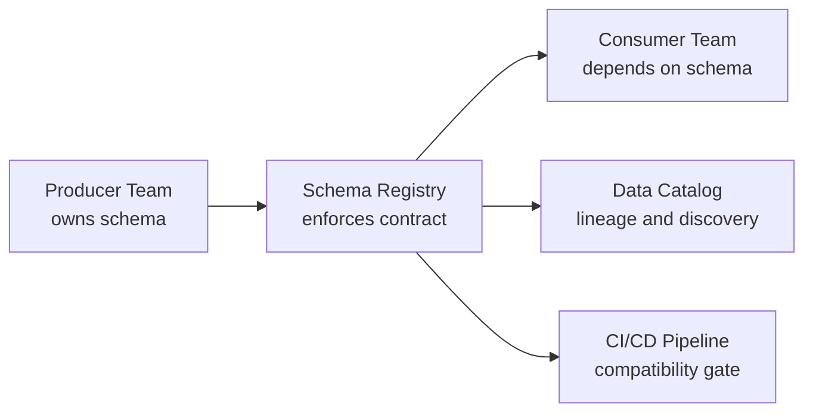
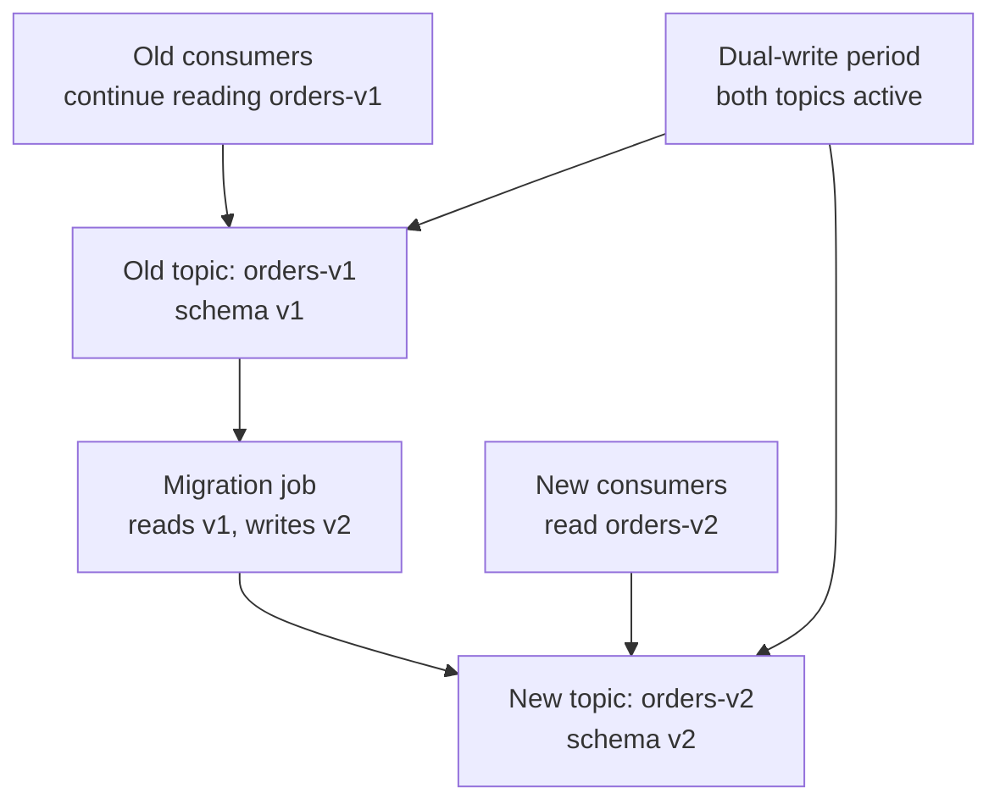

# Schema Registry — Senior Deep Dive

## Data Contracts as a First-Class Concern

At senior level, schema management is a **data governance problem**, not just a serialization detail. Data contracts define the expectations between producers and consumers as explicit agreements.



Key governance questions:
- Who owns a schema? (producer team)
- Who can change it? (schema owner + review process)
- What change process is required? (PR + compatibility check + consumer notification)
- How long must old versions be supported? (SLA)

## Schema Migration Strategies

### Strategy 1: Two-Phase Migration (New Field)

```
Phase 1: Deploy new producer → writes schema v2 (with new field, default)
Phase 2: Deploy new consumers → read new field
Phase 3: Remove default if field is now required
```

This ensures all consumers see the new field before it becomes required.

### Strategy 2: Topic Migration (Breaking Change)

When a truly breaking change is needed (field type change, field removal without default):



```python
def migrate_topic(bootstrap: str, src_topic: str, dst_topic: str,
                  transformer, sr_url: str):
    from confluent_kafka import Consumer, Producer
    from confluent_kafka.schema_registry.avro import AvroDeserializer, AvroSerializer

    sr = SchemaRegistryClient({'url': sr_url})
    consumer = Consumer({
        'bootstrap.servers': bootstrap,
        'group.id': f'migration-{src_topic}',
        'auto.offset.reset': 'earliest',
        'enable.auto.commit': False,
    })
    producer = Producer({'bootstrap.servers': bootstrap})

    consumer.subscribe([src_topic])
    deserializer = AvroDeserializer(sr)
    serializer = AvroSerializer(sr, new_schema_str)

    while True:
        msg = consumer.poll(1.0)
        if not msg or msg.error():
            continue
        old_data = deserializer(msg.value(), ...)
        new_data = transformer(old_data)
        producer.produce(dst_topic, value=serializer(new_data, ...))
        consumer.commit(message=msg, asynchronous=False)
```

### Strategy 3: Consumer-Driven Contract Testing

Before deploying a new schema, test it against all known consumers:

```python
import fastavro
import io

def test_backward_compatibility(old_schema_str: str, new_schema_str: str,
                                sample_records: list) -> bool:
    """Simulate: old producer writes, new consumer reads."""
    import json
    old_schema = fastavro.parse_schema(json.loads(old_schema_str))
    new_schema = fastavro.parse_schema(json.loads(new_schema_str))

    for record in sample_records:
        # Serialize with old schema
        buf = io.BytesIO()
        fastavro.schemaless_writer(buf, old_schema, record)
        serialized = buf.getvalue()

        # Deserialize with new schema (reader=new, writer=old)
        buf = io.BytesIO(serialized)
        try:
            result = fastavro.schemaless_reader(buf, new_schema, old_schema)
        except Exception as e:
            print(f"Incompatible: {e}")
            return False

    return True
```

## Multi-Tenant Schema Registry

In large organizations, a single Schema Registry instance serves multiple teams. Access control and namespacing become critical.

### Namespace Isolation via Subject Strategies

```python
# RecordNameStrategy: subject = "com.payments.Order"
# Different teams own different namespaces
from confluent_kafka.schema_registry.avro import AvroSerializer
from confluent_kafka.schema_registry.record_subject_name_strategy import RecordNameStrategy

serializer = AvroSerializer(
    sr_client,
    schema_str,
    conf={'auto.register.schemas': False,   # do not auto-register in prod
          'subject.name.strategy': RecordNameStrategy}
)
```

### Role-Based Access Control (Confluent Platform)

```bash
# Grant read access to a subject for a service account
confluent iam rolebinding create \
  --principal User:consumer-service \
  --role ResourceOwner \
  --resource Subject:orders-value \
  --kafka-cluster-id <cluster-id> \
  --schema-registry-cluster-id <sr-id>
```

## Schema Registry Internals: The `_schemas` Topic

```
_schemas topic properties:
- Partitions: 1 (single partition for ordering)
- Replication factor: 3 (or cluster default)
- Cleanup policy: compact (keeps latest value per key)
- Key: subject name + version or config key
- Value: JSON with schema content or config
```

The registry leader is elected via Kafka consumer group coordination. On startup, all instances read `_schemas` from offset 0 to rebuild their in-memory cache. This means startup time grows with the number of registered schemas.

## Soft Deletes, Tombstones, and Data Integrity

When you soft-delete a schema version, the registry writes a tombstone (null value) for that key in `_schemas`. On recovery, the tombstone signals the version is deleted.

**Critical production rule**: Never hard-delete a schema version that may still be referenced by unconsumed messages. The consumer will get:

```
org.apache.kafka.common.errors.SerializationException:
  Error retrieving Avro schema for id 42
```

Safe deletion checklist:
1. Verify all consumers have consumed past the messages using the schema version
2. Verify no consumer groups are lagged on the topic
3. Soft delete first; wait 24h
4. Hard delete only after confirming no active deserialization

## Schema Registry Metrics and SLOs

Key operational metrics:

| Metric | Description | Alert Threshold |
|--------|-------------|-----------------|
| `master-slave-role` | 1=leader, 0=follower | Multiple leaders = split brain |
| `registered-count` | Total schemas registered | Track growth rate |
| `schemas-created` | New schemas per minute | Spike = CI/CD issue |
| HTTP `4xx` rate | Compatibility failures | > 0 = schema change rejected |
| HTTP latency p99 | Request latency | > 100 ms = cache miss storm |

```python
# Monitor Schema Registry health
import requests

def check_sr_health(sr_url: str) -> dict:
    resp = requests.get(f"{sr_url}/subjects", timeout=5)
    subjects = resp.json()

    # Check for any subjects with version gaps (potential corruption)
    report = {}
    for subject in subjects[:10]:   # sample first 10
        versions = requests.get(f"{sr_url}/subjects/{subject}/versions").json()
        report[subject] = {'versions': len(versions), 'latest': max(versions)}

    return report
```

## Glue Schema Registry (AWS Alternative)

For AWS-native Kafka (MSK) environments, AWS Glue Schema Registry is an alternative:

```python
import boto3
from aws_schema_registry import SchemaRegistryClient
from aws_schema_registry.avro import AvroSchema

glue_client = boto3.client('glue', region_name='us-east-1')
sr_client = SchemaRegistryClient(glue_client, registry_name='MyRegistry')

schema = AvroSchema(schema_str)
serializer = sr_client.serializer(schema)

# Wire format: differs from Confluent (header-based, not magic byte)
serialized = serializer.serialize('my-topic', record)
```

**Confluent vs Glue comparison:**

| Feature | Confluent SR | AWS Glue SR |
|---------|-------------|-------------|
| Wire format | 5-byte header (magic + ID) | Variable header with UUID |
| Backends | Kafka + REST | DynamoDB + S3 |
| Compatibility | Confluent ecosystem | AWS-native, MSK-optimized |
| RBAC | Confluent RBAC | IAM |
| Cross-region | Manual setup | Built-in with AWS |

## Interview Tips

> **Tip 1:** The two-phase migration pattern is the safe answer for "how do you roll out a schema change with zero downtime." Phase 1 deploys producers with backward-compatible schema. Phase 2 deploys consumers that use the new field. Only then remove the default.

> **Tip 2:** Hard-deleting schemas is dangerous. Know the consequence: any message in Kafka that was written with that schema ID becomes undeserializable. The safe rule: only delete schemas for topics that have been fully consumed and can be replayed.

> **Tip 3:** The `_schemas` topic's single partition is both a feature (ordering) and a limitation (throughput). In high-churn environments, schema registration can become a bottleneck. Caching is the mitigation.

> **Tip 4:** At the senior level, frame schema management as a data governance problem. Mention schema ownership, versioning policies, backward compatibility as a cultural norm, and schema discovery (data catalog integration).

> **Tip 5:** Know the AWS Glue Schema Registry for MSK contexts. The wire format is different from Confluent (UUID-based header vs magic byte + int32 ID). Mixing the two without awareness causes deserialization failures.
