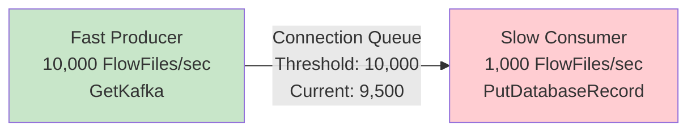
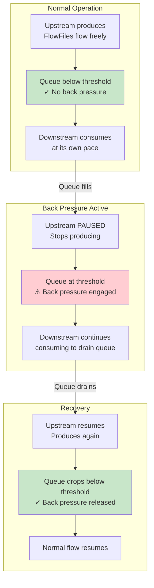
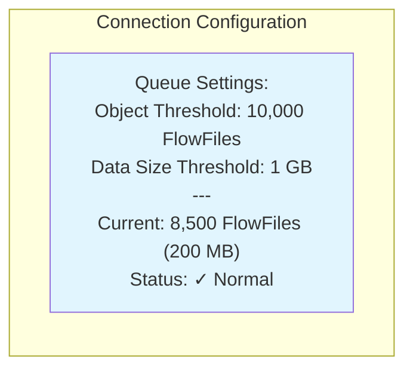
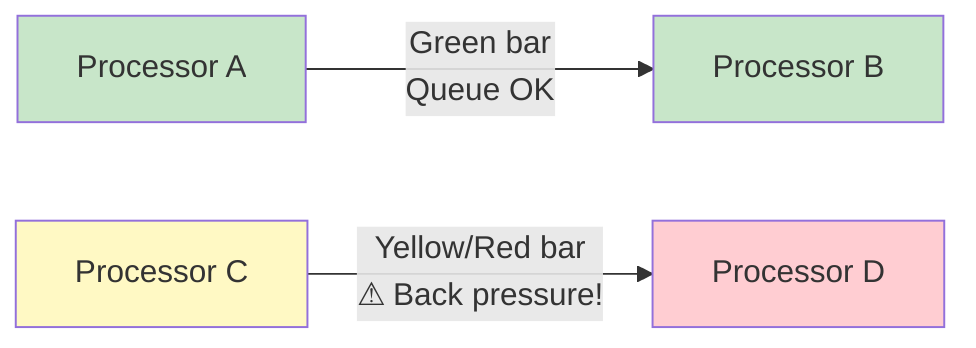
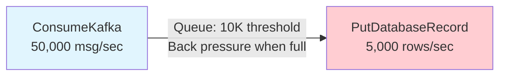
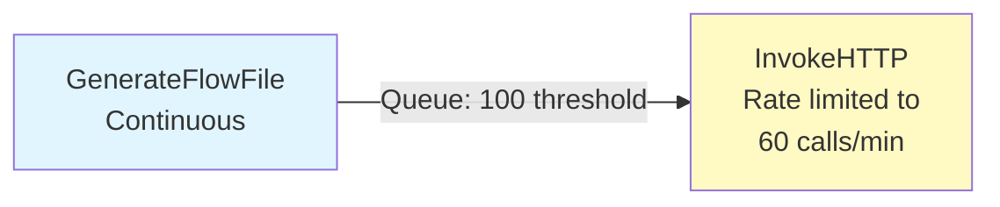
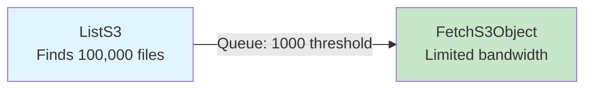
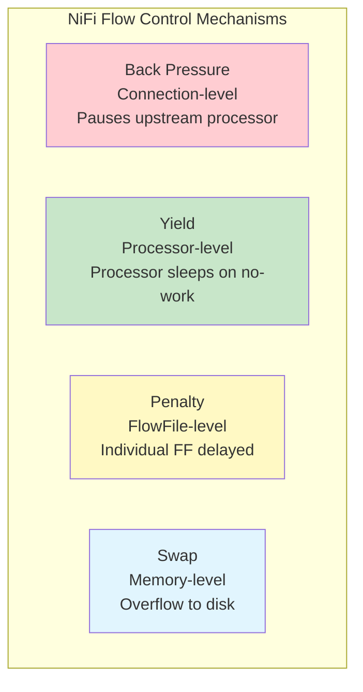

# NiFi Back Pressure — Fundamentals


## 🎯 Analogy

Think of NiFi back-pressure like a water reservoir with safety valves: when a connection queue fills up (10,000 FlowFiles or 1 GB default), NiFi stops the upstream processor from producing more — preventing memory exhaustion downstream.

---
## What is Back Pressure?

Back pressure is NiFi's **built-in flow control mechanism** that prevents a fast producer from overwhelming a slow consumer. When a connection queue fills up to its threshold, NiFi automatically **pauses the upstream processor** until the queue drains.



**Without back pressure:** The queue grows infinitely → memory exhaustion → system crash.

**With back pressure:** When queue reaches threshold → upstream pauses → no memory overflow.

## How Back Pressure Works



## Connection Settings

Every connection (queue) between processors has two back pressure thresholds:

| Setting | Default | Description |
|---------|---------|-------------|
| **Back Pressure Object Threshold** | 10,000 | Max FlowFiles in queue before pausing upstream |
| **Back Pressure Data Size Threshold** | 1 GB | Max data size in queue before pausing upstream |

Whichever threshold is hit **first** triggers back pressure.



## Visual Indicators in NiFi UI



In the NiFi UI:
- **Green connection**: Queue well below threshold
- **Yellow connection**: Queue approaching threshold (warning)
- **Red connection**: Back pressure active (upstream paused)
- Queue size shown on connection label: "5,000 / 10,000"

## Why Back Pressure Matters

| Without Back Pressure | With Back Pressure |
|----------------------|-------------------|
| Memory overflow (OOM) | Memory stays bounded |
| System crash | System stays healthy |
| Data loss possible | No data loss |
| Cascading failures | Graceful degradation |
| Unpredictable behavior | Predictable, controlled flow |

## Common Scenarios

### Scenario 1: Database Slower Than Kafka



Kafka produces at 50K/sec, database handles only 5K/sec.
- Without BP: Queue grows to millions → memory crash
- With BP: Queue fills to 10K → Kafka consumer pauses → queue drains → resumes

### Scenario 2: API Rate Limiting



API allows only 60 requests/minute.
- Set Object Threshold = 100 (small queue, fast pause)
- Upstream pauses quickly, preventing API throttling errors

### Scenario 3: File Processing Burst



ListS3 finds 100K files instantly, but FetchS3Object downloads one at a time.
- Back pressure prevents 100K FlowFiles from overwhelming memory
- FetchS3Object processes at its own pace

## Configuring Back Pressure

### Per Connection

```
Right-click Connection → Configure:
  Back Pressure Object Threshold: 10000
  Back Pressure Data Size Threshold: 1 GB

# For small records (Kafka messages):
  Object Threshold: 50000        (many small FlowFiles OK)
  Data Size Threshold: 500 MB

# For large files (100MB+ each):
  Object Threshold: 100          (few files, each is large)
  Data Size Threshold: 10 GB

# For rate-limited targets:
  Object Threshold: 50           (small queue, fast back pressure)
  Data Size Threshold: 50 MB
```

### Default Settings (nifi.properties)

```properties
# Default back pressure for new connections:
nifi.backpressure.count.threshold=10000
nifi.backpressure.size.threshold=1 GB
```

## Relationship to Other Flow Control



| Mechanism | Level | Trigger | Effect |
|-----------|-------|---------|--------|
| Back Pressure | Connection | Queue full | Pause upstream processor |
| Yield | Processor | No work available | Processor sleeps briefly |
| Penalty | FlowFile | Processing failure | Delay one FlowFile |
| Swap | System | Memory limit | Spill queue to disk |


## ▶️ Try It Yourself

```bash
# Back-pressure is configured per connection in NiFi:
# Back Pressure Object Threshold: 10000 (FlowFile count)
# Back Pressure Data Size Threshold: 1 GB

# When back-pressure triggers:
# 1. Upstream processor stops scheduling (no new FlowFiles created)
# 2. Downstream processor continues draining the queue
# 3. Upstream resumes when queue drops below threshold

# Monitor via NiFi API:
# GET /nifi-api/flow/process-groups/{id}/status
# Look for: "queuedCount" approaching "backPressureObjectThreshold"

# Tune back-pressure per connection based on FlowFile size:
# Small events (1KB): threshold=100000 objects, 100MB size
# Large files (1GB): threshold=10 objects, 20GB size

# Check current queue depths across all connections
# GET /nifi-api/process-groups/root/connections
# -> check status.aggregateSnapshot.queuedCount vs backPressureObjectThreshold

echo "High queue depth + back-pressure = downstream bottleneck — check slow processors"  
```

> **Run it:** Copy the snippet into a REPL or file — no external services needed for the basic example.

---
## Interview Tips

> **Tip 1:** "What is back pressure in NiFi?" — A flow control mechanism on connections (queues) between processors. When a queue reaches its configured threshold (FlowFile count or data size), the upstream processor is automatically paused until the queue drains. Prevents memory overflow and ensures the system doesn't crash when producers are faster than consumers.

> **Tip 2:** "How do you configure back pressure?" — Two thresholds per connection: Object Threshold (number of FlowFiles, default 10,000) and Data Size Threshold (total bytes, default 1 GB). Whichever is hit first triggers back pressure. Tune based on use case: low thresholds for rate-limited APIs, high thresholds for high-throughput batch processing.

> **Tip 3:** "What happens when back pressure is triggered?" — The upstream processor is paused (scheduler stops triggering it). It does NOT drop data — FlowFiles already in the queue continue processing. When the downstream consumer drains the queue below threshold, the upstream processor resumes automatically. Zero data loss, zero manual intervention.
