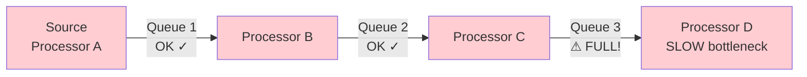
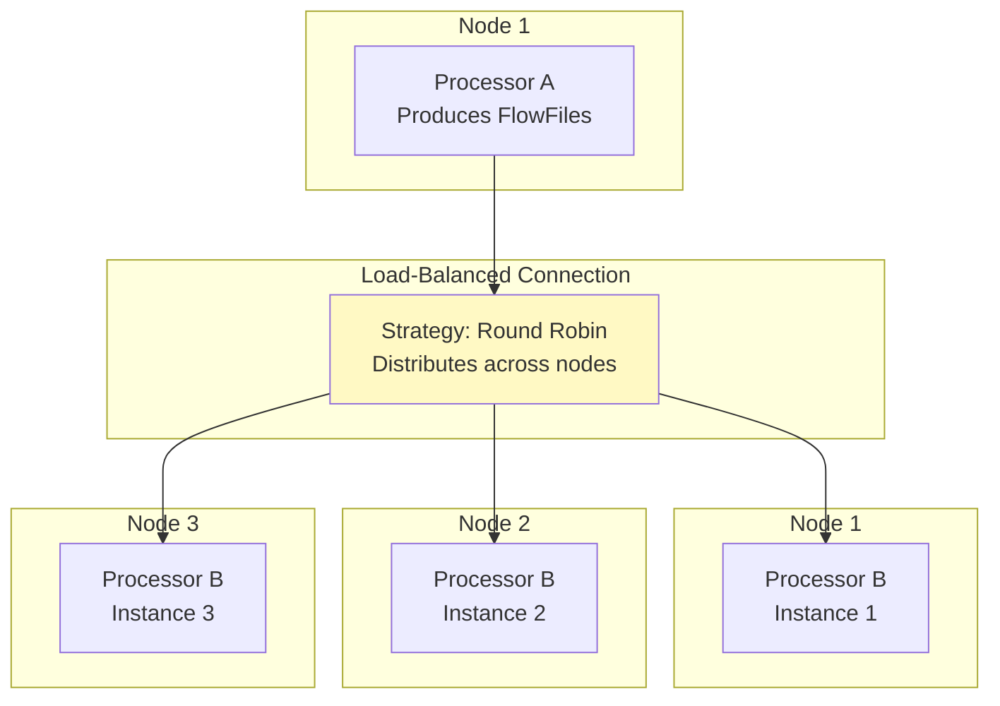
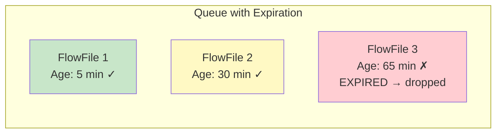
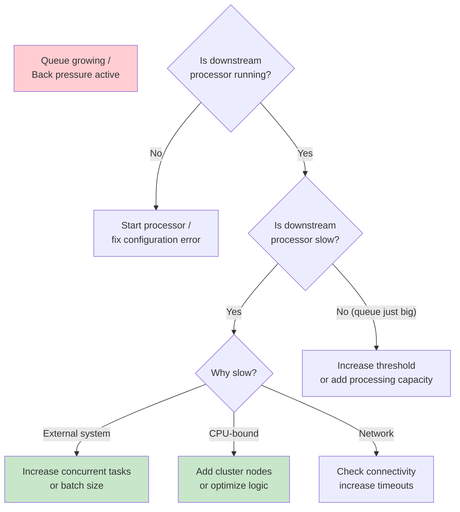

# NiFi Back Pressure — Intermediate Concepts

## Back Pressure Propagation

Back pressure propagates **upstream through the entire flow** — not just one connection.



When Queue 3 fills → C pauses → Queue 2 fills → B pauses → Queue 1 fills → A pauses.

**The entire pipeline throttles to the speed of the slowest processor.**

## Connection Load Balancing

In a NiFi cluster, connections can distribute FlowFiles across nodes:



```
Connection → Configure → Load Balance Strategy:
  - Do not load balance (default)
  - Round Robin (distribute evenly)
  - Single Node (all to one specific node)
  - Partition by Attribute (same key → same node)
```

**Back pressure with load balancing:** Each node's queue has its own threshold. If Node 2 fills up, traffic redirects to Node 1 and Node 3.

## FlowFile Expiration

Prevent queues from holding stale data indefinitely:

```
Connection → Configure:
  FlowFile Expiration: 1 hour
  
# FlowFiles sitting in queue longer than 1 hour → automatically DROPPED
# Useful for: time-sensitive data where old data has no value
# WARNING: Expired FlowFiles are LOST (not sent to failure)
```



## Prioritization in Queues

When back pressure builds up, control which FlowFiles get processed first:

```
Connection → Configure → Available Prioritizers:
  1. FirstInFirstOutPrioritizer (FIFO - default)
  2. NewestFlowFileFirstPrioritizer
  3. OldestFlowFileFirstPrioritizer
  4. PriorityAttributePrioritizer (by "priority" attribute)

# Combine prioritizers (first one is primary, next is tiebreaker):
# Selected: [PriorityAttributePrioritizer, OldestFlowFileFirstPrioritizer]
# → Process high-priority first; within same priority, oldest first
```

**Use case:** During back pressure, ensure payment transactions (priority=1) process before marketing events (priority=5).

## Tuning Back Pressure Thresholds

### Guidelines by Use Case

| Scenario | Object Threshold | Size Threshold | Rationale |
|----------|-----------------|----------------|-----------|
| Kafka → DB (small messages) | 50,000 | 500 MB | Many small FlowFiles are fine |
| S3 large files (100MB each) | 50 | 5 GB | Few but large files |
| Real-time API pipeline | 100 | 50 MB | Fast back pressure for responsiveness |
| Batch ETL (hourly) | 100,000 | 10 GB | Large batches, high throughput |
| CDC stream | 20,000 | 1 GB | Balance between latency and throughput |

### Monitoring Queue Depths

```
# NiFi REST API — check queue sizes:
GET /nifi-api/connections/{id}/status

Response:
{
  "queuedCount": "8500",
  "queuedSize": "450 MB",
  "backPressureObjectThreshold": 10000,
  "backPressureBytesThreshold": "1 GB",
  "percentUseCount": "85%",      ← Approaching threshold!
  "percentUseBytes": "45%"
}

# Alert when queue > 80% of threshold:
# Integrate with monitoring (Prometheus/Datadog via NiFi Reporting Tasks)
```

## Back Pressure and Processor Scheduling

```
# How back pressure interacts with scheduling:
# When back pressure is active on a processor's OUTPUT connection:
# → Processor is NOT scheduled (onTrigger() not called)
# → Processor thread released back to pool
# → Zero CPU consumed while paused

# When back pressure releases:
# → Next scheduled run: processor resumes normally
# → No "burst" of processing (processes one batch per trigger)

# Run Schedule impact:
# Timer Driven, 0 sec: Resumes IMMEDIATELY when back pressure releases
# Timer Driven, 5 sec: May wait up to 5 sec after back pressure releases
# Cron: Only runs at next cron time (may miss windows during back pressure!)
```

## ControlRate Processor (Explicit Rate Limiting)

When you need rate limiting BEYOND back pressure:

```
ControlRate:
  Rate Control Criteria: flowfile count
  Maximum Rate: 100
  Time Duration: 1 min
  Grouping Attribute: (empty = global rate)
  
# Limits flow to 100 FlowFiles per minute regardless of queue state
# Use for: API rate limits, throttling to external systems

# Per-source rate limiting:
ControlRate:
  Rate Control Criteria: flowfile count
  Maximum Rate: 50
  Time Duration: 1 min
  Grouping Attribute: source.system
  # Each source gets its own 50/min limit
```

## Diagnosing Back Pressure Issues



## Interview Tips

> **Tip 1:** "How does back pressure propagate?" — It cascades upstream through the entire flow. If the final processor (e.g., database write) is slow, its input queue fills → its upstream processor pauses → THAT queue fills → eventually back to the source processor. The whole pipeline throttles to the bottleneck speed. This is by design — prevents unbounded memory growth.

> **Tip 2:** "How do you handle a slow downstream system?" — (1) Increase concurrent tasks on the slow processor (more parallelism). (2) Batch FlowFiles before the slow processor (MergeRecord → bulk inserts). (3) Increase back pressure threshold (buffer more in queue). (4) Add NiFi cluster nodes with load-balanced connections. (5) If all else fails, use ControlRate to match downstream capacity.

> **Tip 3:** "FlowFile expiration vs. back pressure?" — They solve different problems. Back pressure = flow control (pause upstream, keep data). Expiration = data lifecycle (discard stale data). Use expiration for time-sensitive data where old data is worthless (real-time dashboards). Never use expiration for data that must be delivered (financial records, audit logs).
