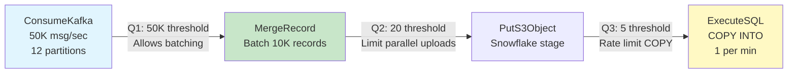
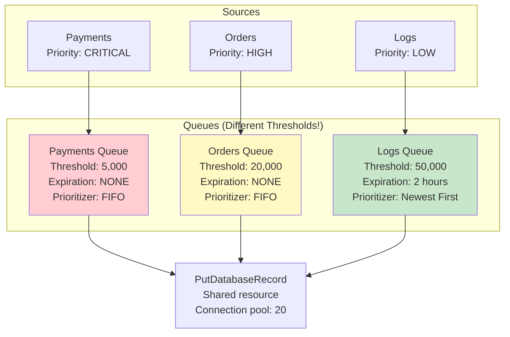

# NiFi Back Pressure — Real-World Production Examples

## Example 1: Kafka → Snowflake Pipeline Tuning



```
# Back pressure tuning rationale:

Q1 (Kafka → MergeRecord):
  Object Threshold: 50,000
  Size Threshold: 2 GB
  # WHY: Allow MergeRecord to accumulate enough FlowFiles for efficient batching
  # At 50K/sec, this gives 1 second of buffer
  # MergeRecord creates 10K-record batches (5 per second)

Q2 (MergeRecord → PutS3Object):
  Object Threshold: 20
  Size Threshold: 2 GB
  # WHY: Each FlowFile is now 10K records (~50MB Parquet)
  # 20 × 50MB = 1GB buffered — enough for S3 upload variability
  # Prevents too many parallel uploads overwhelming S3

Q3 (PutS3Object → ExecuteSQL COPY):
  Object Threshold: 5
  Size Threshold: 500 MB
  # WHY: COPY INTO runs every minute (processes all staged files)
  # Only need to buffer 1 minute of staged files
  # Low threshold because COPY is the rate-limiting step
```

## Example 2: Multi-Source Ingestion with Priority



```
# Strategy:
# - Payments: Small queue (back pressure fires fast → alerts immediately)
#   No expiration (every payment MUST be delivered)
# - Orders: Medium queue (buffers for burst handling)
#   No expiration (orders must be delivered, can be delayed)
# - Logs: Large queue (absorbs spikes without back pressure)
#   2-hour expiration (old logs can be discarded if system is overloaded)
#   Newest First prioritizer (current logs more valuable than old)

# The shared database connection pool (20 connections):
# Payments get 10 dedicated connections (Concurrent Tasks = 10)
# Orders get 7 connections (Concurrent Tasks = 7)
# Logs get 3 connections (Concurrent Tasks = 3)
# Under pressure: payments continue, logs back up → expire gracefully
```

## Example 3: Handling Sudden Data Spikes

```
# Scenario: Normal load = 5,000 FlowFiles/sec
# Spike during Black Friday: 50,000 FlowFiles/sec (10x burst)

# Pipeline:
# ConsumeKafka → ValidateRecord → ConvertRecord → PutDatabaseRecord

# BEFORE tuning (system crashed during spike):
# All thresholds at 10,000
# Spike: all queues filled in 2 seconds
# All processors paused
# Kafka consumer offset didn't commit → reprocessing on restart
# Database overwhelmed when released

# AFTER tuning (handles 10x spike gracefully):
Connection: Kafka → Validate
  Object Threshold: 200,000     # Buffer 40 seconds of spike traffic
  Size Threshold: 5 GB

Connection: Validate → Convert
  Object Threshold: 100,000     # Buffer 20 seconds
  Size Threshold: 3 GB

Connection: Convert → Database
  Object Threshold: 50,000      # Buffer 10 seconds
  Size Threshold: 2 GB
  
# PLUS: ControlRate before database
ControlRate:
  Maximum Rate: 10,000 FlowFiles/min
  # Caps database at sustainable rate regardless of input spike
  
# Result during 10x spike:
# Kafka queue fills to 200K (40 seconds of data)
# ControlRate limits DB to sustainable 10K/min
# Spike queued safely → drains over ~20 minutes after spike ends
# ZERO data loss, ZERO system crash
```

## Example 4: Back Pressure Monitoring Dashboard

```python
# Prometheus metrics from NiFi PrometheusReportingTask:
# nifi_connection_queued_count{connection_name="kafka_to_merge"}
# nifi_connection_backpressure_pct{connection_name="kafka_to_merge"}

# Grafana dashboard panels:
# 1. Queue depth over time (area chart)
# 2. Back pressure percentage (gauge)
# 3. Alert: Queue > 80% threshold for > 5 minutes

# Alert rules (Prometheus):
# ALERT NiFiBackPressureWarning
#   IF nifi_connection_backpressure_pct > 80
#   FOR 5m
#   LABELS {severity="warning"}
#   ANNOTATIONS {summary="NiFi queue {{$labels.connection}} at {{$value}}%"}

# ALERT NiFiBackPressureCritical
#   IF nifi_connection_backpressure_pct > 95
#   FOR 2m
#   LABELS {severity="critical"}
#   ANNOTATIONS {summary="NiFi back pressure ACTIVE on {{$labels.connection}}"}
```

## Troubleshooting Checklist

| Symptom | Cause | Fix |
|---------|-------|-----|
| All queues full | Final processor is the bottleneck | Increase concurrent tasks or batch size on final processor |
| One queue full, others empty | Single slow processor in chain | Fix that specific processor (config, resources) |
| Queues fill during specific hours | Peak traffic pattern | Increase thresholds to buffer peak; add nodes |
| Queue fills, never drains | Downstream system is DOWN | Implement circuit breaker; alert on-call |
| Frequent pause/resume cycling | Threshold too low for throughput | Increase threshold (buffer_seconds × rate) |
| Memory issues despite back pressure | Too many connections with high thresholds | Lower thresholds or consolidate connections |

## Interview Tips

> **Tip 1:** "How do you handle data spikes?" — Size back pressure thresholds for PEAK, not average. Formula: threshold = peak_rate × acceptable_buffer_seconds. For 10x spike lasting 1 minute: threshold = 50,000/sec × 60 sec = 3M. Then add ControlRate before the bottleneck to cap at sustainable rate. The queue buffers the spike; ControlRate drains it steadily.

> **Tip 2:** "How do you prioritize traffic under back pressure?" — Separate queues per priority class with different thresholds. Critical: low threshold (fast alerting), no expiration, dedicated processor threads. Low priority: high threshold (absorbs spikes), with expiration (discard if stale). Newest-first prioritizer for low-priority (current data more valuable).

> **Tip 3:** "How do you monitor back pressure in production?" — PrometheusReportingTask exports queue metrics. Dashboard: queue depth over time + percentage of threshold. Alert at 80% (warning) and 95% (critical). Track: which connection, how long at threshold, upstream/downstream processor throughput. This identifies bottlenecks BEFORE they cause pipeline failures.
