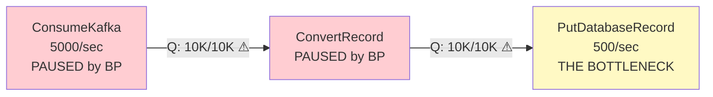
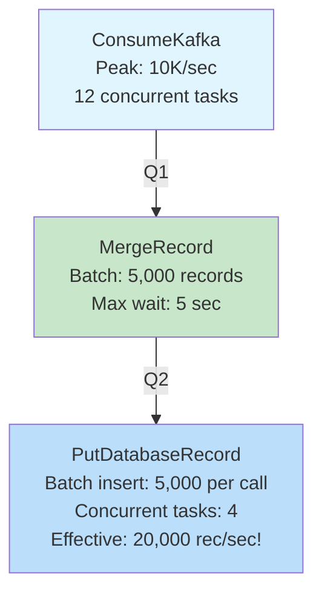
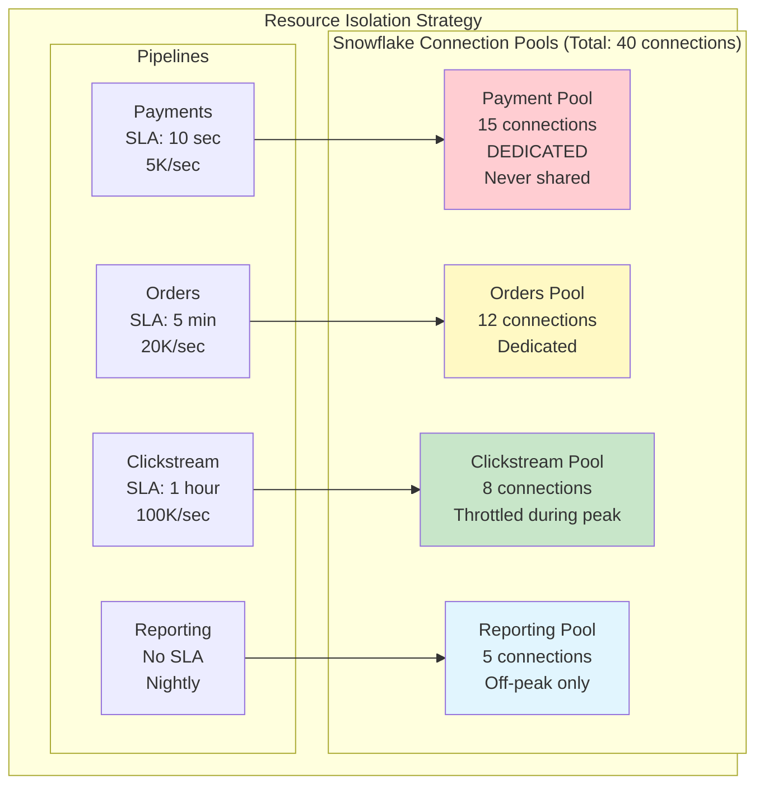
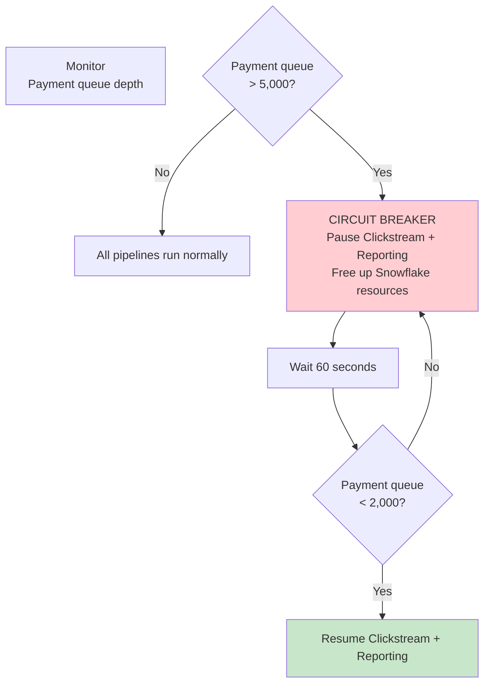

# Scenario Questions — NiFi Back Pressure

<article data-difficulty="junior">

## 🟢 Junior: Understanding Back Pressure Behavior

**Scenario:** You have a NiFi flow: ConsumeKafka (produces 5,000 FlowFiles/sec) → ConvertRecord → PutDatabaseRecord (handles 500 FlowFiles/sec). The connection between ConvertRecord and PutDatabaseRecord has Object Threshold = 10,000. Describe: (1) What happens in the first 20 seconds? (2) When does back pressure engage? (3) What is the steady-state behavior?

<details>
<summary>💡 Hint</summary>
Producer rate = 5,000/sec. Consumer rate = 500/sec. Net queue growth = 4,500/sec. Queue fills to 10,000 in ~2.2 seconds. Then back pressure pauses ConvertRecord. But ConsumeKafka → ConvertRecord queue will also fill. Steady state: entire pipeline runs at 500/sec (bottleneck speed).
</details>

<details>
<summary>✅ Solution</summary>

**(1) First 20 seconds timeline:**

```
Second 0-2.2:
  ConvertRecord outputs: 5,000 FF/sec
  PutDatabaseRecord consumes: 500 FF/sec
  Queue growth: 4,500 FF/sec
  Queue after 2.2 sec: ~10,000 (threshold reached!)

Second 2.2:
  ⚠ BACK PRESSURE ACTIVATES on ConvertRecord → PutDB connection
  ConvertRecord is PAUSED (cannot output to full queue)

Second 2.2-4.5:
  ConvertRecord paused → its INPUT queue starts filling
  ConsumeKafka outputs: 5,000 FF/sec
  ConvertRecord processes: 0/sec (paused by downstream BP)
  Kafka→Convert queue growth: 5,000 FF/sec
  
Second 4.5 (Kafka→Convert queue also fills to 10K):
  ⚠ BACK PRESSURE ACTIVATES on Kafka → ConvertRecord connection
  ConsumeKafka is PAUSED

Second 4.5+:
  Entire pipeline paused EXCEPT PutDatabaseRecord
  PutDB drains its queue at 500 FF/sec
  Queue drops: 10,000 → 9,500 → 9,000...
  
Second ~24.5 (queue drops below threshold):
  Back pressure RELEASES on Convert→PutDB
  ConvertRecord resumes → processes backlog
  But immediately fills again (5K > 500)
  Back pressure RE-ENGAGES almost immediately
```

**(2) When does back pressure engage?**

```
First engagement: ~2.2 seconds after start
  Convert→PutDB queue reaches 10,000 (Object Threshold)
  
Cascading engagement: ~4.5 seconds after start
  Kafka→Convert queue also reaches 10,000
  ConsumeKafka pauses
```

**(3) Steady-state behavior:**

```
Steady state: The ENTIRE pipeline runs at 500 FF/sec (bottleneck speed)

Pattern: pulse/pause cycling
  - PutDB drains queue slightly below 10K
  - Back pressure releases briefly
  - ConvertRecord processes a small burst
  - Queue fills back to 10K
  - Back pressure re-engages
  
  Net throughput: 500 FF/sec (PutDatabaseRecord's max speed)
  Kafka consumer lag grows: 4,500 messages/sec accumulate in Kafka
  
To fix: Increase PutDatabaseRecord capacity:
  - Concurrent Tasks: 10 → handles 5,000/sec
  - Or: Batch with MergeRecord before PutDB
  - Or: Add NiFi cluster nodes
```



**Key Points:**
- Back pressure propagates upstream (Convert pauses first, then Kafka)
- Entire pipeline throttles to slowest processor (500/sec)
- No data loss — data buffered in Kafka (lag grows)
- Fix the bottleneck, not the thresholds!

</details>

</article>

<article data-difficulty="mid-level">

## 🟡 Mid-Level: Designing Back Pressure for SLA Requirements

**Scenario:** You're building a NiFi pipeline that must deliver payment transactions to a database within 30 seconds of receipt (SLA). Average throughput: 1,000 transactions/sec. Peak throughput: 10,000 transactions/sec (lasting up to 5 minutes). The database can sustain 2,000 inserts/sec. Design the back pressure strategy, batching approach, and alerting to meet the SLA while handling peaks.

<details>
<summary>💡 Hint</summary>
SLA = 30 seconds end-to-end. At peak 10K/sec with DB at 2K/sec: need to buffer 8K/sec × 300 sec = 2.4M FlowFiles during peak. That's too many! Solution: batch before DB (MergeRecord increases effective DB rate to 10K+/sec with bulk inserts). Then back pressure thresholds sized for 30-second buffer at peak.
</details>

<details>
<summary>✅ Solution</summary>



**Back Pressure Calculation:**

```
# STEP 1: Understand the math
# SLA: 30 seconds end-to-end
# Processing time per stage: ~2 seconds (Kafka read + merge + insert)
# Available buffer time: 30 - 2 = 28 seconds

# STEP 2: Effective throughput with batching
# Without batching: DB handles 2,000 single inserts/sec
# WITH batching (5,000 per batch insert):
#   Each batch insert takes ~250ms
#   4 concurrent tasks × (1000ms/250ms) = 4 × 4 = 16 batches/sec
#   16 batches × 5,000 records = 80,000 records/sec effective!
#   
# WITH BATCHING: DB can handle 80K/sec >> Peak of 10K/sec
# Bottleneck eliminated!

# STEP 3: Size back pressure for SLA (safety margin)
# Even with batching, allow buffer for transient slowdowns:

Q1 (Kafka → MergeRecord):
  Object Threshold: 100,000
  # At 10K/sec peak: 10 seconds buffer
  # MergeRecord processes at 10K+/sec (creates 2 batches/sec of 5K each)
  # Should rarely hit this threshold

Q2 (MergeRecord → PutDatabaseRecord):
  Object Threshold: 10
  Size Threshold: 2 GB
  # Each FlowFile = 5,000 records
  # 10 FlowFiles × 5,000 = 50,000 records buffered
  # At peak: 50,000 / 10,000/sec = 5 seconds of buffer
  # Total pipeline buffer: 10 + 5 = 15 seconds < 30 sec SLA ✓
```

**MergeRecord Configuration:**

```
MergeRecord:
  Minimum Number of Records: 5000
  Maximum Number of Records: 10000
  Max Bin Age: 5 sec
  
  # At peak (10K/sec): fills to 5K in 0.5 seconds → emit batch
  # At normal (1K/sec): fills to 5K in 5 seconds OR max age fires at 5 sec
  # 5 sec max age ensures SLA compliance even at low volume!
```

**PutDatabaseRecord Configuration:**

```
PutDatabaseRecord:
  Concurrent Tasks: 4
  Batch Size: 5000
  Statement Type: INSERT
  # 4 threads × batch inserts → handles 80K records/sec
  # Way above 10K/sec peak → NO back pressure during peaks!
```

**SLA Monitoring:**

```
# UpdateAttribute (after ConsumeKafka):
  sla.start.time = "${now()}"
  sla.deadline = "${now():toNumber():plus(30000)}"  # 30 sec from now

# UpdateAttribute (after PutDatabaseRecord success):
  sla.end.time = "${now()}"
  sla.duration.ms = "${now():toNumber():minus(${sla.start.time:toNumber()})}"
  sla.met = "${sla.duration.ms:lt(30000)}"  # true if < 30 seconds

# Route breached SLAs to alerting:
RouteOnAttribute:
  sla_breach = ${sla.met:equals('false')}
  
# Alert:
InvokeHTTP:
  POST to PagerDuty/Slack with:
  "Payment SLA BREACH: ${sla.duration.ms}ms (max 30000ms)"
```

**Back Pressure Alerts (Before SLA Breach):**

```
# Alert if Q1 > 50% (early warning):
# At 50K queued at 10K/sec input = 5 seconds of data
# Total time already: 5 + processing = ~7 seconds
# Still within 30 sec SLA but approaching risk

# PrometheusReportingTask metrics:
# Alert: nifi_q1_depth > 50000 for > 30 seconds
# Action: Scale up (add NiFi nodes) or investigate DB slowdown
```

**Key Points:**
- **Batching eliminates the bottleneck**: 2K/sec → 80K/sec effective throughput
- **Back pressure sized for SLA**: Total buffer time < SLA target
- **Max Bin Age**: Ensures low-volume records don't wait too long (5 sec cap)
- **SLA tracking in attributes**: Every FlowFile carries its own SLA timer
- **Early warning alerts**: At 50% queue depth, before SLA is actually breached
- **Peak handling**: 10x spike fully handled by batching (no queue buildup)

</details>

</article>

<article data-difficulty="senior">

## 🔴 Senior: Multi-Pipeline Resource Contention

**Scenario:** You have a single NiFi cluster (5 nodes) running 4 independent pipelines that share resources: (1) Payments pipeline (SLA: 10 sec, 5K msg/sec), (2) Orders pipeline (SLA: 5 min, 20K msg/sec), (3) Clickstream pipeline (SLA: 1 hour, 100K events/sec), (4) Reporting pipeline (SLA: none, runs nightly). All four write to the same Snowflake warehouse. During peak hours, the Payments pipeline misses SLA because Clickstream consumes all database connections. Design a back pressure and resource isolation strategy.

<details>
<summary>💡 Hint</summary>
Resource isolation: separate DBCPConnectionPool services per pipeline (dedicated connections). Priority-based: Payments gets most connections (critical SLA). Back pressure on Clickstream: aggressive throttling during business hours. ControlRate on Clickstream. Circuit breaker: if Payments queue > threshold → pause lower-priority pipelines. Reporting: only runs during off-peak.
</details>

<details>
<summary>✅ Solution</summary>



**1. Separate Connection Pools:**

```
# Create 4 separate DBCPConnectionPool controller services:

Payment_Snowflake_Pool:
  Max Total Connections: 15
  Max Wait Time: 500 ms    # Fast fail if pool exhausted
  Validation Query: SELECT 1
  
Orders_Snowflake_Pool:
  Max Total Connections: 12
  Max Wait Time: 2000 ms
  
Clickstream_Snowflake_Pool:
  Max Total Connections: 8
  Max Wait Time: 5000 ms   # Can wait longer (relaxed SLA)
  
Reporting_Snowflake_Pool:
  Max Total Connections: 5
  Max Wait Time: 30000 ms  # No SLA, can wait

# CRITICAL: Each pipeline's PutDatabaseRecord uses ONLY its own pool
# Clickstream can NEVER consume Payment connections!
```

**2. Priority-Based Back Pressure:**

```
# Payments Pipeline (SLA: 10 seconds):
Kafka → Merge connection:
  Object Threshold: 10,000    # 2 seconds of buffer at 5K/sec
  # TINY buffer — hit back pressure fast → alert immediately
  
Merge → PutDB connection:
  Object Threshold: 5         # Almost no buffer before DB
  # If DB is slow, back pressure fires in < 1 second
  
# Why low thresholds? 
# SLA is 10 seconds. Low threshold = early warning.
# With 15 dedicated connections: should NEVER hit back pressure normally.
# If it does → something is WRONG → alert → investigate immediately.

# Orders Pipeline (SLA: 5 minutes):
Kafka → Merge connection:
  Object Threshold: 200,000   # 10 seconds at 20K/sec
Merge → PutDB connection:
  Object Threshold: 50        # 50 batches buffered

# Clickstream Pipeline (SLA: 1 hour):
Kafka → Merge connection:
  Object Threshold: 5,000,000 # 50 seconds at 100K/sec
  Expiration: 2 hours         # Discard if > 2 hours old
Merge → PutDB connection:
  Object Threshold: 200       # Large buffer OK
```

**3. Adaptive Throttling (Clickstream During Peak):**

```
# ControlRate on Clickstream pipeline:
ControlRate:
  Rate Control Criteria: flowfile count
  Maximum Rate: ${clickstream.rate.limit}  # Variable!
  Time Duration: 1 sec

# Variable schedule (set by external script or GenerateFlowFile trigger):
# Peak hours (8 AM - 8 PM):   clickstream.rate.limit = 20,000/sec
# Off-peak (8 PM - 8 AM):     clickstream.rate.limit = 100,000/sec

# Rationale: During peak, clickstream throttled to 20K/sec (uses 8 DB connections)
# This leaves plenty of Snowflake capacity for Payments and Orders.
# Off-peak: clickstream runs at full speed to catch up.
```

**4. Circuit Breaker (Protect Payments):**



```python
# Circuit breaker implementation (runs as a scheduled task or external monitor):

def circuit_breaker_check():
    payment_queue_depth = get_connection_queue_depth("payment_merge_to_db")
    
    if payment_queue_depth > 5000:
        # CRITICAL: Payments are backing up!
        # Action 1: Pause lower-priority pipelines
        stop_processor_group("clickstream-pipeline")
        stop_processor_group("reporting-pipeline")
        
        # Action 2: Alert on-call
        send_alert("P1: Payment pipeline back pressure! "
                   "Paused clickstream & reporting to free resources.")
        
    elif payment_queue_depth < 2000:
        # Safe to resume lower-priority
        start_processor_group("clickstream-pipeline")
        start_processor_group("reporting-pipeline")
```

**5. Reporting Pipeline (Off-Peak Only):**

```
# Reporting pipeline scheduling:
# All processors in Reporting group: Cron schedule
# Run Schedule: 0 0 2 * * ?    (2 AM only)
# Yield Duration: 1 hour        (if triggered off-schedule, wait)

# Back pressure: doesn't matter much (no SLA)
# But still set reasonable limits to prevent resource waste:
  Object Threshold: 10,000
  Size Threshold: 5 GB
```

**6. Monitoring Dashboard:**

```
# Per-pipeline metrics:
nifi_payment_queue_depth gauge
nifi_payment_sla_duration_p99 histogram
nifi_orders_queue_depth gauge
nifi_clickstream_queue_depth gauge
nifi_clickstream_records_dropped counter (expiration)

# Alerts:
# Payment queue > 1000 for 10 sec → P2 warning
# Payment queue > 5000 → P1 critical (circuit breaker fires)
# Payment SLA p99 > 8 sec → P2 warning (approaching 10 sec SLA)
# Orders queue > 100,000 → P3 info (approaching capacity)
```

**Key Points:**
- **Resource isolation via separate pools**: Clickstream CAN'T steal Payment connections
- **Priority-encoded in thresholds**: Low threshold = fast alert for critical pipelines
- **Adaptive throttling**: Clickstream rate-limited during business hours
- **Circuit breaker**: Automatically protects Payments by pausing lower-priority
- **Time-based scheduling**: Reporting only during off-peak (no resource contention)
- **Result**: Payments consistently meet 10-sec SLA even during peak clickstream volume

</details>

</article>

</content>
