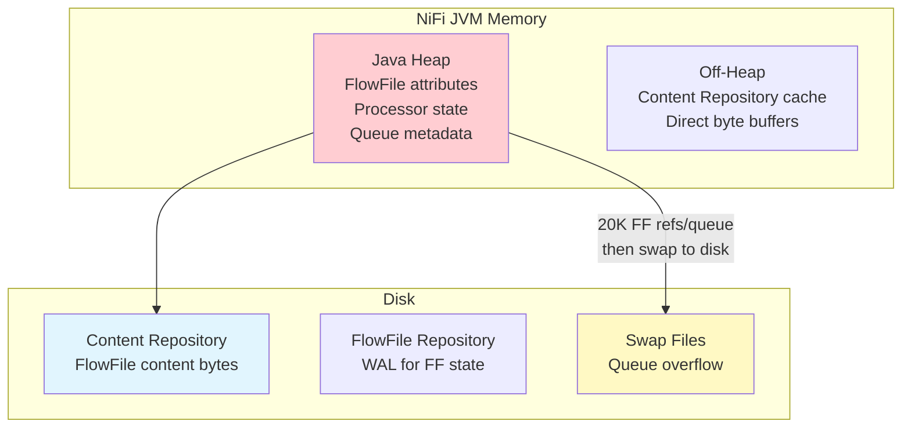
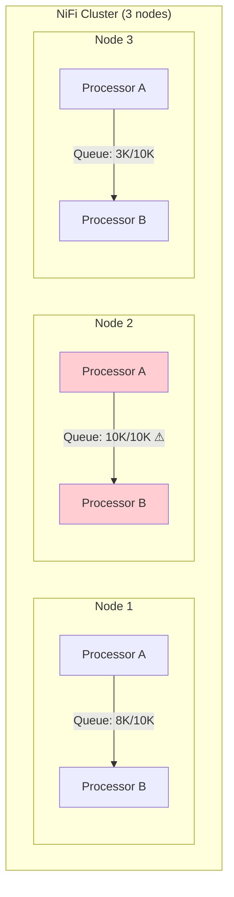
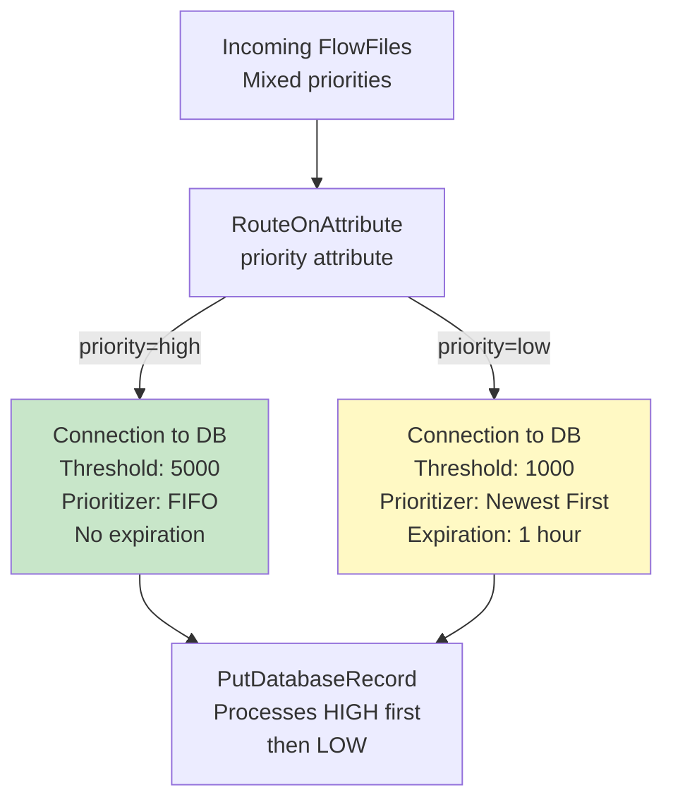
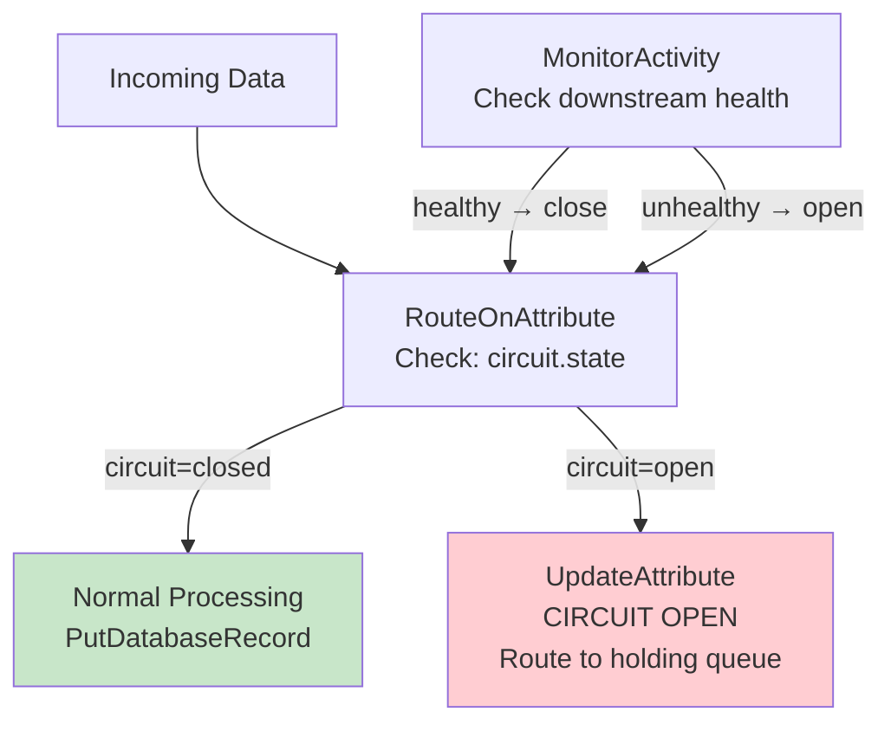

# NiFi Back Pressure — Senior Deep Dive

## Memory Architecture and Back Pressure



### Memory Budget Per FlowFile

```
Each FlowFile in a queue consumes:
  - ~1 KB heap memory (attributes + metadata + content claim reference)
  - Actual content is on DISK (Content Repository)

Queue with 10,000 FlowFiles = ~10 MB heap
Queue with 100,000 FlowFiles = ~100 MB heap
Queue with 1,000,000 FlowFiles = ~1 GB heap ← PROBLEMATIC!

# This is why back pressure defaults to 10,000 objects:
# 10,000 × 1 KB = ~10 MB per queue (manageable)
# With 100 connections: 100 × 10 MB = 1 GB (significant!)
```

### Swap Threshold Interaction

```properties
# When queue exceeds swap threshold → FlowFiles serialized to disk:
nifi.queue.swap.threshold=20000

# Interaction with back pressure:
# Back Pressure Threshold: 10,000 (upstream pauses)
# Swap Threshold: 20,000 (overflow to disk)

# If back pressure = 50,000 and swap = 20,000:
#   0-20,000: In-memory queue (fast)
#   20,001-50,000: Swapped to disk (slower)
#   50,001+: Back pressure engaged (upstream pauses)

# RECOMMENDATION: Back pressure < swap threshold
# This way, upstream pauses BEFORE swapping occurs
# Swap = safety net, not normal operation
```

## Cluster-Aware Back Pressure



```
# Back pressure is PER-NODE in a cluster:
# Each node has its own queue with its own threshold
# Node 2 at 10K → Node 2's Processor A pauses
# Node 1 and Node 3 continue normally!

# Load-balanced connections help:
# If Node 2 is full, new FlowFiles route to Node 1/3
# Prevents single-node hotspots

# Cluster-wide back pressure monitoring:
# Sum all node queues for total pipeline health
# Alert if ANY node hits threshold (indicates bottleneck)
```

## Advanced Flow Control Patterns

### Pattern 1: Priority-Based Throttling



```
# High priority: larger buffer, no expiration (must deliver)
# Low priority: smaller buffer, 1-hour expiration (discard if stale)
# Database processes high-priority queue first (connection ordering)
```

### Pattern 2: Adaptive Batching Based on Queue Depth

```
# Concept: When queue is shallow → small batches (low latency)
#          When queue is deep → large batches (high throughput)

# Read queue depth via NiFi API or SiteToSite reporting
# Adjust MergeRecord threshold dynamically:

# Variable: merge_threshold (set by monitoring script)
MergeRecord:
  Minimum Number of Records: ${merge_threshold}
  # Shallow queue (< 1000): merge_threshold = 100 (fast, low latency)
  # Deep queue (> 5000): merge_threshold = 5000 (batched, high throughput)
```

### Pattern 3: Circuit Breaker



```
# Implement circuit breaker via:
# 1. Monitor downstream failures (count in attributes)
# 2. If failures > threshold: set circuit.state = "open"
# 3. Route to holding queue (PutS3Object for safe storage)
# 4. Periodically probe downstream (health check)
# 5. If healthy: set circuit.state = "closed" → resume

# This prevents cascading failures when downstream is DOWN
# Better than back pressure alone (which just fills queue)
```

## Performance Impact of Back Pressure Thresholds

```
# Threshold too LOW (e.g., 100):
# ✗ Frequent pause/resume cycles
# ✗ Processor scheduling overhead
# ✗ Reduced throughput (stop-start pattern)
# ✓ Minimal memory usage
# ✓ Fast response to downstream issues

# Threshold too HIGH (e.g., 1,000,000):
# ✗ High memory usage (1M × 1KB = 1GB per queue)
# ✗ Swap file activity (if > swap threshold)
# ✗ Long drain time on restart
# ✓ Smooth throughput (large buffer)
# ✓ Handles bursts well

# SWEET SPOT: 10,000-50,000 for most use cases
# Rule of thumb: 
# threshold = desired_buffer_seconds × production_rate_per_sec
# Example: 30 seconds buffer × 1000 FlowFiles/sec = 30,000 threshold
```

## Monitoring and Alerting

```python
# Python script to monitor NiFi back pressure via REST API:
import requests

NIFI_URL = "https://nifi.company.com/nifi-api"
ALERT_THRESHOLD_PCT = 80  # Alert at 80% of back pressure threshold

def check_back_pressure():
    connections = requests.get(f"{NIFI_URL}/flow/process-groups/root/connections").json()
    
    alerts = []
    for conn in connections['connections']:
        status = conn['status']['aggregateSnapshot']
        threshold = conn['backPressureObjectThreshold']
        current = int(status['flowFilesQueued'])
        pct = (current / threshold) * 100 if threshold > 0 else 0
        
        if pct > ALERT_THRESHOLD_PCT:
            alerts.append({
                'connection': conn['component']['name'],
                'source': conn['component']['source']['name'],
                'destination': conn['component']['destination']['name'],
                'queued': current,
                'threshold': threshold,
                'percent': pct
            })
    
    return alerts
```

## Interview Tips

> **Tip 1:** "How does back pressure interact with NiFi memory?" — Each queued FlowFile consumes ~1KB of heap memory (attributes + metadata). Content is on disk. At 10K threshold with 100 connections = ~1GB heap just for queues. If threshold is too high, you'll hit swap (20K default) → disk I/O → performance degradation. Set back pressure BELOW swap threshold so upstream pauses before swapping.

> **Tip 2:** "How does back pressure work in a cluster?" — Per-node. Each node has its own queue with its own threshold. Node 2 at threshold doesn't pause Node 1. Use load-balanced connections to redistribute work from overloaded nodes. Monitor SUM across all nodes for total pipeline health. One node consistently hitting back pressure = that node needs investigation.

> **Tip 3:** "How do you size back pressure thresholds?" — Formula: `threshold = buffer_seconds × production_rate`. Want 30 seconds of buffer at 1000 FF/sec = 30,000. Then check: 30,000 × 1KB = 30MB heap per queue (acceptable). Also consider: keep threshold < swap threshold (avoid disk swap). For rate-limited targets: small threshold (100-1000) for fast feedback.

## ⚡ Cheat Sheet

**Core NiFi concepts**
```
FlowFile:    unit of data (content + attributes map)
Processor:   transforms/routes FlowFiles (GetFile, PutS3Object, RouteOnAttribute, etc.)
Connection:  queue between processors with back-pressure settings
Process Group: logical grouping of processors (like a subflow)
Controller Service: shared resource (DBCPConnectionPool, SSLContextService, etc.)
```

**Back-pressure settings**
```
Back Pressure Object Threshold: max FlowFiles in queue before upstream pauses
Back Pressure Data Size Threshold: max bytes in queue before upstream pauses
Typical: 10,000 objects / 1 GB — tune based on downstream throughput
When both thresholds hit → upstream processor stops scheduling
```

**Expression Language (attribute-based routing)**
```
${filename}                    — attribute value
${filename:toUpper()}          — uppercase
${fileSize:gt(1000000)}        — > 1 MB (returns true/false)
${filename:startsWith('order')} — prefix check
${now():format('yyyy-MM-dd')}  — current date
${uuid()}                      — generate UUID
${field.value:trim():toLower()} — chain functions
```

**Key processors**
```
GetFile / ListFile + FetchFile  — ingest from filesystem
GetSFTP / PutSFTP               — SFTP in/out
GetKafka / PublishKafka         — Kafka consumer/producer
ExecuteSQL / QueryDatabaseTable — SQL source
PutDatabaseRecord               — write to RDBMS
MergeContent                    — batch small files into larger ones
SplitRecord / SplitText         — split large FlowFiles
RouteOnAttribute / RouteOnContent — conditional routing
ConvertRecord                   — CSV ↔ JSON ↔ Avro ↔ Parquet
```

**Record-based processing**
```
Record Reader + Record Writer → schema-aware processing
Avoids row-by-row FlowFile per record — bulk processing in one FlowFile
Readers: CSVReader, JsonTreeReader, AvroReader, ParquetReader
Writers: CSVRecordSetWriter, JsonRecordSetWriter, ParquetRecordSetWriter
Schema: from Schema Registry (Confluent), from attribute, or inferred
```

**Clustering (NiFi cluster)**
```
Zero-Master: all nodes are peers; one elected Coordinator via ZooKeeper
Primary Node: handles scheduled processors once per cluster (GetFile, etc.)
Load balancing: connections can load-balance FlowFiles across nodes
State Provider: ZooKeeper stores distributed state (watermarks, offsets)
```

**Provenance (lineage)**
```
Every FlowFile event recorded: RECEIVE, SEND, FETCH, DROP, FORK, JOIN, CONTENT_MODIFIED
Searchable by: filename, UUID, attribute, component, time range
Replay: any FlowFile can be replayed from any point in provenance chain
Retention: configurable (default 24h); archive to external storage for longer
```

**Key interview points**
- NiFi is best for: heterogeneous data ingestion, protocol translation, low-code ETL
- Not ideal for: complex transformations (use Spark/dbt), high-throughput ML pipelines
- Site-to-Site (S2S): secure data transfer between NiFi instances (no Kafka needed)
- MiNiFi: lightweight NiFi agent for edge devices (IoT, network equipment)
- NiFi vs Kafka: NiFi = data routing/transformation; Kafka = durable messaging queue
