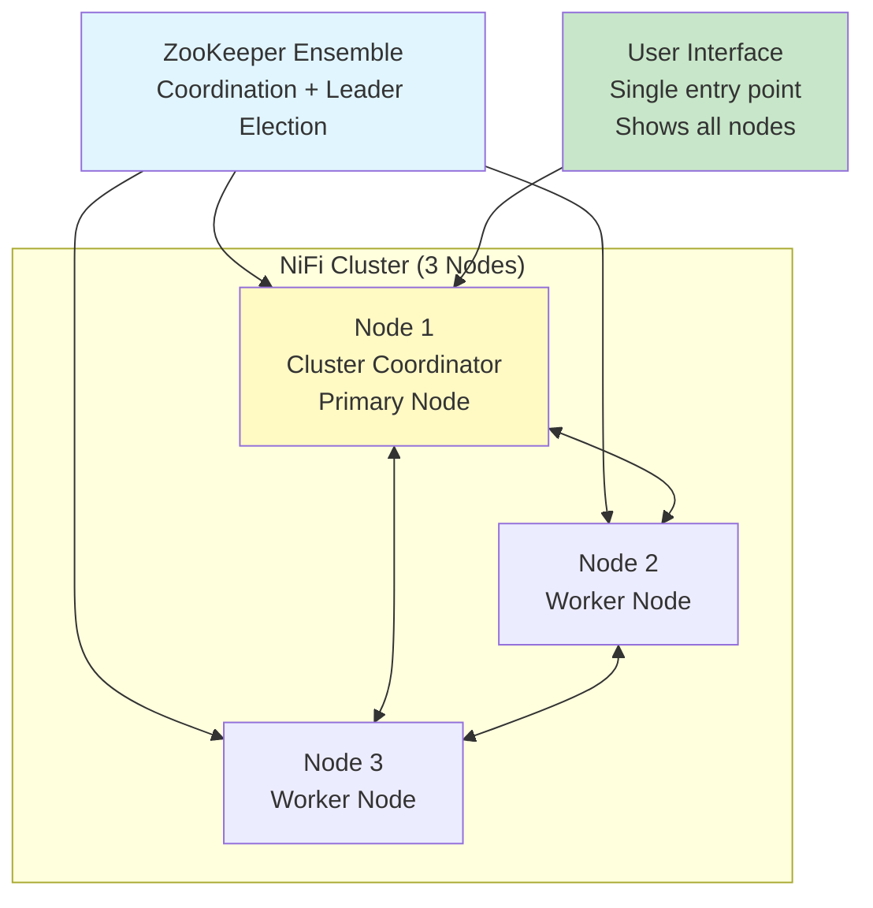
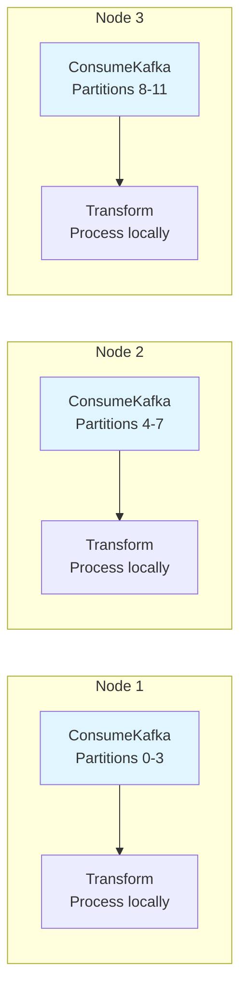
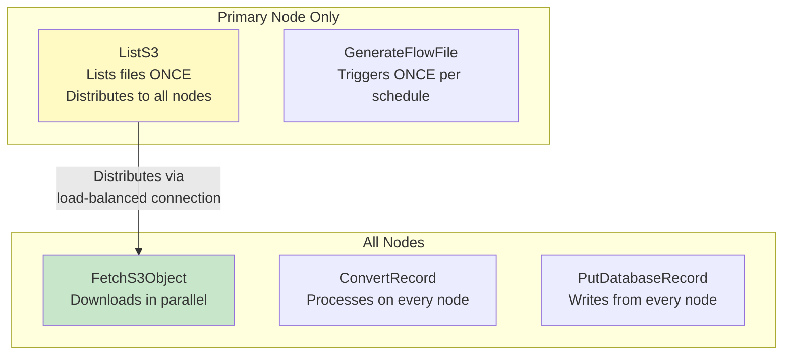
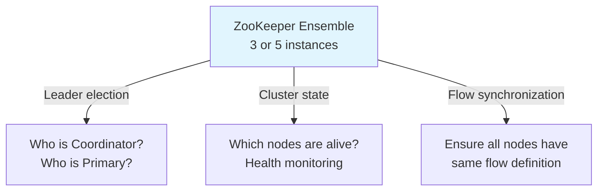
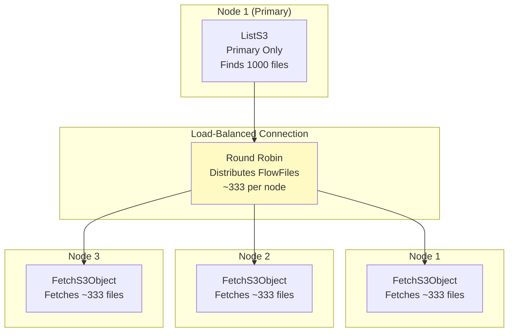
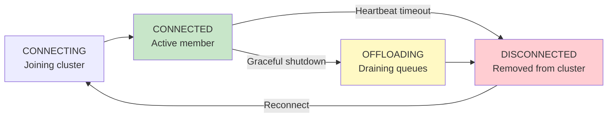

# NiFi Clustering — Fundamentals

## What is NiFi Clustering?

NiFi clustering allows multiple NiFi instances (nodes) to work together as a **single logical system**. Data flows are designed once and run across all nodes, providing horizontal scalability and high availability.



## Key Cluster Roles

| Role | Description | How Many |
|------|-------------|----------|
| **Cluster Coordinator** | Manages cluster membership, handles join/leave | 1 (auto-elected) |
| **Primary Node** | Runs processors that should only run on one node | 1 (auto-elected) |
| **Worker Node** | Processes data (all nodes including coordinator/primary) | All nodes |

## Why Cluster?

| Benefit | Explanation |
|---------|-------------|
| **Scalability** | Add nodes to increase throughput |
| **High Availability** | If one node fails, others continue processing |
| **Load Distribution** | Data automatically distributed across nodes |
| **Single Management** | Design flows once, runs on all nodes |

## How Data Flows in a Cluster



**By default:** Each node runs its own instance of every processor independently. Data stays local to the node that ingested it (no unnecessary network transfer).

## Primary Node vs. All Nodes

Some processors should only run on ONE node (to avoid duplication):



| Execution Strategy | Processors | Why |
|-------------------|-----------|-----|
| **Primary Node Only** | ListS3, ListSFTP, GenerateFlowFile | Avoid listing/generating duplicates |
| **All Nodes** | FetchS3Object, ConvertRecord, PutDatabaseRecord | Parallel processing for throughput |

## ZooKeeper's Role

ZooKeeper provides coordination services for the cluster:



```properties
# nifi.properties — ZooKeeper configuration:
nifi.cluster.is.node=true
nifi.zookeeper.connect.string=zk1:2181,zk2:2181,zk3:2181
nifi.zookeeper.root.node=/nifi
nifi.cluster.node.address=nifi-node-1
nifi.cluster.node.protocol.port=9876
```

## Basic Cluster Configuration

```properties
# nifi.properties on EACH node:

# Enable clustering:
nifi.cluster.is.node=true

# This node's identity:
nifi.cluster.node.address=nifi-node-1.company.com
nifi.cluster.node.protocol.port=9876

# ZooKeeper:
nifi.zookeeper.connect.string=zk-1:2181,zk-2:2181,zk-3:2181

# State management (cluster-wide):
nifi.state.management.provider.cluster=zk-provider

# Web UI (each node has its own port):
nifi.web.https.host=nifi-node-1.company.com
nifi.web.https.port=8443
```

## Load-Balanced Connections

To distribute work across cluster nodes:



```
# Connection → Configure → Load Balance Strategy:
Load Balance Strategy: Round Robin
Load Balance Compression: Compress Attributes and Content
# Distributes evenly across all connected nodes
# Compression reduces network traffic for inter-node transfer
```

## Cluster Node States



## Interview Tips

> **Tip 1:** "What is a NiFi cluster?" — Multiple NiFi instances working as one logical system. ZooKeeper coordinates. One node is Cluster Coordinator (manages membership), one is Primary Node (runs single-instance processors). All nodes process data in parallel. Design flows once — they run identically on all nodes.

> **Tip 2:** "Primary Node vs. All Nodes execution?" — Primary Node Only: for processors that should run once (ListS3, GenerateFlowFile) — avoids duplicate listings. All Nodes: for processing/output processors (FetchS3, ConvertRecord, PutDB) — maximizes parallelism. Use load-balanced connections to distribute work from primary-only processors to all nodes.

> **Tip 3:** "Why is ZooKeeper needed?" — Three functions: (1) Leader election (who is coordinator/primary). (2) Cluster membership (detecting node failures via heartbeats). (3) Flow synchronization (all nodes have the same flow version). Without ZooKeeper, nodes can't coordinate and may process data inconsistently.
