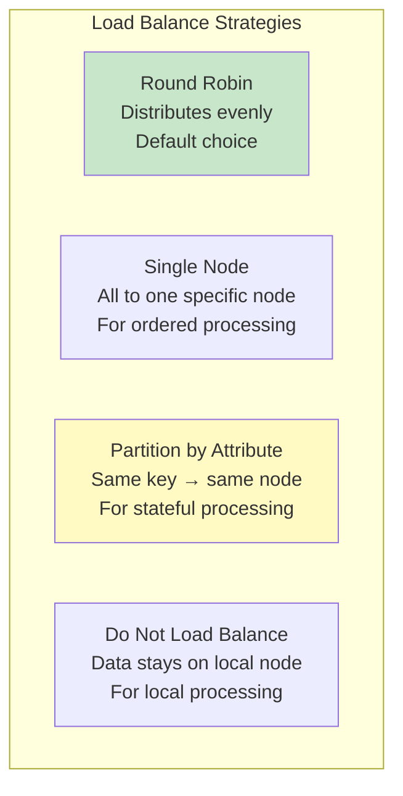
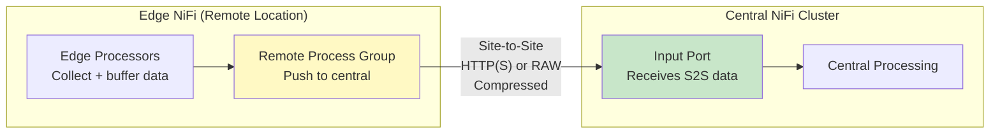
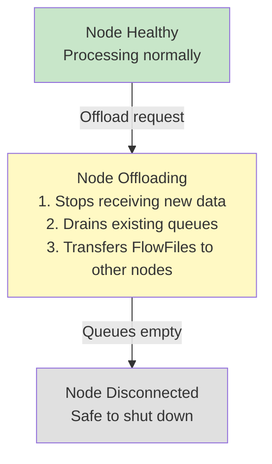

# NiFi Clustering — Intermediate Concepts

## Load Balancing Strategies



| Strategy | Use Case | Example |
|----------|----------|---------|
| **Round Robin** | Even distribution for stateless processing | FetchS3 (any node can fetch any file) |
| **Partition by Attribute** | Group related data on same node | All records for customer_id=C001 → same node |
| **Single Node** | Ordered/aggregation processing | MergeRecord needs all fragments on one node |
| **Do Not Load Balance** | Data already local from ingestion | ConsumeKafka with partition assignment |

### Partition by Attribute

```
# Ensures all FlowFiles with same key land on same node:
Connection → Load Balance Strategy: Partition by Attribute
Load Balance Partition Attribute: customer_id

# Result:
# customer_id=C001 → always Node 2
# customer_id=C002 → always Node 1
# customer_id=C003 → always Node 3

# WHY: When downstream processor needs ALL records for a customer
#       (e.g., deduplication, aggregation, windowing)
```

## Site-to-Site Communication

Transfer data between NiFi instances (or between clusters):



```
# Central cluster — Input Port:
Input Port Name: "receive_from_edge"
# Accessible to Remote Process Groups

# Edge NiFi — Remote Process Group:
Remote Process Group:
  URLs: https://central-nifi.company.com:8443
  Transport Protocol: HTTP
  # Points to central cluster's input port
  # Data flows from edge → central automatically
  # Handles back pressure, retry, compression
```

## State Management in Clusters

Processors that track state (e.g., "last file listed") need cluster-aware state:

```properties
# state-management.xml — defines state providers:

# Local state (per-node, survives restarts):
<local-provider>
    <id>local-provider</id>
    <class>org.apache.nifi.controller.state.providers.local.WriteAheadLocalStateProvider</class>
    <property name="Directory">./state/local</property>
</local-provider>

# Cluster state (shared across all nodes via ZooKeeper):
<cluster-provider>
    <id>zk-provider</id>
    <class>org.apache.nifi.controller.state.providers.zookeeper.ZooKeeperStateProvider</class>
    <property name="Connect String">zk1:2181,zk2:2181,zk3:2181</property>
    <property name="Root Node">/nifi/state</property>
</cluster-provider>
```

| State Scope | Where Stored | Use Case |
|-------------|-------------|----------|
| **LOCAL** | Node's local disk | Node-specific state (which files this node has seen) |
| **CLUSTER** | ZooKeeper | Shared state (ListS3 listing timestamp — all nodes agree) |

```
# ListS3 uses CLUSTER state:
# State: {listing.timestamp: "2024-03-15T10:30:00Z"}
# WHY: Only ONE node (Primary) runs ListS3
# If Primary changes → new primary reads cluster state → continues from where old left off
# NO re-listing of already-processed files!
```

## Node Offloading (Graceful Removal)



```
# How to offload (via NiFi UI):
# 1. Click node in Cluster page
# 2. Select "Offload"
# 3. NiFi moves all queued FlowFiles to remaining nodes
# 4. Once empty → node can be safely shut down
# 5. Use for: maintenance, upgrades, scaling down

# IMPORTANT: Offloading preserves ALL data (zero loss)
# FlowFiles in queues are transferred to other nodes
# Processing continues on remaining nodes
```

## Cluster Security

```properties
# Every node must authenticate to join the cluster:
nifi.cluster.protocol.is.secure=true

# Each node has its own identity (certificate):
nifi.security.keystore=/opt/nifi/certs/node1-keystore.p12
nifi.security.keystoreType=PKCS12
nifi.security.keystorePasswd=#{node.keystore.pass}
nifi.security.truststore=/opt/nifi/certs/cluster-truststore.jks
nifi.security.truststoreType=JKS

# Only nodes with valid certificates can join
# Prevents rogue nodes from joining cluster and accessing data
```

## Heartbeat and Failure Detection

```properties
# Heartbeat configuration:
nifi.cluster.node.heartbeat.interval=5 sec
# Each node sends heartbeat every 5 seconds

# If heartbeat missed for this duration → node considered dead:
nifi.cluster.protocol.heartbeat.misses.allowed=8
# 8 × 5 sec = 40 seconds before declaring node dead

# After node declared dead:
# 1. FlowFiles in that node's queues are LOST (not replicated!)
# 2. Source processors (e.g., Kafka) re-read from last committed offset
# 3. Cluster continues with remaining nodes
```

## Cluster Sizing Guidelines

| Workload | Recommended Nodes | Rationale |
|----------|------------------|-----------|
| Small (< 10K FlowFiles/sec) | 3 nodes | Minimum for HA |
| Medium (10K-100K FF/sec) | 5 nodes | Good parallelism |
| Large (> 100K FF/sec) | 7-10 nodes | Maximum throughput |
| Edge collection | 1 node (standalone) | MiNiFi for edge |

```
# Per-node resource recommendations:
# CPU: 8-16 cores (NiFi is I/O heavy, moderate CPU)
# RAM: 16-32 GB (heap: 8-16 GB, OS cache for content repo)
# Disk: SSD for repositories (FlowFile repo MUST be fast SSD)
# Network: 10 Gbps (inter-node transfer for load balancing)
```

## Interview Tips

> **Tip 1:** "How does load balancing work in a NiFi cluster?" — Connection-level setting. Round Robin distributes evenly (stateless processing). Partition by Attribute sends same key to same node (stateful). Single Node sends all to one (when ordering matters). Do Not Balance keeps data local (when already distributed, like Kafka partitions). Choose based on whether downstream processing is stateful or stateless.

> **Tip 2:** "What is Site-to-Site?" — NiFi's built-in protocol for transferring data between NiFi instances. Used for: edge-to-central data collection, cluster-to-cluster replication, and Remote Process Groups. Supports: compression, back pressure, load balancing, and authentication. Alternative to Kafka for NiFi-to-NiFi communication.

> **Tip 3:** "What happens when a cluster node fails?" — FlowFiles in that node's queues may be lost (queues are not replicated). Source processors (Kafka, S3) re-read from their state/offset. Primary/Coordinator role auto-fails-over to another node. Remaining nodes continue processing. Key: make source processors idempotent and use committed offsets for recovery.
