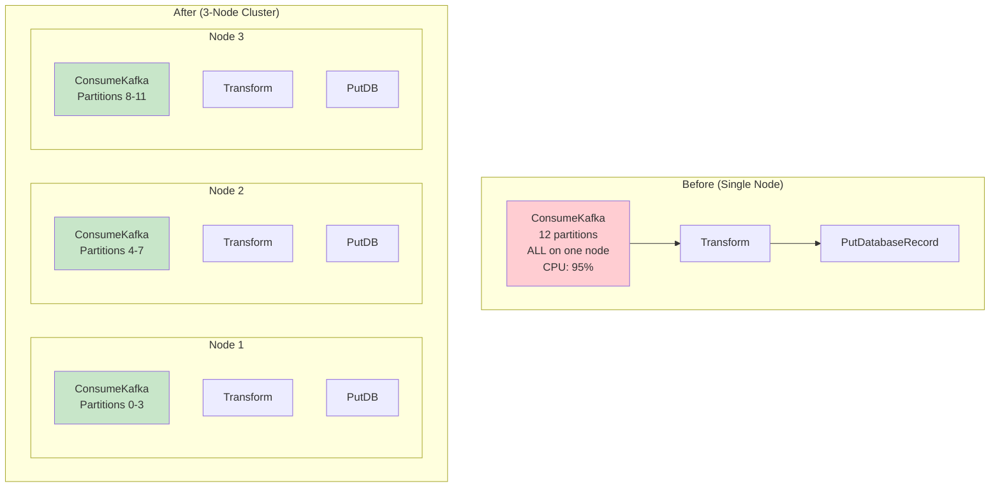
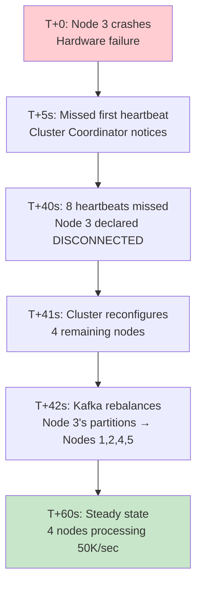
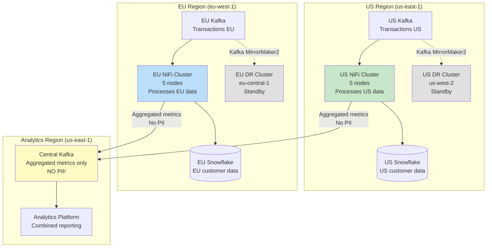

# Scenario Questions — NiFi Clustering

<article data-difficulty="junior">

## 🟢 Junior: Cluster Basics

**Scenario:** You have a standalone NiFi instance processing 10K FlowFiles/sec from Kafka. Performance is maxed out at 10K/sec (CPU at 95%). Your team needs to scale to 30K/sec. Explain how you'd convert to a cluster and what changes are needed to the existing flow.

<details>
<summary>💡 Hint</summary>
Add 2 more nodes (total 3). NiFi cluster with ZooKeeper. For Kafka: each node consumes different partitions (12 partitions / 3 nodes = 4 per node). Most flow changes are ZERO (processors run on all nodes automatically). Only check: ListS3/GenerateFlowFile → set to Primary Node Only.
</details>

<details>
<summary>✅ Solution</summary>

**Steps to scale from 1 node to 3-node cluster:**

```
1. INFRASTRUCTURE:
   - Provision 2 additional nodes (same specs as existing)
   - Deploy ZooKeeper ensemble (3 instances on separate servers)
   - Configure networking (nodes can communicate on protocol port)

2. CONFIGURATION (on each node):
   # nifi.properties:
   nifi.cluster.is.node=true
   nifi.cluster.node.address=nifi-node-X.company.com
   nifi.cluster.node.protocol.port=9876
   nifi.zookeeper.connect.string=zk1:2181,zk2:2181,zk3:2181
   nifi.state.management.provider.cluster=zk-provider

3. FLOW CHANGES (minimal!):
```



```
4. WHAT CHANGES IN THE FLOW:

   ConsumeKafka:
   - Execution: ALL NODES (default — no change needed!)
   - Each node joins the same consumer group
   - Kafka auto-assigns partitions: 12 partitions ÷ 3 nodes = 4 per node
   - Each node processes ~10K/sec → total 30K/sec ✓

   Transform (ConvertRecord):
   - Execution: ALL NODES (no change)
   - Each node transforms its own data locally

   PutDatabaseRecord:
   - Execution: ALL NODES (no change)
   - Each node writes to database independently
   - Increase DB connection pool: 20 → 60 (20 per node)

5. WHAT TO CHECK:
   - GenerateFlowFile: set to "Primary Node Only" (avoid 3x triggers)
   - ListS3/ListSFTP: set to "Primary Node Only" (avoid duplicate listings)
   - State-dependent processors: ensure CLUSTER state scope
   - Database pool: sized for 3 nodes (total connections ÷ nodes)
   
6. RESULT:
   - Throughput: 10K → 30K FlowFiles/sec (3x improvement)
   - CPU per node: ~35% (from 95% — headroom for spikes!)
   - High availability: if one node fails, 2 continue at 20K/sec
   - ZERO data loss: Kafka consumer group handles rebalancing
```

**Key Points:**
- **Most processors need ZERO changes** (run on all nodes automatically)
- **Kafka auto-distributes** partitions across consumer group members
- **Only "source" processors** (List*, Generate*) need Primary Node Only
- **Database pool** must be sized for cluster-wide concurrent tasks
- **Network**: nodes need to communicate (protocol port + S2S port)

</details>

</article>

<article data-difficulty="mid-level">

## 🟡 Mid-Level: Handling Cluster Node Failure

**Scenario:** Your 5-node NiFi cluster processes financial transactions (50K/sec). At 3 AM, Node 3 crashes (hardware failure). Node 3's queues had 25,000 FlowFiles at crash time. Describe: (1) What happens automatically? (2) What data might be lost? (3) How does the system recover? (4) What operational steps do you take in the morning?

<details>
<summary>💡 Hint</summary>
NiFi queues are NOT replicated across nodes. FlowFiles on Node 3 are lost. BUT: source processor (Kafka) tracks committed offsets. Uncommitted messages will be redelivered. Key question: were those 25K FlowFiles before or after Kafka commit? Recovery: remaining 4 nodes handle the load. Kafka rebalances Node 3's partitions.
</details>

<details>
<summary>✅ Solution</summary>

**(1) What happens automatically (within 40 seconds):**



```
Automatic actions:
1. Cluster Coordinator detects missing heartbeats (8 × 5s = 40s)
2. Node 3 declared DISCONNECTED
3. If Node 3 was Primary: new Primary auto-elected
4. If Node 3 was Coordinator: new Coordinator auto-elected
5. Kafka consumer group rebalance: Node 3's partitions redistributed
6. Remaining 4 nodes absorb the workload
7. Each node now handles: 50K/4 = 12,500 FF/sec (was 10K/node with 5)
```

**(2) What data might be lost:**

```
Node 3's queues had 25,000 FlowFiles at crash:

CASE A — FlowFiles from ConsumeKafka (NOT yet committed):
  Status: NOT LOST!
  Reason: Kafka offset not committed until after successful processing
  Recovery: Kafka redelivers these messages to other nodes
  
CASE B — FlowFiles BETWEEN processors (already past Kafka commit):
  Status: POTENTIALLY LOST! ⚠
  Example: FlowFile was in queue between Transform and PutDB
  Kafka thinks it was consumed (offset committed after ConsumeKafka)
  But it hasn't been written to database yet
  
  Mitigation: Depends on commit strategy!
  
  If "commit after ConsumeKafka" (earliest): UP TO 25K messages lost
  If "commit after PutDB" (latest): ZERO messages lost (but may reprocess)
  
RECOMMENDED: Commit offset AFTER full processing (at-least-once):
  nifi.kafka.commit.offsets = after-session-complete
  Result: All 25K messages REDELIVERED by Kafka (some may be duplicates)
  Handle duplicates: idempotent database writes (ON CONFLICT DO NOTHING)
```

**(3) How the system recovers:**

```
Automatic recovery (no human intervention):
1. Kafka rebalances (seconds): Node 3's partitions assigned to others
2. Redelivery: uncommitted messages re-consumed by other nodes
3. Processing: 4 nodes handle 50K/sec total (slight overload, each at 12.5K)
4. Back pressure: if 4 nodes can't sustain 50K → queues build → manageable

If 4 nodes CAN handle 50K/sec:
  → Full recovery in under 1 minute
  → Zero human intervention needed
  → Some duplicate processing (handled by idempotent writes)

If 4 nodes CANNOT sustain 50K/sec:
  → Back pressure engages
  → Kafka consumer lag grows
  → Still zero data loss (Kafka retains)
  → Recovers when new node added or load decreases
```

**(4) Morning operational steps:**

```
1. VERIFY: Check monitoring dashboard
   - Confirm 4 nodes CONNECTED
   - Check Kafka consumer lag (should be caught up)
   - Check database for any missing data windows
   
2. INVESTIGATE: Root cause of Node 3 failure
   - Hardware logs, system logs
   - Was it disk failure? Memory? Network?
   
3. REPLACE: Provision new Node 3
   - Same instance type, same configuration
   - Start NiFi → auto-joins cluster via ZooKeeper
   - Load-balanced connections automatically include new node
   
4. VALIDATE: Verify data completeness
   SELECT COUNT(*) FROM fact_transactions 
   WHERE event_time BETWEEN '2024-03-15 03:00' AND '2024-03-15 03:05';
   -- Compare against expected volume from Kafka topic
   
5. RECONCILE: If any gap found
   - Kafka still has all messages (retention > crash period)
   - Reset consumer offset for the gap period → reprocess
   - Idempotent writes prevent duplicates
   
6. POST-MORTEM: Document and improve
   - Add monitoring for node health
   - Consider: was 5-node cluster adequate? Need 6 for N+1 redundancy?
```

**Key Points:**
- **Queues are NOT replicated** — this is NiFi's main weakness vs Kafka
- **Kafka is the safety net** — uncommitted offsets mean messages are redelivered
- **Commit strategy matters** — late commit = more reprocessing, zero loss
- **Idempotent writes** — handle duplicates from reprocessing gracefully
- **Auto-recovery** — 40 seconds to detect, Kafka rebalance is automatic
- **N+1 sizing** — 5 nodes where 4 can handle peak = survive 1 failure

</details>

</article>

<article data-difficulty="senior">

## 🔴 Senior: Multi-Region Cluster Design

**Scenario:** Design a NiFi deployment for a global financial services company with: (1) US data must stay in US (regulatory), EU data must stay in EU (GDPR), (2) Both regions process 100K transactions/sec, (3) Combined reporting needs data from BOTH regions in a central analytics platform, (4) RPO < 1 minute, RTO < 5 minutes for each region, (5) Must handle complete region failure. Provide: architecture, data flow patterns, DR strategy, and trade-offs.

<details>
<summary>💡 Hint</summary>
Two independent NiFi clusters (US + EU) for data residency. Each processes its own regional data. For combined reporting: each cluster publishes aggregated/anonymized data to a central analytics topic (not raw PII!). DR: active-passive per region with Kafka mirroring. NiFi Registry: shared for consistent flows. Challenge: cross-region aggregation without moving raw PII.
</details>

<details>
<summary>✅ Solution</summary>



**Architecture Details:**

```yaml
# Regional Clusters (independent, data-sovereign):
us_cluster:
  location: us-east-1
  nodes: 5 (r5.4xlarge: 16 CPU, 128GB)
  kafka: MSK (12 partitions per topic)
  database: Snowflake (US account)
  nifi_registry: shared (NiFi Registry in us-east-1)
  
eu_cluster:
  location: eu-west-1
  nodes: 5 (r5.4xlarge: 16 CPU, 128GB)
  kafka: MSK (12 partitions per topic)
  database: Snowflake (EU account, EU data residency!)
  nifi_registry: shared (same Registry, different parameter contexts)

# DR Clusters (warm standby):
us_dr_cluster:
  location: us-west-2
  nodes: 5 (same specs, processors STOPPED)
  kafka: MirrorMaker2 from us-east-1

eu_dr_cluster:
  location: eu-central-1
  nodes: 5 (same specs, processors STOPPED)
  kafka: MirrorMaker2 from eu-west-1
```

**Data Flow Pattern (per region):**

```
# Each region runs IDENTICAL flow (from NiFi Registry)
# Only PARAMETER CONTEXTS differ (endpoints, credentials)

Flow: Regional Transaction Processing
1. ConsumeKafka (regional.transactions topic)
2. ValidateRecord (schema validation)
3. LookupRecord (enrich from regional DB)
4. RouteOnAttribute (route by transaction type)
5. PutDatabaseRecord (write to regional Snowflake)
6. PublishKafka → regional.processed topic

Flow: Cross-Region Analytics (CRITICAL: No PII!)
1. ConsumeKafka (regional.processed topic)
2. QueryRecord (AGGREGATE + ANONYMIZE):
   "SELECT 
      region,
      transaction_type,
      COUNT(*) as txn_count,
      SUM(amount) as total_amount,
      AVG(amount) as avg_amount,
      DATE_TRUNC('minute', event_time) as minute_bucket
    FROM FLOWFILE
    GROUP BY region, transaction_type, DATE_TRUNC('minute', event_time)"
3. PublishKafka → CENTRAL analytics.metrics topic (cross-region!)

# KEY: Only aggregated, anonymized metrics cross region boundaries!
# NO customer_id, NO names, NO addresses — just counts and sums
# Compliant with GDPR Article 44 (no personal data transfer)
```

**DR Strategy (per region):**

```
# RPO < 1 minute:
Kafka MirrorMaker2:
  sync.group.offsets.enabled: true
  refresh.groups.interval.seconds: 10
  # Consumer group offsets mirrored every 10 seconds
  # Data mirrored continuously (sub-second lag)
  # RPO: max Kafka replication lag (~seconds)

# RTO < 5 minutes:
DR Failover Automation:
  1. Health check detects primary region failure (30 sec)
  2. DNS failover triggers (Route53 health check, 60 sec TTL)
  3. Script starts DR NiFi processors (API call, 10 sec)
  4. Kafka consumer starts from mirrored offsets (seconds)
  5. Total RTO: 30 + 60 + 10 = ~100 seconds < 5 min ✓

# Failover script:
def failover_region(dr_cluster_url, region):
    # Start all processor groups in DR cluster
    process_groups = get_all_process_groups(dr_cluster_url)
    for pg in process_groups:
        start_process_group(dr_cluster_url, pg['id'])
    
    # Update DNS (Route53)
    update_dns_record(f"nifi-{region}.company.com", dr_cluster_url)
    
    # Alert
    send_alert(f"FAILOVER: {region} NiFi active on DR cluster")
```

**Cross-Region Considerations:**

```
# What CAN cross regions:
✓ Aggregated metrics (count, sum, avg per minute)
✓ Anonymized statistics (no PII)
✓ Operational metrics (NiFi health, throughput)
✓ Flow definitions (NiFi Registry)
✓ Schema definitions (Schema Registry sync)

# What CANNOT cross regions:
✗ Raw transaction data with PII
✗ Customer names, emails, addresses
✗ Individual transaction records
✗ Database connections to other region's DB

# Implementation: QueryRecord with GROUP BY = aggregation barrier
# Raw data enters, only aggregates leave the region
# Audit: provenance proves no PII left the region
```

**NiFi Registry Strategy:**

```
# Single NiFi Registry (in us-east-1):
# Both clusters pull SAME flow versions
# Parameter Contexts make them region-specific:

# US Parameter Context:
us_params:
  kafka.brokers: kafka-us-east.company.com:9092
  snowflake.account: company-us
  analytics.topic: analytics.metrics.us
  region.label: US

# EU Parameter Context:  
eu_params:
  kafka.brokers: kafka-eu-west.company.com:9092
  snowflake.account: company-eu
  analytics.topic: analytics.metrics.eu
  region.label: EU

# Promotion: Update flow version in Registry → 
#   both clusters update from same source → consistent processing
```

**Trade-offs:**

| Decision | Trade-off | Rationale |
|----------|-----------|-----------|
| Independent clusters (not one global cluster) | More infrastructure | Data residency compliance |
| Aggregation at edge (not central raw copy) | Limited central analytics | GDPR compliance |
| Active-passive DR (not active-active) | DR nodes idle cost | Simpler, avoids split-brain |
| Shared NiFi Registry | Single point for flow mgmt | Consistent flows, easy promotion |
| MirrorMaker2 for DR | Additional Kafka infra | Sub-minute RPO |

</details>

</article>

</content>
