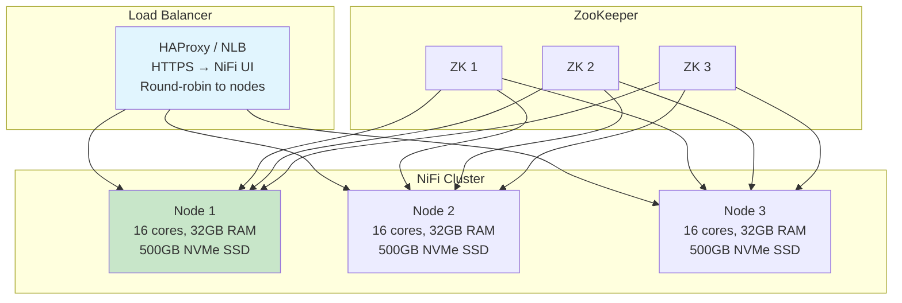
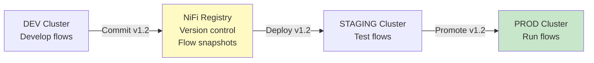
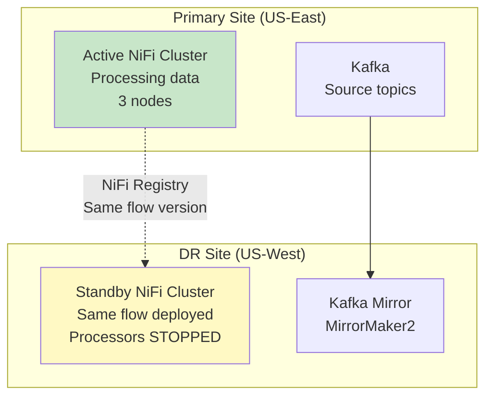

# NiFi Clustering — Senior Deep Dive

## Cluster Architecture Patterns

### Pattern 1: Traditional Cluster (Bare Metal / VM)



### Pattern 2: Kubernetes Deployment

```yaml
# NiFi on Kubernetes (StatefulSet):
apiVersion: apps/v1
kind: StatefulSet
metadata:
  name: nifi
spec:
  replicas: 3
  selector:
    matchLabels:
      app: nifi
  serviceName: nifi-headless
  template:
    spec:
      containers:
      - name: nifi
        image: apache/nifi:1.25.0
        resources:
          requests:
            memory: "16Gi"
            cpu: "8"
          limits:
            memory: "32Gi"
            cpu: "16"
        volumeMounts:
        - name: content-repo
          mountPath: /opt/nifi/content-repository
        - name: flowfile-repo
          mountPath: /opt/nifi/flowfile-repository
        - name: provenance-repo
          mountPath: /opt/nifi/provenance-repository
  volumeClaimTemplates:
  - metadata:
      name: content-repo
    spec:
      accessModes: ["ReadWriteOnce"]
      storageClassName: gp3-ssd
      resources:
        requests:
          storage: 500Gi
```

### Pattern 3: NiFi Registry + GitOps



## Disaster Recovery Strategies

### Active-Passive (Warm Standby)



```
# DR Failover procedure:
# 1. Detect primary failure (monitoring alert)
# 2. Start processors on DR cluster
# 3. DR Kafka has mirrored topics (MirrorMaker2)
# 4. NiFi on DR reads from DR Kafka
# 5. RPO: seconds (Kafka mirror lag)
# 6. RTO: minutes (start processors + verify)

# Key considerations:
# - NiFi state (ListS3 cursor): lost on failover → small reprocessing
# - Kafka offsets: DR starts from latest (or last committed)
# - Database connections: DR points to DR database replicas
# - Parameter Context in DR: different hosts (DR endpoints)
```

### Active-Active (Multi-Region)

```
# Each region processes its own data subset:
# US-East cluster: processes US customer data
# EU-West cluster: processes EU customer data (GDPR data residency!)
# AP cluster: processes APAC data

# Routing at source:
# Kafka topic partitioning by region → each cluster consumes its region's partitions
# OR: separate topics per region

# Shared resources:
# NiFi Registry: single source of truth for flow definitions
# Schema Registry: replicated across regions
# Monitoring: centralized (Datadog/Grafana across all clusters)
```

## Auto-Scaling

```python
# Auto-scaling NiFi cluster based on queue depth:
# (External script / Kubernetes HPA custom metric)

def check_scale_need():
    metrics = get_nifi_metrics()
    
    # Scale-up trigger: average queue utilization > 70%
    avg_queue_pct = metrics['avg_queue_backpressure_pct']
    if avg_queue_pct > 70 and current_nodes < max_nodes:
        scale_up()  # Add a node
        
    # Scale-down trigger: average queue utilization < 20% for 30 min
    if avg_queue_pct < 20 and current_nodes > min_nodes:
        if low_utilization_duration > 30:
            offload_and_remove_node()  # Graceful scale-down

def scale_up():
    """Add a new node to the cluster."""
    # Kubernetes: kubectl scale statefulset nifi --replicas=N+1
    # VM: provision new instance, start NiFi with cluster config
    # New node auto-joins via ZooKeeper
    # Load-balanced connections automatically include new node
    
def offload_and_remove_node():
    """Gracefully remove a node."""
    # 1. Offload node (via NiFi API)
    # 2. Wait for queues to drain (FlowFiles transferred to other nodes)
    # 3. Disconnect node
    # 4. Terminate instance
```

## Performance Tuning for Clusters

```properties
# Inter-node communication:
nifi.cluster.node.protocol.threads=10
# Threads for cluster protocol (heartbeat, state sync)
# Increase for larger clusters (>5 nodes)

# Load balance transfer:
nifi.cluster.load.balance.max.thread.count=8
# Threads for load-balancing FlowFiles between nodes
# Increase for high-throughput load-balanced connections

nifi.cluster.load.balance.comms.timeout=30 sec
# Timeout for inter-node FlowFile transfer
# Increase for large FlowFiles or slow networks

# Site-to-Site:
nifi.remote.input.http.enabled=true
nifi.remote.input.socket.port=10443
# Enable both HTTP and raw socket for S2S flexibility

# Network buffer:
nifi.cluster.node.protocol.max.socket.buffer.size=10 MB
# Buffer size for inter-node protocol communication
```

## Split-Brain Prevention

```
# Split-brain: two halves of cluster think they're both the active cluster
# NiFi prevention via ZooKeeper quorum:

# ZooKeeper ensemble: 3 nodes (majority = 2)
# If network partition:
#   Partition A (2 ZK nodes): has majority → ACTIVE
#   Partition B (1 ZK node): no majority → NiFi nodes DISCONNECT
#   
# NiFi nodes can only operate if they can reach ZK quorum!
# No ZK quorum → processors pause → prevents split-brain processing

# Best practice:
# ZK nodes on different racks/AZs (survive single failure)
# 5 ZK nodes for large clusters (majority = 3, survives 2 failures)
# NiFi nodes spread across AZs (survive AZ failure)
```

## Interview Tips

> **Tip 1:** "How do you handle NiFi disaster recovery?" — Active-passive with NiFi Registry (same flow version on DR cluster). Kafka MirrorMaker2 replicates source topics to DR site. On failover: start processors on DR cluster (RTO: minutes). State management: accept small reprocessing (ListS3 cursor lost). Parameter Contexts: DR has different endpoints. For data residency: active-active with geographic partitioning.

> **Tip 2:** "How do you auto-scale a NiFi cluster?" — Monitor queue back-pressure percentage across the cluster. Scale-up when avg > 70% for 5 minutes. New node auto-joins via ZooKeeper, load-balanced connections automatically include it. Scale-down: offload node first (drains queues to other nodes), then remove. On Kubernetes: custom HPA metric from NiFi's back-pressure metrics.

> **Tip 3:** "How do you prevent split-brain in NiFi clusters?" — ZooKeeper quorum. NiFi nodes require ZK connectivity to operate. If a network partition occurs, the partition with ZK majority continues; the partition without majority → NiFi nodes disconnect and stop processing. Use odd number of ZK nodes (3 or 5) spread across failure domains (different racks/AZs).

## ⚡ Cheat Sheet

**Core NiFi concepts**
```
FlowFile:    unit of data (content + attributes map)
Processor:   transforms/routes FlowFiles (GetFile, PutS3Object, RouteOnAttribute, etc.)
Connection:  queue between processors with back-pressure settings
Process Group: logical grouping of processors (like a subflow)
Controller Service: shared resource (DBCPConnectionPool, SSLContextService, etc.)
```

**Back-pressure settings**
```
Back Pressure Object Threshold: max FlowFiles in queue before upstream pauses
Back Pressure Data Size Threshold: max bytes in queue before upstream pauses
Typical: 10,000 objects / 1 GB — tune based on downstream throughput
When both thresholds hit → upstream processor stops scheduling
```

**Expression Language (attribute-based routing)**
```
${filename}                    — attribute value
${filename:toUpper()}          — uppercase
${fileSize:gt(1000000)}        — > 1 MB (returns true/false)
${filename:startsWith('order')} — prefix check
${now():format('yyyy-MM-dd')}  — current date
${uuid()}                      — generate UUID
${field.value:trim():toLower()} — chain functions
```

**Key processors**
```
GetFile / ListFile + FetchFile  — ingest from filesystem
GetSFTP / PutSFTP               — SFTP in/out
GetKafka / PublishKafka         — Kafka consumer/producer
ExecuteSQL / QueryDatabaseTable — SQL source
PutDatabaseRecord               — write to RDBMS
MergeContent                    — batch small files into larger ones
SplitRecord / SplitText         — split large FlowFiles
RouteOnAttribute / RouteOnContent — conditional routing
ConvertRecord                   — CSV ↔ JSON ↔ Avro ↔ Parquet
```

**Record-based processing**
```
Record Reader + Record Writer → schema-aware processing
Avoids row-by-row FlowFile per record — bulk processing in one FlowFile
Readers: CSVReader, JsonTreeReader, AvroReader, ParquetReader
Writers: CSVRecordSetWriter, JsonRecordSetWriter, ParquetRecordSetWriter
Schema: from Schema Registry (Confluent), from attribute, or inferred
```

**Clustering (NiFi cluster)**
```
Zero-Master: all nodes are peers; one elected Coordinator via ZooKeeper
Primary Node: handles scheduled processors once per cluster (GetFile, etc.)
Load balancing: connections can load-balance FlowFiles across nodes
State Provider: ZooKeeper stores distributed state (watermarks, offsets)
```

**Provenance (lineage)**
```
Every FlowFile event recorded: RECEIVE, SEND, FETCH, DROP, FORK, JOIN, CONTENT_MODIFIED
Searchable by: filename, UUID, attribute, component, time range
Replay: any FlowFile can be replayed from any point in provenance chain
Retention: configurable (default 24h); archive to external storage for longer
```

**Key interview points**
- NiFi is best for: heterogeneous data ingestion, protocol translation, low-code ETL
- Not ideal for: complex transformations (use Spark/dbt), high-throughput ML pipelines
- Site-to-Site (S2S): secure data transfer between NiFi instances (no Kafka needed)
- MiNiFi: lightweight NiFi agent for edge devices (IoT, network equipment)
- NiFi vs Kafka: NiFi = data routing/transformation; Kafka = durable messaging queue
