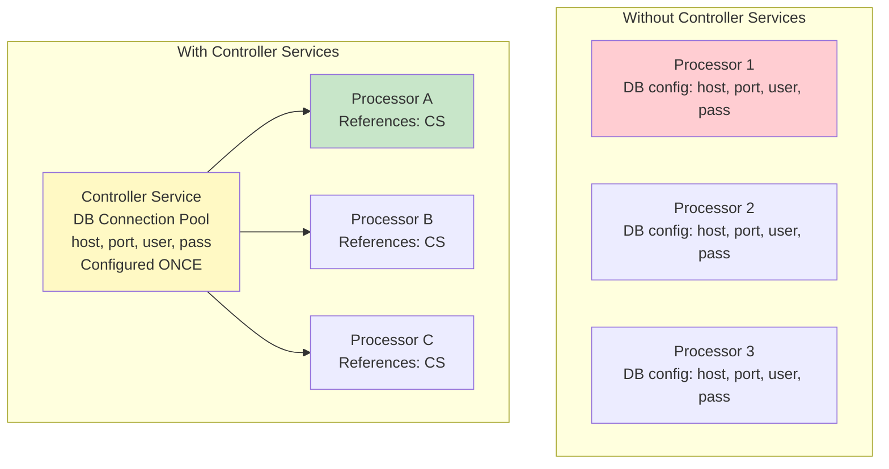
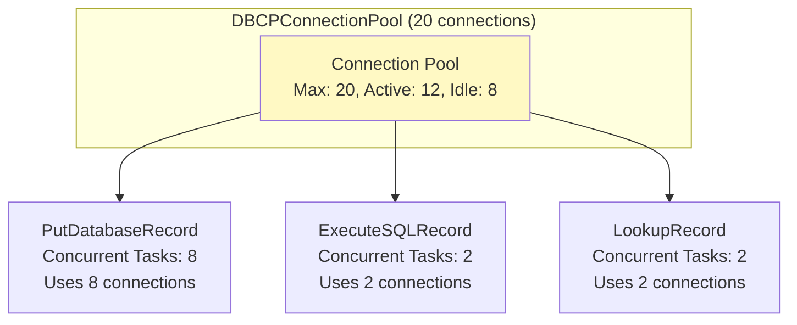
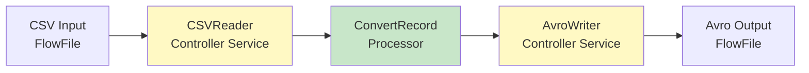
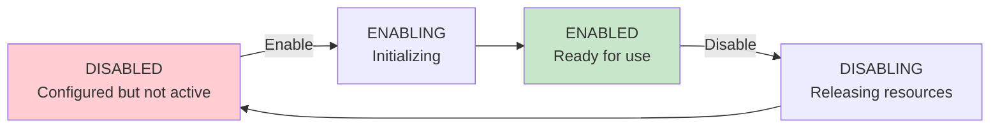
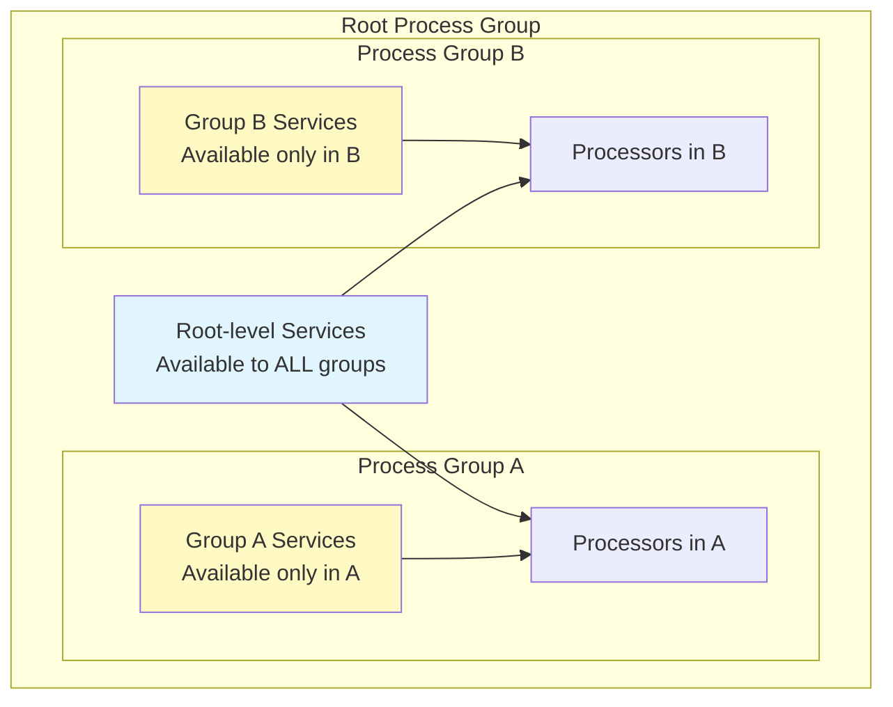

# NiFi Controller Services — Fundamentals


## 🎯 Analogy

Think of controller services like shared utilities in an office building: instead of each processor having its own JDBC connection, the DBCPConnectionPool service maintains a shared pool — all processors draw from the same pool efficiently.

---
## What are Controller Services?

Controller Services are **shared, reusable configurations** that multiple processors can reference. They provide common functionality like database connection pools, schema registries, record readers/writers, and SSL contexts.



**Benefits:**
- Configure once, reference everywhere
- Change in one place updates all processors
- Connection pooling (shared connections)
- Centralized credential management

## Common Controller Service Types

| Category | Service | Purpose |
|----------|---------|---------|
| **Database** | DBCPConnectionPool | JDBC connection pool for databases |
| **Record Readers** | JsonTreeReader, CSVReader, AvroReader | Parse FlowFile content into records |
| **Record Writers** | JsonRecordSetWriter, AvroRecordSetWriter | Serialize records into output format |
| **Schema** | AvroSchemaRegistry, HortonworksSchemaRegistry | Store/retrieve data schemas |
| **Cache** | DistributedMapCacheServer/Client | Key-value cache across cluster |
| **SSL** | StandardSSLContextService | TLS/SSL configuration |
| **AWS** | AWSCredentialsProviderControllerService | AWS authentication |
| **Lookup** | SimpleDatabaseLookupService | Enrich FlowFiles from DB |

## Database Connection Pooling (DBCPConnectionPool)

The most commonly used controller service:

```
DBCPConnectionPool Configuration:
  Database Connection URL: jdbc:postgresql://db.company.com:5432/warehouse
  Database Driver Class Name: org.postgresql.Driver
  Database Driver Location: /opt/nifi/drivers/postgresql-42.7.1.jar
  Database User: nifi_etl_user
  Password: ${db_password}           # Can use Parameter Context!
  Max Wait Time: 5000 ms
  Max Total Connections: 20
  Min Idle Connections: 5
  Validation Query: SELECT 1
```



**Key rule:** Total concurrent tasks across all processors ≤ Max Total Connections in the pool.

## Record Reader/Writer Services

These enable format-agnostic processing:

```
# JsonTreeReader (reads JSON content):
JsonTreeReader:
  Schema Access Strategy: Infer Schema   # Or "Schema Name" for registry
  Date Format: yyyy-MM-dd
  Time Format: HH:mm:ss
  Timestamp Format: yyyy-MM-dd HH:mm:ss

# CSVReader:
CSVReader:
  Schema Access Strategy: Infer Schema
  Treat First Line as Header: true
  Value Separator: ,
  Quote Character: "
  
# AvroRecordSetWriter (outputs Avro):
AvroRecordSetWriter:
  Schema Access Strategy: Schema Name
  Schema Registry: NiFi_Schema_Registry   # Controller service reference!
  Schema Name: ${schema.name}             # Dynamic from attribute!
  Compression: SNAPPY
```

### How Processors Use Reader/Writer Services



## Schema Registry Service

Stores schemas for record-based processing:

```
# AvroSchemaRegistry (NiFi built-in):
AvroSchemaRegistry:
  Schemas:
    order_schema_v1 = {
      "type": "record",
      "name": "Order",
      "fields": [
        {"name": "order_id", "type": "string"},
        {"name": "customer_id", "type": "string"},
        {"name": "amount", "type": "double"},
        {"name": "order_date", "type": "string"},
        {"name": "status", "type": "string"}
      ]
    }
    
    customer_schema_v1 = {
      "type": "record",
      "name": "Customer",
      "fields": [
        {"name": "customer_id", "type": "string"},
        {"name": "name", "type": "string"},
        {"name": "email", "type": ["null", "string"]}
      ]
    }
```

## Controller Service Lifecycle



**Rules:**
- Must be ENABLED before processors can use it
- Cannot disable if any processor is running that references it
- Disable processors first → disable service → reconfigure → re-enable

## Controller Service Scope



- Services at root level: accessible by ALL process groups
- Services within a process group: accessible only within that group
- Use root level for shared infrastructure (DB pools, SSL)
- Use group level for domain-specific configs


## ▶️ Try It Yourself

```bash
# Controller Services are shared resources referenced by multiple processors

# Common Controller Services:
# DBCPConnectionPool: JDBC connection pool (shared by PutSQL, QueryDatabaseTable, etc.)
# StandardSSLContextService: TLS configuration (shared by all HTTPS processors)
# JsonTreeReader / JsonRecordSetWriter: convert JSON (shared by ConvertRecord)
# AvroSchemaRegistry: centralized Avro schemas (shared by all Avro processors)
# AWSCredentialsProviderControllerService: shared AWS credentials

# Configure via NiFi API:
# POST /nifi-api/controller/controller-services
# {
#   "component": {
#     "type": "org.apache.nifi.dbcp.DBCPConnectionPool",
#     "name": "Postgres Connection Pool",
#     "properties": {
#       "Database Connection URL": "jdbc:postgresql://host:5432/db",
#       "Database Driver Class Name": "org.postgresql.Driver",
#       "Maximum Total Connections": "10"
#     }
#   }
# }

echo "Enable a controller service via UI before processors can use it"  
```

> **Run it:** Copy the snippet into a REPL or file — no external services needed for the basic example.

---
## Interview Tips

> **Tip 1:** "What are controller services in NiFi?" — Shared, reusable configurations that processors reference instead of duplicating. Common examples: database connection pools (DBCPConnectionPool), record format readers/writers (CSVReader, JsonWriter), schema registries, and SSL contexts. Configure once → used by many processors. Change in one place → all processors updated.

> **Tip 2:** "Why use a connection pool instead of direct connections?" — Connection pooling (DBCPConnectionPool) reuses database connections across multiple processors and requests. Without pooling: each processor opens/closes connections (expensive overhead). With pooling: connections stay open, processors borrow/return them. Reduces database load, improves throughput, prevents connection exhaustion.

> **Tip 3:** "How do Record Reader/Writer services enable format conversion?" — Processors like ConvertRecord don't know specific formats. They work with abstract "records." The Reader service (CSVReader, JsonReader) converts bytes → records. The Writer service (AvroWriter, ParquetWriter) converts records → bytes. Change the Reader/Writer to handle any format without changing the processor logic.
