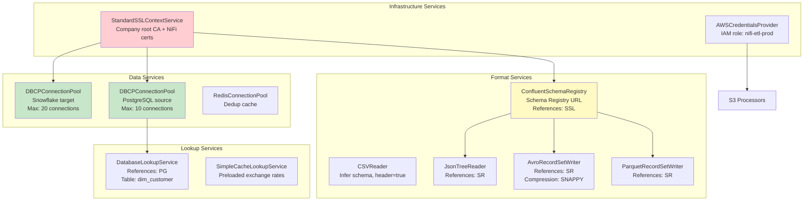
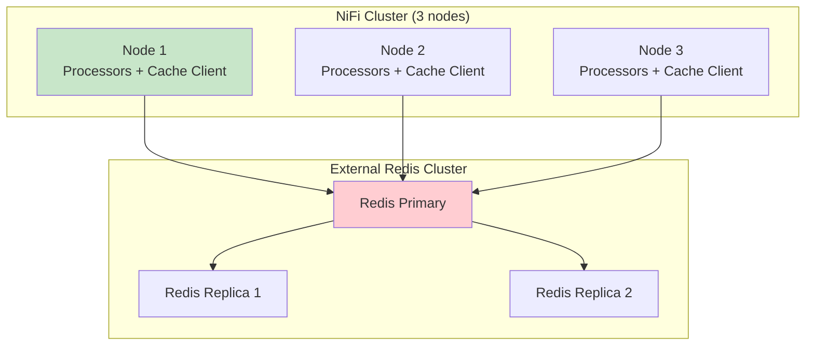

# NiFi Controller Services — Real-World Production Examples

## Example 1: Complete Service Stack for ETL Pipeline



### Configuration Details

```
# 1. SSL Context (shared by everything requiring TLS):
StandardSSLContextService:
  Keystore: /opt/nifi/certs/nifi-keystore.p12
  Keystore Type: PKCS12
  Keystore Password: #{ssl.keystore.password}    # Parameter!
  Truststore: /opt/nifi/certs/company-truststore.jks
  Truststore Type: JKS
  Truststore Password: #{ssl.truststore.password}
  TLS Protocol: TLSv1.2

# 2. Source Database (PostgreSQL):
DBCPConnectionPool "PostgreSQL_Source":
  URL: jdbc:postgresql://#{pg.host}:5432/#{pg.database}?ssl=true&sslmode=verify-full
  Driver Class: org.postgresql.Driver
  Driver Location: /opt/nifi/drivers/postgresql-42.7.1.jar
  User: #{pg.user}
  Password: #{pg.password}
  Max Total: 10
  Max Wait: 3000 ms
  Validation Query: SELECT 1
  SSL Context Service: StandardSSLContextService

# 3. Target Database (Snowflake):
DBCPConnectionPool "Snowflake_Target":
  URL: jdbc:snowflake://#{sf.account}.snowflakecomputing.com/?warehouse=#{sf.warehouse}&db=#{sf.database}&schema=#{sf.schema}
  Driver Class: net.snowflake.client.jdbc.SnowflakeDriver
  Driver Location: /opt/nifi/drivers/snowflake-jdbc-3.14.4.jar
  User: #{sf.user}
  Password: #{sf.password}
  Max Total: 20
  Max Wait: 5000 ms

# 4. Confluent Schema Registry:
ConfluentSchemaRegistry:
  Schema Registry URLs: https://#{schema.registry.host}:8081
  SSL Context Service: StandardSSLContextService
  Schema Cache Expiration: 1 hour
  Cache Size: 200

# 5. Customer Lookup:
DatabaseRecordLookupService:
  Database Connection Pooling Service: PostgreSQL_Source
  Table Name: public.dim_customer
  Lookup Key Column: customer_id
  Lookup Value Columns: customer_name, segment, region, lifetime_value
```

## Example 2: Environment Promotion via Parameter Contexts

```yaml
# Parameter Contexts for each environment:

# DEV Parameter Context:
dev-params:
  pg.host: dev-postgres.internal
  pg.database: dev_warehouse
  pg.user: nifi_dev
  pg.password: "***"
  sf.account: company-dev
  sf.warehouse: DEV_WH
  sf.database: DEV_DB
  sf.schema: RAW
  s3.bucket: dev-data-lake
  schema.registry.host: dev-schema-registry.internal
  kafka.brokers: dev-kafka-1:9092,dev-kafka-2:9092

# PROD Parameter Context:
prod-params:
  pg.host: prod-postgres.company.com
  pg.database: prod_warehouse
  pg.user: nifi_prod
  pg.password: "***"
  sf.account: company-prod
  sf.warehouse: ETL_WH
  sf.database: ANALYTICS
  sf.schema: RAW
  s3.bucket: prod-data-lake
  schema.registry.host: prod-schema-registry.company.com
  kafka.brokers: prod-kafka-1:9092,prod-kafka-2:9092,prod-kafka-3:9092
```

```
# Promotion workflow:
# 1. Develop flow in DEV (using dev-params)
# 2. Commit to NiFi Registry
# 3. Import to PROD → assign prod-params Parameter Context
# 4. ALL controller services automatically point to PROD resources!
# 5. ZERO flow changes between environments
```

## Example 3: High-Availability Cache Architecture



```
# Redis-based cache (replaces built-in DistributedMapCache):
RedisDistributedMapCacheClientService:
  Redis Mode: Standalone  (or Cluster/Sentinel)
  Connection String: redis-primary.company.com:6379
  Password: #{redis.password}
  Database Index: 0
  Communication Timeout: 5 sec
  
# Benefits over built-in:
# ✓ Survives NiFi restarts (persistent)
# ✓ High availability (Redis Sentinel failover)
# ✓ Shared across multiple NiFi clusters
# ✓ Larger capacity (Redis handles billions of keys)
# ✓ TTL per key (native Redis expiration)
```

## Example 4: Service Monitoring and Health Checks

```python
# Script to monitor controller service health via NiFi REST API:
import requests

NIFI_API = "https://nifi.company.com/nifi-api"

def check_controller_services():
    """Check all controller services are enabled and healthy."""
    response = requests.get(
        f"{NIFI_API}/flow/controller/controller-services",
        verify="/opt/certs/ca.pem"
    )
    
    services = response.json()['controllerServices']
    issues = []
    
    for svc in services:
        component = svc['component']
        status = svc['status']
        
        if component['state'] != 'ENABLED':
            issues.append({
                'service': component['name'],
                'state': component['state'],
                'type': component['type'],
                'validation': component.get('validationErrors', [])
            })
    
    if issues:
        alert(f"Controller service issues: {len(issues)} services not ENABLED",
              details=issues,
              severity="critical")
    
    return issues

# Run every 5 minutes via cron/monitoring system
```

## Interview Tips

> **Tip 1:** "How do you manage controller services across environments?" — Parameter Contexts. Each environment (DEV/STAGING/PROD) has its own Parameter Context with environment-specific values (DB hosts, credentials, bucket names). Controller services reference parameters via `#{param_name}`. Promote flows via NiFi Registry — same flow, different parameters per environment. Zero flow modifications between environments.

> **Tip 2:** "What's the service startup order?" — Enable from bottom of dependency chain up: SSL first (no deps), then Schema Registry (needs SSL), then Record Readers/Writers (need Schema Registry), then DB Pools (need SSL), then processors. Disable in reverse order. NiFi enforces this — can't enable a service if its dependencies aren't enabled. Can't disable a service if processors referencing it are running.

> **Tip 3:** "How do you monitor controller service health?" — NiFi REST API: GET /flow/controller/controller-services returns state of all services. Alert if any service is not ENABLED. For DB pools: monitor active/idle connection counts and wait time. For cache services: monitor hit/miss ratios. Integrate with Prometheus/Datadog via PrometheusReportingTask for dashboard visibility.
