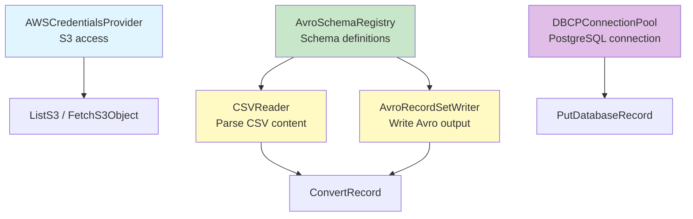
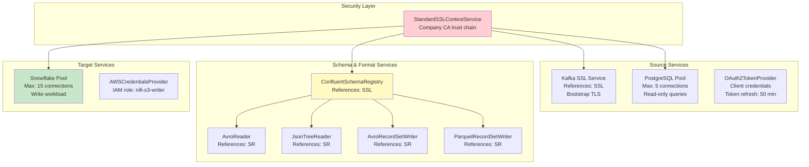

# Scenario Questions — NiFi Controller Services

<article data-difficulty="junior">

## 🟢 Junior: Configure Essential Services

**Scenario:** You need to build a NiFi flow that reads CSV files from S3, converts them to Avro format, and inserts into PostgreSQL. List all controller services needed, explain why each is required, and describe their configurations.

<details>
<summary>💡 Hint</summary>
Think about: How does NiFi connect to S3? (AWS credentials). How does NiFi read CSV? (CSVReader service). How does NiFi write Avro? (AvroWriter + schema). How does NiFi connect to PostgreSQL? (DBCPConnectionPool). Where does the Avro schema come from? (Schema Registry service).
</details>

<details>
<summary>✅ Solution</summary>

**Required Controller Services (5):**



```
# 1. AWSCredentialsProviderControllerService
#    WHY: S3 processors need AWS authentication
AWSCredentialsProviderControllerService:
  Use Default Credentials Provider Chain: true
  # On EC2: uses instance IAM role (no hardcoded keys!)
  # Alternative: Access Key + Secret Key for non-EC2

# 2. AvroSchemaRegistry (built-in NiFi registry)
#    WHY: CSVReader and AvroWriter need to know the record structure
AvroSchemaRegistry:
  Schemas:
    orders_schema = {
      "type": "record",
      "name": "Order",
      "fields": [
        {"name": "order_id", "type": "string"},
        {"name": "customer_id", "type": "string"},
        {"name": "amount", "type": "double"},
        {"name": "order_date", "type": "string"},
        {"name": "product_name", "type": "string"},
        {"name": "quantity", "type": "int"},
        {"name": "status", "type": "string"},
        {"name": "region", "type": "string"}
      ]
    }

# 3. CSVReader
#    WHY: ConvertRecord needs to parse CSV FlowFile content into records
CSVReader:
  Schema Access Strategy: Schema Name
  Schema Registry: AvroSchemaRegistry    # Reference to service #2!
  Schema Name: orders_schema
  Treat First Line as Header: true
  Value Separator: ,
  Quote Character: "
  Date Format: yyyy-MM-dd

# 4. AvroRecordSetWriter
#    WHY: ConvertRecord needs to serialize records into Avro format
AvroRecordSetWriter:
  Schema Access Strategy: Schema Name
  Schema Registry: AvroSchemaRegistry    # Same registry!
  Schema Name: orders_schema
  Compression: SNAPPY

# 5. DBCPConnectionPool
#    WHY: PutDatabaseRecord needs a database connection
DBCPConnectionPool:
  Database Connection URL: jdbc:postgresql://pg-host.company.com:5432/warehouse
  Database Driver Class Name: org.postgresql.Driver
  Database Driver Location: /opt/nifi/drivers/postgresql-42.7.1.jar
  Database User: nifi_writer
  Password: ${db_password}
  Max Total Connections: 10
  Max Wait Time: 5000 ms
  Validation Query: SELECT 1
```

**How processors reference these services:**

```
ListS3:
  AWS Credentials Provider: AWSCredentialsProviderControllerService
  
FetchS3Object:
  AWS Credentials Provider: AWSCredentialsProviderControllerService

ConvertRecord:
  Record Reader: CSVReader                    # Service #3
  Record Writer: AvroRecordSetWriter          # Service #4

PutDatabaseRecord:
  Record Reader: AvroReader                   # (reads the Avro FlowFile)
  Database Connection Pool: DBCPConnectionPool  # Service #5
  Table Name: raw.orders
  Statement Type: INSERT
```

**Key Points:**
- Each service is configured ONCE, referenced by name
- Schema Registry is shared between Reader AND Writer (consistency)
- AWS credentials use IAM role (no secrets in NiFi config)
- DB pool sized for concurrent tasks (10 connections ≥ PutDB concurrent tasks)
- Enable order: Schema Registry → CSVReader + AvroWriter → DBCPPool → Start processors

</details>

</article>

<article data-difficulty="mid-level">

## 🟡 Mid-Level: Service Design for Multi-Source Pipeline

**Scenario:** You're designing controller services for a pipeline that ingests from 3 sources (Kafka, PostgreSQL, REST API) and writes to 2 targets (Snowflake, S3). Each source has different formats (Avro from Kafka, JSON from API, relational from PostgreSQL) and each target needs different output formats (Parquet for S3, native for Snowflake). Design the complete controller service architecture including: schema management, connection pools sizing, and security.

<details>
<summary>💡 Hint</summary>
You need: SSL for everything, separate DB pools per database, Reader per input format, Writer per output format, shared Schema Registry, separate AWS credentials for S3. Size DB pools based on processor concurrent tasks. Consider: can you reuse services across paths?
</details>

<details>
<summary>✅ Solution</summary>



**Complete Configuration:**

```
# ═══════════════════════════════════
# SECURITY (shared by all)
# ═══════════════════════════════════
StandardSSLContextService:
  Keystore: /opt/nifi/certs/nifi.p12
  Keystore Type: PKCS12
  Keystore Password: #{ssl.keystore.pass}
  Truststore: /opt/nifi/certs/company-ca.jks
  Truststore Type: JKS
  Truststore Password: #{ssl.truststore.pass}

# ═══════════════════════════════════
# SOURCE: Kafka
# ═══════════════════════════════════
# No separate service needed — ConsumeKafka references SSL directly
# ConsumeKafka properties:
#   Security Protocol: SSL
#   SSL Context Service: StandardSSLContextService

# ═══════════════════════════════════
# SOURCE: PostgreSQL (read-only)
# ═══════════════════════════════════
DBCPConnectionPool "PG_Source_ReadOnly":
  URL: jdbc:postgresql://#{pg.host}:5432/#{pg.db}?ssl=true
  User: #{pg.readonly.user}
  Password: #{pg.readonly.pass}
  Max Total Connections: 5      # Only 2 processors use this (query + lookup)
  Max Wait: 3000 ms
  Default Auto Commit: true     # Read-only, no transactions
  SSL Context Service: StandardSSLContextService

# ═══════════════════════════════════
# SOURCE: REST API
# ═══════════════════════════════════  
StandardOAuth2ClientCredentialsProvider:
  Authorization Server URL: https://auth.partner.com/oauth/token
  Client ID: #{api.client.id}
  Client Secret: #{api.client.secret}
  Scope: read:orders
  SSL Context Service: StandardSSLContextService
  # Auto-refreshes token before expiry

# ═══════════════════════════════════
# SCHEMA REGISTRY (shared for all formats)
# ═══════════════════════════════════
ConfluentSchemaRegistry:
  Schema Registry URLs: https://#{schema.registry.url}:8081
  SSL Context Service: StandardSSLContextService
  Cache Expiration: 1 hour
  # Stores schemas for: Kafka Avro, API JSON, DB records

# ═══════════════════════════════════
# READERS (one per input format)
# ═══════════════════════════════════
AvroReader "Kafka_Avro_Reader":
  Schema Access Strategy: Schema from Schema Registry
  Schema Registry: ConfluentSchemaRegistry
  # Used by: processors consuming from Kafka

JsonTreeReader "API_Json_Reader":
  Schema Access Strategy: Schema Name
  Schema Registry: ConfluentSchemaRegistry
  Schema Name: ${schema.name}    # Dynamic per API endpoint!
  # Used by: processors handling REST API responses

# PostgreSQL: uses built-in SQL → Record conversion (no explicit reader)

# ═══════════════════════════════════
# WRITERS (one per output format)
# ═══════════════════════════════════
ParquetRecordSetWriter "S3_Parquet_Writer":
  Schema Access Strategy: Schema Name
  Schema Registry: ConfluentSchemaRegistry
  Schema Name: ${output.schema}
  Compression Type: SNAPPY
  # Used by: ConvertRecord → PutS3Object path

AvroRecordSetWriter "Snowflake_Avro_Writer":
  Schema Access Strategy: Schema Name
  Schema Registry: ConfluentSchemaRegistry
  Schema Name: ${output.schema}
  # Used by: ConvertRecord → PutDatabaseRecord (Snowflake) path
  # Snowflake ingests Avro natively via COPY INTO

# ═══════════════════════════════════
# TARGET: Snowflake
# ═══════════════════════════════════
DBCPConnectionPool "Snowflake_Target":
  URL: jdbc:snowflake://#{sf.account}.snowflakecomputing.com/?warehouse=#{sf.warehouse}&db=#{sf.database}
  User: #{sf.user}
  Password: #{sf.password}
  Max Total Connections: 15
  # Sizing: PutDatabaseRecord(8 tasks) + ExecuteSQL(2 tasks) = 10 active + 5 buffer
  Max Wait: 5000 ms

# ═══════════════════════════════════
# TARGET: S3
# ═══════════════════════════════════
AWSCredentialsProviderControllerService:
  Use Default Credentials Provider Chain: true
  # EC2 instance role: allows s3:PutObject on target bucket
```

**Connection Pool Sizing Rationale:**

```
PostgreSQL Source Pool (5 connections):
  - ExecuteSQLRecord: 2 concurrent tasks (incremental extract)
  - DatabaseLookupService: 2 concurrent tasks (enrichment)
  - Buffer: 1 connection
  Total: 5

Snowflake Target Pool (15 connections):
  - PutDatabaseRecord: 8 concurrent tasks (main write path)
  - ExecuteSQL (COPY INTO): 2 concurrent tasks (bulk load)
  - Buffer: 5 connections (handles retry bursts)
  Total: 15
```

**Key Points:**
- **ONE SSL service shared everywhere** (DRY principle)
- **Separate DB pools per database** (isolation, independent sizing)
- **Schema Registry shared by ALL readers/writers** (single source of truth)
- **Dynamic schema names** via `${schema.name}` attribute (one service, many schemas)
- **OAuth2 for APIs** (auto-refreshing tokens, no manual management)
- **Pool sizing** tied to concrete processor concurrent task numbers
- **Parameter Contexts** for all credentials (environment-agnostic)

</details>

</article>

<article data-difficulty="senior">

## 🔴 Senior: Service Failure Recovery Design

**Scenario:** Your NiFi production cluster uses controller services for: database connections (Snowflake), schema registry (Confluent), Redis cache (dedup), and OAuth2 tokens (partner API). Design the resilience strategy for when each service's backing system goes down: (1) Snowflake maintenance window (2 hours), (2) Schema Registry crash (10 minutes), (3) Redis failover (30 seconds), (4) OAuth2 server timeout (5 minutes). For each, specify: what NiFi behavior occurs, how to prevent data loss, and how to auto-recover.

<details>
<summary>💡 Hint</summary>
Each service failure has different impact. DB down: writes fail → back pressure → Kafka lag grows (acceptable for 2h). Schema Registry: readers/writers fail → all processing stops. Redis: dedup fails → possible duplicates (acceptable?). OAuth: API calls fail → retry. Design: back pressure absorbs short outages, idempotent writes handle duplicates, circuit breakers prevent cascading failures.
</details>

<details>
<summary>✅ Solution</summary>

**Failure Impact Matrix:**

| Service Down | Immediate Impact | Data Loss Risk | Auto-Recovery |
|-------------|-----------------|----------------|---------------|
| Snowflake (2h) | PutDB fails → back pressure | None (queued in NiFi + Kafka) | Reconnect on next attempt |
| Schema Registry (10min) | ALL record processing fails | None (back pressure holds data) | Cache hit if < TTL |
| Redis (30sec) | Dedup returns false-positive | Possible duplicates | Reconnect + rebuild |
| OAuth2 (5min) | API calls 401 → retry | None (retry with backoff) | Token refresh on recovery |

**1. Snowflake Maintenance (2 hours):**

```
BEHAVIOR:
- PutDatabaseRecord gets JDBC connection error
- FlowFiles route to "failure" relationship
- RetryFlowFile retries 3 times with backoff
- After 3 retries: back pressure fills queues upstream
- Eventually: ConsumeKafka pauses (Kafka retains messages)

PREVENTION (Zero Data Loss):
- Back pressure sized for 2 hours:
  Queue before PutDB: Object Threshold = 500,000 (at 5K/sec × 7200 sec = 36M)
  Actually: Kafka retains indefinitely! NiFi just needs to pause cleanly.
  Object Threshold = 50,000 (reasonable memory, Kafka is the buffer)

AUTO-RECOVERY:
- DBCPConnectionPool: Test On Borrow = true, Validation Query = SELECT 1
- When Snowflake returns: next borrow validates → success → processing resumes
- Queue drains at max speed until caught up
- Kafka consumer lag metric shows recovery progress

CONFIGURATION:
DBCPConnectionPool "Snowflake":
  Test On Borrow: true
  Test While Idle: true
  Eviction Run Period: 30000 ms
  Min Evictable Idle Time: 60000 ms
  # Stale connections evicted during outage
  # Fresh connections created when Snowflake returns
  
RetryFlowFile (before back pressure):
  Max Retries: 3
  Penalty Duration: 30 sec
  # 3 retries × 30 sec = 90 seconds before back pressure kicks in
  # Handles transient blips without triggering full back pressure
```

**2. Schema Registry Crash (10 minutes):**

```
BEHAVIOR:
- Record Readers/Writers can't resolve schemas
- ALL record-based processors fail (ConvertRecord, ValidateRecord, etc.)
- Back pressure propagates to source processors

PREVENTION:
- Schema Cache prevents immediate failure!
  ConfluentSchemaRegistry:
    Cache Expiration: 1 hour        # Cached schemas survive 1-hour outage!
    Cache Size: 500                  # All schemas fit in cache
  
  # If schemas are cached: processing continues for up to 1 HOUR
  # Only NEW/UNKNOWN schemas would fail (can't look up)
  
- For truly new schemas during outage:
  RouteOnAttribute:
    schema_lookup_failed = ${record.error:contains('schema')}
  → Route to holding queue (PutS3Object to staging bucket)
  → Reprocess after registry recovers

AUTO-RECOVERY:
- Schema Registry restarts → cache expires → fresh fetch on next request
- No manual intervention needed if cache TTL > outage duration
- Holding queue data reprocessed via ListS3 after recovery

MONITORING:
- Alert: Schema Registry health check (InvokeHTTP GET /subjects)
- Alert: Processors with schema-related bulletin errors
```

**3. Redis Failover (30 seconds):**

```
BEHAVIOR:
- RedisDistributedMapCacheClient: connection timeout
- DetectDuplicate: can't check cache
- Default behavior: treat ALL FlowFiles as "new" (non-duplicate)
- RISK: 30 seconds of potential duplicate processing!

PREVENTION:
- Option A: Route to holding queue during Redis outage
  # DetectDuplicate failure relationship → UpdateAttribute(cache_miss=true) → hold

- Option B: Accept duplicates, handle at destination (IDEMPOTENT writes)
  PutDatabaseRecord:
    Statement Type: INSERT
    Table: target_table
    # Table has UNIQUE constraint on business key
    # INSERT ... ON CONFLICT DO NOTHING
    # Duplicates silently ignored by database!
    
- Option C: Redis Sentinel for sub-second failover
  RedisDistributedMapCacheClient:
    Redis Mode: Sentinel
    Sentinel Master: mymaster
    Sentinel Hosts: sentinel-1:26379,sentinel-2:26379,sentinel-3:26379
    # Automatic failover in < 5 seconds (Redis Sentinel)
    # NiFi client reconnects to new primary transparently

AUTO-RECOVERY:
- Redis Sentinel promotes replica in < 5 seconds
- NiFi client reconnects on next operation attempt
- Cache data preserved (replica had full copy)
- If using standalone Redis (no Sentinel): cache rebuilds from empty
  → Duplicates possible until cache repopulated (use idempotent writes!)

CONFIGURATION:
RedisDistributedMapCacheClient:
  Connection Timeout: 5 sec
  Communication Timeout: 5 sec
  Pool Max Total: 20
  Pool Max Idle: 10
  # Short timeouts = fast failure detection
  # Fast failure → fail to "non-duplicate" → processed (idempotent downstream)
```

**4. OAuth2 Server Timeout (5 minutes):**

```
BEHAVIOR:
- StandardOAuth2ClientCredentialsProvider: token refresh fails
- If current token not expired: processing continues using cached token!
- If token expired during outage: InvokeHTTP gets 401 → failure relationship

PREVENTION:
- Token buffer: Request refresh at 80% of token lifetime
  # If token lasts 60 min, refresh at 48 min
  # 12-minute buffer > 5-minute outage → no impact!
  
  StandardOAuth2ClientCredentialsProvider:
    Token Refresh Window: 12 min    # Refresh 12 min before expiry
    
- RetryFlowFile for 401 errors:
  RetryFlowFile:
    Max Retries: 10
    Penalty Duration: 30 sec
    # 10 × 30 sec = 5 minutes of retries → covers exact outage duration!

AUTO-RECOVERY:
- OAuth2 server returns → next token refresh succeeds
- Cached token updated → all subsequent requests use new token
- Retried FlowFiles process successfully with fresh token
- No manual intervention needed

MONITORING:
- Alert: token refresh failures > 3 consecutive
- Alert: InvokeHTTP 401 count > threshold
```

**Summary Architecture:**

```mermaid
graph TD
    subgraph "Resilience Layers"
        L1[Layer 1: Caching<br>Schema cache (1h), Token cache<br>Survives short outages transparently]
        L2[Layer 2: Retry<br>RetryFlowFile with backoff<br>Handles transient failures]
        L3[Layer 3: Back Pressure<br>Queue absorption<br>Handles minutes of downtime]
        L4[Layer 4: Kafka Retention<br>Consumer lag grows<br>Handles hours of downtime]
        L5[Layer 5: Idempotent Writes<br>ON CONFLICT DO NOTHING<br>Handles duplicates from cache failures]
    end
    
    L1 --> L2 --> L3 --> L4
    L5 -.->|"Safety net for all layers"| L1
    
    style L1 fill:#c8e6c9
    style L2 fill:#fff9c4
    style L3 fill:#ffe0b2
    style L4 fill:#ffcdd2
    style L5 fill:#e1f5fe
```

</details>

</article>

</content>

---

## ⚡ Quick-fire Q&A

**Q: What is a Controller Service in NiFi?**
A: A Controller Service is a shared, long-lived component that provides resources (database connections, SSL contexts, schema registries) to processors and other controller services. It is initialized once and reused across many processors, avoiding the overhead of creating a new connection per FlowFile.

**Q: Why use a DBCPConnectionPool Controller Service instead of configuring JDBC in each processor?**
A: The connection pool manages a fixed set of reusable database connections and enforces limits, preventing connection exhaustion. Centralizing credentials in one service also simplifies secret rotation—you update one place instead of every processor property.

**Q: What scopes can a Controller Service be defined at?**
A: Process Group scope (visible only within that group and its children) or Root/Controller scope (visible cluster-wide). Defining shared infrastructure services at root scope and business-logic services at process-group scope follows least-privilege and promotes reuse.

**Q: How do you enable or disable a Controller Service without stopping processors?**
A: In the NiFi UI, navigate to the gear icon → Controller Services tab, then enable/disable the service. NiFi will warn if processors referencing the service are running; you can choose to stop them automatically or abort. Disabling is required before changing most service properties.

**Q: What happens if a Controller Service fails to initialize?**
A: Processors that depend on it transition to an Invalid state and cannot be started. The NiFi bulletin board and the service's status icon show the error. You must fix the configuration and re-enable the service.

**Q: Name three common Controller Services used in data engineering flows.**
A: DBCPConnectionPool (JDBC connection pool), AvroSchemaRegistry / ConfluentSchemaRegistry (schema management for record-aware processors), and StandardSSLContextService (TLS configuration shared by HTTPS and Kafka processors).

**Q: How do Controller Services interact with record-based processors?**
A: Record Reader and Record Writer Controller Services (e.g., CSVReader, AvroRecordSetWriter) are passed to processors like ConvertRecord or QueryRecord, decoupling format-parsing logic from processing logic. Swapping the reader/writer changes format without touching the processor configuration.

**Q: Can Controller Services be version-controlled in NiFi Registry?**
A: Yes. Process Groups saved to NiFi Registry include their Controller Services. When you import or upgrade a versioned flow, the associated services are restored with the correct configuration, enabling reproducible deployments.

---

## 💼 Interview Tips

- Highlight the separation of concerns: Controller Services handle infrastructure (connections, credentials, formats) while processors handle business logic. This is a design principle senior interviewers appreciate.
- Know the enable/disable lifecycle and why you cannot edit a running service—it prevents in-flight processors from using an inconsistent resource.
- Mention secret management integration: pairing DBCPConnectionPool with NiFi's sensitive property encryption or an external vault (HashiCorp Vault via the NAR) shows production awareness.
- Avoid the common mistake of creating a new DBCPConnectionPool per processor in the same flow—explain why shared pools are superior (connection limits, monitoring, rotation).
- Senior interviewers may ask how you'd test a new Controller Service in isolation before wiring it to processors—use a test process group with a GenerateFlowFile → processor → LogAttribute chain.
