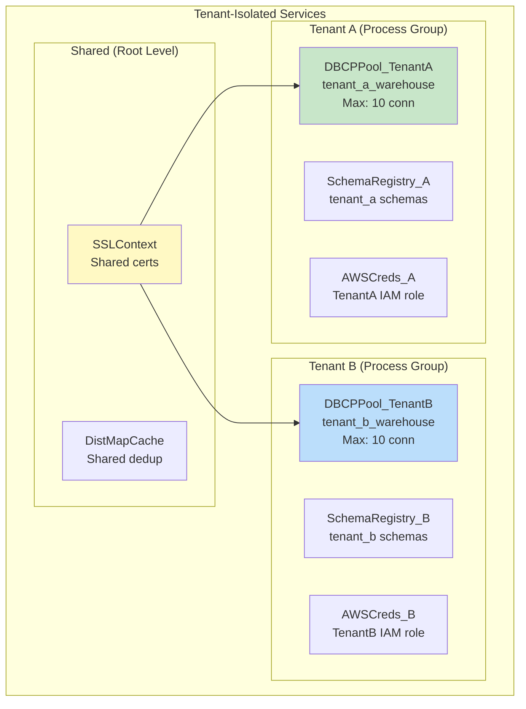

# NiFi Controller Services — Senior Deep Dive

## Custom Controller Service Development

```java
// Interface definition for a custom lookup service:
public interface CustomLookupService extends ControllerService {
    Optional<String> lookup(String key) throws LookupFailureException;
    void refresh() throws IOException;
}

// Implementation:
@Tags({"custom", "lookup", "cache"})
@CapabilityDescription("Custom cached lookup service with TTL")
public class CachedDatabaseLookupService extends AbstractControllerService 
    implements CustomLookupService {
    
    private final ConcurrentHashMap<String, CacheEntry> cache = new ConcurrentHashMap<>();
    private DBCPService dbcpService;
    
    public static final PropertyDescriptor DBCP_SERVICE = new PropertyDescriptor.Builder()
        .name("Database Connection Pool")
        .identifiesControllerService(DBCPService.class)
        .required(true)
        .build();
    
    public static final PropertyDescriptor CACHE_TTL = new PropertyDescriptor.Builder()
        .name("Cache TTL")
        .defaultValue("5 min")
        .required(true)
        .addValidator(StandardValidators.TIME_PERIOD_VALIDATOR)
        .build();
    
    @OnEnabled
    public void onEnabled(ConfigurationContext context) {
        this.dbcpService = context.getProperty(DBCP_SERVICE)
            .asControllerService(DBCPService.class);
        preloadCache();  // Load full cache on startup
    }
    
    @Override
    public Optional<String> lookup(String key) {
        CacheEntry entry = cache.get(key);
        if (entry != null && !entry.isExpired()) {
            return Optional.of(entry.getValue());
        }
        // Cache miss: query DB, update cache
        String value = queryDatabase(key);
        if (value != null) {
            cache.put(key, new CacheEntry(value, cacheTtlMs));
            return Optional.of(value);
        }
        return Optional.empty();
    }
}
```

## Multi-Tenant Controller Service Architecture



```
# Isolation strategy:
# 1. Each tenant gets their OWN Process Group
# 2. Each group has its OWN controller services (DB, Schema, AWS)
# 3. Shared infrastructure services at root level (SSL, Cache)
# 4. Parameter Contexts per tenant for credentials

# Parameter Context: "tenant-acme-config"
#   db.url = jdbc:snowflake://acme.snowflakecomputing.com
#   db.user = acme_etl
#   db.password = ***
#   aws.role = arn:aws:iam::111:role/acme-nifi
#   s3.bucket = acme-data-lake

# Same flow template, different parameters per tenant!
```

## Connection Pool Sizing Strategy

```
# Formula for pool sizing:
# Max Connections = SUM(all referencing processor concurrent tasks) + buffer

# Example pipeline:
# PutDatabaseRecord: 8 concurrent tasks
# ExecuteSQLRecord: 2 concurrent tasks  
# LookupRecord: 4 concurrent tasks
# Total: 14 active connections needed
# Buffer: +6 for spikes/retries
# Pool size: 20

# WARNING: If pool too small:
# Processors wait for connections → throughput drops
# Wait timeout → failure relationship → retries → worse

# WARNING: If pool too large:
# Database overwhelmed with too many connections
# PostgreSQL max_connections = 100; 5 NiFi nodes × 20 = 100 (max!)
# Leave room for other applications!

# nifi.properties overrides for JVM:
# Ensure NiFi has enough threads for all concurrent tasks:
nifi.bored.yield.duration=10 millis
nifi.processor.scheduling.timeout=1 min
```

## Service High Availability

```
# Problem: DistributedMapCacheServer runs on ONE node
# If that node fails → dedup stops working!

# Solution 1: NiFi cluster auto-failover
# Primary node runs the server
# If primary fails → new primary elected → server restarts
# Gap: cache is LOST (rebuilds from empty)

# Solution 2: External cache (Redis)
# Use RedisDistributedMapCacheClientService
# Redis handles its own HA (Redis Sentinel/Cluster)
# NiFi nodes are stateless clients

# Solution 3: Database-backed dedup
# Use DBCPLookupService for dedup checks
# Database handles HA natively
# Slower than in-memory cache but reliable

# Production recommendation:
# Critical dedup → Redis (fast + HA)
# Nice-to-have dedup → NiFi built-in cache (simple + fast, accepts gap)
```

## Service Performance Tuning

```
# DBCPConnectionPool:
Max Total Connections: 20
Max Wait Time: 5000 ms          # Fail fast if pool exhausted
Min Evictable Idle Time: 300000 ms  # Close idle connections after 5 min
Validation Query: SELECT 1      # Test connection before use
Test On Borrow: true            # Validate every checkout
Eviction Run Period: 60000 ms   # Check for stale connections every 60s

# High-performance settings:
Max Total Connections: 50       # For heavy batch workloads
Max Wait Time: 1000 ms          # Fail very fast
Min Idle: 10                    # Keep 10 warm connections ready
Test On Borrow: false           # Skip validation (faster, risk stale)
Test While Idle: true           # Validate during idle eviction instead

# Schema Registry:
# Cache schemas aggressively (they rarely change):
Schema Cache: 100 entries
Schema Cache Expiration: 1 hour
# First lookup: network call. Subsequent: memory cache hit.
```

## Interview Tips

> **Tip 1:** "How do you handle multi-tenant data in NiFi?" — Process Group per tenant with isolated controller services (own DB pool, own AWS credentials, own schema registry). Shared services (SSL, monitoring) at root level. Parameter Contexts store tenant-specific configs. Same flow template deployed per tenant with different parameters. Complete isolation: one tenant's DB issue doesn't affect others.

> **Tip 2:** "How do you size database connection pools?" — Formula: sum of concurrent tasks across all referencing processors + 20-30% buffer. Also check: database max_connections ÷ NiFi nodes = max per-node pool. If PutDatabaseRecord has 8 tasks and LookupRecord has 4 = 12 needed. Set pool to 15-20. Monitor: pool wait time metric should be < 100ms; if higher, pool is undersized.

> **Tip 3:** "Custom controller service vs. ExecuteScript?" — Controller service when: multiple processors need the same shared resource, you need connection pooling, or you need lifecycle management (initialize on enable, cleanup on disable). ExecuteScript when: one-off transformation logic for a single processor. Services are reusable, testable, and performant. Scripts are quick but fragile.
