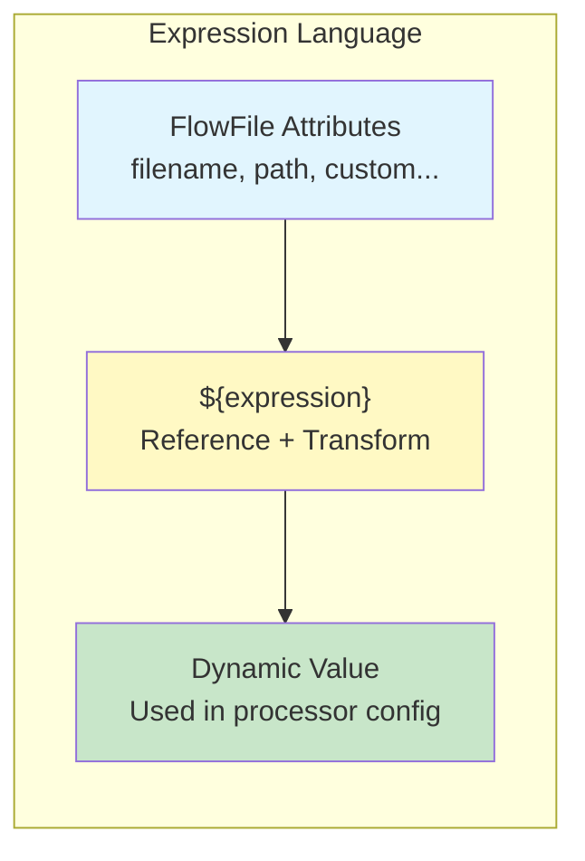

# NiFi Expression Language — Fundamentals

## What is NiFi Expression Language?

NiFi Expression Language (EL) is a **mini query language** that lets you dynamically reference and manipulate FlowFile attributes within processor configurations. It uses the syntax `${attribute_name}` and supports functions for string manipulation, math, dates, and logic.



## Basic Syntax

```
${attribute_name}                    — Reference an attribute value
${attribute_name:function()}         — Apply a function to the value
${attribute_name:function1():function2()}  — Chain multiple functions
${literal("static text")}           — Use a literal value
```

## Referencing Attributes

```
# Given FlowFile attributes:
#   filename = "orders_2024-03-15.csv"
#   path = "/data/incoming/"
#   fileSize = "1048576"
#   source.system = "shopify"

# Reference in processor config:
${filename}                    → "orders_2024-03-15.csv"
${path}                        → "/data/incoming/"
${fileSize}                    → "1048576"
${source.system}               → "shopify"

# Use in PutS3Object:
Object Key: raw/${source.system}/${filename}
# Result: "raw/shopify/orders_2024-03-15.csv"
```

## String Functions

| Function | Example | Result |
|----------|---------|--------|
| `toUpper()` | `${filename:toUpper()}` | "ORDERS_2024-03-15.CSV" |
| `toLower()` | `${filename:toLower()}` | "orders_2024-03-15.csv" |
| `trim()` | `${name:trim()}` | Removes whitespace |
| `substring(start, end)` | `${filename:substring(0, 6)}` | "orders" |
| `substringBefore(str)` | `${filename:substringBefore('.')}` | "orders_2024-03-15" |
| `substringAfter(str)` | `${filename:substringAfter('_')}` | "2024-03-15.csv" |
| `replace(old, new)` | `${filename:replace('.csv', '.json')}` | "orders_2024-03-15.json" |
| `replaceAll(regex, new)` | `${filename:replaceAll('[^a-zA-Z]', '')}` | "orderscsv" |
| `append(str)` | `${filename:append('.processed')}` | "orders_2024-03-15.csv.processed" |
| `prepend(str)` | `${filename:prepend('archive/')}` | "archive/orders_2024-03-15.csv" |
| `length()` | `${filename:length()}` | "23" |
| `contains(str)` | `${filename:contains('orders')}` | "true" |
| `startsWith(str)` | `${filename:startsWith('orders')}` | "true" |
| `endsWith(str)` | `${filename:endsWith('.csv')}` | "true" |

## Numeric Functions

```
# Given: fileSize = "1048576", record.count = "5000"

${fileSize:divide(1024)}              → "1024" (KB)
${fileSize:divide(1048576)}           → "1" (MB)
${record.count:multiply(2)}           → "10000"
${record.count:plus(100)}             → "5100"
${record.count:minus(50)}             → "4950"
${record.count:mod(3)}                → "2"
${record.count:gt(1000)}              → "true" (greater than)
${record.count:lt(10000)}             → "true" (less than)
```

## Date/Time Functions

```
# Current time:
${now()}                              → Current timestamp (epoch millis)
${now():format('yyyy-MM-dd')}         → "2024-03-15"
${now():format('yyyy/MM/dd/HH')}      → "2024/03/15/10"
${now():format("yyyy-MM-dd'T'HH:mm:ss'Z'")} → "2024-03-15T10:30:00Z"

# Date math:
${now():toNumber():minus(86400000):format('yyyy-MM-dd')}  → Yesterday's date
# (subtract 24h in millis)

# Parse date from attribute:
# Given: event.date = "2024-03-15"
${event.date:toDate('yyyy-MM-dd'):format('yyyyMMdd')}  → "20240315"

# Extract parts:
${now():format('yyyy')}               → "2024" (year)
${now():format('MM')}                 → "03" (month)
${now():format('dd')}                 → "15" (day)
${now():format('HH')}                 → "10" (hour)
```

## Boolean/Conditional Functions

```
# Equals:
${source.system:equals('shopify')}    → "true" or "false"

# If/Else:
${source.system:equals('shopify'):ifElse('Shop', 'Other')}
# Returns "Shop" if source.system is "shopify", else "Other"

# IsEmpty / IsNull:
${customer_id:isEmpty()}              → "true" if attribute is empty or missing
${customer_id:isNull()}               → "true" if attribute doesn't exist

# Chained conditions:
${priority:equals('high'):or(${source:equals('payments')})}
# true if priority=high OR source=payments

${amount:gt(1000):and(${region:equals('US')})}
# true if amount > 1000 AND region = US
```

## Common Use Cases

### Dynamic File Paths

```
# PutS3Object — Object Key:
${source.system}/${now():format('yyyy/MM/dd')}/${filename}
# Result: "shopify/2024/03/15/orders_2024-03-15.csv"

# Partitioned output:
data/${source.system}/year=${now():format('yyyy')}/month=${now():format('MM')}/day=${now():format('dd')}/${UUID()}.parquet
# Result: "data/shopify/year=2024/month=03/day=15/a1b2c3d4.parquet"
```

### Dynamic Attribute Values (UpdateAttribute)

```
# UpdateAttribute processor properties:
processed_filename = "${filename:substringBefore('.')}__processed.${filename:substringAfter('.')}"
# "orders_2024-03-15.csv" → "orders_2024-03-15__processed.csv"

file_date = "${filename:substringAfter('_'):substringBefore('.')}"
# "orders_2024-03-15.csv" → "2024-03-15"

size_mb = "${fileSize:divide(1048576)}"
# "1048576" → "1"

is_large_file = "${fileSize:gt(104857600)}"
# true if > 100MB
```

### Routing Conditions (RouteOnAttribute)

```
# RouteOnAttribute properties:
high_priority = ${priority:equals('high')}
large_batch = ${record.count:gt(10000)}
us_region = ${region:equals('US'):or(${region:equals('CA')})}
csv_file = ${filename:toLower():endsWith('.csv')}
recent = ${file.lastModified:gt(${now():toNumber():minus(3600000)})}
# (modified within last hour)
```

## Expression Language in Different Contexts

| Context | Example |
|---------|---------|
| Processor property | `Remote URL: https://api.com/orders?date=${now():format('yyyy-MM-dd')}` |
| UpdateAttribute | `new_attr = ${old_attr:toUpper():replace(' ', '_')}` |
| RouteOnAttribute condition | `${amount:gt(1000):and(${status:equals('active')})}` |
| PutS3Object key | `${source}/${now():format('yyyy/MM/dd')}/${filename}` |
| PublishKafka topic | `events.${source.system:toLower()}` |

## Interview Tips

> **Tip 1:** "What is NiFi Expression Language?" — A built-in mini-language for dynamically referencing and transforming FlowFile attributes within processor configurations. Syntax: `${attribute:function1():function2()}`. Supports: string manipulation, math, date formatting, boolean logic. Used everywhere: routing conditions, dynamic paths, attribute computation.

> **Tip 2:** "How do you create dynamic file paths in NiFi?" — Use EL in output processor configs. Example: `${source}/${now():format('yyyy/MM/dd')}/${filename}` creates date-partitioned paths automatically. Combine attribute references with date functions for S3 keys, HDFS paths, or Kafka topics that organize data by time.

> **Tip 3:** "How do you do conditional logic in EL?" — Use `equals()`, `gt()`, `lt()`, `contains()` for conditions. Chain with `and()`, `or()` for complex logic. Use `ifElse()` for conditional values: `${priority:equals('high'):ifElse('fast-lane', 'standard')}`. In RouteOnAttribute, each property is a boolean EL expression — FlowFiles route to matching relationships.
