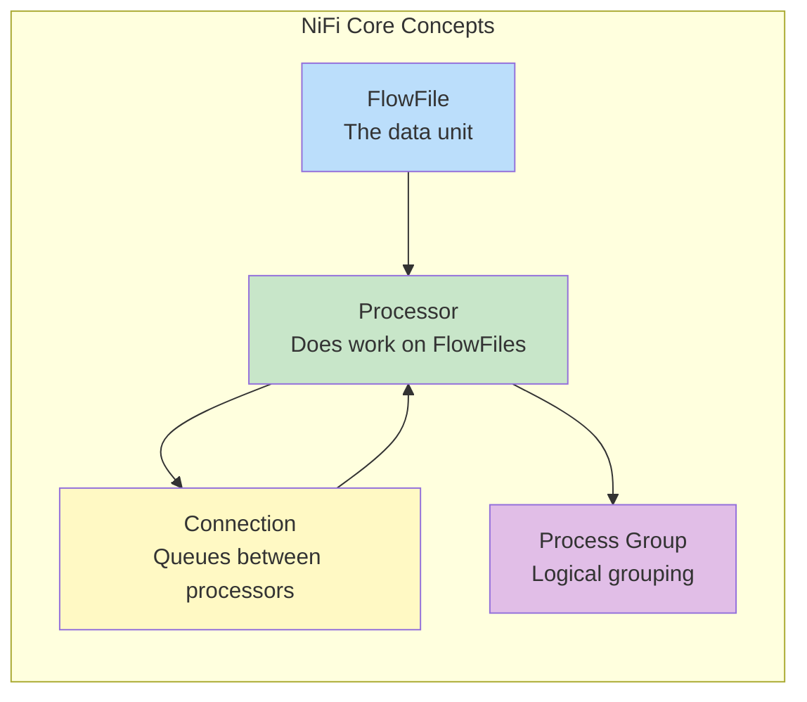
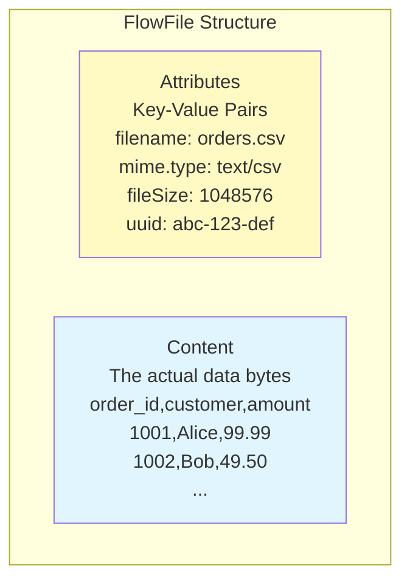
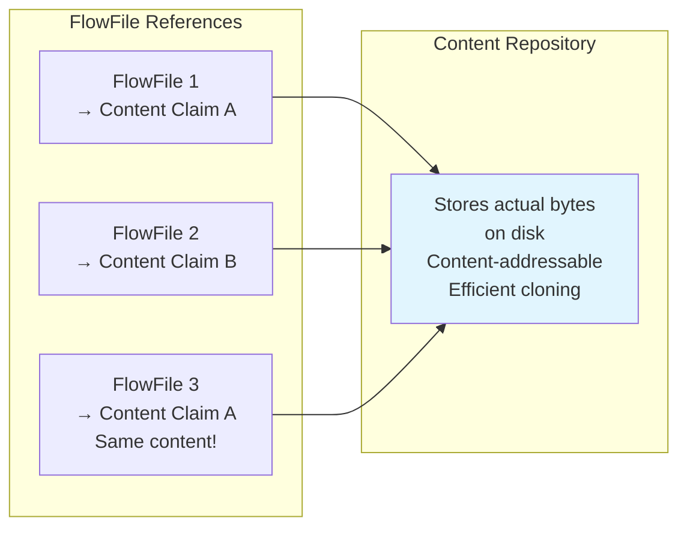
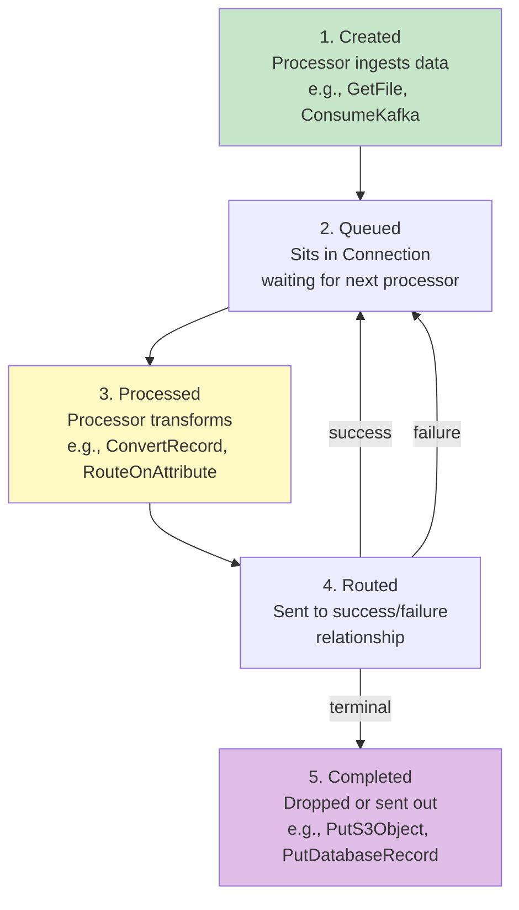
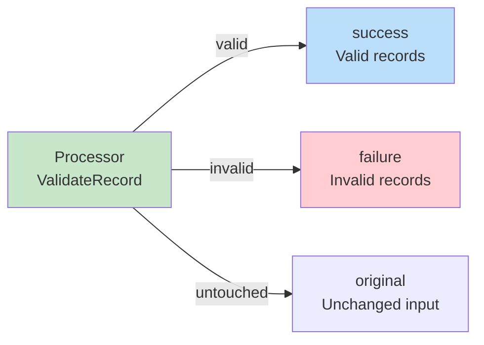
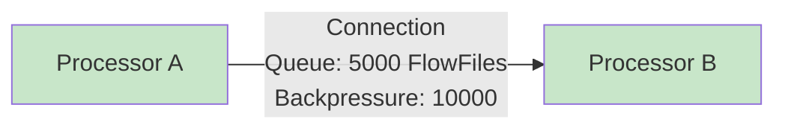

# Apache NiFi FlowFiles — Fundamentals

## What is Apache NiFi?

Apache NiFi is a **data integration and dataflow automation platform** designed to move data between systems reliably at scale. It provides a web-based UI for designing, monitoring, and managing data pipelines visually.



## What is a FlowFile?

A FlowFile is the **fundamental data unit** in NiFi. Every piece of data moving through a NiFi pipeline is wrapped in a FlowFile.

A FlowFile has two parts:

| Component | What it is | Example |
|-----------|-----------|---------|
| **Content** | The actual data payload (bytes) | CSV rows, JSON document, image, Avro file |
| **Attributes** | Key-value metadata about the content | filename, path, mime.type, fileSize, uuid |



## FlowFile Attributes

Every FlowFile automatically gets **core attributes** created by NiFi:

| Attribute | Description | Example |
|-----------|-------------|---------|
| `uuid` | Unique identifier for this FlowFile | `a1b2c3d4-e5f6-7890` |
| `filename` | Name of the file/data | `orders_2024-03-15.csv` |
| `path` | Directory path | `/data/incoming/` |
| `fileSize` | Size in bytes | `1048576` |
| `mime.type` | Content type | `application/json` |
| `entryDate` | When FlowFile entered the flow | `2024-03-15T10:30:00Z` |
| `lineageStartDate` | When FlowFile was originally created | `2024-03-15T10:30:00Z` |

You can also add **custom attributes** at any point in the flow:

```
source.system = "salesforce"
batch.id = "batch-20240315-001"
record.count = "5000"
processing.status = "validated"
```

## FlowFile Content

The content is the **raw bytes** — NiFi doesn't care what format it is. It could be:

- CSV, TSV, or fixed-width text
- JSON or XML documents
- Avro, Parquet, or ORC binary files
- Images, PDFs, or any binary data
- A single database row or an entire table dump



**Key concept:** FlowFiles don't contain the data directly — they hold a **reference (content claim)** to data stored in the Content Repository. Multiple FlowFiles can reference the same content (copy-on-write).

## FlowFile Lifecycle



## Common FlowFile Operations

| Operation | What happens | Example Processor |
|-----------|-------------|-------------------|
| **Create** | New FlowFile from external source | GetFile, ConsumeKafka, ListS3 |
| **Transform** | Modify content | ConvertRecord, ReplaceText, JoltTransformJSON |
| **Route** | Send to different paths based on condition | RouteOnAttribute, RouteOnContent |
| **Split** | One FlowFile → multiple FlowFiles | SplitJson, SplitRecord, SplitText |
| **Merge** | Multiple FlowFiles → one FlowFile | MergeContent, MergeRecord |
| **Enrich** | Add/update attributes | UpdateAttribute, EvaluateJsonPath |
| **Output** | Send FlowFile to external system | PutS3Object, PutDatabaseRecord |

## FlowFile Relationships

When a processor finishes with a FlowFile, it routes it to a **relationship** (like an output port):



Common relationships:
- `success` — processing completed normally
- `failure` — processing encountered an error
- `original` — original FlowFile (when processor creates new ones)
- `matched` / `unmatched` — for routing processors
- Custom relationships defined per processor

## Connections (Queues)

Connections are the **queues** between processors. They hold FlowFiles waiting to be processed.



Connection settings:
- **Back pressure threshold**: Max FlowFiles in queue before upstream pauses
- **Expiration**: Auto-drop FlowFiles older than X time
- **Prioritization**: FIFO, newest first, oldest first, priority attribute

## Interview Tips

> **Tip 1:** "What is a FlowFile?" — The fundamental data unit in NiFi. It has two parts: content (the actual data bytes stored in the Content Repository) and attributes (key-value metadata like filename, size, uuid). FlowFiles flow through processors connected by queues (connections).

> **Tip 2:** "How does NiFi handle large files efficiently?" — FlowFiles don't contain the data directly — they reference content stored in the Content Repository using content claims. Multiple FlowFiles can share the same content (copy-on-write). Content is streamed through processors, so even multi-GB files don't need to fit in memory.

> **Tip 3:** "What are FlowFile relationships?" — Output ports from processors. Each processor defines relationships (success, failure, original, etc.). You connect relationships to downstream processors or auto-terminate them. This enables conditional routing: valid records go to success, invalid to failure → different handling paths.
