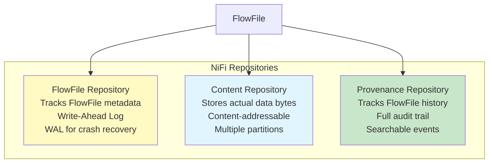
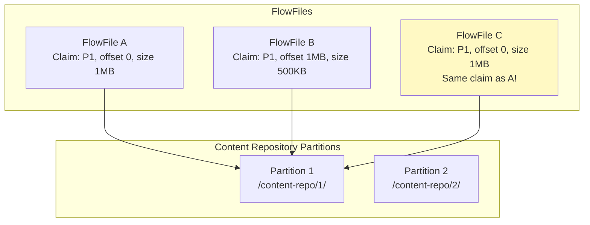
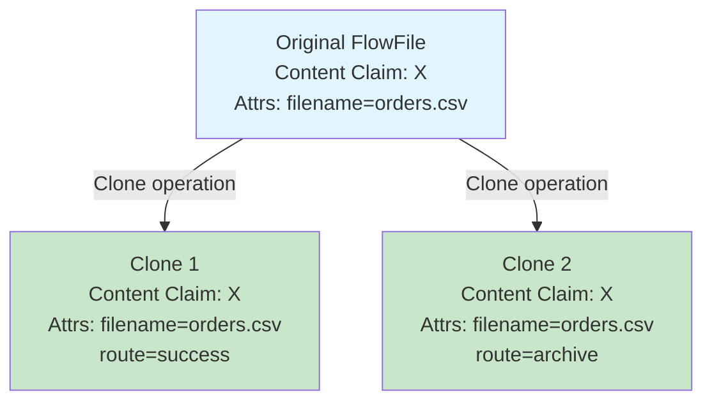
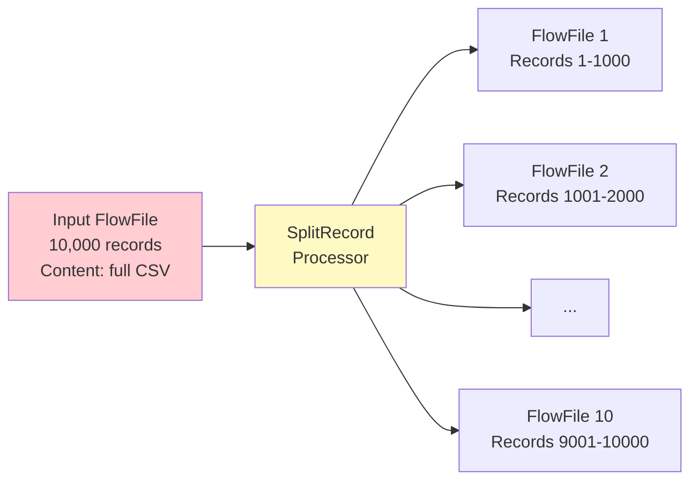
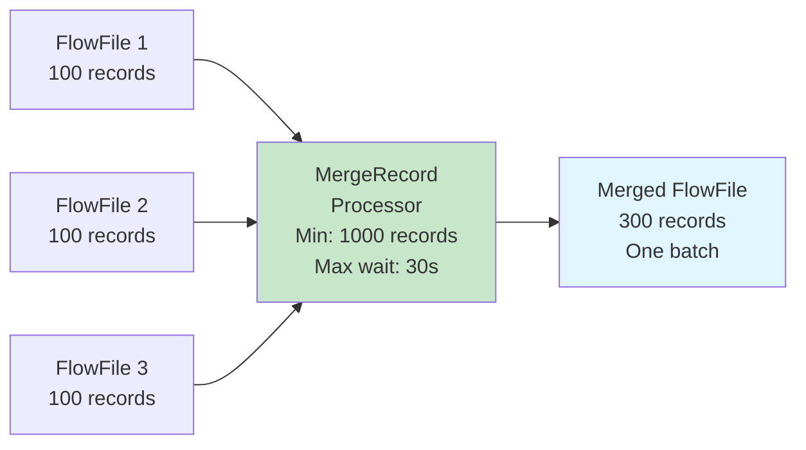
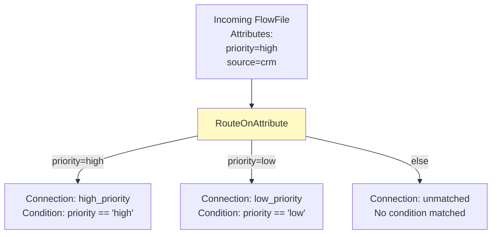

# Apache NiFi FlowFiles — Intermediate Concepts

## Content Repository Deep Dive

The Content Repository is where FlowFile content (data bytes) is physically stored on disk.



### Content Claims



**Key concepts:**
- Content is stored in **container files** (not one file per FlowFile)
- A **content claim** = container ID + offset + length
- **Copy-on-write**: Cloning a FlowFile copies only the claim reference, not the data
- Multiple partitions for I/O parallelism

## FlowFile Cloning

When a processor needs to create a copy (e.g., RouteOnAttribute sends to multiple relationships):



**Cloning is nearly free** — only metadata is duplicated, not the content bytes. The content claim reference count increments. Content is only garbage-collected when no FlowFiles reference it.

## FlowFile Splitting

Split one FlowFile into many (e.g., splitting a 10,000-record CSV into individual records):



```
# Split attributes automatically added:
fragment.identifier = "abc-123"     (groups fragments together)
fragment.index = "0"                (position in original)
fragment.count = "10"               (total fragments)
segment.original.filename = "orders.csv"
```

## FlowFile Merging

Combine multiple FlowFiles back into one (reverse of split, or batching):



**Merge strategies:**
- **Defragment**: Reassemble split FlowFiles (uses fragment.identifier)
- **Bin-Packing**: Combine by size/count thresholds
- **Record-based**: Merge by record count (MergeRecord)

## Attribute Management

### Updating Attributes

```
# UpdateAttribute processor — add or modify attributes:
Processing Rules:
  source.system = "salesforce"
  environment = "production"
  processed_date = "${now():format('yyyy-MM-dd')}"
  record_count = "${record.count}"  # From previous processor
```

### Extracting Attributes from Content

```
# EvaluateJsonPath — extract values from JSON content into attributes:
Input FlowFile content:
  {"customer_id": "C001", "name": "Alice", "amount": 99.99}

Configuration:
  customer_id = $.customer_id
  customer_name = $.name
  order_amount = $.amount

Result: FlowFile gets attributes:
  customer_id = "C001"
  customer_name = "Alice"
  order_amount = "99.99"
```

### Routing on Attributes



## FlowFile Content Manipulation

### Streaming (Preferred)

NiFi processors use **streaming** — content is never fully loaded into memory:

```java
// Processor reads content as a stream (never all in memory):
session.read(flowFile, inputStream -> {
    // Process byte-by-byte or line-by-line
    BufferedReader reader = new BufferedReader(new InputStreamReader(inputStream));
    String line;
    while ((line = reader.readLine()) != null) {
        // Process each line
    }
});

// This handles 100GB files with only MB of memory!
```

### Write-Back Pattern

```java
// Modify content: read old → write new
FlowFile newFlowFile = session.write(flowFile, (inputStream, outputStream) -> {
    // Read from input, transform, write to output
    // Old content claim released when done
});
```

## FlowFile Prioritization

Connections can prioritize which FlowFiles get processed first:

| Prioritizer | Order | Use Case |
|-------------|-------|----------|
| FirstInFirstOutPrioritizer | FIFO (default) | Normal ordering |
| NewestFlowFileFirstPrioritizer | Newest first | Process fresh data first |
| OldestFlowFileFirstPrioritizer | Oldest first | Prevent starvation |
| PriorityAttributePrioritizer | By `priority` attribute | Business-critical first |

```
# Set priority attribute for business-critical routing:
UpdateAttribute:
  priority = "${source.system:equals('payments'):ifElse('1', '5')}"
  
# Connection prioritizer: PriorityAttributePrioritizer
# Result: Payment FlowFiles (priority=1) processed before others (priority=5)
```

## FlowFile Provenance

Every operation on a FlowFile is tracked in the **Provenance Repository**:

| Event Type | What it Tracks |
|-----------|---------------|
| CREATE | FlowFile first enters the system |
| RECEIVE | Received from external system |
| SEND | Sent to external system |
| CLONE | FlowFile was duplicated |
| FORK | Split into multiple FlowFiles |
| JOIN | Multiple merged into one |
| CONTENT_MODIFIED | Content was changed |
| ATTRIBUTES_MODIFIED | Attributes were changed |
| ROUTE | Routed to specific relationship |
| DROP | FlowFile removed from flow |

## Interview Tips

> **Tip 1:** "How does NiFi handle large files without running out of memory?" — Streaming architecture. FlowFile content is stored in the Content Repository on disk, referenced by content claims. Processors read/write via streams (InputSteam/OutputStream), never loading full content into heap memory. A 100GB file uses the same memory as a 1KB file.

> **Tip 2:** "What happens when you clone a FlowFile?" — Only the metadata (attributes) is copied. Both the original and clone reference the SAME content claim in the Content Repository. The claim's reference count increments. Content is only written to disk again if one of them modifies it (copy-on-write). Cloning is O(1) in time and space.

> **Tip 3:** "How does NiFi track data lineage?" — Provenance Repository. Every operation (create, modify, route, send, drop) on every FlowFile is recorded with timestamps, processor IDs, and attribute snapshots. You can trace any piece of data from source to destination, see every transformation it went through, and replay it if needed.
