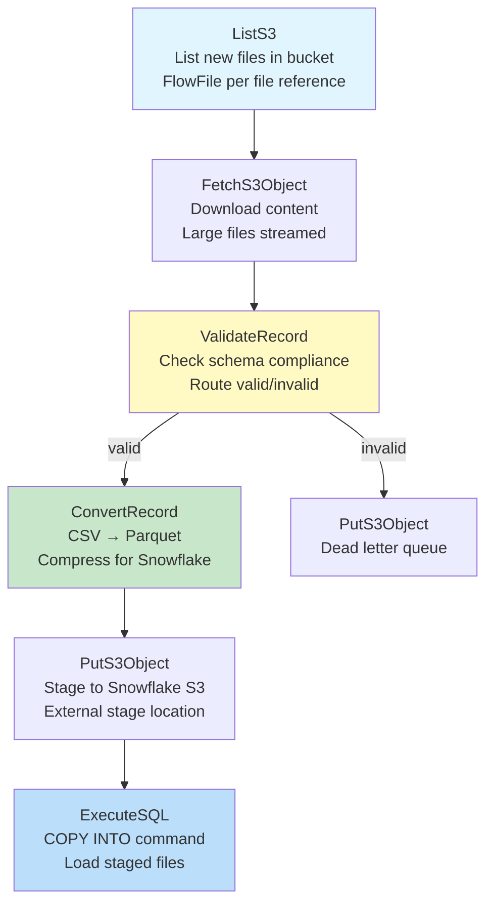
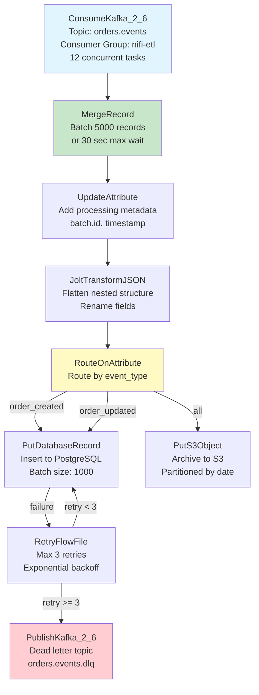
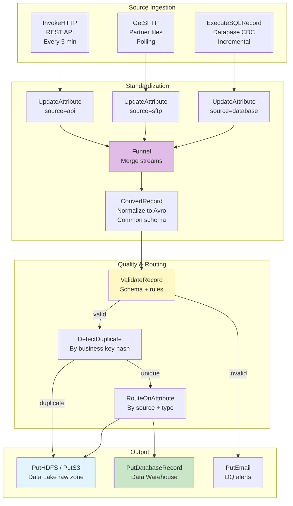
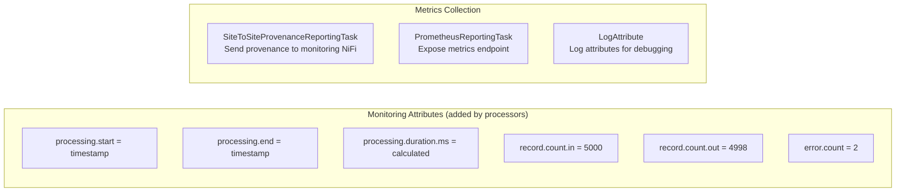

# Apache NiFi FlowFiles — Real-World Production Examples

## Example 1: S3-to-Snowflake ETL Pipeline



### FlowFile Attribute Flow

```
After ListS3:
  filename = "orders_2024-03-15_001.csv.gz"
  s3.bucket = "data-lake-raw"
  s3.key = "landing/orders/2024/03/15/orders_2024-03-15_001.csv.gz"
  s3.lastModified = "1710489600000"
  
After FetchS3Object:
  (same attributes + content now contains the actual CSV data)
  fileSize = "52428800"  (50MB compressed)
  mime.type = "application/gzip"

After ValidateRecord:
  record.count = "125000"
  schema.validation = "valid"
  
After ConvertRecord:
  mime.type = "application/parquet"
  filename = "orders_2024-03-15_001.parquet"
  
After PutS3Object (staging):
  s3.bucket = "snowflake-stage"
  s3.key = "orders/orders_2024-03-15_001.parquet"
  s3.etag = "abc123..."
```

---

## Example 2: Kafka Consumer with Error Handling



### Kafka FlowFile Attributes

```
After ConsumeKafka:
  kafka.topic = "orders.events"
  kafka.partition = "7"
  kafka.offset = "1589234"
  kafka.timestamp = "1710489600123"
  kafka.key = "order-12345"
  kafka.count = "1"
  
After MergeRecord (batched):
  record.count = "5000"
  merge.count = "5000"
  merge.bin.age = "12 seconds"
  fragment.identifier = "batch-uuid-456"
  
After UpdateAttribute:
  batch.id = "nifi-20240315-103000-001"
  processing.timestamp = "2024-03-15T10:30:00Z"
  environment = "production"
  
After RouteOnAttribute:
  (routed to appropriate relationship based on event_type attribute)
  
On Failure (RetryFlowFile):
  retry.count = "1"  → "2" → "3"
  last.error = "Connection refused: PostgreSQL"
  first.failure.time = "2024-03-15T10:30:05Z"
```

---

## Example 3: Multi-Source Data Integration



---

## Example 4: Production FlowFile Monitoring



### Production Attribute Convention

```
# Tracking through pipeline stages:
pipeline.name = "orders-etl-v2"
pipeline.stage = "3-transform"       # Current stage
pipeline.total.stages = "5"

# Timing:
stage.1.ingest.start = "2024-03-15T10:30:00Z"
stage.1.ingest.end = "2024-03-15T10:30:05Z"
stage.2.validate.start = "2024-03-15T10:30:06Z"
stage.2.validate.end = "2024-03-15T10:30:08Z"
stage.3.transform.start = "2024-03-15T10:30:09Z"

# Data quality embedded:
dq.input.records = "5000"
dq.valid.records = "4998"
dq.invalid.records = "2"
dq.null.rate.pct = "0.04"
dq.passed = "true"

# Error tracking:
error.processor = ""                 # Empty = no error
error.message = ""
error.timestamp = ""
retry.count = "0"
retry.max = "3"
```

---

## Best Practices Summary

| Practice | Why |
|----------|-----|
| Batch FlowFiles (1K-10K records each) | Avoid per-FlowFile overhead |
| Use attributes for routing, not content | Faster than parsing content |
| Name attributes with prefixes | `source.`, `dq.`, `routing.` — clarity |
| Keep content in standard formats | Avro/JSON for record-based processing |
| Archive FlowFile content (provenance) | Enables replay for debugging |
| Set back-pressure on every connection | Prevent memory issues |
| Use MergeRecord before external writes | Batch I/O to databases/APIs |
| Log attributes at key decision points | Debugging and audit trail |

## Interview Tips

> **Tip 1:** "Design a production NiFi pipeline for Kafka → Data Warehouse" — ConsumeKafka (concurrent tasks = partition count) → MergeRecord (batch 5000 records, 30s max) → ConvertRecord (to target format) → PutDatabaseRecord (batch size 1000). Error handling: RetryFlowFile (3 attempts, exponential backoff) → PublishKafka to DLQ after max retries. Add UpdateAttribute for tracking metadata throughout.

> **Tip 2:** "How do you handle multiple data sources with different formats?" — Each source gets its own ingestion processor. Add `source` attribute immediately (UpdateAttribute). Funnel to merge streams. ConvertRecord to a common schema (Avro with a unified schema). ValidateRecord ensures all sources conform. Route downstream based on attributes (source, type, priority) — not format-specific logic.

> **Tip 3:** "How do you monitor FlowFile processing in production?" — (1) Embed timing attributes at each stage for SLA tracking. (2) Use PrometheusReportingTask for metrics dashboards. (3) LogAttribute at key points for debugging. (4) Provenance for full audit trail. (5) Bulletin board for processor errors. (6) Monitor connection queue sizes for back-pressure alerts.
