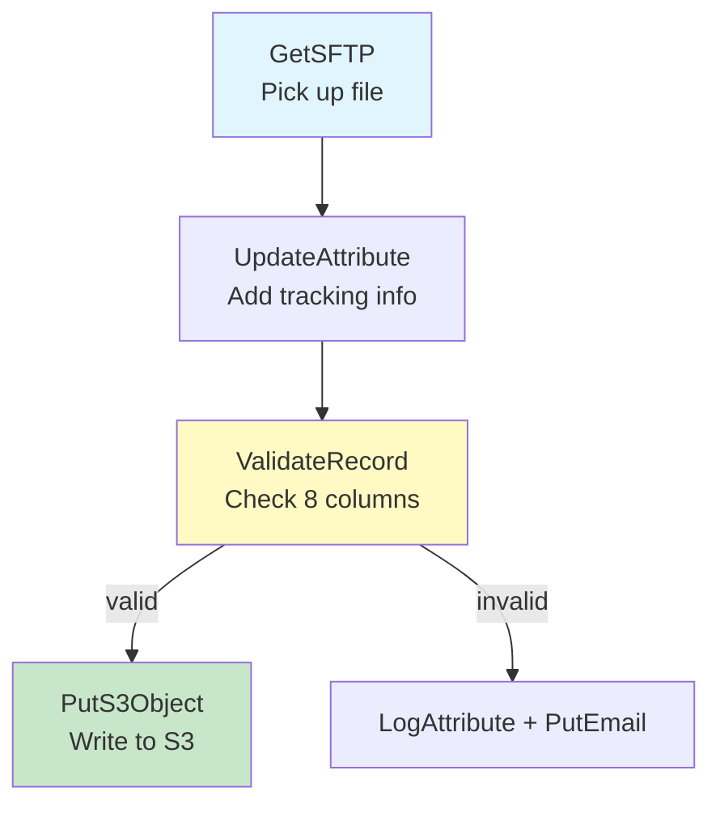
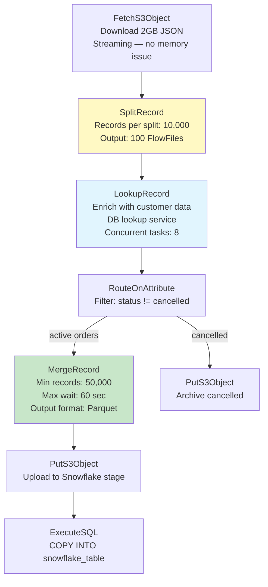
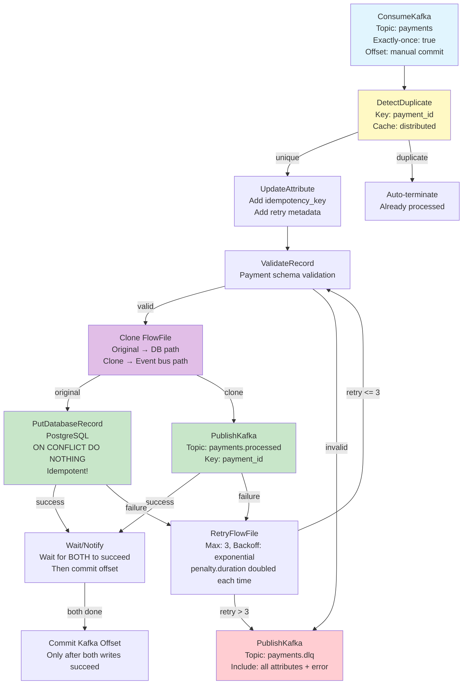

# Scenario Questions — NiFi FlowFiles

<article data-difficulty="junior">

## 🟢 Junior: FlowFile Basics

**Scenario:** You receive a CSV file `customers.csv` (50MB, 500,000 rows) via SFTP. Using NiFi, you need to: (1) pick up the file, (2) add attributes for source tracking, (3) validate that it has the expected 8 columns, and (4) write it to an S3 bucket. Describe the FlowFile at each stage — what are its attributes and content?

<details>
<summary>💡 Hint</summary>
FlowFile starts with: content = CSV bytes, attributes = filename, path, fileSize (auto-set by GetSFTP). You add custom attributes with UpdateAttribute. ValidateRecord checks schema. PutS3Object writes content to S3. Track what the FlowFile looks like at each step.
</details>

<details>
<summary>✅ Solution</summary>



**Stage 1 — After GetSFTP:**
```
FlowFile:
  ATTRIBUTES:
    uuid = "a1b2c3d4-e5f6-7890-abcd-ef1234567890"
    filename = "customers.csv"
    path = "/incoming/"
    fileSize = "52428800"    (50MB)
    mime.type = "text/csv"
    file.lastModifiedTime = "2024-03-15T09:00:00Z"
    
  CONTENT:
    customer_id,name,email,phone,city,state,country,segment
    C001,Alice Smith,alice@co.com,555-0101,New York,NY,US,enterprise
    C002,Bob Jones,bob@co.com,555-0102,Chicago,IL,US,smb
    ... (500,000 rows)
```

**Stage 2 — After UpdateAttribute:**
```
FlowFile:
  ATTRIBUTES (existing + new):
    uuid = "a1b2c3d4-e5f6-7890-abcd-ef1234567890"
    filename = "customers.csv"
    path = "/incoming/"
    fileSize = "52428800"
    mime.type = "text/csv"
    # NEW attributes added:
    source.system = "partner-sftp"
    source.partner = "acme-corp"
    ingestion.timestamp = "2024-03-15T10:30:00Z"
    pipeline.name = "customer-ingestion-v1"
    environment = "production"
    
  CONTENT: (unchanged — same CSV data)
```

**Stage 3 — After ValidateRecord (success):**
```
FlowFile:
  ATTRIBUTES (existing + validation results):
    ... (all previous attributes)
    # NEW attributes from validation:
    record.count = "500000"
    schema.validation.result = "valid"
    record.schema = "customer_schema_v1"
    
  CONTENT: (unchanged — ValidateRecord doesn't modify content on success)
```

**Stage 4 — After PutS3Object:**
```
FlowFile:
  ATTRIBUTES (existing + S3 metadata):
    ... (all previous attributes)
    # NEW attributes from S3 upload:
    s3.bucket = "data-lake-raw"
    s3.key = "customers/2024/03/15/customers.csv"
    s3.etag = "d41d8cd98f00b204e9800998ecf8427e"
    s3.version = "abc123"
    
  CONTENT: (same — content was written to S3 but FlowFile still holds reference)
  
  # After PutS3Object, FlowFile is typically auto-terminated
  # (success relationship with nothing connected = drop FlowFile)
```

**Key Points:**
- FlowFile content (CSV bytes) stays the same throughout — only attributes change
- Each processor adds attributes (source tracking, validation results, S3 metadata)
- Content is streamed to S3 from the Content Repository — never fully in memory
- If validation fails: FlowFile routed to "invalid" relationship → alerting path
- The 50MB file uses constant memory at each processor (streaming I/O)

</details>

</article>

<article data-difficulty="mid-level">

## 🟡 Mid-Level: Split, Process, and Merge

**Scenario:** You receive a 2GB JSON array file from an API containing 1 million order records. You need to: (1) split it into batches of 10,000 records, (2) enrich each batch by looking up customer data from a database, (3) filter out cancelled orders, (4) merge the results back into batches of 50,000 for efficient loading to Snowflake. Design the flow with attention to FlowFile management, attributes, and performance.

<details>
<summary>💡 Hint</summary>
SplitRecord (10K per split) → LookupRecord (DB enrichment) → RouteOnAttribute (filter cancelled) → MergeRecord (50K threshold). Track fragment.identifier for provenance. Consider: concurrent tasks on the lookup step, back-pressure settings, and how MergeRecord regroups.
</details>

<details>
<summary>✅ Solution</summary>



**FlowFile States:**

```
AFTER SPLIT (100 FlowFiles created from 1):
  FlowFile 1:
    filename = "api_orders.json"
    fragment.identifier = "split-uuid-001"
    fragment.index = "0"
    fragment.count = "100"
    record.count = "10000"
    segment.original.filename = "api_orders_2024-03-15.json"
    
  FlowFile 2:
    fragment.identifier = "split-uuid-001"  (same! groups them)
    fragment.index = "1"
    record.count = "10000"
  ...
  FlowFile 100:
    fragment.index = "99"
    record.count = "10000"

AFTER LOOKUP (enriched):
  Each FlowFile now has additional fields IN CONTENT:
  Content before: {"order_id": "O1", "customer_id": "C1", "amount": 99}
  Content after:  {"order_id": "O1", "customer_id": "C1", "amount": 99, 
                   "customer_name": "Alice", "customer_segment": "enterprise"}
  
  Attributes added:
    lookup.matched.count = "9850"
    lookup.unmatched.count = "150"

AFTER ROUTE (filtered):
  Active orders → ~95,000 records across ~95 FlowFiles (10K each)
  Cancelled orders → ~5,000 records across ~5 FlowFiles
  
  Active FlowFile attributes:
    routing.result = "active"

AFTER MERGE (rebatched):
  ~2 FlowFiles (95,000 records / 50,000 = ~2 batches)
  
  FlowFile 1:
    record.count = "50000"
    merge.count = "5"              (5 input FlowFiles merged)
    merge.bin.age = "12 seconds"
    mime.type = "application/parquet"
    filename = "orders_batch_001.parquet"
```

**Performance Configuration:**

```
SplitRecord:
  Records Per Split: 10000
  # Creates manageable chunks for parallel processing
  # 100 FlowFiles × 8 concurrent tasks on LookupRecord = good parallelism

LookupRecord:
  Concurrent Tasks: 8
  # 8 threads doing DB lookups simultaneously
  # Connection pool size must be >= 8
  # Each processes one 10K-record FlowFile at a time

Back-pressure on connection before LookupRecord:
  FlowFile Threshold: 50
  # Only allow 50 FlowFiles to queue (prevents overwhelming DB)
  # SplitRecord will pause when queue is full

MergeRecord:
  Minimum Number of Records: 50000
  Maximum Number of Records: 100000
  Max Bin Age: 60 sec
  # Waits for 50K records OR 60 seconds, whichever comes first
  # Prevents infinite wait if flow volume is low
```

**Key Points:**
- **Split for parallelism**: 10K per FlowFile allows 8 threads on LookupRecord
- **Back-pressure**: Prevents SplitRecord from overwhelming the lookup step
- **Merge for efficiency**: Snowflake loads faster with fewer, larger files (50K vs 10K)
- **Format conversion**: MergeRecord can output Parquet directly (optimal for Snowflake)
- **Fragment tracking**: fragment.identifier groups related FlowFiles for debugging
- **Memory safety**: 2GB input file is STREAMED through SplitRecord (never fully in memory)

</details>

</article>

<article data-difficulty="senior">

## 🔴 Senior: Guaranteed Delivery with Complex Error Handling

**Scenario:** Design a NiFi flow for a financial payments system where: (1) messages arrive from Kafka (10K/sec), (2) each payment must be processed exactly-once (no duplicates, no losses), (3) failed records must be retried 3 times with exponential backoff, (4) after 3 failures, records go to a dead letter queue with full context, (5) successful records must be written to both a database AND an event bus (dual-write), (6) if either write fails, the entire transaction must be retried (not half-written). Explain your FlowFile management strategy.

<details>
<summary>💡 Hint</summary>
Exactly-once requires: idempotent writes (dedup key) + offset management. Dual-write atomicity: process both writes, only commit Kafka offset after BOTH succeed. Use UpdateAttribute for retry tracking. RetryFlowFile for backoff. Clone FlowFile for dual-write (both get same content). Wait for both to complete before acknowledging.
</details>

<details>
<summary>✅ Solution</summary>



**FlowFile Attribute Strategy:**

```
# After ConsumeKafka:
kafka.topic = "payments"
kafka.partition = "5"
kafka.offset = "982341"
kafka.key = "PAY-2024-0315-12345"
kafka.timestamp = "1710489600123"

# After DetectDuplicate:
duplicate.detection.result = "unique"    # or "duplicate"
dedup.cache.key = "PAY-2024-0315-12345"

# After UpdateAttribute (idempotency + retry tracking):
idempotency_key = "${kafka.key}"         # Used for DB upsert
retry.count = "0"
retry.max = "3"
retry.penalty.duration = "5 sec"         # Doubles each retry: 5, 10, 20
first.attempt.time = "${now()}"
processing.id = "${UUID()}"              # Unique per processing attempt

# After Clone:
# Original gets: write.target = "database"
# Clone gets:    write.target = "event_bus"

# On DB failure:
retry.count = "1"                        # Incremented
retry.penalty.duration = "10 sec"        # Doubled
last.error = "Connection timeout: PostgreSQL"
last.error.time = "2024-03-15T10:30:05Z"
last.error.processor = "PutDatabaseRecord"

# On final failure (DLQ):
dlq.reason = "max_retries_exceeded"
dlq.original.topic = "payments"
dlq.original.partition = "5"
dlq.original.offset = "982341"
dlq.total.attempts = "4"                 # 1 original + 3 retries
dlq.first.attempt = "2024-03-15T10:30:00Z"
dlq.last.attempt = "2024-03-15T10:30:35Z"
dlq.errors = "timeout;timeout;connection_refused"
```

**Exactly-Once Strategy:**

```
1. DEDUPLICATION (prevents duplicate processing):
   - DetectDuplicate with distributed cache (DistributedMapCacheServer)
   - Key = kafka.key (payment_id)
   - If seen before → auto-drop (already processed successfully)

2. IDEMPOTENT WRITES (prevents duplicate effects):
   Database: INSERT ... ON CONFLICT (payment_id) DO NOTHING
   Kafka publish: same key → same partition → last write wins (idempotent producer)

3. ATOMIC DUAL-WRITE (both succeed or both retry):
   - Clone FlowFile → send to DB AND event bus in parallel
   - Wait/Notify pattern: only proceed when BOTH return success
   - If either fails: retry the ORIGINAL FlowFile (both paths re-execute)
   - Kafka offset committed ONLY after both writes confirmed
   
4. OFFSET MANAGEMENT:
   - ConsumeKafka with manual offset commit
   - Offset only committed after full processing confirmed
   - On NiFi restart: re-reads from last committed offset
   - Combined with dedup: re-processing is safe (idempotent)
```

**Exponential Backoff Implementation:**

```
RetryFlowFile Processor Configuration:
  Maximum Retries: 3
  Penalty Duration: ${retry.penalty.duration}
  Penalize on Retry: true
  
UpdateAttribute (on retry path):
  retry.count = "${retry.count:plus(1)}"
  retry.penalty.duration = "${retry.penalty.duration:replaceAll('[^0-9]',''):multiply(2)} sec"
  last.error = "${error.message}"
  last.error.time = "${now()}"
  
# Sequence: 5 sec → 10 sec → 20 sec → DLQ
```

**Key Points:**
- **Exactly-once = dedup + idempotent writes + offset management** (not a single feature)
- **Distributed dedup cache**: Shared across NiFi cluster nodes (prevents cross-node duplication)
- **Clone for dual-write**: Both paths get identical FlowFile; both must succeed
- **Exponential backoff**: Stored in FlowFile attributes, doubled each retry
- **DLQ includes full context**: All original attributes + all error history (enables manual replay)
- **Kafka offset commit LAST**: Only after confirmed dual-write success (crash-safe)
- **10K/sec throughput**: ConsumeKafka concurrent tasks = partition count; MergeRecord batches before DB write

</details>

</article>

</content>
