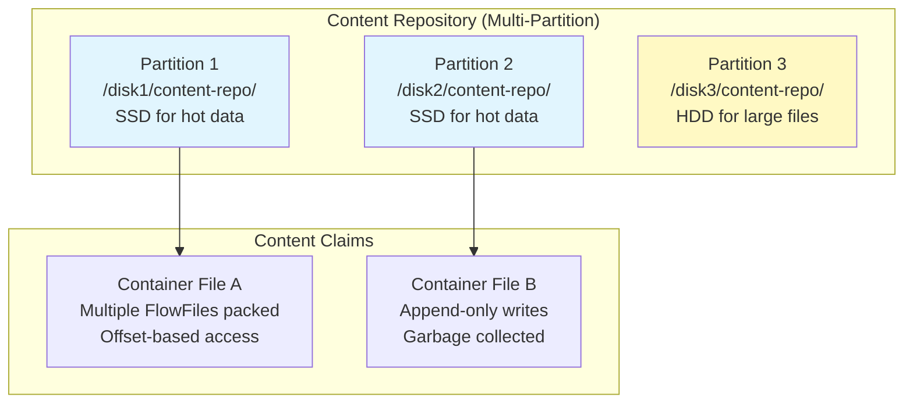
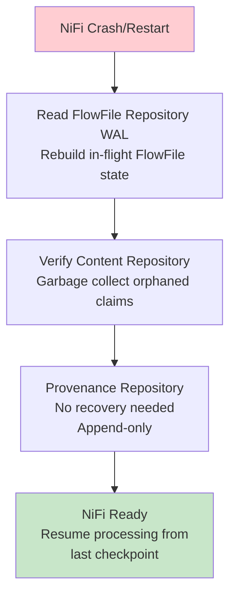
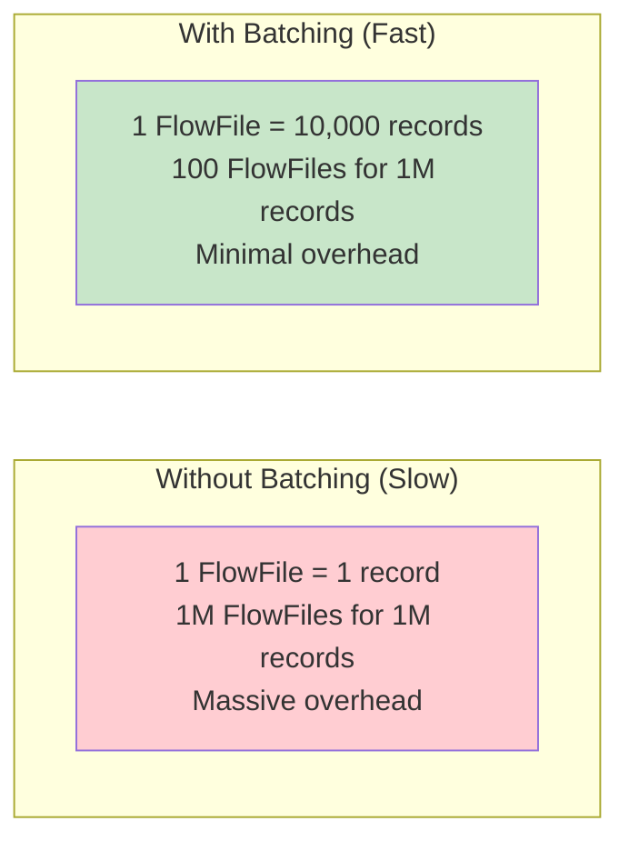
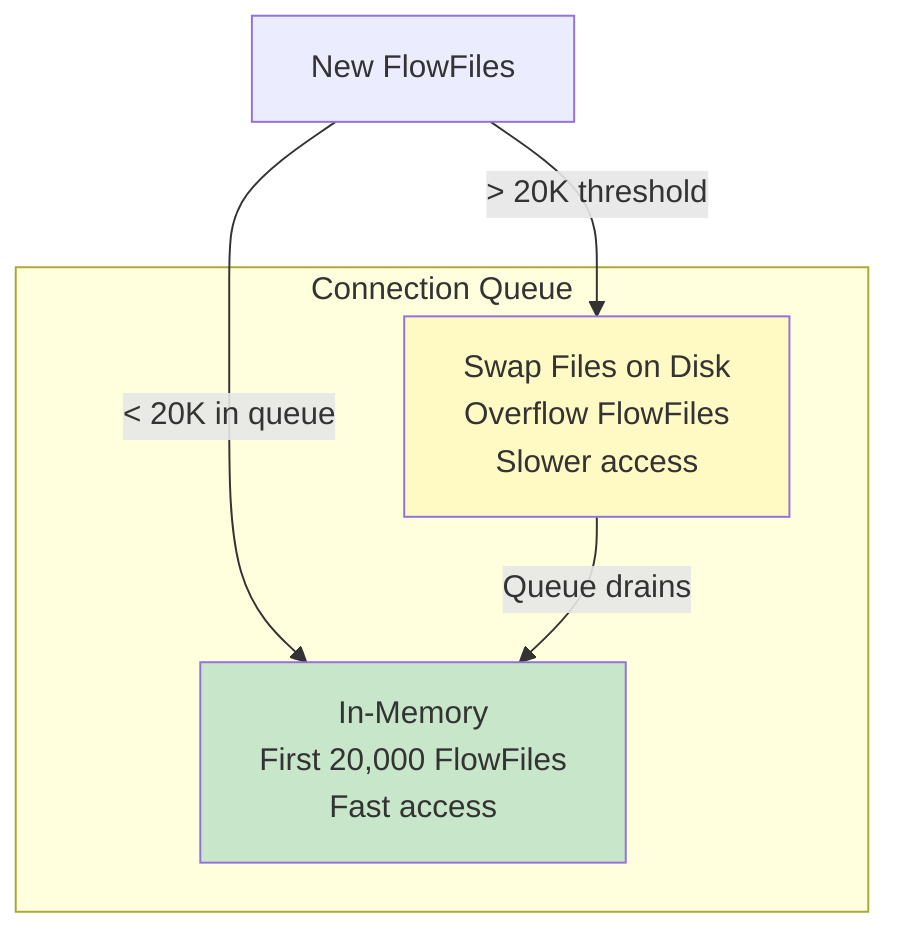
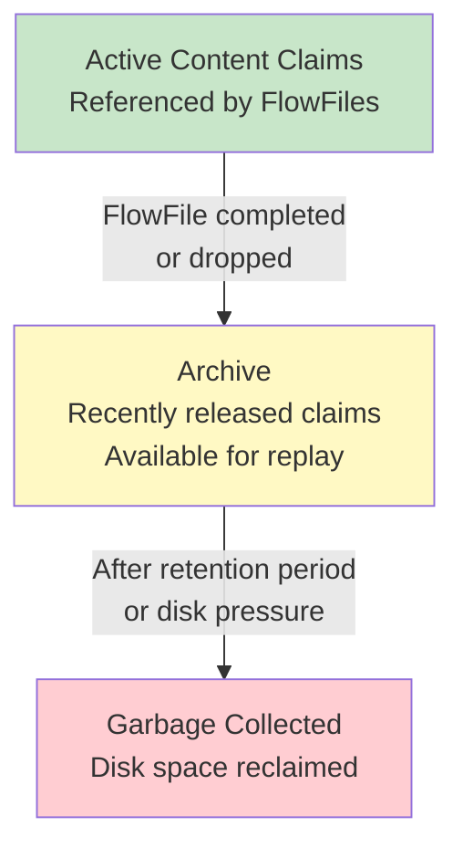

# Apache NiFi FlowFiles — Senior Deep Dive

## Content Repository Architecture



### nifi.properties Configuration

```properties
# Content Repository Configuration
nifi.content.repository.implementation=org.apache.nifi.controller.repository.FileSystemRepository

# Multiple partitions for I/O parallelism:
nifi.content.repository.directory.partition1=/ssd1/nifi/content-repo
nifi.content.repository.directory.partition2=/ssd2/nifi/content-repo
nifi.content.repository.directory.partition3=/hdd1/nifi/content-repo

# Content claim tuning:
nifi.content.claim.max.appendable.size=1 MB    # Max size before new container file
nifi.content.claim.max.flow.files=100          # Max FlowFiles per container file
nifi.content.repository.archive.max.retention.period=24 hours
nifi.content.repository.archive.max.usage.percentage=50%
```

## FlowFile Repository (Write-Ahead Log)

The FlowFile Repository tracks the current state of all FlowFiles in the system using a WAL:

```properties
# FlowFile Repository Configuration
nifi.flowfile.repository.implementation=org.apache.nifi.controller.repository.WriteAheadFlowFileRepository

# WAL checkpoint interval (flush to disk):
nifi.flowfile.repository.checkpoint.interval=20 secs

# Partitions for the WAL:
nifi.flowfile.repository.directory=/fast-ssd/nifi/flowfile-repo

# CRITICAL: This must be on the FASTEST disk (NVMe SSD recommended)
# Every FlowFile state change writes to this WAL
# Disk I/O here directly impacts throughput
```

### Recovery Process



**Guaranteed delivery:** FlowFiles are never lost because:
1. FlowFile state written to WAL before acknowledging to processors
2. Content written to Content Repository before FlowFile state updated
3. On crash: WAL replayed → FlowFiles restored to last known state
4. Unacknowledged FlowFiles re-processed (at-least-once semantics)

## Performance Tuning for High-Throughput

### FlowFile Batching



**Rule of thumb:** Keep FlowFiles between 1KB and 100MB. Avoid millions of tiny FlowFiles (each has metadata overhead in the FlowFile Repository).

### MergeContent for Batching

```
MergeContent Processor:
  Merge Strategy: Bin-Packing Algorithm
  Minimum Number of Entries: 1000
  Maximum Number of Entries: 10000
  Minimum Group Size: 1 MB
  Maximum Group Size: 100 MB
  Max Bin Age: 30 sec
  
# Collects small FlowFiles until threshold → emits one large FlowFile
# Balances latency (30s max wait) vs throughput (batched I/O)
```

### Concurrent Tasks

```properties
# Per-processor concurrency:
# Processor Settings → Concurrent Tasks = 8
# Allows 8 threads to process FlowFiles simultaneously
# Set based on: downstream system limits, CPU cores, I/O capacity

# Example tuning:
# ConsumeKafka: Concurrent Tasks = partition count (e.g., 12)
# PutDatabaseRecord: Concurrent Tasks = connection pool size (e.g., 10)
# ConvertRecord: Concurrent Tasks = CPU cores (e.g., 8)
```

## Swap File Mechanism

When connections hold too many FlowFiles in memory, NiFi **swaps** them to disk:

```properties
# Swap configuration:
nifi.queue.swap.threshold=20000           # FlowFiles in memory before swapping
nifi.swap.manager.implementation=org.apache.nifi.controller.FileSystemSwapManager
nifi.swap.in.period=1 sec                 # How often to swap in
nifi.swap.in.threads=4                    # Threads for swap-in
nifi.swap.out.period=5 sec                # How often to swap out
nifi.swap.out.threads=4                   # Threads for swap-out
```



## Content Archiving and Garbage Collection



```properties
# Archive settings:
nifi.content.repository.archive.enabled=true
nifi.content.repository.archive.max.retention.period=24 hours
nifi.content.repository.archive.max.usage.percentage=50%
# When disk > 50% used: start deleting archived content (oldest first)
# Archived content enables provenance replay (re-send historical FlowFiles)
```

## Custom FlowFile Attributes Pattern (Production)

```
# Standard attribute naming convention for enterprise NiFi:
# Prefix with domain for clarity:

# Source tracking:
source.system = "salesforce"
source.object = "Account"
source.extract.timestamp = "2024-03-15T10:30:00Z"
source.batch.id = "batch-20240315-001"

# Processing tracking:
processing.stage = "silver"          # bronze → silver → gold
processing.validated = "true"
processing.error.count = "0"
processing.start.time = "${now()}"

# Data quality:
dq.null.count = "12"
dq.duplicate.count = "0"
dq.schema.valid = "true"

# Routing:
routing.priority = "1"
routing.destination = "snowflake"
routing.retry.count = "0"
```

## Interview Tips

> **Tip 1:** "How does NiFi guarantee no data loss?" — Three repositories working together: (1) FlowFile Repository (WAL) records every FlowFile state change before acknowledging. (2) Content Repository stores data on disk before FlowFile state advances. (3) On crash, WAL is replayed to restore FlowFiles to last checkpointed state. Result: at-least-once delivery guarantee.

> **Tip 2:** "How do you tune NiFi for high throughput?" — (1) Batch small FlowFiles (MergeContent: 1000-10000 records per FlowFile). (2) Increase concurrent tasks per processor (match to downstream capacity). (3) Put FlowFile Repository on fastest disk (NVMe SSD). (4) Multiple Content Repository partitions across disks. (5) Avoid single-record FlowFiles (metadata overhead per FlowFile dominates).

> **Tip 3:** "What is the swap mechanism?" — When a connection queue exceeds the swap threshold (default 20,000 FlowFiles), overflow is serialized to disk swap files. Prevents OOM but adds latency. To avoid swapping: tune back-pressure thresholds, increase processing speed, or add more NiFi nodes. Swap files are transparent to the flow — processors don't know if a FlowFile was swapped.

## ⚡ Cheat Sheet

**Core NiFi concepts**
```
FlowFile:    unit of data (content + attributes map)
Processor:   transforms/routes FlowFiles (GetFile, PutS3Object, RouteOnAttribute, etc.)
Connection:  queue between processors with back-pressure settings
Process Group: logical grouping of processors (like a subflow)
Controller Service: shared resource (DBCPConnectionPool, SSLContextService, etc.)
```

**Back-pressure settings**
```
Back Pressure Object Threshold: max FlowFiles in queue before upstream pauses
Back Pressure Data Size Threshold: max bytes in queue before upstream pauses
Typical: 10,000 objects / 1 GB — tune based on downstream throughput
When both thresholds hit → upstream processor stops scheduling
```

**Expression Language (attribute-based routing)**
```
${filename}                    — attribute value
${filename:toUpper()}          — uppercase
${fileSize:gt(1000000)}        — > 1 MB (returns true/false)
${filename:startsWith('order')} — prefix check
${now():format('yyyy-MM-dd')}  — current date
${uuid()}                      — generate UUID
${field.value:trim():toLower()} — chain functions
```

**Key processors**
```
GetFile / ListFile + FetchFile  — ingest from filesystem
GetSFTP / PutSFTP               — SFTP in/out
GetKafka / PublishKafka         — Kafka consumer/producer
ExecuteSQL / QueryDatabaseTable — SQL source
PutDatabaseRecord               — write to RDBMS
MergeContent                    — batch small files into larger ones
SplitRecord / SplitText         — split large FlowFiles
RouteOnAttribute / RouteOnContent — conditional routing
ConvertRecord                   — CSV ↔ JSON ↔ Avro ↔ Parquet
```

**Record-based processing**
```
Record Reader + Record Writer → schema-aware processing
Avoids row-by-row FlowFile per record — bulk processing in one FlowFile
Readers: CSVReader, JsonTreeReader, AvroReader, ParquetReader
Writers: CSVRecordSetWriter, JsonRecordSetWriter, ParquetRecordSetWriter
Schema: from Schema Registry (Confluent), from attribute, or inferred
```

**Clustering (NiFi cluster)**
```
Zero-Master: all nodes are peers; one elected Coordinator via ZooKeeper
Primary Node: handles scheduled processors once per cluster (GetFile, etc.)
Load balancing: connections can load-balance FlowFiles across nodes
State Provider: ZooKeeper stores distributed state (watermarks, offsets)
```

**Provenance (lineage)**
```
Every FlowFile event recorded: RECEIVE, SEND, FETCH, DROP, FORK, JOIN, CONTENT_MODIFIED
Searchable by: filename, UUID, attribute, component, time range
Replay: any FlowFile can be replayed from any point in provenance chain
Retention: configurable (default 24h); archive to external storage for longer
```

**Key interview points**
- NiFi is best for: heterogeneous data ingestion, protocol translation, low-code ETL
- Not ideal for: complex transformations (use Spark/dbt), high-throughput ML pipelines
- Site-to-Site (S2S): secure data transfer between NiFi instances (no Kafka needed)
- MiNiFi: lightweight NiFi agent for edge devices (IoT, network equipment)
- NiFi vs Kafka: NiFi = data routing/transformation; Kafka = durable messaging queue
