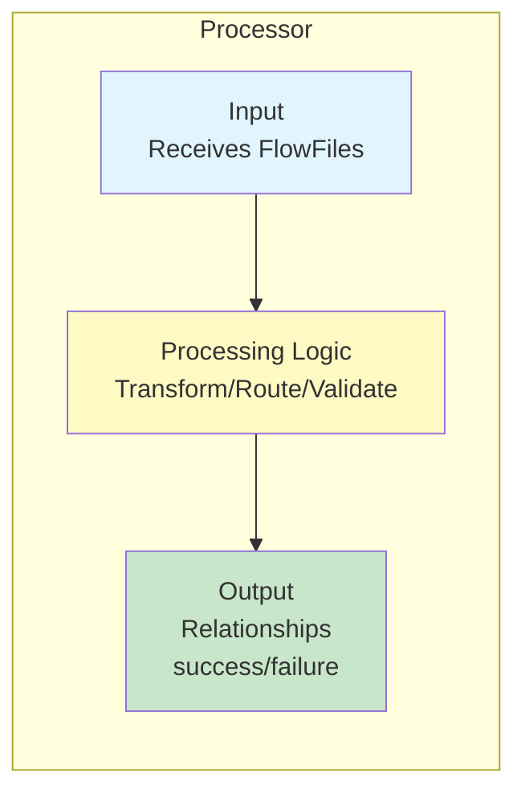
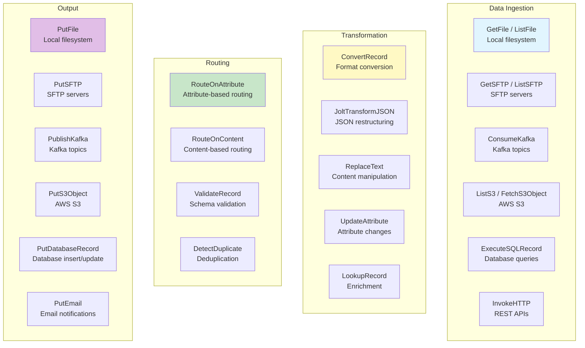
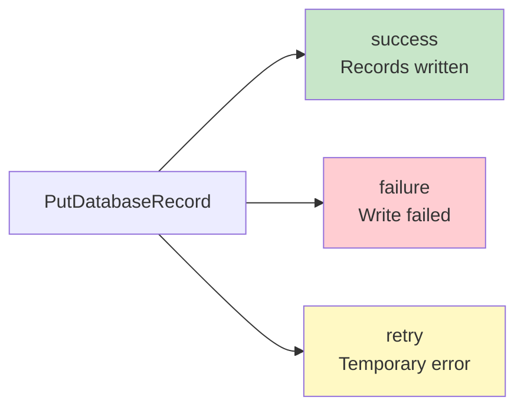

# Apache NiFi Processors — Fundamentals

## What is a Processor?

A processor is the **building block** of NiFi data flows. Each processor performs a specific operation on FlowFiles — ingesting, transforming, routing, or outputting data.



NiFi ships with **300+ built-in processors** covering most data integration needs.

## Processor Categories



## Essential Ingestion Processors

### GetFile / ListFile + FetchFile

```
GetFile — picks up files and deletes source (simple):
  Input Directory: /data/incoming
  File Filter: .*\.csv
  Keep Source File: false
  
ListFile + FetchFile — list then fetch (scalable, clustered):
  ListFile:
    Input Directory: /data/incoming
    # Emits FlowFile per discovered file (metadata only!)
  FetchFile:
    # Downloads actual content based on ListFile metadata
    # Supports distributed processing in NiFi cluster
```

### ConsumeKafka

```
ConsumeKafka_2_6:
  Kafka Brokers: broker1:9092,broker2:9092
  Topic Name(s): orders.events
  Group ID: nifi-consumer-group
  Offset Reset: latest
  Key Deserializer: String
  Value Deserializer: String (or Avro, JSON)
  Max Poll Records: 10000
  # Concurrent Tasks: set to number of partitions for max parallelism
```

### ListS3 + FetchS3Object

```
ListS3:
  Bucket: data-lake-raw
  Prefix: landing/orders/
  Region: us-east-1
  # Emits one FlowFile per S3 object found (metadata only)
  
FetchS3Object:
  Bucket: ${s3.bucket}          # From ListS3 attributes
  Object Key: ${s3.key}         # From ListS3 attributes
  Region: us-east-1
  # Downloads the actual content
```

### InvokeHTTP

```
InvokeHTTP:
  HTTP Method: GET
  Remote URL: https://api.example.com/orders?date=${now():format('yyyy-MM-dd')}
  # Authentication via controller service (see later topics)
  # Response becomes FlowFile content
  # HTTP status → attribute: invokehttp.status.code
```

## Essential Transformation Processors

### ConvertRecord

Converts between data formats using Record Reader + Record Writer:

```
ConvertRecord:
  Record Reader: CSVReader           # Input format
  Record Writer: JsonRecordSetWriter  # Output format
  
# Input (CSV):
order_id,customer,amount
1001,Alice,99.99
1002,Bob,49.50

# Output (JSON):
[
  {"order_id": "1001", "customer": "Alice", "amount": 99.99},
  {"order_id": "1002", "customer": "Bob", "amount": 49.50}
]
```

### UpdateAttribute

Add or modify FlowFile attributes:

```
UpdateAttribute:
  Properties:
    environment = "production"
    processed_date = "${now():format('yyyy-MM-dd')}"
    source_system = "shopify"
    filename = "${filename:substringBefore('.')}_processed.${filename:substringAfter('.')}"
```

### JoltTransformJSON

Restructure JSON using Jolt spec:

```json
// Input:
{"order": {"id": 1001, "items": [{"sku": "A1", "qty": 2}]}}

// Jolt Spec (flatten):
[{
  "operation": "shift",
  "spec": {
    "order": {
      "id": "order_id",
      "items": {
        "*": {
          "sku": "items[&1].product_sku",
          "qty": "items[&1].quantity"
        }
      }
    }
  }
}]

// Output:
{"order_id": 1001, "items": [{"product_sku": "A1", "quantity": 2}]}
```

## Essential Routing Processors

### RouteOnAttribute

Route FlowFiles based on attribute conditions:

```
RouteOnAttribute:
  Routing Strategy: Route to Property name
  
  Properties:
    high_priority = ${priority:equals('high')}
    us_orders = ${region:equals('US')}
    large_batch = ${record.count:gt(10000)}
    
# FlowFile routed to first matching relationship
# "unmatched" relationship for FlowFiles matching nothing
```

### ValidateRecord

Check content against a schema:

```
ValidateRecord:
  Record Reader: JsonTreeReader
  Record Writer: JsonRecordSetWriter
  Schema Access Strategy: Schema Name
  Schema Name: order_schema_v1
  Allow Extra Fields: false
  Strict Type Checking: true
  
# Relationships:
#   valid → schema-compliant records
#   invalid → records that fail validation
```

## Essential Output Processors

### PutDatabaseRecord

Write records to a database:

```
PutDatabaseRecord:
  Record Reader: AvroReader
  Database Connection Pooling Service: PostgreSQL_Pool
  Statement Type: INSERT
  Table Name: silver.orders
  # Relationships: success, failure, retry
```

### PutS3Object

Upload to S3:

```
PutS3Object:
  Bucket: data-lake-processed
  Object Key: orders/${now():format('yyyy/MM/dd')}/${filename}
  Region: us-east-1
  Storage Class: Standard
  Server Side Encryption: AES256
```

## Processor Configuration

Every processor has:

| Setting | Purpose |
|---------|---------|
| **Scheduling** | Timer-driven (every X seconds) or Cron-driven |
| **Concurrent Tasks** | Number of threads (parallelism) |
| **Run Schedule** | How often to trigger |
| **Penalty Duration** | How long to wait after failure before retry |
| **Yield Duration** | How long processor yields when no work available |
| **Bulletin Level** | Log level for processor messages |

```
Example - ConsumeKafka scheduling:
  Scheduling Strategy: Timer Driven
  Run Schedule: 0 sec          (continuous)
  Concurrent Tasks: 12         (one per Kafka partition)
  Penalty Duration: 30 sec
  Yield Duration: 1 sec
```

## Processor Relationships



**Rules:**
- Every relationship MUST be either connected to another processor OR auto-terminated
- Auto-terminate = FlowFiles reaching this relationship are dropped
- Unconnected relationships cause the processor to not start (error!)

## Interview Tips

> **Tip 1:** "Name the most important NiFi processors" — Ingestion: ConsumeKafka, ListS3+FetchS3Object, InvokeHTTP. Transformation: ConvertRecord, JoltTransformJSON, UpdateAttribute, LookupRecord. Routing: RouteOnAttribute, ValidateRecord. Output: PutDatabaseRecord, PutS3Object, PublishKafka. These cover 90% of production data flows.

> **Tip 2:** "List vs. Get pattern?" — GetFile picks up AND removes the source file (simple, single-node). ListFile + FetchFile separates listing from fetching — enables distributed processing in a NiFi cluster (ListFile runs on primary node, FetchFile runs on all nodes). Always use List+Fetch for production/cluster environments.

> **Tip 3:** "How do you convert between formats?" — ConvertRecord processor with a Record Reader (input format) and Record Writer (output format). Supports: CSV, JSON, Avro, Parquet, XML, and more. You can go CSV→Avro, JSON→Parquet, etc. in one processor. Schema can be embedded, referenced from Schema Registry, or inferred.
