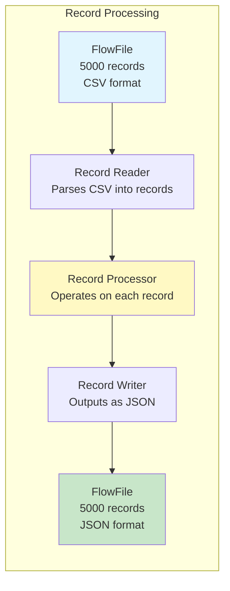
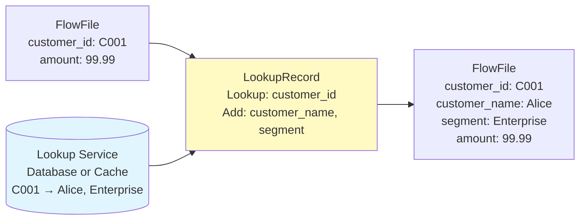
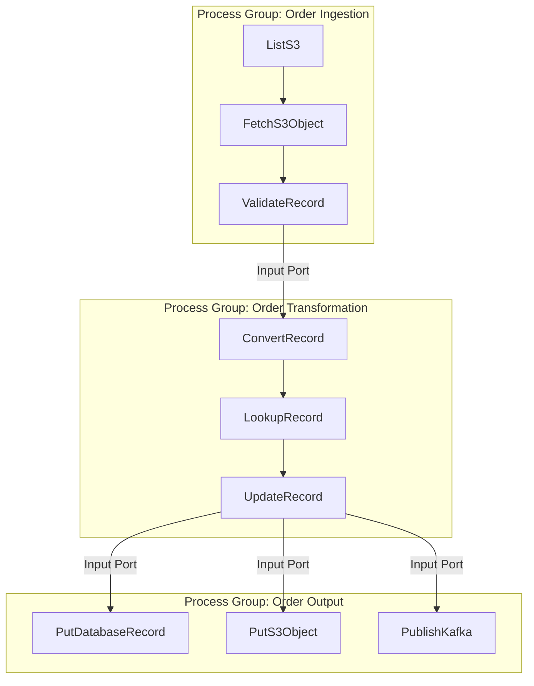
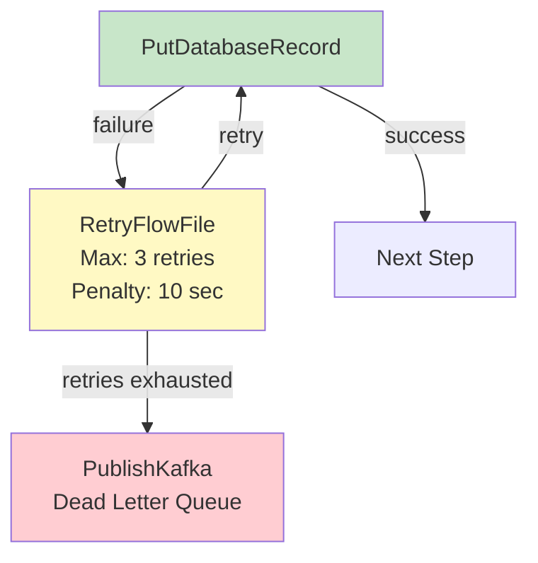

# Apache NiFi Processors — Intermediate Concepts

## Record-Based Processors

Record processors work on **individual records within a FlowFile** (not the FlowFile as a whole). They use Record Reader + Record Writer services.



### Key Record Processors

| Processor | Purpose | Example |
|-----------|---------|---------|
| ConvertRecord | Change format | CSV → JSON, JSON → Avro |
| QueryRecord | SQL on FlowFile content | `SELECT * WHERE amount > 100` |
| UpdateRecord | Modify field values | Set status = 'processed' |
| LookupRecord | Enrich from external source | Add customer_name from DB |
| ValidateRecord | Schema validation | Reject if missing required fields |
| SplitRecord | Split into smaller batches | 1M records → 100 × 10K |
| MergeRecord | Combine into larger batches | 100 × 10K → 1 × 1M |
| PartitionRecord | Split by field value | Group by region |

### QueryRecord (SQL on FlowFile Data)

```sql
-- QueryRecord lets you run SQL DIRECTLY on FlowFile content!
-- No database needed — processes in-memory.

-- Configuration:
--   Record Reader: CSVReader
--   Record Writer: JsonRecordSetWriter
--   Custom Properties (each becomes a relationship):

high_value_orders:
  SELECT * FROM FLOWFILE WHERE amount > 1000

us_only:
  SELECT order_id, customer, amount 
  FROM FLOWFILE 
  WHERE region = 'US'

summary:
  SELECT region, COUNT(*) as order_count, SUM(amount) as total
  FROM FLOWFILE
  GROUP BY region
```

### LookupRecord (Enrichment)



```
LookupRecord Configuration:
  Record Reader: JsonTreeReader
  Record Writer: JsonRecordSetWriter
  Lookup Service: DatabaseLookupService (or SimpleDatabaseLookupService)
  Result RecordPath: /customer_name    # Where to put lookup result
  Key: /customer_id                    # Field to lookup by
  
Lookup Service (SimpleDatabaseLookupService):
  Database Connection: PostgreSQL_Pool
  Table Name: dim_customer
  Lookup Key Column: customer_id
  Lookup Value Columns: customer_name, segment
```

### PartitionRecord

Split FlowFile content by field value (like GROUP BY):

```
PartitionRecord:
  Record Reader: JsonTreeReader
  Record Writer: JsonRecordSetWriter
  Partition Fields: region
  
# Input: 1 FlowFile with 10,000 records (mixed regions)
# Output: Multiple FlowFiles, one per region value:
#   FlowFile 1: region=US (3000 records), attribute: partition.region=US
#   FlowFile 2: region=EU (4000 records), attribute: partition.region=EU
#   FlowFile 3: region=APAC (3000 records), attribute: partition.region=APAC
```

## Processor Scheduling Deep Dive

### Timer Driven

```
Run Schedule: 5 sec
# Processor triggers every 5 seconds
# For polling sources: check for new data every 5 sec

Run Schedule: 0 sec  
# Run continuously (as fast as possible)
# For transformation processors: process immediately when FlowFiles arrive
```

### Cron Driven

```
Run Schedule: 0 0 6 * * ?
# Run at 6:00 AM every day (standard cron expression)
# For scheduled extractions: daily reports, hourly syncs

Run Schedule: 0 */15 * * * ?
# Every 15 minutes
```

### Event Driven (NiFi 2.x)

```
# Processor runs ONLY when a FlowFile arrives (no polling!)
# Most efficient for transformation processors
# Reduces unnecessary CPU usage
```

## Processor State Management

Some processors need to track state between executions:

```
# ListS3 tracks: "last file I listed" (to avoid re-listing)
# State stored locally (node-specific) or in cluster (shared)

ListS3 State:
  Scope: CLUSTER  (shared across NiFi cluster nodes)
  State:
    listing.timestamp = "1710489600000"
    # Only lists S3 objects newer than this timestamp

ConsumeKafka State:
  # Kafka manages offsets externally (consumer group)
  # NiFi doesn't need internal state for Kafka

ExecuteSQLRecord State:
  Scope: LOCAL
  State:
    maximum.value = "2024-03-15 10:30:00"
    # Incremental: SELECT * WHERE updated_at > ${maximum.value}
```

## Processor Groups

Logical containers for organizing related processors:



**Benefits:**
- Visual organization (collapse/expand)
- Reusability (copy entire groups)
- Variable scoping (variables defined per group)
- Access control (permissions per group)
- Versioning (NiFi Registry integration)

## Error Handling Patterns

### Retry Pattern



### Rollback Pattern

```
# For processors that support transactions:
PutDatabaseRecord:
  Rollback On Failure: true
  # If ANY record fails → entire batch rolled back
  # FlowFile sent to failure relationship (retryable)
  
# For non-transactional processors:
# Split into smaller batches first → limit blast radius
```

## Processor Performance Tips

| Tip | Explanation |
|-----|-------------|
| Set Concurrent Tasks wisely | Match to downstream capacity (DB connections, Kafka partitions) |
| Use Record processors | Process 1000s of records per FlowFile (not 1 FlowFile per record) |
| Batch before output | MergeRecord before PutDatabaseRecord (batch inserts are faster) |
| Avoid unnecessary copies | Use RouteOnAttribute instead of reading content when possible |
| Tune Run Schedule | 0 sec for transformers (react immediately), 5-30 sec for pollers |

## Interview Tips

> **Tip 1:** "What are record-based processors?" — Processors that operate on individual records WITHIN a FlowFile (not the FlowFile as a whole). They use Record Reader/Writer services for format-aware processing. Examples: ConvertRecord, QueryRecord, LookupRecord, PartitionRecord. Key advantage: one FlowFile can contain 100K records, all processed efficiently without splitting.

> **Tip 2:** "How does QueryRecord work?" — It lets you run SQL queries directly on FlowFile content (no external database needed!). Define multiple queries as properties — each becomes a relationship. Enables filtering (WHERE), projection (SELECT specific columns), aggregation (GROUP BY), and joining. Perfect for in-flow data transformation.

> **Tip 3:** "How do you handle processor failures?" — RetryFlowFile processor with exponential backoff (max retries + penalty duration). After exhausting retries → route to dead letter queue (PublishKafka or PutS3Object to DLQ). For transactional processors: enable rollback-on-failure to prevent partial writes. Always log error details in FlowFile attributes for debugging.
