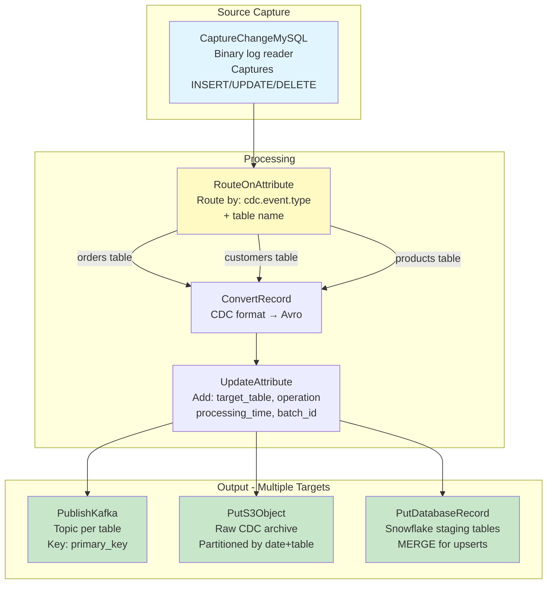
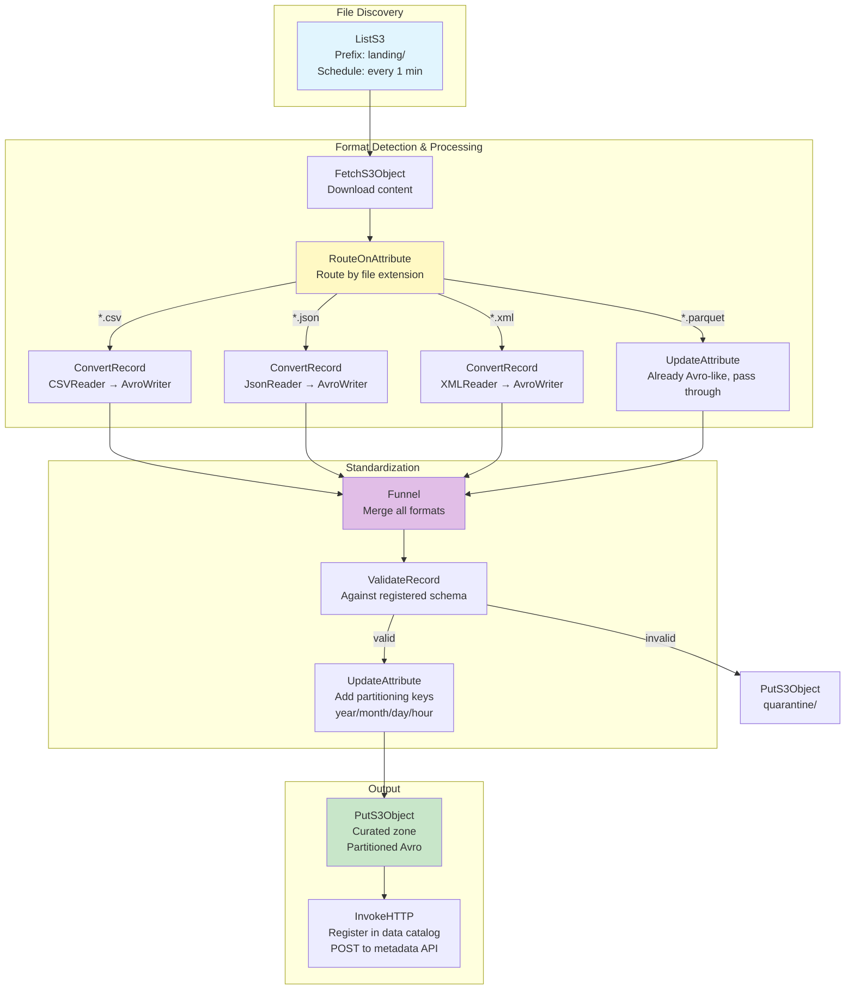

# Apache NiFi Processors — Real-World Production Examples

## Example 1: CDC Database Replication Pipeline



### Processor Configuration Details

```
CaptureChangeMySQL:
  MySQL Hosts: mysql-primary:3306
  Username: nifi_replication
  Distributed Map Cache Client: cluster-cache
  Include Begin/Commit: false
  Output as Records: true
  # State tracked: binlog filename + position
  # Survives NiFi restarts (state stored in cluster)

RouteOnAttribute:
  orders_table = ${cdc.table.name:equals('orders')}
  customers_table = ${cdc.table.name:equals('customers')}
  # Each table can have different downstream processing

ConvertRecord:
  Record Reader: CaptureChangeRecordReader
  Record Writer: AvroRecordSetWriter
  # Schema from Schema Registry (Confluent or NiFi internal)

UpdateAttribute:
  target_table = "staging.${cdc.table.name}"
  operation = "${cdc.event.type}"          # insert, update, delete
  cdc_timestamp = "${cdc.event.timestamp}"
  batch_id = "${UUID()}"
  
PublishKafka_2_6:
  Topic Name: cdc.${cdc.table.name}        # Dynamic topic per table!
  Kafka Key: ${cdc.primary.key.value}
  Delivery Guarantee: EXACTLY_ONCE
```

---

## Example 2: REST API Ingestion with Pagination

```mermaid
graph TD
    GEN[GenerateFlowFile<br>Trigger every 5 min<br>Empty FlowFile]
    
    INIT[UpdateAttribute<br>page=1, has_more=true<br>api_url=https://api.example.com/orders]
    
    INVOKE["InvokeHTTP<br>GET ${api_url}?page=${page}&limit=1000<br>Auth: Bearer token"]
    
    CHECK[EvaluateJsonPath<br>Extract: total_pages, current_page<br>from response headers]
    
    ROUTE[RouteOnAttribute<br>has_more = current_page < total_pages]
    
    NEXT["UpdateAttribute<br>page = ${page:plus(1)}"]
    
    EXTRACT[SplitJson<br>Extract records array<br>$.data[*]]
    
    MERGE_OUT[MergeRecord<br>Batch 10,000 records]
    
    OUTPUT[PutS3Object<br>Data lake landing zone]
    
    GEN --> INIT --> INVOKE --> CHECK --> ROUTE
    ROUTE -->|"has more pages"| NEXT --> INVOKE
    ROUTE -->|"last page"| EXTRACT
    CHECK --> EXTRACT
    EXTRACT --> MERGE_OUT --> OUTPUT
    
    style GEN fill:#e1f5fe
    style INVOKE fill:#fff9c4
    style OUTPUT fill:#c8e6c9
```

```
InvokeHTTP:
  HTTP Method: GET
  Remote URL: ${api_url}?page=${page}&per_page=1000&since=${last_sync}
  # Authorization handled by StandardOAuth2TokenProvider controller service
  
  # Response → FlowFile content (JSON response body)
  # Status code → invokehttp.status.code attribute
  # Rate limit headers → attributes for throttling

# Handle rate limiting:
RouteOnAttribute (after InvokeHTTP):
  rate_limited = ${invokehttp.status.code:equals('429')}
  
# If rate limited:
UpdateAttribute:
  retry_after = ${invokehttp.response.header.Retry-After:ifElse(${invokehttp.response.header.Retry-After}, '60')}
  
# ControlRate processor: limit to 100 requests/minute
ControlRate:
  Rate Control Criteria: flowfile count
  Maximum Rate: 100
  Time Duration: 1 min
```

---

## Example 3: Multi-Format Data Lake Ingestion



```
RouteOnAttribute (format detection):
  csv_files = ${filename:toLower():endsWith('.csv')}
  json_files = ${filename:toLower():endsWith('.json'):or(${filename:toLower():endsWith('.jsonl')})}
  xml_files = ${filename:toLower():endsWith('.xml')}
  parquet_files = ${filename:toLower():endsWith('.parquet')}
  # unmatched → quarantine (unknown format)

# Each ConvertRecord uses appropriate reader:
ConvertRecord (CSV path):
  Record Reader: CSVReader (with header, auto-detect types)
  Record Writer: AvroRecordSetWriter (schema from registry)
  
# Partitioning attributes:
UpdateAttribute:
  partition.year = "${now():format('yyyy')}"
  partition.month = "${now():format('MM')}"
  partition.day = "${now():format('dd')}"
  partition.hour = "${now():format('HH')}"
  target.key = "curated/${source.system}/${partition.year}/${partition.month}/${partition.day}/${filename:substringBefore('.')}.avro"
```

---

## Example 4: Real-Time Alerting Pipeline

```
# Pattern: Detect anomalies and alert within seconds

ConsumeKafka (metrics topic)
  → QueryRecord (detect threshold breaches):
    "SELECT * FROM FLOWFILE WHERE cpu_pct > 90 OR error_rate > 5.0"
  → UpdateAttribute (format alert):
    alert.severity = "${error_rate:gt(10):ifElse('critical','warning')}"
    alert.message = "Host ${hostname}: CPU=${cpu_pct}%, Errors=${error_rate}/min"
  → RouteOnAttribute:
    critical = ${alert.severity:equals('critical')}
    warning = ${alert.severity:equals('warning')}
  → PutSlack (critical) / PutEmail (warning)
  
# End-to-end latency: < 5 seconds from metric emission to alert
```

---

## Production Processor Selection Guide

| Use Case | Recommended Processors | Why |
|----------|----------------------|-----|
| Database CDC | CaptureChangeMySQL / QueryDatabaseTableRecord | Real-time / incremental capture |
| File ingestion | ListS3 + FetchS3Object | Scalable, cluster-friendly |
| API integration | GenerateFlowFile + InvokeHTTP + Loop | Pagination support |
| Format conversion | ConvertRecord | Native, schema-aware, fast |
| Data enrichment | LookupRecord + DBCPService | Bulk lookup with caching |
| Data quality | ValidateRecord + QueryRecord | Schema validation + rule checks |
| Batching for output | MergeRecord (count/size threshold) | Efficient bulk writes |
| Multi-target output | Clone + route to each target | Same data to multiple sinks |
| Error handling | RetryFlowFile + UpdateAttribute | Exponential backoff + context |

## Interview Tips

> **Tip 1:** "Design a CDC pipeline in NiFi" — CaptureChangeMySQL (reads binlog) → RouteOnAttribute (by table) → ConvertRecord (CDC format → Avro) → PublishKafka (topic per table, key = primary key). State management: binlog position tracked in NiFi cluster state. Output to: Kafka (real-time consumers), S3 (archive), Snowflake (staging for MERGE).

> **Tip 2:** "How do you handle REST API pagination in NiFi?" — Loop pattern: GenerateFlowFile (trigger) → UpdateAttribute (page=1) → InvokeHTTP → EvaluateJsonPath (extract pagination info) → RouteOnAttribute (has_more_pages?) → UpdateAttribute (page++) → back to InvokeHTTP. Add ControlRate to respect API rate limits. Collect pages → MergeRecord for output.

> **Tip 3:** "How do you handle multiple file formats landing in the same bucket?" — RouteOnAttribute based on filename extension (`.csv`, `.json`, `.parquet`). Each route has appropriate ConvertRecord with the matching Reader. All routes converge at a Funnel → ValidateRecord against a unified Avro schema. Invalid → quarantine. Valid → standardized output. This "format normalization" pattern handles heterogeneous sources cleanly.
