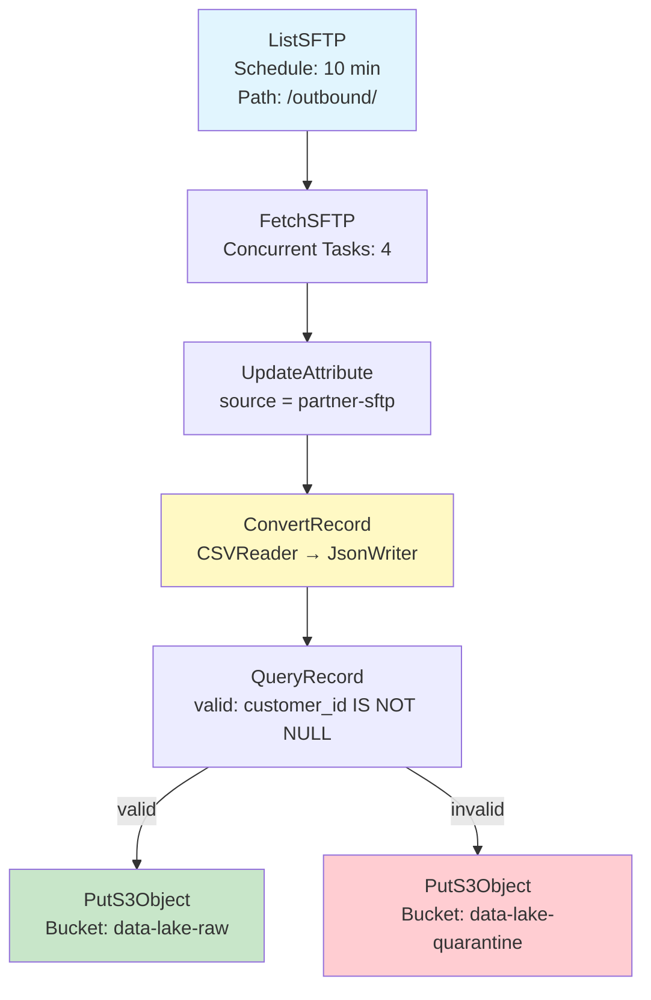
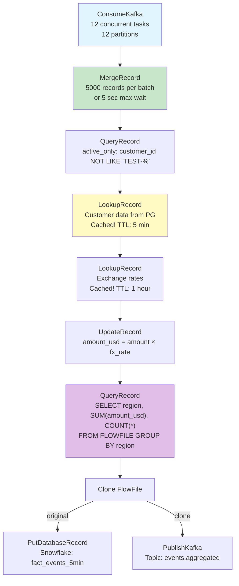
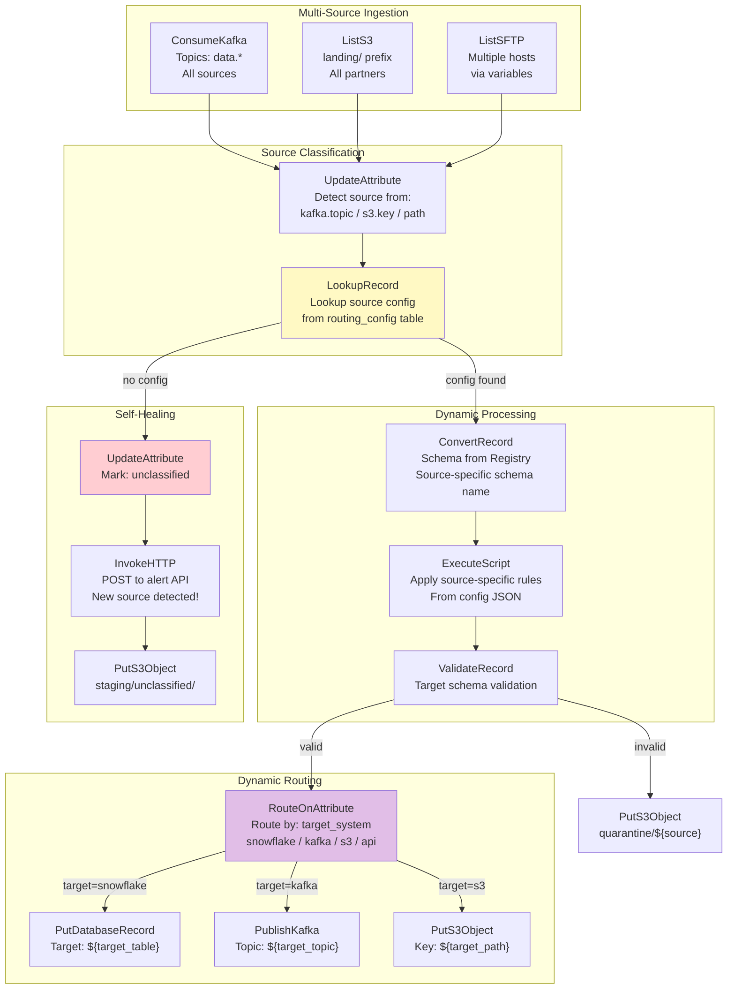

# Scenario Questions — NiFi Processors

<article data-difficulty="junior">

## 🟢 Junior: Choose the Right Processors

**Scenario:** You need to build a NiFi flow that: (1) reads CSV files from an SFTP server every 10 minutes, (2) converts them to JSON format, (3) adds a `source` attribute with value "partner-sftp", (4) validates that each record has a non-null `customer_id` field, and (5) writes valid records to an S3 bucket. List the processors you'd use in order and explain their configuration.

<details>
<summary>💡 Hint</summary>
Ingestion: ListSFTP + FetchSFTP (or GetSFTP for simple cases). Transform: ConvertRecord (CSV→JSON). Attributes: UpdateAttribute. Validation: ValidateRecord or QueryRecord. Output: PutS3Object. Think about scheduling, relationships (valid/invalid), and what happens to invalid records.
</details>

<details>
<summary>✅ Solution</summary>



**Processor configurations:**

```
1. ListSFTP:
   Hostname: sftp.partner.com
   Port: 22
   Username: nifi_user
   Remote Path: /outbound/
   File Filter: .*\.csv
   Scheduling: Timer Driven, Run Schedule = 10 min
   State Scope: CLUSTER (tracks which files already listed)

2. FetchSFTP:
   Hostname: sftp.partner.com
   Port: 22
   Remote File: ${path}/${filename}   (from ListSFTP attributes)
   Completion Strategy: Move File  (move to /outbound/processed/)
   Concurrent Tasks: 4

3. UpdateAttribute:
   Properties:
     source = "partner-sftp"
     ingested_at = "${now():format('yyyy-MM-dd HH:mm:ss')}"
     pipeline = "partner-ingestion-v1"

4. ConvertRecord:
   Record Reader: CSVReader
     - Schema Access: Infer Schema
     - Treat First Line as Header: true
   Record Writer: JsonRecordSetWriter
     - Output Grouping: Array
     - Pretty Print: false

5. QueryRecord (validation):
   Record Reader: JsonTreeReader
   Record Writer: JsonRecordSetWriter
   Properties:
     valid = "SELECT * FROM FLOWFILE WHERE customer_id IS NOT NULL"
     invalid = "SELECT * FROM FLOWFILE WHERE customer_id IS NULL"

6. PutS3Object (valid records):
   Bucket: data-lake-raw
   Object Key: partner/${now():format('yyyy/MM/dd')}/${filename:substringBefore('.')}.json
   Region: us-east-1

7. PutS3Object (invalid records):
   Bucket: data-lake-quarantine
   Object Key: partner/invalid/${now():format('yyyy-MM-dd')}/${filename}
   Region: us-east-1
```

**Key Points:**
- **ListSFTP + FetchSFTP** (not GetSFTP) for cluster-safe operation
- **ConvertRecord** handles CSV→JSON in one step (no scripting needed)
- **QueryRecord** for validation: SQL WHERE clause is more flexible than ValidateRecord for field-level checks
- **Two PutS3Object** processors: one for valid data (raw zone), one for quarantine
- Move processed files on SFTP to prevent re-ingestion
- Cluster state on ListSFTP prevents duplicate processing across nodes

</details>

</article>

<article data-difficulty="mid-level">

## 🟡 Mid-Level: Complex Transformation Pipeline

**Scenario:** You receive JSON events from Kafka (5000/sec) that need: (1) enrichment with customer data from PostgreSQL, (2) currency conversion (amount × exchange rate from a lookup table), (3) filtering out test accounts (customer_id starting with "TEST-"), (4) aggregation into 5-minute windows (sum of amounts per region), (5) output aggregated results to both Snowflake AND a Kafka topic. Design the processor chain with attention to performance at 5000 events/sec.

<details>
<summary>💡 Hint</summary>
At 5000/sec, you need: batching (MergeRecord before enrichment), caching (LookupRecord with cache, not per-record DB calls), and parallel processing. Use QueryRecord for filtering AND aggregation. Clone for dual output. Key: don't do a DB lookup per record — use cached LookupRecord or preload into DistributedMapCache.
</details>

<details>
<summary>✅ Solution</summary>



**Performance-Critical Configurations:**

```
ConsumeKafka_2_6:
  Concurrent Tasks: 12              # = partition count
  Max Poll Records: 10000           # Batch from Kafka
  # Throughput: 12 threads × 5000/sec input = distributed across threads

MergeRecord:
  Min Records: 5000
  Max Records: 10000
  Max Bin Age: 5 sec
  # At 5000/sec: fills in ~1 second
  # Batches of 5000 reduce per-FlowFile overhead by 5000x!

QueryRecord (filter):
  active_only: "SELECT * FROM FLOWFILE WHERE customer_id NOT LIKE 'TEST-%'"
  # Filters in-memory, no external I/O
  # ~95% pass through (5% test accounts removed)

LookupRecord (customer enrichment):
  Lookup Service: DBCPLookupService
  Cache Size: 50000                 # Cache 50K customers in memory!
  Cache Expiration: 5 min
  # First call: DB lookup. Subsequent: memory cache hit.
  # At 5000/sec with 10K unique customers: 99%+ cache hit rate after warmup

LookupRecord (FX rates):
  Lookup Service: SimpleKeyValueLookupService
  # Only ~30 currency pairs — entire table fits in cache
  Cache Expiration: 1 hour          # Rates don't change often

QueryRecord (aggregation):
  agg_by_region:
    "SELECT 
       region, 
       SUM(amount_usd) AS total_amount,
       COUNT(*) AS event_count,
       '${now():format('yyyy-MM-dd HH:mm')}' AS window_end
     FROM FLOWFILE 
     GROUP BY region"
  # 5000 records → ~10 rows (one per region)
  # Massive data reduction before output!

PutDatabaseRecord (Snowflake):
  Concurrent Tasks: 4
  Batch Size: 1000
  # Receives small aggregated FlowFiles (~10 rows each)
  # Snowflake handles easily

PublishKafka:
  Concurrent Tasks: 4
  Delivery Guarantee: AT_LEAST_ONCE
  # Small messages (aggregated) — very fast
```

**Throughput Calculation:**

```
Input: 5000 events/sec
After MergeRecord: 1 FlowFile/sec (5000 records each)
After Filter: ~4750 records/FlowFile (5% removed)
After Enrichment: Same count (adds fields, cached lookups ~instant)
After Aggregation: ~10 rows/FlowFile (grouped by region)
Output: ~10 rows/sec to Snowflake + Kafka

Data reduction: 5000 events/sec → 10 aggregated rows/sec = 500x reduction
This is why aggregation BEFORE output is critical for performance!
```

**Key Points:**
- **MergeRecord early**: Reduces FlowFile count from 5000/sec to 1/sec
- **Cached lookups**: 50K customer cache = 99% hit rate (no DB pressure)
- **QueryRecord for both filter AND aggregate**: SQL in-memory, no external systems
- **Aggregate before output**: 5000 records → 10 rows per region (500x less I/O)
- **Clone for dual-write**: Both targets get identical aggregated data
- **12 concurrent tasks on ConsumeKafka**: Matches partition count for max parallelism

</details>

</article>

<article data-difficulty="senior">

## 🔴 Senior: Self-Healing Pipeline with Dynamic Routing

**Scenario:** Design a NiFi flow that acts as a **universal data router** for an enterprise: (1) receives data from 20+ sources via Kafka, S3, SFTP, and APIs, (2) dynamically routes each dataset to its target based on a configuration table (no hardcoded routing!), (3) applies source-specific transformations (schema mapping) from a schema registry, (4) automatically detects new sources and creates routing rules, (5) handles failures with per-source retry policies, and (6) provides per-source SLA monitoring. The system should work without code changes when adding a new data source.

<details>
<summary>💡 Hint</summary>
Key insight: routing configuration stored EXTERNALLY (database/S3 config file), read dynamically via LookupRecord or a cached config. Schema per source from registry. Per-source attributes drive routing (RouteOnAttribute with dynamic property). New sources: default route to "unclassified" → alert team → add config → auto-routes next time. Use ExecuteScript or InvokeHTTP to read dynamic config.
</details>

<details>
<summary>✅ Solution</summary>



**Dynamic Configuration Table:**

```sql
-- routing_config table (PostgreSQL or Snowflake):
CREATE TABLE nifi.routing_config (
    source_id           VARCHAR(50) PRIMARY KEY,
    source_name         VARCHAR(200),
    source_type         VARCHAR(20),     -- 'kafka', 's3', 'sftp', 'api'
    -- Schema mapping:
    source_schema_name  VARCHAR(100),    -- Schema Registry reference
    target_schema_name  VARCHAR(100),    -- Target schema
    -- Routing:
    target_system       VARCHAR(20),     -- 'snowflake', 'kafka', 's3'
    target_table        VARCHAR(200),    -- Dynamic table name
    target_topic        VARCHAR(200),    -- Dynamic Kafka topic
    target_path         VARCHAR(500),    -- Dynamic S3 path template
    -- Processing rules:
    transform_rules     JSONB,           -- Source-specific transformations
    -- Retry policy:
    max_retries         INT DEFAULT 3,
    retry_delay_sec     INT DEFAULT 10,
    retry_backoff       VARCHAR(20) DEFAULT 'exponential',
    -- SLA:
    sla_max_delay_min   INT DEFAULT 60,
    alert_channel       VARCHAR(100),    -- Slack channel for this source
    -- Status:
    is_active           BOOLEAN DEFAULT TRUE,
    created_at          TIMESTAMP,
    updated_at          TIMESTAMP
);

-- Example rows:
INSERT INTO nifi.routing_config VALUES
('shopify_orders', 'Shopify Orders', 'kafka', 
 'shopify_order_v2', 'canonical_order_v1',
 'snowflake', 'raw.shopify_orders', NULL, NULL,
 '{"rename": {"total_price": "amount"}, "add": {"source": "shopify"}}',
 3, 10, 'exponential', 30, '#data-alerts-sales', TRUE, NOW(), NOW()),
 
('partner_acme_csv', 'Acme Corp Files', 's3',
 'acme_csv_v1', 'canonical_order_v1', 
 's3', NULL, NULL, 'curated/acme/${year}/${month}/${filename}.avro',
 '{"date_format": "MM/dd/yyyy", "delimiter": "|"}',
 5, 30, 'linear', 120, '#data-alerts-partners', TRUE, NOW(), NOW());
```

**Source Classification Logic:**

```
UpdateAttribute (TAG processor):
  # Detect source from ingestion metadata:
  source_id = "${kafka.topic:substringAfter('data.'):ifElse(
    ${kafka.topic:substringAfter('data.')},
    ${s3.key:getDelimitedField(2, '/'):ifElse(
      ${s3.key:getDelimitedField(2, '/')},
      ${sftp.host:append('_'):append(${path:getDelimitedField(2, '/')})}
    )}
  )}"
  
  # Simplified: source_id derived from topic name, S3 prefix, or SFTP path
```

**LookupRecord for Dynamic Config:**

```
LookupRecord (CONFIG processor):
  Lookup Service: DatabaseRecordLookupService
  Database Connection: PostgreSQL_Pool
  Table: nifi.routing_config
  Lookup Key: source_id
  Cache: 1000 entries, TTL = 5 minutes
  
  # Adds to FlowFile attributes:
  # target_system, target_table, target_topic, target_path,
  # source_schema_name, transform_rules, max_retries, etc.
  
  # If lookup returns NULL → source not configured → "no config" relationship
```

**Per-Source Retry Policy:**

```
RetryFlowFile:
  Maximum Retries: ${max_retries}          # From config! (not hardcoded)
  Penalty Duration: ${retry_delay_sec} sec  # From config!
  
  # Each source has its OWN retry policy:
  # Shopify: 3 retries, 10 sec (fast recovery)
  # Partner Acme: 5 retries, 30 sec (slow partner system)
```

**SLA Monitoring:**

```
# After successful processing, emit metrics:
UpdateAttribute:
  processing.complete.time = "${now()}"
  processing.latency.sec = "${now():toNumber():minus(${source.event.time:toNumber()}):divide(1000)}"
  sla.max.delay.min = "${sla_max_delay_min}"
  sla.breached = "${processing.latency.sec:divide(60):gt(${sla_max_delay_min})}"

# Route SLA breaches to alerting:
RouteOnAttribute:
  sla_breach = ${sla.breached:equals('true')}
  
# Alert on breach:
InvokeHTTP (Slack webhook):
  URL: https://hooks.slack.com/services/...
  Body: {"channel": "${alert_channel}", 
         "text": "⚠️ SLA breach: ${source_name} — ${processing.latency.sec}s delay (max: ${sla_max_delay_min}min)"}
```

**Adding a New Source (Zero Code Change):**

```sql
-- Step 1: New source starts sending data to Kafka topic "data.new_partner"
-- Step 2: NiFi receives it, tries lookup, gets NULL → routes to "unclassified"
-- Step 3: Alert fires: "New unclassified source detected: new_partner"
-- Step 4: Data team adds config row:
INSERT INTO nifi.routing_config VALUES (
    'new_partner', 'New Partner Inc', 'kafka',
    'new_partner_v1', 'canonical_order_v1',
    'snowflake', 'raw.new_partner_orders', NULL, NULL,
    '{"rename": {"order_num": "order_id"}}',
    3, 10, 'exponential', 60, '#data-alerts', TRUE, NOW(), NOW()
);
-- Step 5: Within 5 minutes (cache TTL), NiFi automatically routes new_partner
--          to Snowflake with the correct schema transformation.
-- NO NiFi flow changes, NO restarts, NO deployments!
```

**Key Points:**
- **Configuration-driven routing**: All routing logic in a database table, not in the NiFi flow
- **Schema Registry integration**: Source-specific and target schemas managed externally
- **Self-healing**: Unknown sources auto-detected → staged → alert → config → auto-routes
- **Per-source policies**: Retry counts, delays, SLAs all from config (not hardcoded)
- **Zero-deployment for new sources**: Just add a row to the config table
- **Cache with TTL**: Config changes take effect within 5 minutes (no restart)
- **SLA monitoring built-in**: Processing latency tracked per source, alerts on breach
- **Scalable**: 20+ sources with different schemas, targets, and policies — ONE flow handles all

</details>

</article>

</content>

---

## ⚡ Quick-fire Q&A

**Q: What is the difference between a source, transform, and sink processor in NiFi?**
A: Source processors generate FlowFiles from external systems (GetFile, ConsumeKafka); they have no incoming relationships. Transform processors modify FlowFiles in transit (ReplaceText, ConvertRecord). Sink processors send data to external destinations (PutS3Object, PutDatabaseRecord) and typically terminate FlowFiles.

**Q: What does "Concurrent Tasks" mean for a processor and how does it affect throughput?**
A: Concurrent Tasks sets how many threads can execute the processor simultaneously. Increasing it can improve throughput for I/O-bound processors (network, disk), but CPU-bound processors see diminishing returns past the number of available cores. It must be tuned per processor type.

**Q: What is a processor's scheduling strategy and what options are available?**
A: The scheduling strategy controls how often NiFi invokes the processor. Options include Timer Driven (run every N seconds), CRON Driven (run on a cron schedule), and Event Driven (experimental; trigger on incoming FlowFile). Most production flows use Timer Driven or CRON.

**Q: What is the purpose of the `success` and `failure` relationships?**
A: Relationships are output paths for FlowFiles after processing. `success` routes FlowFiles that were processed correctly; `failure` routes FlowFiles that encountered an error. You must connect or auto-terminate every relationship before a processor can be started.

**Q: How do you create a custom processor in NiFi?**
A: Implement the `AbstractProcessor` class from the NiFi API, annotate it with `@Tags`, `@CapabilityDescription`, and `@SupportsBatching` as needed, define `PropertyDescriptor` constants and `Relationship` constants, implement `onTrigger()`, and package it into a NAR (NiFi Archive) file deployed to `lib/`.

**Q: What is the difference between GetFile and ListFile + FetchFile?**
A: GetFile lists and reads in a single atomic operation—it physically moves/deletes the file. ListFile + FetchFile separates listing (producing attributes) from fetching (retrieving content), enabling distributed processing in a cluster where different nodes fetch different files.

**Q: How does the QueryRecord processor differ from ConvertRecord?**
A: ConvertRecord translates between formats (CSV → Avro) without transforming structure. QueryRecord executes a SQL SELECT against the incoming record set, enabling filtering, projection, and simple aggregation using the same format-agnostic Record API.

**Q: What is processor state and how can a processor use it?**
A: NiFi provides a State Manager API allowing processors to persist key-value pairs either locally (per-node) or cluster-wide (via ZooKeeper). ListS3 uses cluster state to track the last-seen modification timestamp so it does not re-list already-processed objects after restart.

---

## 💼 Interview Tips

- When asked to design a flow, clearly identify which processors are sources/transforms/sinks—interviewers look for data-flow thinking, not just naming processors.
- Know the ListFile + FetchFile pattern cold—it's the recommended approach for clustered NiFi and comes up constantly in senior interviews.
- Demonstrate awareness of processor thread models: heavy concurrent tasks can starve other processors. Mention the NiFi thread pool settings and how to balance priorities.
- For custom processor questions, go beyond "implement onTrigger"—mention proper session management, using `ProcessSession.read()` / `write()`, avoiding holding sessions open, and writing unit tests with `TestRunner`.
- Senior interviewers appreciate when you mention observability: use `getLogger().warn()` with FlowFile context and bulletins, not just raw exceptions.
