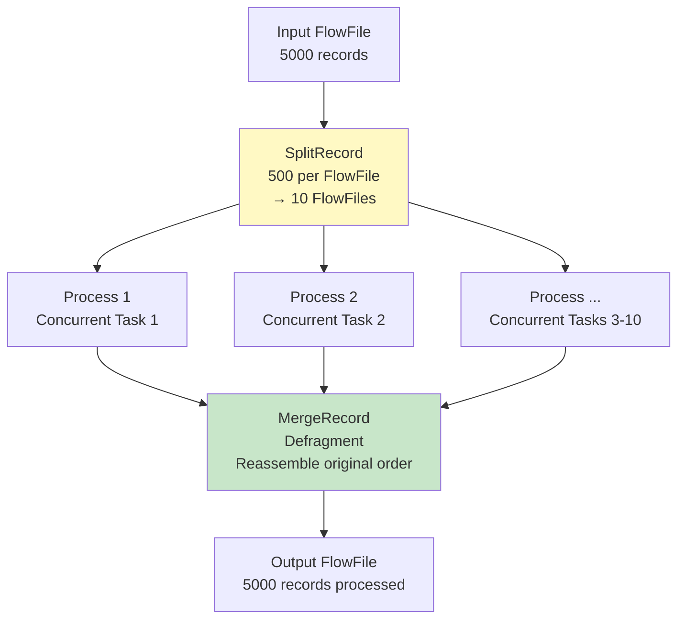
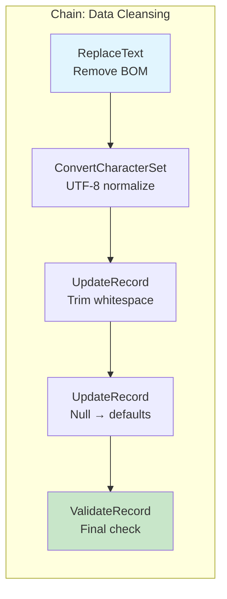
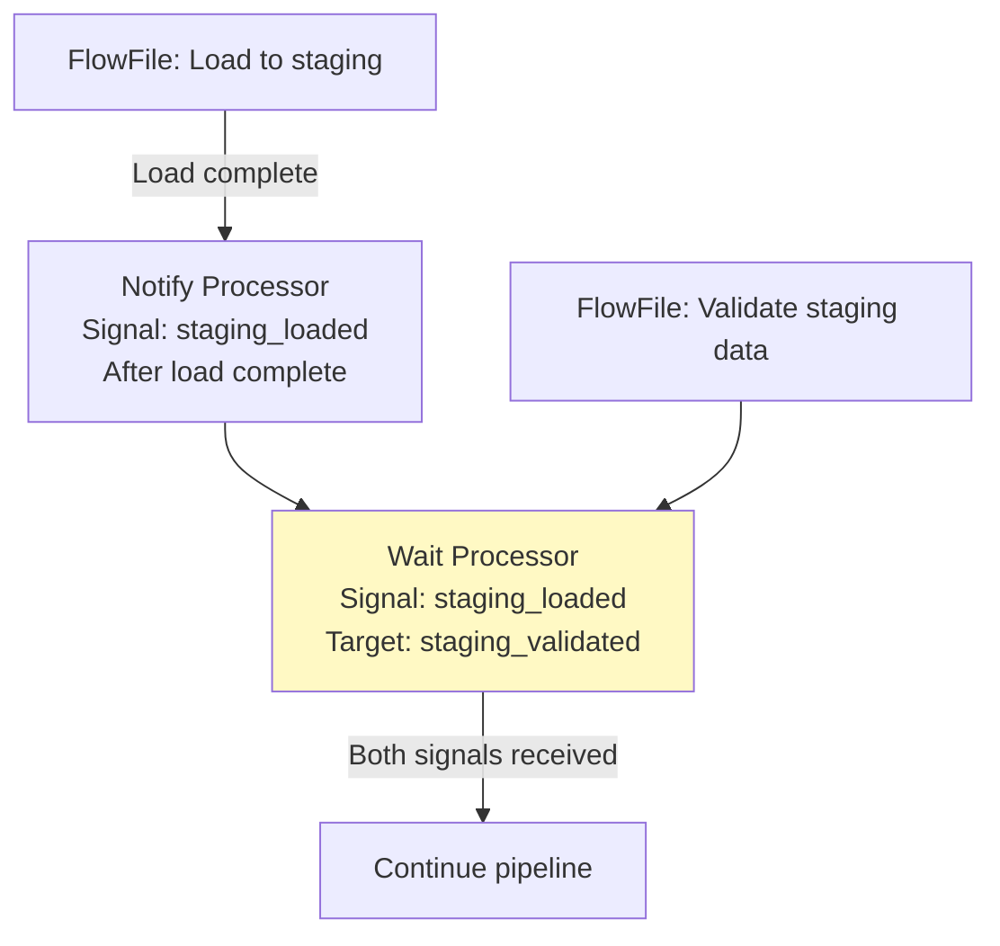
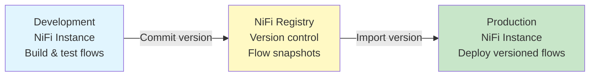

# Apache NiFi Processors — Senior Deep Dive

## Custom Processor Development

When built-in processors don't meet your needs, build custom ones:

```java
// Custom processor skeleton:
@Tags({"custom", "transform", "data-engineering"})
@CapabilityDescription("Custom data quality validation processor")
@InputRequirement(InputRequirement.Requirement.INPUT_REQUIRED)
public class CustomDQProcessor extends AbstractProcessor {

    public static final PropertyDescriptor NULL_THRESHOLD = new PropertyDescriptor.Builder()
        .name("Max Null Percentage")
        .description("Maximum allowed null percentage per column")
        .required(true)
        .defaultValue("5")
        .addValidator(StandardValidators.POSITIVE_INTEGER_VALIDATOR)
        .build();

    public static final Relationship REL_PASS = new Relationship.Builder()
        .name("pass")
        .description("FlowFiles that pass DQ checks")
        .build();

    public static final Relationship REL_FAIL = new Relationship.Builder()
        .name("fail")
        .description("FlowFiles that fail DQ checks")
        .build();

    @Override
    public void onTrigger(ProcessContext context, ProcessSession session) {
        FlowFile flowFile = session.get();
        if (flowFile == null) return;

        int maxNullPct = context.getProperty(NULL_THRESHOLD).asInteger();
        
        // Stream content (memory-safe for large files):
        AtomicReference<DQResult> result = new AtomicReference<>();
        session.read(flowFile, inputStream -> {
            // Parse records, compute null percentages
            result.set(validateDataQuality(inputStream, maxNullPct));
        });

        // Add DQ attributes:
        flowFile = session.putAttribute(flowFile, "dq.null.max.pct", 
            String.valueOf(result.get().maxNullPct));
        flowFile = session.putAttribute(flowFile, "dq.passed", 
            String.valueOf(result.get().passed));

        // Route based on result:
        if (result.get().passed) {
            session.transfer(flowFile, REL_PASS);
        } else {
            session.transfer(flowFile, REL_FAIL);
        }
    }
}
```

### NAR (NiFi Archive) Packaging

```xml
<!-- pom.xml for custom processor NAR -->
<packaging>nar</packaging>

<dependencies>
    <dependency>
        <groupId>org.apache.nifi</groupId>
        <artifactId>nifi-api</artifactId>
        <version>1.25.0</version>
    </dependency>
    <dependency>
        <groupId>org.apache.nifi</groupId>
        <artifactId>nifi-utils</artifactId>
        <version>1.25.0</version>
    </dependency>
</dependencies>

<!-- Build: mvn clean package → deploy .nar to NiFi lib/ folder -->
```

## ExecuteScript / ExecuteStreamCommand

For quick custom logic without building a full NAR:

```python
# ExecuteScript (Jython/Groovy/Python):
# Processor: ExecuteScript
# Script Engine: python
# Script Body:

import json
from org.apache.nifi.processor.io import StreamCallback

class TransformCallback(StreamCallback):
    def process(self, inputStream, outputStream):
        content = json.loads(inputStream.read())
        
        # Custom transformation:
        for record in content:
            record['amount_usd'] = record['amount'] * record.get('fx_rate', 1.0)
            record['processed'] = True
        
        outputStream.write(json.dumps(content).encode())

flowFile = session.get()
if flowFile:
    flowFile = session.write(flowFile, TransformCallback())
    flowFile = session.putAttribute(flowFile, 'transform.applied', 'currency_conversion')
    session.transfer(flowFile, REL_SUCCESS)
```

```groovy
// ExecuteScript (Groovy — more performant than Python):
import groovy.json.JsonSlurper
import groovy.json.JsonOutput

def ff = session.get()
if (!ff) return

ff = session.write(ff, { inputStream, outputStream ->
    def records = new JsonSlurper().parse(inputStream)
    
    records.each { record ->
        record.amount_usd = record.amount * (record.fx_rate ?: 1.0)
        record.processed_at = new Date().format("yyyy-MM-dd'T'HH:mm:ss'Z'")
    }
    
    outputStream.write(JsonOutput.toJson(records).getBytes('UTF-8'))
} as StreamCallback)

ff = session.putAttribute(ff, 'script.status', 'success')
session.transfer(ff, REL_SUCCESS)
```

## Advanced Processor Patterns

### Fan-Out / Fan-In (Scatter-Gather)



### Processor Chains for Complex Transformations



### Wait/Notify Pattern (Synchronization)



## Performance Optimization

### Bulletin-Level Monitoring

```properties
# Per-processor performance tracking:
# Processor → Status tab shows:
# - Bytes In/Out (throughput)
# - FlowFiles In/Out (record throughput)
# - Tasks (active threads)
# - Time (processing time per FlowFile)

# If processing time is high:
# 1. Increase Concurrent Tasks (if downstream allows)
# 2. Batch more records per FlowFile (reduce per-FF overhead)
# 3. Use Record-based processors (bulk operations)
# 4. Check if processor is I/O bound (network) vs CPU bound

# If queue is building up (back-pressure):
# 1. Downstream processor is the bottleneck
# 2. Increase Concurrent Tasks on bottleneck processor
# 3. Add more NiFi nodes (cluster scaling)
# 4. Batch before the bottleneck (fewer, larger FlowFiles)
```

### Processor Selection Impact

| Scenario | Slow Choice | Fast Choice |
|----------|-------------|-------------|
| JSON transformation | ExecuteScript (Python) | JoltTransformJSON (native) |
| Format conversion | Custom script | ConvertRecord (native) |
| SQL-like filtering | Split + Route individual records | QueryRecord (SQL on FlowFile) |
| Enrichment | InvokeHTTP per record | LookupRecord + cache service |
| Many small files to S3 | PutS3Object per file | MergeContent → PutS3Object |

## Processor Versioning (NiFi Registry)



```
# Version control flow:
1. Develop in DEV NiFi instance
2. Right-click Process Group → "Start Version Control"
3. Select NiFi Registry bucket
4. Commit with message: "v1.2: Added retry logic for DB writes"
5. In PROD: Right-click Process Group → "Change Version" → select v1.2
6. Review changes → Apply
# Rollback: "Change Version" → select previous version
```

## Interview Tips

> **Tip 1:** "How do you build custom processors?" — Extend AbstractProcessor, define PropertyDescriptors (configuration), Relationships (output ports), and implement onTrigger() (processing logic). Package as a NAR (NiFi Archive) and deploy to lib/ folder. For quick scripts: use ExecuteScript with Groovy/Python (no deployment needed, but less performant).

> **Tip 2:** "How do you optimize processor performance?" — (1) Prefer native processors over scripts (JoltTransform > ExecuteScript for JSON). (2) Use record-based processors (QueryRecord, LookupRecord) — process thousands of records in one FlowFile. (3) Batch before I/O-heavy processors (MergeRecord before PutDatabaseRecord). (4) Match Concurrent Tasks to downstream limits. (5) Use cache-based lookups instead of per-record API calls.

> **Tip 3:** "How do you version NiFi flows?" — NiFi Registry: version-control Process Groups with Git-like semantics (commit, tag, rollback). Develop in DEV instance → commit to Registry → import specific version in PROD. Enables: change tracking, rollback, promotion between environments, and team collaboration on flows.

## ⚡ Cheat Sheet

**Core NiFi concepts**
```
FlowFile:    unit of data (content + attributes map)
Processor:   transforms/routes FlowFiles (GetFile, PutS3Object, RouteOnAttribute, etc.)
Connection:  queue between processors with back-pressure settings
Process Group: logical grouping of processors (like a subflow)
Controller Service: shared resource (DBCPConnectionPool, SSLContextService, etc.)
```

**Back-pressure settings**
```
Back Pressure Object Threshold: max FlowFiles in queue before upstream pauses
Back Pressure Data Size Threshold: max bytes in queue before upstream pauses
Typical: 10,000 objects / 1 GB — tune based on downstream throughput
When both thresholds hit → upstream processor stops scheduling
```

**Expression Language (attribute-based routing)**
```
${filename}                    — attribute value
${filename:toUpper()}          — uppercase
${fileSize:gt(1000000)}        — > 1 MB (returns true/false)
${filename:startsWith('order')} — prefix check
${now():format('yyyy-MM-dd')}  — current date
${uuid()}                      — generate UUID
${field.value:trim():toLower()} — chain functions
```

**Key processors**
```
GetFile / ListFile + FetchFile  — ingest from filesystem
GetSFTP / PutSFTP               — SFTP in/out
GetKafka / PublishKafka         — Kafka consumer/producer
ExecuteSQL / QueryDatabaseTable — SQL source
PutDatabaseRecord               — write to RDBMS
MergeContent                    — batch small files into larger ones
SplitRecord / SplitText         — split large FlowFiles
RouteOnAttribute / RouteOnContent — conditional routing
ConvertRecord                   — CSV ↔ JSON ↔ Avro ↔ Parquet
```

**Record-based processing**
```
Record Reader + Record Writer → schema-aware processing
Avoids row-by-row FlowFile per record — bulk processing in one FlowFile
Readers: CSVReader, JsonTreeReader, AvroReader, ParquetReader
Writers: CSVRecordSetWriter, JsonRecordSetWriter, ParquetRecordSetWriter
Schema: from Schema Registry (Confluent), from attribute, or inferred
```

**Clustering (NiFi cluster)**
```
Zero-Master: all nodes are peers; one elected Coordinator via ZooKeeper
Primary Node: handles scheduled processors once per cluster (GetFile, etc.)
Load balancing: connections can load-balance FlowFiles across nodes
State Provider: ZooKeeper stores distributed state (watermarks, offsets)
```

**Provenance (lineage)**
```
Every FlowFile event recorded: RECEIVE, SEND, FETCH, DROP, FORK, JOIN, CONTENT_MODIFIED
Searchable by: filename, UUID, attribute, component, time range
Replay: any FlowFile can be replayed from any point in provenance chain
Retention: configurable (default 24h); archive to external storage for longer
```

**Key interview points**
- NiFi is best for: heterogeneous data ingestion, protocol translation, low-code ETL
- Not ideal for: complex transformations (use Spark/dbt), high-throughput ML pipelines
- Site-to-Site (S2S): secure data transfer between NiFi instances (no Kafka needed)
- MiNiFi: lightweight NiFi agent for edge devices (IoT, network equipment)
- NiFi vs Kafka: NiFi = data routing/transformation; Kafka = durable messaging queue
