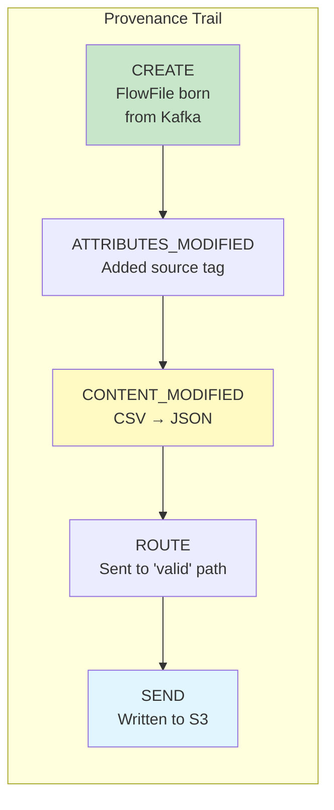
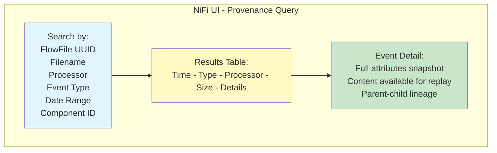
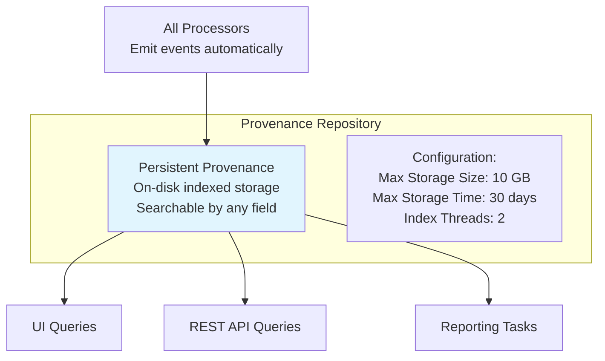
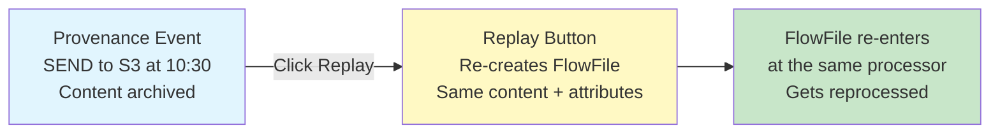
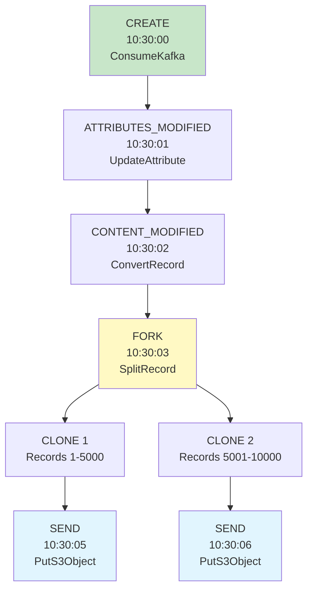

# NiFi Provenance — Fundamentals


## 🎯 Analogy

Think of NiFi provenance like a flight data recorder for your data: every FlowFile's journey is recorded — when it was created, modified, routed, cloned, and dropped. You can replay any FlowFile from any point in its history.

---
## What is Data Provenance?

Data provenance in NiFi is a **complete audit trail** of every FlowFile's journey through the system. It records every event (create, modify, route, send, drop) with full context — enabling you to trace any piece of data from source to destination.



## Why Provenance Matters

| Use Case | How Provenance Helps |
|----------|---------------------|
| **Debugging** | "Why did this FlowFile end up in the failure queue?" → trace its path |
| **Compliance** | "Prove this customer data was processed correctly" → full audit trail |
| **Replay** | "Re-send this FlowFile" → replay from any point in the pipeline |
| **Root Cause** | "When did the data get corrupted?" → find exact processor + timestamp |
| **SLA Monitoring** | "How long did processing take?" → measure event timestamps |
| **Data Lineage** | "Where did this output record come from?" → trace back to source |

## Provenance Event Types

| Event | Description | Recorded When |
|-------|-------------|---------------|
| **CREATE** | FlowFile first enters the system | GetFile, ConsumeKafka, GenerateFlowFile |
| **RECEIVE** | FlowFile received from external source | Remote Process Group, Site-to-Site |
| **SEND** | FlowFile sent to external system | PutS3Object, PublishKafka, PutDatabaseRecord |
| **CLONE** | FlowFile duplicated | RouteOnAttribute (multi-route), processor cloning |
| **FORK** | Split into multiple FlowFiles | SplitRecord, SplitJson, SplitText |
| **JOIN** | Multiple FlowFiles merged | MergeContent, MergeRecord |
| **CONTENT_MODIFIED** | Content bytes changed | ConvertRecord, JoltTransform, ReplaceText |
| **ATTRIBUTES_MODIFIED** | Attributes updated | UpdateAttribute, EvaluateJsonPath |
| **ROUTE** | FlowFile routed to specific relationship | RouteOnAttribute |
| **DROP** | FlowFile removed from flow | Auto-terminated relationship, expiration |
| **EXPIRE** | FlowFile expired in queue | Queue FlowFile Expiration setting |

## Provenance Event Structure

Each event records:

```
Provenance Event:
  Event ID: 1589234
  Event Type: CONTENT_MODIFIED
  Timestamp: 2024-03-15T10:30:05.123Z
  
  FlowFile UUID: a1b2c3d4-e5f6-7890-abcd-ef1234567890
  File Size: 52,428,800 bytes
  
  Component (Processor):
    ID: 3f7a8b2c-1d4e-5f6a-7890
    Name: ConvertRecord
    Type: org.apache.nifi.processors.standard.ConvertRecord
    
  Source/Destination:
    Source System URI: (none - local processing)
    Transit URI: (none)
    
  Attributes (snapshot at event time):
    filename: orders_2024-03-15.csv
    source.system: shopify
    record.count: 125000
    mime.type: application/json  (changed from text/csv!)
    
  Parent FlowFile UUIDs: (if fork/join)
  Child FlowFile UUIDs: (if fork)
  
  Content Claim:
    Container: default
    Section: 123
    Identifier: 1589234
    Offset: 0
    Size: 52,428,800
    # CAN replay content from here!
```

## Viewing Provenance in the UI



**Access:** Global menu → "Data Provenance" → Search

## Provenance Repository



```properties
# nifi.properties — Provenance configuration:
nifi.provenance.repository.implementation=org.apache.nifi.provenance.WriteAheadProvenanceRepository
nifi.provenance.repository.directory.default=/opt/nifi/provenance-repository
nifi.provenance.repository.max.storage.time=30 days
nifi.provenance.repository.max.storage.size=10 GB
nifi.provenance.repository.index.threads=2
nifi.provenance.repository.index.shard.size=500 MB
```

## Replay

One of provenance's most powerful features — **re-send a FlowFile** from any point:



**Replay use cases:**
- Re-process a failed FlowFile after fixing the pipeline
- Re-send data to a target that was temporarily down
- Debug by replaying through a modified flow
- Recover from accidental data loss

## FlowFile Lineage View

Traces a single FlowFile's complete history:




## ▶️ Try It Yourself

```bash
# Query provenance via NiFi REST API

# Submit a provenance query (find all events for a specific file)
curl -X POST http://localhost:8080/nifi-api/provenance   -H "Content-Type: application/json"   -d '{
    "provenance": {
      "request": {
        "searchTerms": {
          "filename": {"value": "orders_20240115.csv"},
          "eventType": {"value": "SEND"}
        },
        "maxResults": 100,
        "startDate": "01/15/2024 00:00:00 EST",
        "endDate": "01/16/2024 00:00:00 EST"
      }
    }
  }'

# Provenance event types:
# CREATE: FlowFile first created
# FETCH: Content fetched from source
# SEND: FlowFile sent to destination
# RECEIVE: FlowFile received from source
# ROUTE: FlowFile routed to a relationship
# DROP: FlowFile dropped (end of life)
# REPLAY: FlowFile replayed from provenance repository

echo "Use provenance to debug where a FlowFile went wrong in the pipeline"  
```

> **Run it:** Copy the snippet into a REPL or file — no external services needed for the basic example.

---
## Interview Tips

> **Tip 1:** "What is NiFi provenance?" — A complete audit trail of every FlowFile operation. Every create, modify, route, send, and drop event is recorded with timestamps, processor info, and attribute snapshots. Enables: debugging (trace failures), compliance (prove data handling), replay (re-send failed FlowFiles), and data lineage (source-to-destination tracing).

> **Tip 2:** "How does replay work?" — From the provenance UI, you can replay any FlowFile from any point in its history. NiFi re-creates the FlowFile with the same content and attributes (from the archived content claim) and resubmits it to the same processor. The FlowFile gets reprocessed as if it just arrived. Essential for error recovery and debugging.

> **Tip 3:** "How is provenance stored?" — Write-Ahead Provenance Repository on disk. Indexed for searching (by UUID, filename, processor, event type, date range). Configured with max storage size and time (e.g., 10 GB / 30 days). Oldest events automatically purged. Content is archived separately (content repository) — if archive is available, replay is possible.
