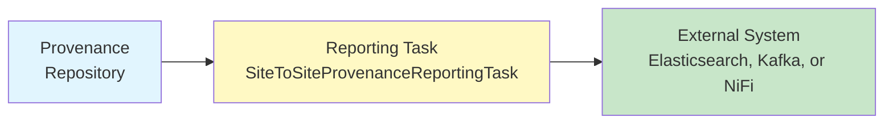
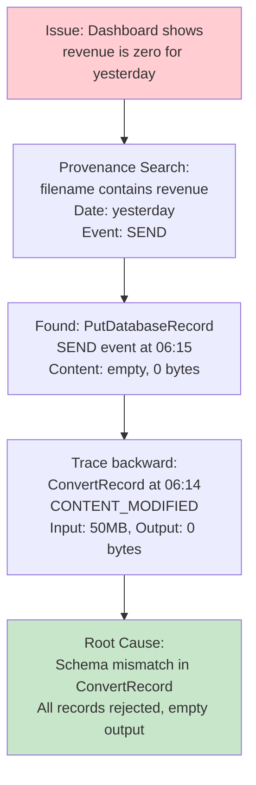

# NiFi Provenance — Intermediate Concepts

## Provenance Querying

### Search Criteria

```
# Provenance search fields:
Component ID:       (specific processor UUID)
Component Type:     (e.g., "ConvertRecord", "PutS3Object")  
FlowFile UUID:      (trace specific FlowFile)
Filename:           (search by filename attribute)
Event Type:         (CREATE, SEND, DROP, etc.)
Relationship:       (success, failure, etc.)
Minimum/Maximum File Size:  (filter by content size)
Start/End Date:     (time range)
Search Terms:       (attribute key=value pairs)
```

### Common Provenance Queries

```
# "Where did this FlowFile end up?"
Search: FlowFile UUID = "a1b2c3d4..."
→ Shows complete event chain from CREATE to DROP/SEND

# "What failed in the last hour?"
Search: Event Type = "DROP", Date Range = last 1 hour
→ Shows all FlowFiles that were dropped (errors, expiration)

# "What data was sent to S3 today?"
Search: Component Type = "PutS3Object", Event Type = "SEND", Date = today
→ Shows all successful S3 uploads

# "Find a specific customer's data:"
Search: Search Terms: customer_id = "C001"
→ Shows all events for FlowFiles with this attribute value
```

## Provenance REST API

```bash
# Query provenance via REST API (automation/scripting):

# Submit a provenance query:
POST /nifi-api/provenance
{
  "provenance": {
    "request": {
      "searchTerms": {
        "FlowFileUUID": "a1b2c3d4-e5f6-7890-abcd-ef1234567890"
      },
      "startDate": "2024-03-15T00:00:00Z",
      "endDate": "2024-03-15T23:59:59Z",
      "maxResults": 1000
    }
  }
}

# Get query results:
GET /nifi-api/provenance/{query-id}
# Returns: list of provenance events matching criteria

# Get specific event detail:
GET /nifi-api/provenance/events/{event-id}
# Returns: full event with attributes, content info, lineage

# Replay a FlowFile from an event:
POST /nifi-api/provenance/replays
{
  "eventId": 1589234,
  "clusterNodeId": "node-1-uuid"
}
```

## Provenance Reporting Tasks

Automatically export provenance data to external systems:



```
# SiteToSiteProvenanceReportingTask:
# Sends provenance events to another NiFi instance for analysis

SiteToSiteProvenanceReportingTask:
  Destination URL: https://monitoring-nifi.company.com:8443
  Port Name: provenance-events
  Batch Size: 1000
  Platform: nifi
  # Sends provenance as JSON FlowFiles to monitoring NiFi
  # Monitoring NiFi → Elasticsearch for dashboarding

# PrometheusReportingTask:
# Exposes metrics (not individual events) for dashboards

# Custom Reporting Task:
# Can send to Kafka, Elasticsearch, Splunk directly
```

## Provenance for Troubleshooting

### Pattern: Finding Where Data Was Corrupted



### Pattern: Finding Lost Data

```
# "We expected 100K records but only got 80K. Where are the 20K?"

Step 1: Search provenance for source event:
  Component: ConsumeKafka, Event: CREATE, Date: today
  Result: 100,000 CREATE events ✓ (all received)

Step 2: Search for DROP events:
  Event: DROP, Date: today
  Result: 5,000 DROPs from ValidateRecord (invalid records!)
  
Step 3: Search for EXPIRE events:
  Event: EXPIRE, Date: today
  Result: 15,000 EXPIREs from queue expiration!
  
Step 4: Root cause:
  Queue before PutDB had 1-hour expiration
  PutDB was slow (back pressure) → 15K FlowFiles expired while waiting!
  Fix: Remove expiration from that queue (or increase threshold)
  
Total: 80K delivered + 5K invalid + 15K expired = 100K ✓ (all accounted for!)
```

## Provenance Performance Impact

```properties
# Provenance writes for EVERY event → disk I/O impact!

# Tuning for high-throughput systems:
nifi.provenance.repository.max.storage.size=20 GB
nifi.provenance.repository.max.storage.time=7 days
nifi.provenance.repository.rollover.size=100 MB
nifi.provenance.repository.rollover.time=10 mins
nifi.provenance.repository.index.threads=4
nifi.provenance.repository.index.shard.size=500 MB
nifi.provenance.repository.journal.count=16

# For VERY high throughput (>100K events/sec):
# Consider: Volatile Provenance Repository (in-memory, no disk)
# nifi.provenance.repository.implementation=org.apache.nifi.provenance.VolatileProvenanceRepository
# nifi.provenance.repository.buffer.size=100000
# WARNING: Lost on restart! Use only when audit trail not required.

# Best practice: Put provenance repo on dedicated SSD (separate from content repo)
nifi.provenance.repository.directory.default=/ssd-provenance/provenance-repo
```

## Content Archiving for Replay

```properties
# Content Repository archiving enables provenance replay:
nifi.content.repository.archive.enabled=true
nifi.content.repository.archive.max.retention.period=24 hours
nifi.content.repository.archive.max.usage.percentage=50%

# With archiving:
# - Content kept for 24 hours after FlowFile completes
# - Provenance "Replay" button works (can re-create FlowFile)
# - Disk usage: up to 50% of content repo partition

# Without archiving:
# - Content deleted immediately when FlowFile completes
# - Provenance events still recorded (metadata only)
# - Replay NOT possible (content gone)
# - Use when: disk space critical, replay not needed
```

## Interview Tips

> **Tip 1:** "How do you troubleshoot data loss in NiFi?" — Provenance search. (1) Search CREATE events at source processor → confirm all data entered. (2) Search DROP and EXPIRE events → find where data disappeared. (3) Trace specific FlowFile UUID → see its complete path. Common causes: queue expiration (data too old), validation failures (routed to failure), processor errors (dropped).

> **Tip 2:** "What's the performance impact of provenance?" — Every FlowFile event writes to the provenance repository (disk I/O). For high-throughput (100K+ events/sec): put provenance on dedicated SSD, increase index threads, tune journal count. Extreme case: use VolatileProvenanceRepository (memory-only, no persistence — events lost on restart). Trade-off: auditability vs. performance.

> **Tip 3:** "How do you export provenance for analysis?" — Reporting Tasks: SiteToSiteProvenanceReportingTask sends events to another NiFi (or directly to Elasticsearch/Kafka). Format: JSON with full event details. Use for: centralized monitoring dashboards, long-term audit storage, cross-cluster provenance correlation. Events include: processor, timestamp, FlowFile UUID, all attributes at event time.
