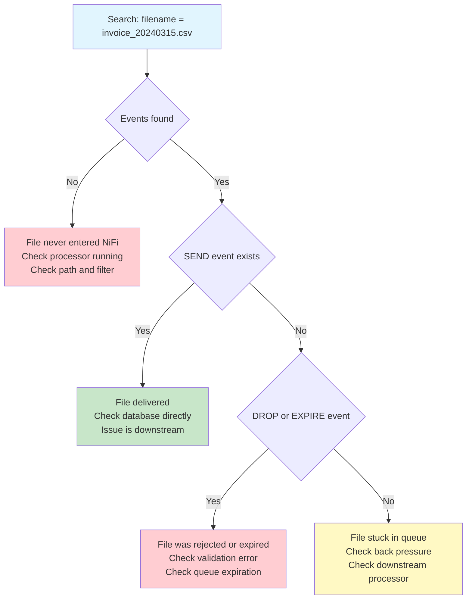
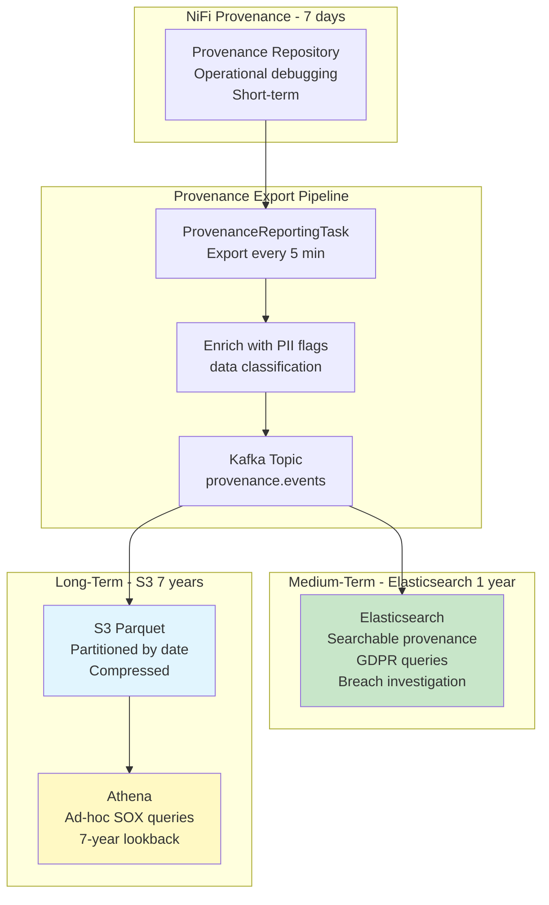

# Scenario Questions — NiFi Provenance

<article data-difficulty="junior">

## 🟢 Junior: Using Provenance for Debugging

**Scenario:** A partner complains they sent a file `invoice_20240315.csv` via SFTP at 9:00 AM but it hasn't appeared in the target database by 2:00 PM. Using NiFi provenance, describe how you'd trace this file through the system to find out what happened to it.

<details>
<summary>💡 Hint</summary>
Search provenance by filename attribute. Look for: CREATE event (was it picked up?), subsequent events (was it processed?), DROP/EXPIRE events (was it lost?). Check the last event — did it reach PutDatabaseRecord? If it stopped somewhere, check the processor and relationship.
</details>

<details>
<summary>✅ Solution</summary>

**Step-by-step investigation:**

```
Step 1: Search provenance for the file
  Data Provenance → Search
  Search Terms: filename = "invoice_20240315.csv"
  Date Range: 2024-03-15 09:00 → 2024-03-15 14:00

Step 2: Analyze results (possible outcomes):
```

**Outcome A: No events found**
```
Result: 0 provenance events
Meaning: File was NEVER picked up by NiFi!
Investigation:
  - Check GetSFTP/ListSFTP processor: is it running?
  - Check File Filter: does it match "invoice_*.csv"?
  - Check SFTP path: is NiFi looking in the right directory?
  - Check scheduling: did NiFi poll during this period?
Fix: Start processor or fix path/filter configuration
```

**Outcome B: CREATE event found, but no SEND event**
```
Result: CREATE at 09:05, ATTRIBUTES_MODIFIED at 09:05, then nothing
Meaning: File was picked up but stuck somewhere in the flow!
Investigation:
  - Click "Lineage" on the CREATE event → shows FlowFile's journey
  - Last event was at processor "ValidateRecord"
  - Check: is the FlowFile sitting in a queue? (back pressure?)
  - Check: was it routed to "failure" relationship?
  - Look for queue between last processor and next: is it full?
Fix: If in queue → wait (or increase downstream capacity)
     If in failure → check validation error, fix data or schema
```

**Outcome C: File was processed but DROP event found**
```
Result: CREATE → ATTRIBUTES_MODIFIED → CONTENT_MODIFIED → DROP
Meaning: File was processed but then DROPPED!
Investigation:
  - Click the DROP event → see which processor dropped it
  - Check event details: "Relationship: failure"
  - Check processor that dropped: "ValidateRecord"
  - Check attributes at DROP time: "validation.error: column count mismatch"
Root Cause: File has wrong number of columns → validation rejected it
Fix: Fix the partner's file format OR adjust validation schema
```

**Outcome D: SEND event found — file WAS delivered!**
```
Result: CREATE → ... → SEND at 09:08 to "jdbc:postgresql://..."
Meaning: NiFi delivered the file successfully!
Investigation:
  - Check SEND event: transit URI, record count, size
  - Issue is DOWNSTREAM of NiFi (database didn't commit? wrong table?)
  - Check attributes: target_table, record_count
  - Verify in database: SELECT COUNT(*) WHERE source_file = 'invoice_20240315.csv'
Fix: Database issue, not NiFi issue. Check DB logs.
```



**Key Points:**
- Provenance search by filename instantly locates the file
- Event chain shows EXACTLY where the file is/was
- Each event has: timestamp, processor, relationship, attributes
- "Lineage" view gives visual timeline for the FlowFile
- No guessing needed — provenance is the definitive answer

</details>

</article>

<article data-difficulty="mid-level">

## 🟡 Mid-Level: Provenance for Data Reconciliation

**Scenario:** Your NiFi pipeline processes orders from Kafka and writes to Snowflake. The business team reports that Snowflake shows 950,000 orders for March, but Kafka topic has 1,000,000 messages for the same period. Design a provenance-based reconciliation process to: (1) find the 50,000 missing records, (2) categorize WHY they're missing, and (3) recover what can be recovered.

<details>
<summary>💡 Hint</summary>
Use provenance to count: CREATE events (from Kafka) vs SEND events (to Snowflake). The difference = events that entered but never left. Categorize by checking: DROP events (validation failures), EXPIRE events (queue timeouts), and events still queued (not yet processed). For recovery: replay DROPped FlowFiles if content is still archived.
</details>

<details>
<summary>✅ Solution</summary>

```python
# Reconciliation script using NiFi Provenance API:

from datetime import datetime
import requests

NIFI_API = "https://nifi.company.com/nifi-api"
START_DATE = "2024-03-01T00:00:00Z"
END_DATE = "2024-03-31T23:59:59Z"

def reconcile_pipeline():
    """Full pipeline reconciliation using provenance."""
    
    # ═══════════════════════════════════
    # STEP 1: Count what ENTERED (CREATE from Kafka)
    # ═══════════════════════════════════
    creates = query_provenance(
        component_type="ConsumeKafka",
        event_type="CREATE",
        start=START_DATE, end=END_DATE
    )
    total_ingested = len(creates)
    print(f"Total ingested from Kafka: {total_ingested:,}")
    # Result: 1,000,000 ✓ (matches Kafka topic count)
    
    # ═══════════════════════════════════
    # STEP 2: Count what was DELIVERED (SEND to Snowflake)
    # ═══════════════════════════════════
    sends = query_provenance(
        component_type="PutDatabaseRecord",
        event_type="SEND",
        start=START_DATE, end=END_DATE
    )
    total_delivered = sum(int(e['attributes'].get('record.count', 1)) for e in sends)
    print(f"Total delivered to Snowflake: {total_delivered:,}")
    # Result: 950,000
    
    # ═══════════════════════════════════
    # STEP 3: Find the GAP (50,000 missing)
    # ═══════════════════════════════════
    gap = total_ingested - total_delivered
    print(f"GAP: {gap:,} records missing!")
    
    # ═══════════════════════════════════
    # STEP 4: Categorize missing records
    # ═══════════════════════════════════
    
    # Category A: Validation failures (DROP from ValidateRecord)
    validation_drops = query_provenance(
        component_type="ValidateRecord",
        event_type="DROP",
        start=START_DATE, end=END_DATE
    )
    cat_a = len(validation_drops)
    
    # Category B: Queue expirations (EXPIRE events)
    expirations = query_provenance(
        event_type="EXPIRE",
        start=START_DATE, end=END_DATE
    )
    cat_b = len(expirations)
    
    # Category C: Still in queue (not yet processed)
    # Check current queue depths via connection status API
    queued = get_current_queue_depths()
    cat_c = queued
    
    # Category D: Other drops (errors, processor failures)
    other_drops = query_provenance(
        event_type="DROP",
        start=START_DATE, end=END_DATE
    )
    cat_d = len(other_drops) - cat_a  # Exclude validation drops
    
    print(f"""
    ═══════════════════════════════════
    RECONCILIATION REPORT - March 2024
    ═══════════════════════════════════
    Ingested from Kafka:      {total_ingested:>10,}
    Delivered to Snowflake:   {total_delivered:>10,}
    Gap:                      {gap:>10,}
    
    Gap breakdown:
      A) Validation failures: {cat_a:>10,}  (schema/quality rejects)
      B) Queue expirations:   {cat_b:>10,}  (waited too long in queue)
      C) Still in queue:      {cat_c:>10,}  (not yet processed)
      D) Other failures:      {cat_d:>10,}  (processor errors)
      
    Accounted for:            {cat_a + cat_b + cat_c + cat_d:>10,}
    Unaccounted:              {gap - (cat_a + cat_b + cat_c + cat_d):>10,}
    ═══════════════════════════════════
    """)
    
    return {
        'validation_failures': validation_drops,
        'expirations': expirations,
        'recoverable': cat_b + cat_d  # Can replay these!
    }

def recover_missing_records(reconciliation_result):
    """Replay recoverable FlowFiles from provenance."""
    
    recoverable_events = (
        reconciliation_result['expirations'] + 
        [e for e in query_provenance(event_type="DROP") 
         if e['componentType'] != 'ValidateRecord']  # Skip invalid data
    )
    
    # Check content archive availability:
    replayable = [e for e in recoverable_events 
                  if is_content_archived(e)]
    
    print(f"Recoverable: {len(replayable)} FlowFiles")
    print(f"Non-recoverable (content expired): {len(recoverable_events) - len(replayable)}")
    
    # Replay:
    replayed = 0
    for event in replayable:
        success = replay_flowfile(event['eventId'], event['clusterNodeId'])
        if success:
            replayed += 1
    
    print(f"Successfully replayed: {replayed} FlowFiles")
    return replayed
```

**Reconciliation Summary:**

```
═══════════════════════════════════
RECONCILIATION REPORT - March 2024
═══════════════════════════════════
Ingested from Kafka:      1,000,000
Delivered to Snowflake:     950,000
Gap:                         50,000

Gap breakdown:
  A) Validation failures:    32,000  (schema/quality rejects)
  B) Queue expirations:      12,000  (DB outage on March 14)
  C) Still in queue:          1,500  (processing now)
  D) Other failures:          4,500  (transient errors)
  
Accounted for:               50,000 ✓
Unaccounted:                      0 ✓

RECOVERY ACTIONS:
  - Cat A (32K): Review validation rules. 30K are genuine data issues.
    2K are schema version mismatch → fix reader schema → replay
  - Cat B (12K): Remove queue expiration. Replay from provenance.
    Content archived? 11,500 YES → replay. 500 NO → re-read from Kafka.
  - Cat C (1.5K): In progress, will deliver within 1 hour.
  - Cat D (4.5K): Mostly DB timeouts. Replay with retry logic fixed.
═══════════════════════════════════
```

**Key Points:**
- Provenance gives EXACT accounting of every record's fate
- Categories: validation, expiration, in-progress, failures
- Replay enables recovery of most missing data
- Content archive retention determines what's replayable
- Reconciliation script can run daily as automated health check

</details>

</article>

<article data-difficulty="senior">

## 🔴 Senior: Provenance-Based Compliance System

**Scenario:** Design a system using NiFi provenance that satisfies: (1) GDPR Article 30: maintain records of all processing activities for personal data, (2) Right to Erasure: prove that a customer's data was completely deleted from all systems NiFi wrote to, (3) Data breach notification: identify all affected customers within 72 hours if a data breach occurs, (4) 7-year retention of processing records for SOX compliance. The system processes 5M records/day across 20 data flows.

<details>
<summary>💡 Hint</summary>
Export provenance to long-term storage (S3 + Elasticsearch). Tag FlowFiles with PII indicators. For Right to Erasure: search provenance by customer_id → find all SEND events → identify all systems that received that customer's data. For breach: search by time window + data classification → find all customers affected. 7-year: archive to S3 Parquet, query via Athena.
</details>

<details>
<summary>✅ Solution</summary>



**1. GDPR Article 30: Processing Activity Records**

```python
# Automated processing activity register (from provenance):

class GDPRProcessingRegister:
    """Generate GDPR Article 30 compliant processing records."""
    
    def generate_register(self):
        """Weekly generation of processing activity register."""
        
        # Query Elasticsearch for this week's provenance:
        activities = self.es.search(index="provenance-*", body={
            "query": {"range": {"eventTime": {"gte": "now-7d"}}},
            "aggs": {
                "by_flow": {
                    "terms": {"field": "processGroupName.keyword"},
                    "aggs": {
                        "data_sources": {
                            "terms": {"field": "transitUri.keyword"},
                            "aggs": {"event_types": {"terms": {"field": "eventType.keyword"}}}
                        },
                        "pii_processed": {
                            "filter": {"term": {"attributes.contains_pii": "true"}},
                            "aggs": {"count": {"value_count": {"field": "flowFileUuid"}}}
                        }
                    }
                }
            }
        })
        
        # Format as GDPR Article 30 register:
        register = []
        for flow in activities['aggregations']['by_flow']['buckets']:
            register.append({
                "processing_activity": flow['key'],
                "purpose": self.get_flow_purpose(flow['key']),  # From metadata
                "categories_of_data": self.get_data_categories(flow['key']),
                "data_subjects": self.get_subject_categories(flow['key']),
                "recipients": [s['key'] for s in flow['data_sources']['buckets'] 
                              if 'SEND' in [e['key'] for e in s['event_types']['buckets']]],
                "pii_records_processed": flow['pii_processed']['count']['value'],
                "retention_period": self.get_retention(flow['key']),
                "technical_measures": "encryption_at_rest, tls_in_transit, access_control"
            })
        
        return register
```

**2. Right to Erasure: Prove Complete Deletion**

```python
def right_to_erasure(customer_id):
    """
    Find ALL systems that received customer's data.
    Prove deletion from each system.
    """
    
    # Step 1: Find all SEND events for this customer
    send_events = es.search(index="provenance-*", body={
        "query": {
            "bool": {
                "must": [
                    {"term": {"eventType": "SEND"}},
                    {"term": {"attributes.customer_id": customer_id}}
                ]
            }
        },
        "size": 10000
    })
    
    # Step 2: Identify all systems that received this customer's data
    systems_with_data = set()
    for event in send_events['hits']['hits']:
        systems_with_data.add({
            'system': event['_source']['transitUri'],
            'processor': event['_source']['componentName'],
            'last_sent': event['_source']['eventTime'],
            'data_type': event['_source']['attributes'].get('data_type', 'unknown')
        })
    
    # Step 3: Generate erasure checklist
    erasure_report = {
        "customer_id": customer_id,
        "request_date": datetime.now().isoformat(),
        "systems_requiring_erasure": [],
        "deadline": (datetime.now() + timedelta(days=30)).isoformat()  # GDPR: 1 month
    }
    
    for system in systems_with_data:
        erasure_report["systems_requiring_erasure"].append({
            "system": system['system'],
            "data_sent": system['last_sent'],
            "erasure_status": "PENDING",
            "erasure_method": determine_erasure_method(system['system']),
            # e.g., "DELETE FROM table WHERE customer_id = ?"
            # e.g., "aws s3 rm s3://bucket/customer/C001/"
        })
    
    return erasure_report

# Result:
# {
#   "customer_id": "C001",
#   "systems_requiring_erasure": [
#     {"system": "jdbc:snowflake://...", "data_sent": "2024-03-15", "status": "PENDING"},
#     {"system": "s3://data-lake/customers/", "data_sent": "2024-03-14", "status": "PENDING"},
#     {"system": "kafka://customer-events", "data_sent": "2024-03-15", "status": "PENDING"}
#   ]
# }
# → Erasure team processes each system → updates status → COMPLETED
```

**3. Data Breach Notification (72-hour requirement):**

```python
def breach_investigation(breach_start_time, breach_end_time, affected_processors):
    """
    Identify all affected customers within 72 hours of breach detection.
    GDPR Article 33: must notify authority within 72 hours.
    """
    
    # Find all FlowFiles that passed through compromised processors
    # during the breach window:
    affected_events = es.search(index="provenance-*", body={
        "query": {
            "bool": {
                "must": [
                    {"range": {"eventTime": {"gte": breach_start_time, "lte": breach_end_time}}},
                    {"terms": {"componentName.keyword": affected_processors}},
                    {"term": {"attributes.contains_pii": "true"}}
                ]
            }
        },
        "size": 0,
        "aggs": {
            "affected_customers": {
                "terms": {
                    "field": "attributes.customer_id.keyword",
                    "size": 1000000  # All affected customers
                }
            },
            "data_categories": {
                "terms": {"field": "attributes.data_category.keyword"}
            }
        }
    })
    
    # Generate breach report:
    breach_report = {
        "breach_window": f"{breach_start_time} to {breach_end_time}",
        "affected_processors": affected_processors,
        "total_affected_customers": len(affected_events['aggregations']['affected_customers']['buckets']),
        "affected_customer_ids": [b['key'] for b in affected_events['aggregations']['affected_customers']['buckets']],
        "data_categories_exposed": [b['key'] for b in affected_events['aggregations']['data_categories']['buckets']],
        "investigation_time": datetime.now().isoformat(),
        "time_to_identify": "< 72 hours ✓"
    }
    
    return breach_report

# Result: Within hours (not days), we know:
# - Exactly 12,345 customers affected
# - Their IDs (for individual notification)
# - What data categories were exposed (name, email, transaction_amount)
# - Which systems processed the data during breach window
# ALL FROM PROVENANCE — no manual log analysis needed!
```

**4. 7-Year SOX Retention:**

```sql
-- S3 Parquet storage (partitioned for efficient queries):
-- s3://compliance-archive/provenance/year=2024/month=03/day=15/

-- Athena query: "Show all processing for revenue data in Q1 2024"
SELECT 
    eventTime,
    componentName,
    eventType,
    attributes['record.count'] as records_processed,
    transitUri as destination
FROM provenance_archive
WHERE year = 2024 AND month BETWEEN 1 AND 3
  AND attributes['data_domain'] = 'revenue'
  AND eventType = 'SEND'
ORDER BY eventTime;

-- Storage cost: ~5M events/day × 1KB/event × 365 days × 7 years
-- = ~12.7 TB compressed Parquet ≈ $300/year on S3 Standard-IA
-- Queryable via Athena on-demand (no running infrastructure!)
```

**Key Points:**
- **Provenance + PII tagging** = complete GDPR processing register
- **SEND events by customer_id** = identify all systems with customer data (erasure checklist)
- **Time-window search + PII flag** = instant breach impact assessment
- **S3 Parquet + Athena** = 7-year SOX retention at minimal cost
- **All automated** — no manual log analysis, no guessing
- **5M events/day** manageable: Kafka → Elasticsearch (1yr) + S3 (7yr)

</details>

</article>

