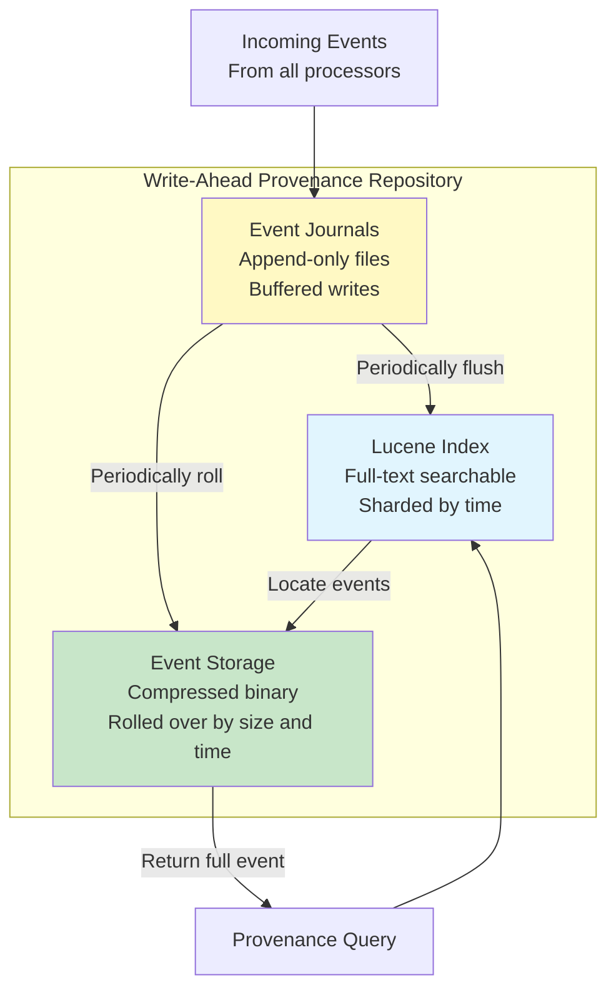
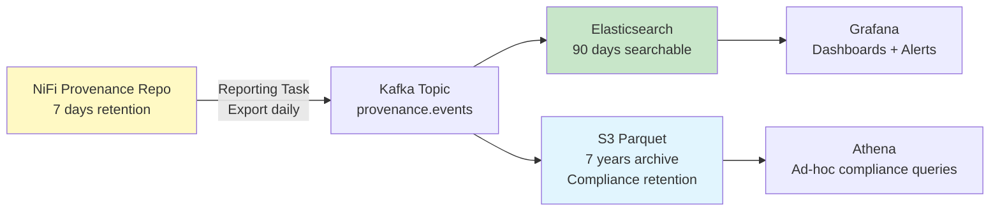

# NiFi Provenance — Senior Deep Dive

## Provenance Repository Internals



```properties
# Advanced repository tuning:
nifi.provenance.repository.journal.count=16
# Number of journal files (parallel write paths)
# Higher = more write throughput (reduce lock contention)
# Rule: set to CPU cores ÷ 4

nifi.provenance.repository.index.shard.size=500 MB
# Size of each Lucene index shard
# Smaller shards = faster queries on recent data
# Larger shards = less overhead for long-term storage

nifi.provenance.repository.concurrent.merge.threads=2
# Background index merge threads
# Increase for write-heavy systems (reduces query latency)

nifi.provenance.repository.warm.cache.duration=
# How long to keep recently accessed events in memory cache
```

## Provenance for Regulatory Compliance

### GDPR: Data Subject Access Request

```python
# "Show me all processing events for customer C001's data"

def gdpr_data_subject_request(customer_id):
    """Find all provenance events for a specific customer's data."""
    
    # Query NiFi provenance API:
    query = {
        "provenance": {
            "request": {
                "searchTerms": {
                    "customer_id": customer_id  # Search by attribute
                },
                "maxResults": 10000
            }
        }
    }
    
    events = nifi_api.post("/provenance", query)
    
    # Build compliance report:
    report = {
        "subject": customer_id,
        "data_lifecycle": [],
        "systems_touched": set(),
        "retention_info": {}
    }
    
    for event in events['provenanceEvents']:
        report["data_lifecycle"].append({
            "timestamp": event["eventTime"],
            "action": event["eventType"],
            "processor": event["componentName"],
            "details": event["details"]
        })
        
        if event["eventType"] == "SEND":
            report["systems_touched"].add(event.get("transitUri", "unknown"))
    
    return report
    
# Output:
# {
#   "subject": "C001",
#   "data_lifecycle": [
#     {"timestamp": "2024-03-15T10:30:00Z", "action": "CREATE", "processor": "ConsumeKafka"},
#     {"timestamp": "2024-03-15T10:30:01Z", "action": "CONTENT_MODIFIED", "processor": "ConvertRecord"},
#     {"timestamp": "2024-03-15T10:30:03Z", "action": "SEND", "processor": "PutDatabaseRecord"}
#   ],
#   "systems_touched": ["jdbc:snowflake://...", "s3://data-lake/..."]
# }
```

### SOX: Financial Data Audit Trail

```
# Requirement: Prove every financial transaction was processed unchanged

# Provenance provides:
# 1. Source event (CREATE): when and from where data entered NiFi
# 2. Every transformation (CONTENT_MODIFIED): what changed
# 3. Delivery confirmation (SEND): when data reached target
# 4. Content hash: verify data wasn't corrupted in transit

# Add content hash tracking:
UpdateAttribute (in flow):
  content.hash.md5 = "${content.hash:md5}"  # NiFi EL for content hash
  
# Verify at destination:
# Compare content.hash.md5 attribute with hash of data written to database
# If match: data integrity proven ✓
# If mismatch: investigate (provenance shows where corruption occurred)
```

## Provenance-Based Monitoring

### SLA Tracking from Provenance

```python
# Calculate end-to-end processing time from provenance events:

def calculate_pipeline_sla(flowfile_uuid):
    """Get total processing time for a FlowFile."""
    events = get_provenance_events(flowfile_uuid)
    
    create_event = next(e for e in events if e['eventType'] == 'CREATE')
    send_event = next(e for e in events if e['eventType'] == 'SEND')
    
    create_time = parse_timestamp(create_event['eventTime'])
    send_time = parse_timestamp(send_event['eventTime'])
    
    processing_time_ms = (send_time - create_time).total_seconds() * 1000
    
    return {
        'flowfile_uuid': flowfile_uuid,
        'processing_time_ms': processing_time_ms,
        'sla_met': processing_time_ms < SLA_THRESHOLD_MS,
        'bottleneck': find_longest_gap(events)
    }

def find_longest_gap(events):
    """Find which processor took the longest (the bottleneck)."""
    sorted_events = sorted(events, key=lambda e: e['eventTime'])
    max_gap = 0
    bottleneck = None
    
    for i in range(1, len(sorted_events)):
        gap = time_diff(sorted_events[i-1], sorted_events[i])
        if gap > max_gap:
            max_gap = gap
            bottleneck = sorted_events[i]['componentName']
    
    return {'processor': bottleneck, 'duration_ms': max_gap}
```

### Automated Anomaly Detection

```python
# Detect processing anomalies using provenance patterns:

def detect_anomalies():
    """Check for unusual provenance patterns."""
    anomalies = []
    
    # Anomaly 1: Unusual DROP rate
    drops = count_events(event_type='DROP', time_range='last_hour')
    if drops > NORMAL_DROP_RATE * 3:
        anomalies.append(f"High DROP rate: {drops}/hour (normal: {NORMAL_DROP_RATE})")
    
    # Anomaly 2: Processing time spike
    avg_time = avg_processing_time(time_range='last_15min')
    if avg_time > NORMAL_AVG_TIME * 2:
        anomalies.append(f"Processing time doubled: {avg_time}ms (normal: {NORMAL_AVG_TIME}ms)")
    
    # Anomaly 3: Unexpected CONTENT_MODIFIED events
    # (Someone changed flow logic → data being transformed differently)
    modified_processors = get_content_modified_processors(time_range='last_hour')
    for proc in modified_processors:
        if proc not in EXPECTED_MODIFIERS:
            anomalies.append(f"Unexpected content modification by: {proc}")
    
    return anomalies
```

## Long-Term Provenance Archival



```
# Architecture for long-term provenance:
# NiFi: 7 days (operational debugging)
# Elasticsearch: 90 days (dashboards, recent queries)
# S3/Parquet: 7 years (regulatory compliance, cold storage)

# Export format (to Kafka/S3):
{
  "eventId": 1589234,
  "eventType": "SEND",
  "timestamp": "2024-03-15T10:30:05.123Z",
  "componentId": "3f7a8b2c-1d4e-5f6a",
  "componentName": "PutDatabaseRecord",
  "componentType": "org.apache.nifi.processors.standard.PutDatabaseRecord",
  "flowFileUuid": "a1b2c3d4-e5f6-7890",
  "fileSize": 52428800,
  "attributes": {
    "filename": "orders_2024-03-15.json",
    "source.system": "shopify",
    "record.count": "125000"
  },
  "transitUri": "jdbc:snowflake://company.snowflakecomputing.com",
  "cluster.node": "nifi-node-2",
  "application": "production-nifi-cluster"
}
```

## Interview Tips

> **Tip 1:** "How do you use provenance for compliance?" — Provenance proves data handling: when data entered (CREATE), every transformation (CONTENT_MODIFIED), where it was delivered (SEND). For GDPR: search by customer_id attribute → get complete processing history. For SOX: prove financial data wasn't altered (content hash + provenance chain). Export to long-term storage (S3) for retention requirements.

> **Tip 2:** "How do you handle provenance at high scale?" — (1) Dedicated SSD for provenance repository. (2) Increase journal count (16+) for write parallelism. (3) Keep NiFi retention short (7 days). (4) Export to Elasticsearch for 90-day search. (5) Archive to S3/Parquet for long-term compliance. (6) For extreme throughput: VolatileProvenanceRepository (memory-only, if audit trail not required).

> **Tip 3:** "How does provenance help with SLA monitoring?" — Calculate processing time from CREATE event timestamp to SEND event timestamp per FlowFile. Find bottlenecks: longest gap between consecutive events identifies the slow processor. Aggregate across FlowFiles: p95/p99 processing time metrics. Alert: when p95 > SLA threshold. All from provenance data — no additional instrumentation needed.

## ⚡ Cheat Sheet

**Core NiFi concepts**
```
FlowFile:    unit of data (content + attributes map)
Processor:   transforms/routes FlowFiles (GetFile, PutS3Object, RouteOnAttribute, etc.)
Connection:  queue between processors with back-pressure settings
Process Group: logical grouping of processors (like a subflow)
Controller Service: shared resource (DBCPConnectionPool, SSLContextService, etc.)
```

**Back-pressure settings**
```
Back Pressure Object Threshold: max FlowFiles in queue before upstream pauses
Back Pressure Data Size Threshold: max bytes in queue before upstream pauses
Typical: 10,000 objects / 1 GB — tune based on downstream throughput
When both thresholds hit → upstream processor stops scheduling
```

**Expression Language (attribute-based routing)**
```
${filename}                    — attribute value
${filename:toUpper()}          — uppercase
${fileSize:gt(1000000)}        — > 1 MB (returns true/false)
${filename:startsWith('order')} — prefix check
${now():format('yyyy-MM-dd')}  — current date
${uuid()}                      — generate UUID
${field.value:trim():toLower()} — chain functions
```

**Key processors**
```
GetFile / ListFile + FetchFile  — ingest from filesystem
GetSFTP / PutSFTP               — SFTP in/out
GetKafka / PublishKafka         — Kafka consumer/producer
ExecuteSQL / QueryDatabaseTable — SQL source
PutDatabaseRecord               — write to RDBMS
MergeContent                    — batch small files into larger ones
SplitRecord / SplitText         — split large FlowFiles
RouteOnAttribute / RouteOnContent — conditional routing
ConvertRecord                   — CSV ↔ JSON ↔ Avro ↔ Parquet
```

**Record-based processing**
```
Record Reader + Record Writer → schema-aware processing
Avoids row-by-row FlowFile per record — bulk processing in one FlowFile
Readers: CSVReader, JsonTreeReader, AvroReader, ParquetReader
Writers: CSVRecordSetWriter, JsonRecordSetWriter, ParquetRecordSetWriter
Schema: from Schema Registry (Confluent), from attribute, or inferred
```

**Clustering (NiFi cluster)**
```
Zero-Master: all nodes are peers; one elected Coordinator via ZooKeeper
Primary Node: handles scheduled processors once per cluster (GetFile, etc.)
Load balancing: connections can load-balance FlowFiles across nodes
State Provider: ZooKeeper stores distributed state (watermarks, offsets)
```

**Provenance (lineage)**
```
Every FlowFile event recorded: RECEIVE, SEND, FETCH, DROP, FORK, JOIN, CONTENT_MODIFIED
Searchable by: filename, UUID, attribute, component, time range
Replay: any FlowFile can be replayed from any point in provenance chain
Retention: configurable (default 24h); archive to external storage for longer
```

**Key interview points**
- NiFi is best for: heterogeneous data ingestion, protocol translation, low-code ETL
- Not ideal for: complex transformations (use Spark/dbt), high-throughput ML pipelines
- Site-to-Site (S2S): secure data transfer between NiFi instances (no Kafka needed)
- MiNiFi: lightweight NiFi agent for edge devices (IoT, network equipment)
- NiFi vs Kafka: NiFi = data routing/transformation; Kafka = durable messaging queue
