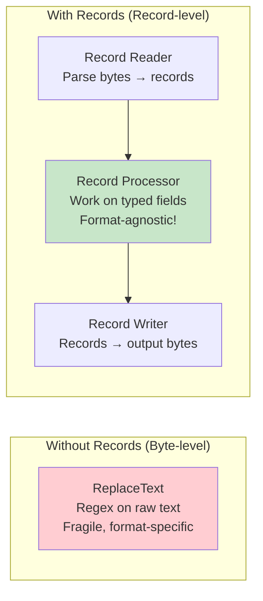
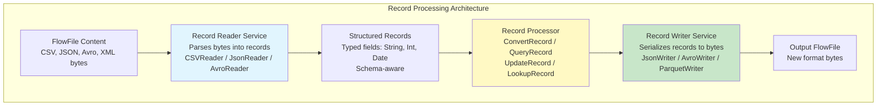
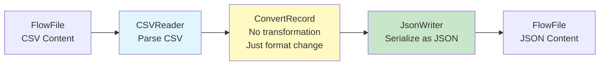
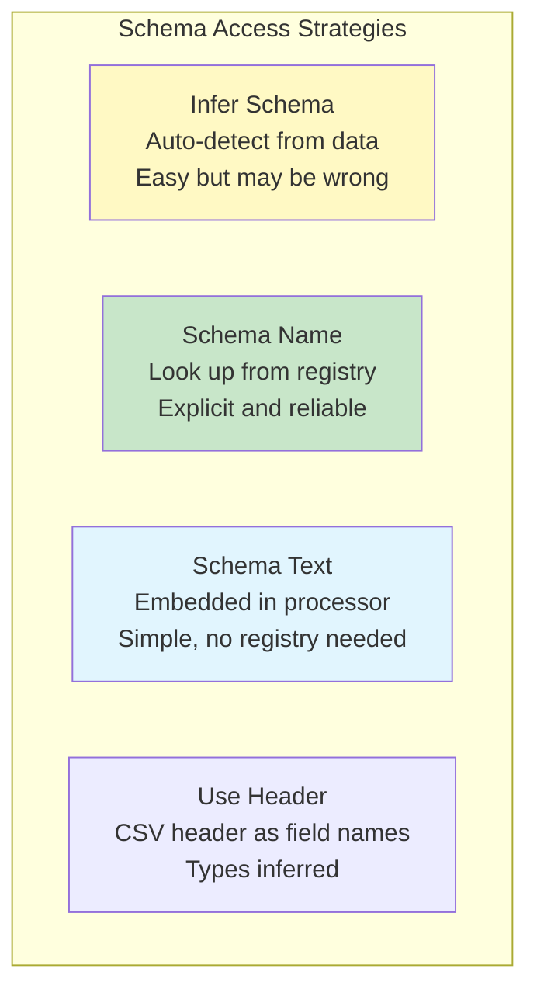

# NiFi Record-Based Processing — Fundamentals


## 🎯 Analogy

Think of record-based processing in NiFi like processing a spreadsheet row by row instead of treating the whole file as one blob: the ConvertRecord processor reads individual records, transforms them, and writes them — enabling schema validation, type coercion, and format conversion in one step.

---
## What is Record-Based Processing?

Record-based processing treats FlowFile content as a **collection of structured records** rather than raw bytes. Instead of manipulating text/bytes directly, you work with typed fields, schemas, and record-level operations.



## Why Record-Based Processing?

| Old Way (Byte Processing) | New Way (Record Processing) |
|--------------------------|---------------------------|
| Format-specific logic | Format-agnostic operations |
| Regex text manipulation | Typed field access |
| One processor per format | Same processor, different reader/writer |
| Fragile (breaks on format change) | Robust (schema-driven) |
| Hard to validate | Schema validation built-in |
| CSV→JSON requires multiple steps | CSV→JSON in ONE ConvertRecord |

## Core Architecture



## Record Readers (Input Parsers)

| Reader | Parses | Example Input |
|--------|--------|---------------|
| **CSVReader** | CSV/TSV files | `id,name,amount\n1,Alice,99.99` |
| **JsonTreeReader** | JSON objects/arrays | `[{"id":1,"name":"Alice"}]` |
| **AvroReader** | Apache Avro binary | Binary Avro container file |
| **ParquetReader** | Apache Parquet | Columnar binary file |
| **XMLReader** | XML documents | `<records><record>...</record></records>` |
| **GrokReader** | Log files (regex patterns) | Apache/Nginx access logs |

## Record Writers (Output Serializers)

| Writer | Produces | Example Output |
|--------|----------|----------------|
| **JsonRecordSetWriter** | JSON arrays | `[{"id":1,"name":"Alice"}]` |
| **CSVRecordSetWriter** | CSV with header | `id,name,amount\n1,Alice,99.99` |
| **AvroRecordSetWriter** | Avro binary + schema | Binary Avro container |
| **ParquetRecordSetWriter** | Parquet columnar | Binary Parquet file |
| **FreeFormTextRecordSetWriter** | Custom text format | Templated output |

## Basic Example: CSV to JSON Conversion



```
Input (CSV):
order_id,customer,amount,date
1001,Alice,99.99,2024-03-15
1002,Bob,49.50,2024-03-15

ConvertRecord Configuration:
  Record Reader: CSVReader
  Record Writer: JsonRecordSetWriter

Output (JSON):
[
  {"order_id": "1001", "customer": "Alice", "amount": 99.99, "date": "2024-03-15"},
  {"order_id": "1002", "customer": "Bob", "amount": 49.50, "date": "2024-03-15"}
]
```

## Schema Strategies

Records need schemas to define field names, types, and structure:



```
# CSVReader with inferred schema:
CSVReader:
  Schema Access Strategy: Infer Schema
  Treat First Line as Header: true
  # NiFi guesses types from data (string, int, float)

# JsonTreeReader with explicit schema:
JsonTreeReader:
  Schema Access Strategy: Schema Name
  Schema Registry: AvroSchemaRegistry
  Schema Name: order_schema_v1
  # Exact types enforced from registry schema
  
# Explicit schema text (inline):
Schema Text: {
  "type": "record",
  "name": "Order",
  "fields": [
    {"name": "order_id", "type": "string"},
    {"name": "customer", "type": "string"},
    {"name": "amount", "type": "double"},
    {"name": "date", "type": "string"}
  ]
}
```

## Key Record Processors

### ConvertRecord (Format Conversion)
```
Reader: CSVReader → Writer: AvroWriter = CSV to Avro
Reader: JsonReader → Writer: ParquetWriter = JSON to Parquet
Reader: AvroReader → Writer: CSVWriter = Avro to CSV
# Any format to any format! One processor does it all.
```

### QueryRecord (SQL Filtering/Aggregation)
```sql
-- Run SQL on FlowFile content (no database needed!):
-- Property name = relationship name, value = SQL query

high_value:
  SELECT * FROM FLOWFILE WHERE amount > 100

summary:
  SELECT region, COUNT(*) as orders, SUM(amount) as total
  FROM FLOWFILE GROUP BY region
```

### UpdateRecord (Modify Fields)
```
-- Set/update record fields using Record Path:
/status = "processed"
/amount_usd = multiply(/amount, /fx_rate)
/full_name = concat(/first_name, ' ', /last_name)
/processed_at = now()
```

### ValidateRecord (Schema Validation)
```
ValidateRecord:
  Record Reader: JsonTreeReader
  Record Writer: JsonRecordSetWriter (for valid records)
  Invalid Record Writer: JsonRecordSetWriter (for invalid records)
  Schema: order_schema_v1
  Allow Extra Fields: false
  Strict Type Checking: true
  
# Valid records → "valid" relationship
# Invalid records → "invalid" relationship (with error details)
```

## Record Count Attribute

After record processing, NiFi sets the `record.count` attribute:

```
# After ConvertRecord processes a 10,000-row CSV:
record.count = "10000"

# Useful for:
# - Monitoring (how many records processed?)
# - Routing (${record.count:gt(0)} → only non-empty FlowFiles)
# - Alerting (${record.count:lt(1000)} → unexpectedly small batch)
```


## ▶️ Try It Yourself

```bash
# Record-based processing pipeline in NiFi:
# GetFile -> ConvertRecord -> PutDatabaseRecord

# ConvertRecord configuration:
# Record Reader:  JsonTreeReader (with schema)
# Record Writer:  AvroRecordSetWriter
# Schema name:    orders_schema (from AvroSchemaRegistry)

# Schema example (registered in AvroSchemaRegistry controller service):
# {
#   "type": "record",
#   "name": "Order",
#   "fields": [
#     {"name": "order_id", "type": "long"},
#     {"name": "amount",   "type": "double"},
#     {"name": "region",   "type": "string"},
#     {"name": "order_date", "type": {"type": "int", "logicalType": "date"}}
#   ]
# }

# Benefits of record-based processing:
# - Validate each record against a schema
# - Convert formats without custom scripts (JSON->Parquet, CSV->Avro)
# - Write directly to DB with PutDatabaseRecord (INSERT/UPSERT)
# - Parallel processing: ConvertRecord processes one record at a time

echo "Record processors: ConvertRecord, SplitRecord, MergeRecord, QueryRecord (SQL)"  
```

> **Run it:** Copy the snippet into a REPL or file — no external services needed for the basic example.

---
## Interview Tips

> **Tip 1:** "What is record-based processing in NiFi?" — A processing paradigm where FlowFile content is parsed into structured records (via Record Reader), processed at the field level (via Record Processors), and serialized back (via Record Writer). Format-agnostic: same processor works on CSV, JSON, Avro, Parquet. Enables: format conversion, SQL filtering, field updates, schema validation — all without format-specific code.

> **Tip 2:** "How does ConvertRecord work?" — It takes a Record Reader (input format) and Record Writer (output format) as controller services. Reads input bytes → records → writes records in new format. CSV→JSON, JSON→Avro, Avro→Parquet — all in one processor. No transformation logic needed — just format change. Add UpdateRecord before/after for field-level changes.

> **Tip 3:** "What's the advantage over text manipulation (ReplaceText, regex)?" — Record processing is: (1) Type-safe (knows amount is a number, not just text). (2) Schema-aware (validates structure). (3) Format-independent (same logic works on CSV or JSON). (4) More readable (SQL in QueryRecord vs complex regex). (5) Performant (optimized record handling vs line-by-line text parsing).
