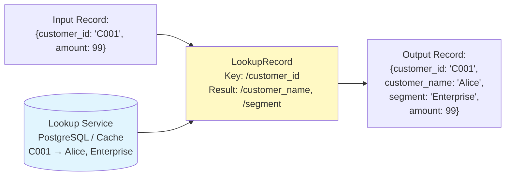

# NiFi Record-Based Processing — Intermediate Concepts

## QueryRecord Deep Dive

QueryRecord is one of NiFi's most powerful processors — run SQL directly on FlowFile content:

```sql
-- Each property name becomes a RELATIONSHIP (output port):
-- FlowFiles route to matching query results

-- Property: "us_high_value" → relationship "us_high_value"
SELECT order_id, customer_name, amount, region
FROM FLOWFILE
WHERE region = 'US' AND amount > 1000

-- Property: "summary_by_region" → relationship "summary_by_region"
SELECT 
    region,
    COUNT(*) AS order_count,
    SUM(amount) AS total_revenue,
    AVG(amount) AS avg_order_value,
    MAX(amount) AS max_order
FROM FLOWFILE
GROUP BY region

-- Property: "joined_data" → join multiple record sets (same FlowFile!)
SELECT a.order_id, a.amount, b.customer_name
FROM FLOWFILE a
INNER JOIN FLOWFILE b ON a.customer_id = b.customer_id
-- NOTE: Self-join works within same FlowFile's records!
```

### QueryRecord for Data Quality

```sql
-- Split FlowFile into valid and invalid records:

-- Property: "valid_records"
SELECT * FROM FLOWFILE
WHERE customer_id IS NOT NULL
  AND amount > 0
  AND email LIKE '%@%'
  AND order_date IS NOT NULL

-- Property: "invalid_records"  
SELECT *, 
    CASE 
        WHEN customer_id IS NULL THEN 'missing_customer_id'
        WHEN amount <= 0 THEN 'invalid_amount'
        WHEN email NOT LIKE '%@%' THEN 'invalid_email'
        WHEN order_date IS NULL THEN 'missing_date'
    END AS validation_error
FROM FLOWFILE
WHERE customer_id IS NULL
   OR amount <= 0
   OR email NOT LIKE '%@%'
   OR order_date IS NULL
```

## LookupRecord (Enrichment)

Enrich records by looking up values from an external source:



```
LookupRecord Configuration:
  Record Reader: JsonTreeReader
  Record Writer: JsonRecordSetWriter
  Lookup Service: SimpleDatabaseLookupService
  
  # Lookup mapping:
  Result RecordPath: /customer_name      # Where to PUT the result
  Key Field: /customer_id               # Record field to lookup BY
  
  # For multiple lookup values:
  Result RecordPath 1: /customer_name
  Result RecordPath 2: /segment
  Result RecordPath 3: /region
  
  # Lookup returns: all configured columns from the lookup table
  # If key not found: field left null (or route to "unmatched")
```

### Cached Lookups for Performance

```
SimpleDatabaseLookupService:
  Database Connection: PostgreSQL_Pool
  Table Name: dim_customer
  Lookup Key Column: customer_id
  Lookup Value Columns: customer_name, segment, region
  Cache Size: 50000          # Cache 50K entries in memory!
  Cache Expiration: 5 min    # Refresh every 5 minutes
  
# Performance impact:
# Without cache: 100K records × 1 DB query per record = 100K queries (slow!)
# With cache: ~10K unique customers → 10K cache misses (DB) + 90K cache hits (instant)
# Result: 90% fewer DB queries → 10x faster processing!
```

## PartitionRecord

Split a FlowFile into multiple FlowFiles based on field values:

```
PartitionRecord:
  Record Reader: JsonTreeReader
  Record Writer: JsonRecordSetWriter
  Partition Field: region

# Input: 1 FlowFile with 10,000 records (mixed regions)
# Output: Multiple FlowFiles, one per unique region value:
#   FlowFile 1: 3,000 records where region="US"
#     attribute: partition.region = "US"
#   FlowFile 2: 4,000 records where region="EU"  
#     attribute: partition.region = "EU"
#   FlowFile 3: 3,000 records where region="APAC"
#     attribute: partition.region = "APAC"

# Use case: Write to different S3 paths by region:
PutS3Object:
  Object Key: data/region=${partition.region}/${filename}
  # US records → data/region=US/...
  # EU records → data/region=EU/...
```

## SplitRecord and MergeRecord

### SplitRecord (Reduce batch size)

```
SplitRecord:
  Record Reader: AvroReader
  Record Writer: AvroRecordSetWriter
  Records Per Split: 5000
  
# Input: 1 FlowFile with 50,000 records
# Output: 10 FlowFiles with 5,000 records each
# Each output FlowFile has: fragment.identifier, fragment.index, fragment.count
# Use: Break large batches for parallel processing
```

### MergeRecord (Increase batch size)

```
MergeRecord:
  Record Reader: JsonTreeReader
  Record Writer: AvroRecordSetWriter    # Can change format during merge!
  Minimum Number of Records: 10000
  Maximum Number of Records: 50000
  Max Bin Age: 30 sec
  Merge Strategy: Bin-Packing Algorithm
  
# Input: Many small FlowFiles (e.g., 1 record each from Kafka)
# Output: Larger FlowFiles with 10K-50K records
# ALSO converts format: JSON input → Avro output (during merge!)
# Use: Batch before database writes or S3 uploads
```

## UpdateRecord (Field-Level Modifications)

```
UpdateRecord:
  Record Reader: JsonTreeReader
  Record Writer: JsonRecordSetWriter
  
  # Record Path expressions for field updates:
  /status = "processed"
  /processed_at = now()
  /amount_usd = multiply(/amount, /fx_rate)
  /full_name = concat(/first_name, ' ', /last_name)
  /email_domain = substringAfter(/email, '@')
  /is_high_value = /amount > 1000
  
  # Conditional updates:
  /priority = if(/amount > 10000, 'critical', if(/amount > 1000, 'high', 'normal'))
  
  # Null handling:
  /city = coalesce(/shipping_city, /billing_city, 'Unknown')
```

## Schema Evolution

Handling schema changes gracefully:

```
# Scenario: Source adds a new column "loyalty_points"
# Old records: {order_id, customer, amount}
# New records: {order_id, customer, amount, loyalty_points}

# Strategy 1: Schema with Optional Fields
Schema:
  fields: [
    {"name": "order_id", "type": "string"},
    {"name": "customer", "type": "string"},
    {"name": "amount", "type": "double"},
    {"name": "loyalty_points", "type": ["null", "int"], "default": null}
  ]
# Old records: loyalty_points = null (field is optional)
# New records: loyalty_points = value
# No processing failure!

# Strategy 2: Allow Extra Fields
ValidateRecord:
  Allow Extra Fields: true
  # New fields pass through without schema change

# Strategy 3: Schema versioning
# v1: without loyalty_points
# v2: with loyalty_points
# Route by schema version → different processing paths
```

## Performance: Record vs. Byte Processing

```
# Benchmark comparison (10M records, CSV→JSON):

# Byte approach (ReplaceText + multiple processors):
# Time: 45 minutes (regex per line, multiple passes)
# Memory: High (full content in memory for regex)
# Maintenance: Fragile (regex breaks on schema change)

# Record approach (ConvertRecord):
# Time: 3 minutes (streaming record-by-record)
# Memory: Low (streaming, constant memory)
# Maintenance: Robust (schema-driven, handles evolution)

# Key reason: Record processors STREAM records (never load all in memory)
# 10GB file processes with same memory as 10KB file!
```

## Interview Tips

> **Tip 1:** "How does QueryRecord compare to a database?" — QueryRecord runs Apache Calcite SQL engine on FlowFile content IN-MEMORY (no external database). Supports: SELECT, WHERE, GROUP BY, JOIN, window functions. Each query becomes a relationship (output port). Perfect for: filtering (WHERE), aggregation (GROUP BY), and projecting (SELECT specific columns). Limitation: no indexes, so large FlowFiles may be slower than a database for complex queries.

> **Tip 2:** "How do you handle schema evolution?" — Three approaches: (1) Optional fields with defaults in Avro schema (`["null", "type"]`). (2) Allow Extra Fields in ValidateRecord (new fields pass through). (3) Schema versioning in registry (multiple versions coexist). Best practice: make new fields optional with defaults → backward compatible. No flow changes needed when sources add columns.

> **Tip 3:** "When to use PartitionRecord vs RouteOnAttribute?" — PartitionRecord splits by RECORD FIELD values (content-level — "region" field in each record). RouteOnAttribute routes by FlowFile ATTRIBUTE values (metadata-level — "source.system" attribute). Use Partition when different records in the SAME FlowFile need different paths. Use Route when entire FlowFiles need different paths based on their metadata.
