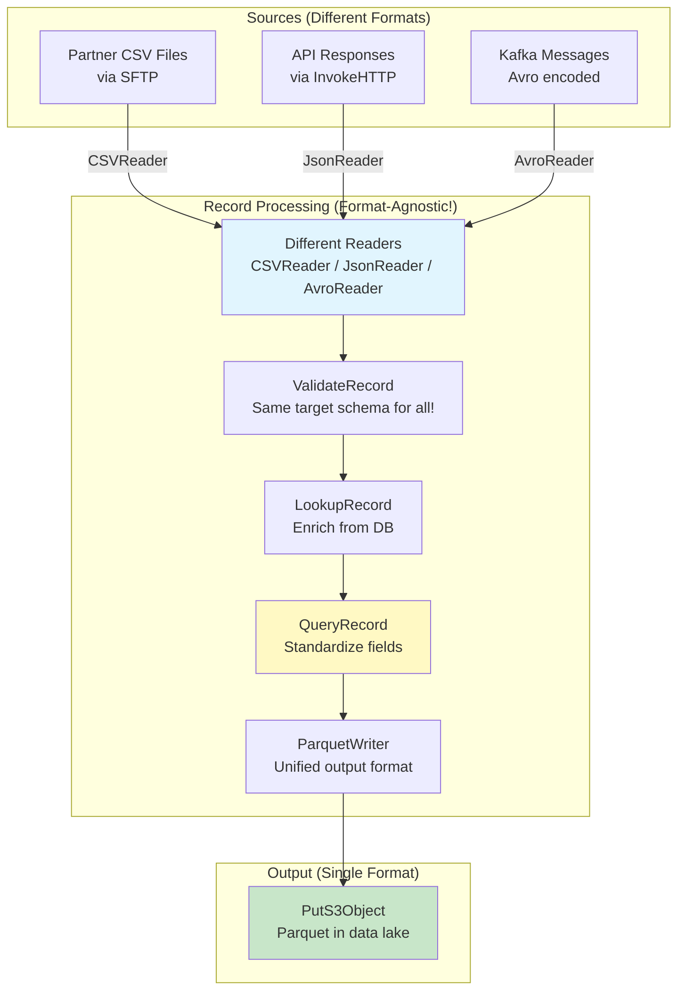
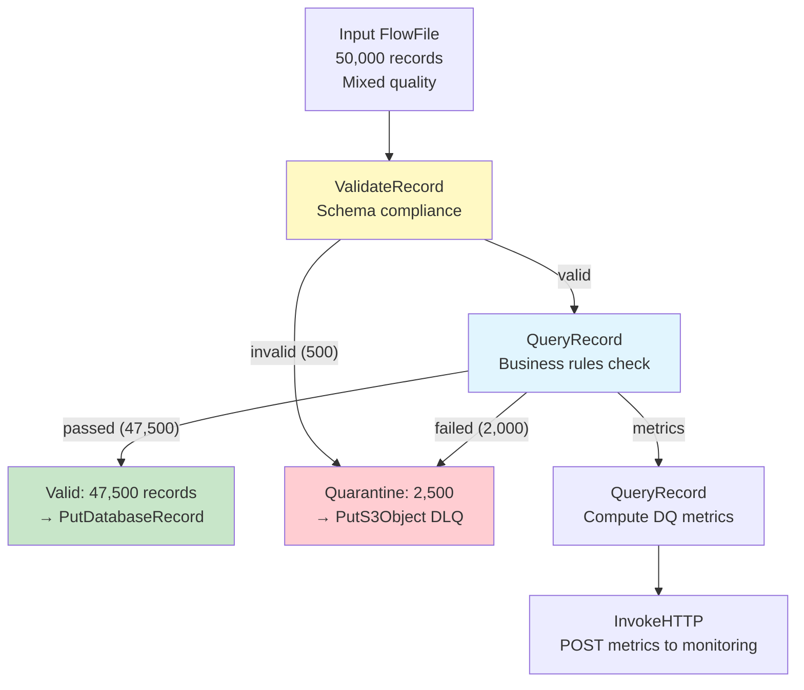

# NiFi Record-Based Processing — Real-World Production Examples

## Example 1: Multi-Format ETL Pipeline



### Configuration

```
# Three different readers (one per source):
CSVReader "partner_csv":
  Schema Access Strategy: Schema Name
  Schema Registry: ConfluentSchemaRegistry
  Schema Name: partner_orders_v1
  Treat First Line as Header: true
  Value Separator: |            # Partner uses pipe-delimited!

JsonTreeReader "api_json":
  Schema Access Strategy: Schema Name
  Schema Registry: ConfluentSchemaRegistry
  Schema Name: api_orders_v2

AvroReader "kafka_avro":
  Schema Access Strategy: Schema from Schema Registry
  Schema Registry: ConfluentSchemaRegistry
  # Schema embedded in Avro container

# Single writer (unified output):
ParquetRecordSetWriter "lake_parquet":
  Schema Access Strategy: Schema Name
  Schema Registry: ConfluentSchemaRegistry
  Schema Name: canonical_order_v1    # Target schema!
  Compression Type: SNAPPY

# Standardization query (handles field name differences):
QueryRecord:
  Record Reader: ${source.reader}   # Dynamic! Based on source attribute
  Record Writer: ParquetRecordSetWriter
  
  standardized:
    SELECT
      COALESCE(order_id, orderNumber, id) AS order_id,
      COALESCE(customer_id, customerId, cust_id) AS customer_id,
      CAST(COALESCE(amount, total_amount, order_total) AS DOUBLE) AS amount,
      COALESCE(order_date, created_at, timestamp) AS order_date,
      'standardized' AS processing_status
    FROM FLOWFILE
```

## Example 2: Real-Time Customer 360 Enrichment

```
# Pipeline: Enrich every event with full customer profile

# Flow:
# ConsumeKafka (events) → MergeRecord (batch 5K) 
#   → LookupRecord (customer profile)
#   → LookupRecord (account status)  
#   → QueryRecord (compute derived fields)
#   → PutDatabaseRecord (write enriched events)

# LookupRecord #1: Customer Profile
LookupRecord:
  Record Reader: AvroReader
  Record Writer: AvroRecordSetWriter
  Lookup Service: CachedDatabaseLookup_Customers
  Result RecordPath: /customer_name
  Routing Strategy: route to 'matched'/'unmatched'
  
  # Additional result paths:
  /customer_segment from lookup
  /customer_region from lookup
  /customer_lifetime_value from lookup

# LookupRecord #2: Account Status  
LookupRecord:
  Lookup Service: CachedDatabaseLookup_Accounts
  Key: /account_id
  Result: /account_status, /account_tier, /credit_limit

# QueryRecord: Compute derived fields
QueryRecord:
  enriched_events:
    SELECT *,
      CASE 
        WHEN customer_lifetime_value > 10000 THEN 'VIP'
        WHEN customer_lifetime_value > 1000 THEN 'valued'
        ELSE 'standard'
      END AS customer_tier,
      amount / NULLIF(credit_limit, 0) * 100 AS credit_utilization_pct,
      CASE 
        WHEN amount > credit_limit THEN true 
        ELSE false 
      END AS over_credit_limit
    FROM FLOWFILE
```

## Example 3: Data Quality with Record Processing



```sql
-- QueryRecord: Business Rules DQ Check

-- Property: "passed" (records meeting all quality rules)
SELECT * FROM FLOWFILE
WHERE customer_id IS NOT NULL
  AND amount BETWEEN 0.01 AND 999999.99
  AND order_date >= '2020-01-01'
  AND order_date <= CURRENT_DATE
  AND email LIKE '%@%.%'
  AND region IN ('US', 'EU', 'APAC', 'LATAM')

-- Property: "failed" (records failing quality, with reason)
SELECT *, 
  CASE
    WHEN customer_id IS NULL THEN 'NULL_CUSTOMER_ID'
    WHEN amount <= 0 OR amount > 999999.99 THEN 'INVALID_AMOUNT'
    WHEN order_date < '2020-01-01' OR order_date > CURRENT_DATE THEN 'INVALID_DATE'
    WHEN email NOT LIKE '%@%.%' THEN 'INVALID_EMAIL'
    WHEN region NOT IN ('US', 'EU', 'APAC', 'LATAM') THEN 'INVALID_REGION'
    ELSE 'UNKNOWN'
  END AS failure_reason
FROM FLOWFILE
WHERE customer_id IS NULL
   OR amount <= 0 OR amount > 999999.99
   OR order_date < '2020-01-01' OR order_date > CURRENT_DATE
   OR email NOT LIKE '%@%.%'
   OR region NOT IN ('US', 'EU', 'APAC', 'LATAM')

-- Property: "metrics" (aggregated quality metrics)
SELECT
  COUNT(*) AS total_records,
  SUM(CASE WHEN customer_id IS NULL THEN 1 ELSE 0 END) AS null_customer_count,
  SUM(CASE WHEN amount <= 0 THEN 1 ELSE 0 END) AS invalid_amount_count,
  SUM(CASE WHEN email NOT LIKE '%@%.%' THEN 1 ELSE 0 END) AS invalid_email_count,
  CAST(SUM(CASE WHEN customer_id IS NOT NULL AND amount > 0 AND email LIKE '%@%.%' THEN 1 ELSE 0 END) AS DOUBLE) 
    / COUNT(*) * 100 AS quality_score_pct
FROM FLOWFILE
```

## Example 4: Record-Based CDC Processing

```
# Process CDC events and apply to target database:

# Input (from Debezium via Kafka, Avro format):
# {"before": {...}, "after": {...}, "op": "u", "source": {...}}

# Step 1: Parse CDC envelope
QueryRecord:
  Reader: AvroReader (Debezium envelope schema)
  Writer: JsonRecordSetWriter
  
  inserts:
    SELECT after.* FROM FLOWFILE WHERE op = 'c'   -- Create
  
  updates:
    SELECT after.* FROM FLOWFILE WHERE op = 'u'   -- Update
  
  deletes:
    SELECT before.customer_id FROM FLOWFILE WHERE op = 'd'  -- Delete

# Step 2: Apply inserts
PutDatabaseRecord (inserts relationship):
  Statement Type: INSERT
  Table Name: target.customers

# Step 3: Apply updates  
PutDatabaseRecord (updates relationship):
  Statement Type: UPDATE
  Table Name: target.customers
  Update Keys: customer_id    # WHERE clause columns

# Step 4: Apply deletes
PutDatabaseRecord (deletes relationship):
  Statement Type: DELETE
  Table Name: target.customers
  # DELETE WHERE customer_id = ?
```

## Interview Tips

> **Tip 1:** "How do you handle multiple input formats going to one target?" — Different Record Reader per source format (CSVReader, JsonReader, AvroReader). Same target schema in the Record Writer. QueryRecord with COALESCE handles field name differences across sources (`COALESCE(order_id, orderNumber, id) AS order_id`). Result: all sources normalized to one canonical schema, written as one output format.

> **Tip 2:** "How do you implement data quality checks with records?" — QueryRecord with two properties: (1) "passed" query with all WHERE conditions (valid records). (2) "failed" query with CASE statement adding failure_reason column. (3) "metrics" query with aggregated counts (quality score). Valid → target DB. Failed → quarantine (S3 with error context). Metrics → monitoring API. All in ONE processor — efficient!

> **Tip 3:** "How do you handle CDC with record processing?" — ConsumeKafka reads CDC events (Debezium format). QueryRecord splits by operation: `WHERE op = 'c'` (inserts), `WHERE op = 'u'` (updates), `WHERE op = 'd'` (deletes). Extract `after.*` for inserts/updates, `before.key` for deletes. Route each to PutDatabaseRecord with appropriate Statement Type (INSERT/UPDATE/DELETE). Handles all DML operations from a single Kafka topic.
