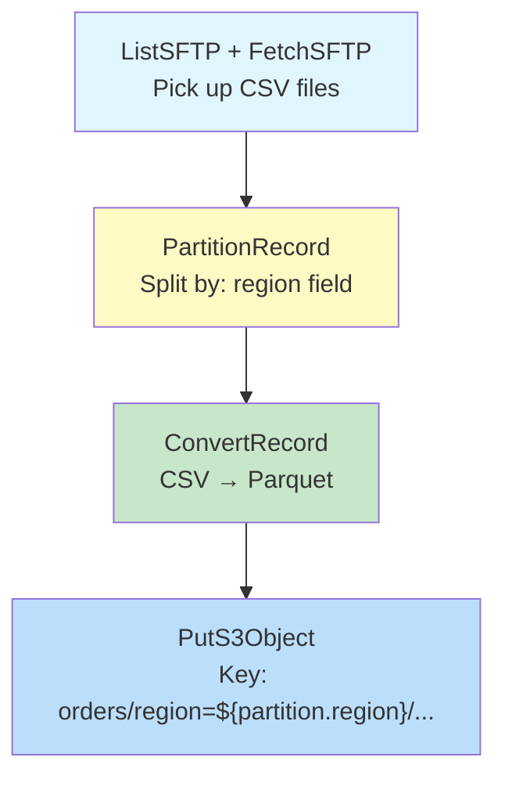
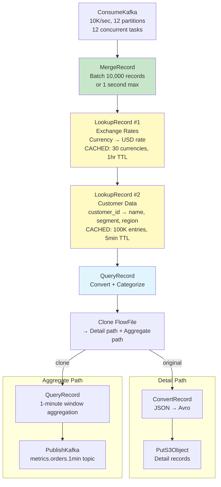
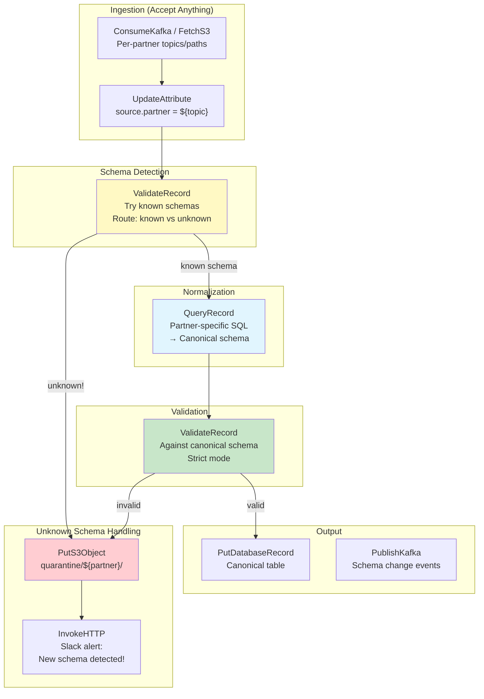

# Scenario Questions — NiFi Record-Based Processing

<article data-difficulty="junior">

## 🟢 Junior: Format Conversion Pipeline

**Scenario:** You receive daily CSV files from a partner via SFTP. The files have: `order_id|customer_name|amount|order_date|region` (pipe-delimited, with header). You need to convert these to Parquet format and write to S3 partitioned by region. Design the record-based processing pipeline, specifying which Record Reader/Writer services you'd configure.

<details>
<summary>💡 Hint</summary>
CSVReader (pipe delimiter, header=true) → PartitionRecord (by region) → ConvertRecord → ParquetWriter → PutS3Object with `${partition.region}` in the path. Remember: ConvertRecord just changes format using Reader+Writer services.
</details>

<details>
<summary>✅ Solution</summary>



**Controller Services:**

```
# 1. CSVReader (input format):
CSVReader:
  Schema Access Strategy: Infer Schema
  Treat First Line as Header: true
  Value Separator: |              # Pipe-delimited!
  Quote Character: "
  Escape Character: \
  Comment Marker: #
  # Infers: order_id(string), customer_name(string), 
  #          amount(double), order_date(string), region(string)

# 2. ParquetRecordSetWriter (output format):
ParquetRecordSetWriter:
  Schema Access Strategy: Inherit Record Schema
  # Uses schema from the Reader (inferred or explicit)
  Compression Type: SNAPPY
  # Parquet + Snappy = optimal for analytics queries

# 3. Alternative: Explicit schema for type safety:
AvroSchemaRegistry:
  order_schema:
    {
      "type": "record",
      "name": "Order",
      "fields": [
        {"name": "order_id", "type": "string"},
        {"name": "customer_name", "type": "string"},
        {"name": "amount", "type": "double"},
        {"name": "order_date", "type": "string"},
        {"name": "region", "type": "string"}
      ]
    }
```

**Processor Configurations:**

```
# PartitionRecord:
PartitionRecord:
  Record Reader: CSVReader
  Record Writer: CSVRecordSetWriter    # Keep CSV format between partition + convert
  Partition Field: region
  
  # Input: 1 FlowFile with 50,000 records (mixed regions)
  # Output: 
  #   FlowFile 1: records where region="US", attribute: partition.region="US"
  #   FlowFile 2: records where region="EU", attribute: partition.region="EU"
  #   FlowFile 3: records where region="APAC", attribute: partition.region="APAC"

# ConvertRecord:
ConvertRecord:
  Record Reader: CSVReader             # Reads the partitioned CSV
  Record Writer: ParquetRecordSetWriter  # Outputs as Parquet
  # No transformation — just format change!

# PutS3Object:
PutS3Object:
  Bucket: data-lake-processed
  Object Key: orders/region=${partition.region}/date=${now():format('yyyy-MM-dd')}/${UUID()}.parquet
  Region: us-east-1
  # Result paths:
  #   orders/region=US/date=2024-03-15/a1b2c3d4.parquet
  #   orders/region=EU/date=2024-03-15/e5f6g7h8.parquet
  #   orders/region=APAC/date=2024-03-15/i9j0k1l2.parquet
```

**Key Points:**
- **CSVReader** handles pipe-delimited (just change Value Separator)
- **PartitionRecord** creates one FlowFile per unique region value
- **ConvertRecord** changes CSV→Parquet (one processor, Reader+Writer services do the work)
- **PutS3Object** uses `${partition.region}` in path for Hive-style partitioning
- **No custom code** — all declarative configuration
- **Parquet + Snappy** = optimal for downstream Athena/Spark/Snowflake queries

</details>

</article>

<article data-difficulty="mid-level">

## 🟡 Mid-Level: Complex Enrichment Pipeline

**Scenario:** You receive JSON events from Kafka (10K/sec) with structure: `{"event_id", "customer_id", "product_id", "amount", "currency", "timestamp"}`. Build a record processing pipeline that: (1) converts amount to USD using exchange rates from a database table, (2) enriches with customer name and segment from a customer table, (3) categorizes into "high/medium/low" value based on USD amount, (4) aggregates into 1-minute windows (sum per region), and (5) outputs both detail records (Avro to S3) and aggregated metrics (JSON to Kafka). Design with performance in mind for 10K/sec.

<details>
<summary>💡 Hint</summary>
Key performance consideration: use CACHED lookups (don't query DB per record!). Batch with MergeRecord first. Use QueryRecord for both currency conversion AND categorization (one pass). Aggregate with QueryRecord GROUP BY. Clone FlowFile for dual output (S3 + Kafka). Consider: 10K/sec × 60 sec = 600K records per minute window.
</details>

<details>
<summary>✅ Solution</summary>



**Controller Services:**

```
# Exchange Rate Lookup (CACHED — only ~30 currencies):
SimpleDatabaseLookupService "FX_Rates":
  Database Connection: PostgreSQL_Pool
  Table Name: ref.exchange_rates
  Lookup Key Column: currency_code
  Lookup Value Columns: usd_rate
  Cache Size: 100           # All currencies fit!
  Cache Expiration: 1 hour  # Rates update hourly

# Customer Lookup (CACHED — 100K customers):
SimpleDatabaseLookupService "Customer_Lookup":
  Database Connection: PostgreSQL_Pool
  Table Name: dim.customers
  Lookup Key Column: customer_id
  Lookup Value Columns: customer_name, segment, region
  Cache Size: 100000        # All active customers cached!
  Cache Expiration: 5 min   # Fresh enough for enrichment
```

**QueryRecord (Transform + Categorize in ONE query):**

```sql
-- Property: "enriched" (single relationship)
SELECT
    event_id,
    customer_id,
    customer_name,              -- From LookupRecord
    segment,                    -- From LookupRecord
    region,                     -- From LookupRecord
    product_id,
    amount,
    currency,
    usd_rate,                   -- From LookupRecord
    amount * usd_rate AS amount_usd,  -- Currency conversion!
    timestamp,
    -- Categorization:
    CASE
        WHEN amount * usd_rate > 1000 THEN 'high'
        WHEN amount * usd_rate > 100 THEN 'medium'
        ELSE 'low'
    END AS value_category,
    -- Processing metadata:
    CURRENT_TIMESTAMP AS processed_at
FROM FLOWFILE
WHERE customer_id IS NOT NULL    -- Filter out bad records
```

**QueryRecord (1-Minute Window Aggregation):**

```sql
-- Property: "metrics"
SELECT
    region,
    value_category,
    DATE_FORMAT(timestamp, 'yyyy-MM-dd HH:mm') AS minute_window,
    COUNT(*) AS order_count,
    SUM(amount_usd) AS total_revenue_usd,
    AVG(amount_usd) AS avg_order_value,
    MAX(amount_usd) AS max_order_value,
    COUNT(DISTINCT customer_id) AS unique_customers
FROM FLOWFILE
GROUP BY region, value_category, DATE_FORMAT(timestamp, 'yyyy-MM-dd HH:mm')
```

**Performance Analysis:**

```
Input: 10,000 records/sec

After MergeRecord (1 sec batches):
  1 FlowFile with 10,000 records per second
  Reduces per-FlowFile overhead by 10,000x!

LookupRecord #1 (FX Rates):
  30 currencies cached → 100% cache hit rate after warmup
  Time: <1ms per FlowFile (cached lookup per record = fast!)

LookupRecord #2 (Customers):
  100K customers cached → ~95% cache hit rate
  5% misses: ~500 DB queries per second (manageable)
  Time: ~50ms per FlowFile

QueryRecord (Transform + Categorize):
  10,000 records in-memory SQL: ~100ms

QueryRecord (Aggregate):
  10,000 records → ~50 rows output (regions × categories): ~50ms

Total pipeline latency: ~200ms per batch
Throughput: 10,000 records in 200ms = 50,000 records/sec capacity!
→ 5x headroom above requirement (10K/sec)
```

**Key Points:**
- **MergeRecord** is critical: reduces overhead from 10K FlowFiles/sec to 1/sec
- **Cached lookups**: FX rates (30 entries, 1hr TTL), Customers (100K entries, 5min TTL)
- **Single QueryRecord** does both conversion AND categorization (one pass!)
- **Aggregation reduces data** by 200x before Kafka output (10K → 50 rows)
- **Clone** enables dual output without reprocessing
- **50K records/sec capacity** provides 5x headroom for spikes

</details>

</article>

<article data-difficulty="senior">

## 🔴 Senior: Schema Evolution Handling

**Scenario:** Your NiFi pipeline processes orders from 5 different partner systems. Each partner has their own schema that evolves independently (adding fields, changing types, renaming columns). You need: (1) accept any schema version without pipeline failure, (2) normalize all partners to a canonical target schema, (3) handle backward AND forward compatibility, (4) track which schema version each record used, and (5) alert when an unknown schema change is detected. Design the record processing strategy.

<details>
<summary>💡 Hint</summary>
Strategy: (1) Use "Infer Schema" on the reader (accepts anything). (2) Normalization via QueryRecord with COALESCE for renamed fields and CAST for type changes. (3) Schema registry with compatibility rules. (4) Add schema_version attribute from source metadata. (5) ValidateRecord against target schema — failures = unexpected schema change → alert.
</details>

<details>
<summary>✅ Solution</summary>



**Schema Detection Strategy:**

```
# ValidateRecord with multiple schemas (try each):
# Route: which schema matches?

# Approach: Use ConvertRecord with known schemas
# If ConvertRecord succeeds → schema is known
# If ConvertRecord fails → unknown schema

# Better approach: Pattern matching on attributes:
RouteOnAttribute:
  partner_a_v1 = ${source.partner:equals('partner-a'):and(${schema.id:equals('1')})}
  partner_a_v2 = ${source.partner:equals('partner-a'):and(${schema.id:equals('2')})}
  partner_b_v1 = ${source.partner:equals('partner-b'):and(${schema.id:equals('1')})}
  # Schema ID from Kafka header or filename convention
  # Unmatched → "unknown" relationship → quarantine + alert
```

**Partner-Specific Normalization (QueryRecord per partner):**

```sql
-- Partner A (v1): has "order_num", "cust_id", "total"
-- Partner A (v2): has "order_num", "cust_id", "total", "loyalty_points" (NEW!)
-- Partner B: has "orderNumber", "customerId", "orderAmount", "currency"
-- Partner C: has "id", "buyer", "value", "date_placed"

-- CANONICAL schema:
-- order_id (string), customer_id (string), amount (double), 
-- order_date (string), source_partner (string), schema_version (string)

-- QueryRecord for Partner A (handles v1 AND v2!):
normalized:
  SELECT
    CAST(order_num AS VARCHAR) AS order_id,
    CAST(cust_id AS VARCHAR) AS customer_id,
    CAST(total AS DOUBLE) AS amount,
    CAST(order_date AS VARCHAR) AS order_date,
    'partner_a' AS source_partner,
    '${schema.id}' AS schema_version,
    -- Handle new v2 field (NULL for v1):
    loyalty_points   -- Will be NULL for v1 records (column doesn't exist → NULL)
  FROM FLOWFILE

-- QueryRecord for Partner B:
normalized:
  SELECT
    CAST(orderNumber AS VARCHAR) AS order_id,
    CAST(customerId AS VARCHAR) AS customer_id,
    CAST(orderAmount AS DOUBLE) AS amount,
    NULL AS order_date,    -- Partner B doesn't have dates!
    'partner_b' AS source_partner,
    '${schema.id}' AS schema_version,
    NULL AS loyalty_points
  FROM FLOWFILE

-- QueryRecord for Partner C:
normalized:
  SELECT
    CAST(id AS VARCHAR) AS order_id,
    CAST(buyer AS VARCHAR) AS customer_id,
    CAST(value AS DOUBLE) AS amount,
    CAST(date_placed AS VARCHAR) AS order_date,
    'partner_c' AS source_partner,
    '${schema.id}' AS schema_version,
    NULL AS loyalty_points
  FROM FLOWFILE
```

**Canonical Schema (Target):**

```json
{
  "type": "record",
  "name": "CanonicalOrder",
  "fields": [
    {"name": "order_id", "type": "string"},
    {"name": "customer_id", "type": "string"},
    {"name": "amount", "type": "double"},
    {"name": "order_date", "type": ["null", "string"], "default": null},
    {"name": "source_partner", "type": "string"},
    {"name": "schema_version", "type": "string"},
    {"name": "loyalty_points", "type": ["null", "int"], "default": null}
  ]
}
```

**Unknown Schema Detection + Alert:**

```
# When a partner changes schema without notice:
# 1. Their data doesn't match ANY known schema
# 2. Routes to "unknown" → quarantine

# Alert includes sample data for investigation:
UpdateAttribute (on unknown path):
  alert.message = "Unknown schema detected from ${source.partner}!"
  alert.sample = "${content:substring(0, 500)}"  # First 500 chars for context
  alert.timestamp = "${now()}"
  
InvokeHTTP (Slack):
  Method: POST
  URL: ${slack.webhook}
  Body: {
    "text": "⚠️ Schema change detected!\nPartner: ${source.partner}\nSample: ```${alert.sample}```\nAction: Review and add normalization mapping"
  }

# Data preserved in quarantine:
PutS3Object:
  Bucket: data-lake-quarantine
  Key: schema-changes/${source.partner}/${now():format('yyyy-MM-dd')}/${UUID()}.json
  # Data engineer reviews → adds new normalization query → replays from quarantine
```

**Compatibility Rules (Schema Registry):**

```
# Confluent Schema Registry compatibility settings:
# Per-partner subject compatibility:

partner_a_orders:
  compatibility: FORWARD_TRANSITIVE
  # Partner can ADD fields (forward compatible)
  # Partner cannot REMOVE or RENAME fields
  # If they do → schema registration fails → caught at source!

canonical_orders:
  compatibility: FULL_TRANSITIVE
  # Target schema: both forward AND backward compatible
  # New fields must have defaults
  # Old consumers still work with new schema versions
```

**Version Tracking + Auditing:**

```sql
-- Every record carries its schema lineage:
-- source_partner = "partner_a"
-- schema_version = "2" 

-- Audit query: "Which schema versions are active?"
SELECT 
    source_partner,
    schema_version,
    COUNT(*) AS record_count,
    MIN(processed_at) AS first_seen,
    MAX(processed_at) AS last_seen
FROM canonical_orders
WHERE processed_at > CURRENT_DATE - 7
GROUP BY source_partner, schema_version;

-- Result:
-- partner_a | v1 | 50,000 | 2024-03-08 | 2024-03-12  (DEPRECATED? v1 stopped!)
-- partner_a | v2 | 200,000 | 2024-03-10 | 2024-03-15 (current)
-- partner_b | v1 | 300,000 | 2024-03-08 | 2024-03-15 (current)
```

**Key Points:**
- **Accept anything**: Use "Infer Schema" or flexible readers (never reject unknown data outright)
- **Normalize per-partner**: QueryRecord with COALESCE/CAST handles field name/type differences
- **Optional fields**: `["null", "type"]` in Avro schema with defaults → forward compatible
- **Quarantine unknown**: Don't drop data — preserve for investigation + replay
- **Schema version tracking**: Every record carries source_partner + schema_version → full auditing
- **Alert on changes**: Proactive notification when partner schema changes unexpectedly
- **No pipeline failures**: Unknown schemas → quarantine path (not error!)

</details>

</article>

</content>
