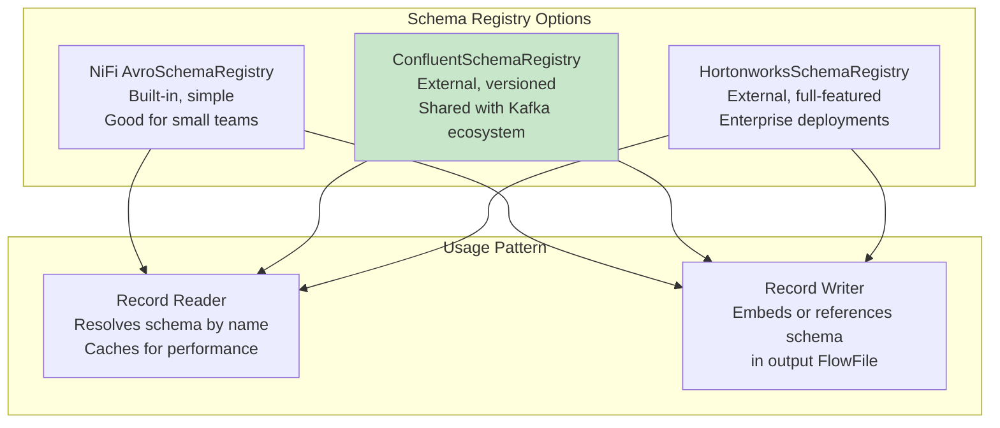
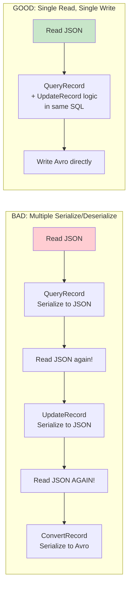

# NiFi Record-Based Processing — Senior Deep Dive

## Schema Registry Integration Patterns



### Dynamic Schema Resolution

```
# Schema name from FlowFile attribute (dynamic!):
JsonTreeReader:
  Schema Access Strategy: Schema Name
  Schema Registry: ConfluentSchemaRegistry
  Schema Name: ${source.system}_${event.type}_v${schema.version}
  
# FlowFile attributes:
#   source.system = "shopify"
#   event.type = "order"
#   schema.version = "3"
# Resolves to: "shopify_order_v3" in Confluent Schema Registry

# This enables:
# - Multiple sources with different schemas → SAME processor
# - Schema versioning per source (v1, v2, v3 coexist)
# - New source/version: just register schema → no flow changes!
```

## Complex Record Types

### Nested Records

```json
// Input: Nested JSON
{
  "order_id": "O001",
  "customer": {
    "id": "C001",
    "name": "Alice",
    "address": {
      "city": "New York",
      "state": "NY"
    }
  },
  "items": [
    {"sku": "P001", "qty": 2, "price": 29.99},
    {"sku": "P002", "qty": 1, "price": 49.99}
  ]
}
```

```
// Avro Schema for nested records:
{
  "type": "record",
  "name": "Order",
  "fields": [
    {"name": "order_id", "type": "string"},
    {"name": "customer", "type": {
      "type": "record",
      "name": "Customer",
      "fields": [
        {"name": "id", "type": "string"},
        {"name": "name", "type": "string"},
        {"name": "address", "type": {
          "type": "record",
          "name": "Address",
          "fields": [
            {"name": "city", "type": "string"},
            {"name": "state", "type": "string"}
          ]
        }}
      ]
    }},
    {"name": "items", "type": {
      "type": "array",
      "items": {
        "type": "record",
        "name": "Item",
        "fields": [
          {"name": "sku", "type": "string"},
          {"name": "qty", "type": "int"},
          {"name": "price", "type": "double"}
        ]
      }
    }}
  ]
}
```

### Record Path for Nested Fields

```
# UpdateRecord with nested Record Paths:
/customer/name = toUpperCase(/customer/name)
/customer/address/city = "Updated City"
/items[*]/price = multiply(/items[*]/price, 1.1)   # 10% price increase on ALL items
/items[0]/qty = 5                                   # Update first item's quantity

# QueryRecord with nested fields (flatten):
SELECT 
    order_id,
    customer.id AS customer_id,
    customer.name AS customer_name,
    customer.address.city AS city
FROM FLOWFILE
-- Dot notation accesses nested fields!
```

## Performance Optimization for Record Processing

### Streaming Architecture

```
# Record processors use STREAMING (constant memory):
# 1. Reader opens input stream
# 2. Reader yields one record at a time
# 3. Processor processes single record
# 4. Writer writes single record to output
# 5. Repeat until end of stream
# 
# Memory: O(1) per record, regardless of FlowFile size!
# 10GB file with 100M records: same memory as 1KB file with 10 records!

# Exception: QueryRecord with GROUP BY
# Must buffer all records for aggregation → memory proportional to data size
# Mitigation: SplitRecord → QueryRecord (smaller batches)
```

### Optimizing Record Pipeline Throughput

```
# ANTI-PATTERN: Process each record individually
# ConsumeKafka (1 record/FlowFile) → ConvertRecord → UpdateRecord → PutDB
# Result: 1000 FlowFiles/sec × overhead per FF = slow!

# BEST PRACTICE: Batch records, then process in bulk
# ConsumeKafka → MergeRecord (10K records) → ConvertRecord → UpdateRecord → PutDB
# Result: 1 FlowFile/sec with 10K records = much less overhead!

# Performance comparison:
# 1 record/FlowFile:  ~1,000 records/sec (per-FF overhead dominates)
# 10K records/FlowFile: ~500,000 records/sec (streaming, minimal overhead)
# 500x throughput improvement from batching!
```

### Avoiding Unnecessary Serialization



```sql
-- Combine filter + transform in single QueryRecord:
-- Instead of: QueryRecord (filter) → UpdateRecord (transform)
-- Do: QueryRecord with transform in SELECT:

SELECT 
    order_id,
    customer_name,
    amount * fx_rate AS amount_usd,          -- Transform!
    UPPER(region) AS region,                 -- Transform!
    CURRENT_TIMESTAMP AS processed_at        -- Add field!
FROM FLOWFILE
WHERE amount > 0 AND customer_id IS NOT NULL  -- Filter!

-- One processor does: filter + multiple transforms + add fields
-- Saves: 1 serialize + 1 deserialize cycle (significant at scale!)
```

## Custom Record Path Functions

```
# Built-in RecordPath functions:
concat(/first, ' ', /last)            -- String concatenation
substring(/text, 0, 100)              -- Substring
toUpperCase(/name)                    -- Case conversion
toLowerCase(/email)                   -- Case conversion
coalesce(/preferred_name, /name)      -- First non-null
replaceAll(/phone, '[^0-9]', '')      -- Regex replace
format(toDate(/ts, 'epoch'), 'yyyy-MM-dd')  -- Date formatting
fieldName(.)                          -- Current field name
toString(/amount)                     -- Type conversion

# Conditional logic:
if(/amount > 1000, 'high', 'normal')  -- If/else
/status[./. = 'active']               -- Predicate filter

# Array operations:
/items[*]/price                       -- All prices in array
/items[0]/sku                         -- First item's SKU
/items[0..-1]                         -- All items (slice)
```

## Schema-on-Write Pattern

```
# Pattern: Accept any JSON (schema-on-read), validate + enforce schema on write

# Ingestion (flexible, no schema):
ConsumeKafka:
  Value Deserializer: String
  # Accept ANY JSON structure from Kafka
  
# Attempt to parse with schema:
ConvertRecord:
  Record Reader: JsonTreeReader (Schema: Infer Schema)
  Record Writer: AvroRecordSetWriter (Schema: target_schema_v1)
  # If data matches target schema → success
  # If data doesn't match → failure relationship

# Valid → Write (schema enforced!):
PutDatabaseRecord (valid records, typed, guaranteed structure)

# Invalid → Quarantine (investigate schema mismatch):
PutS3Object (quarantine bucket, original JSON preserved)
```

## Interview Tips

> **Tip 1:** "How do you optimize record processing throughput?" — (1) Batch records (MergeRecord: 10K+ per FlowFile). (2) Combine operations (QueryRecord can filter + transform + add fields in one SQL). (3) Avoid unnecessary serialization (don't chain 5 record processors that each read/write). (4) Use cached lookups (LookupRecord with 50K entry cache). (5) Match reader/writer formats to minimize conversion overhead.

> **Tip 2:** "How do you handle nested/complex records?" — Avro schemas support nested records (record within record) and arrays. Record Path uses dot notation for nesting (`/customer/address/city`) and brackets for arrays (`/items[*]/price`). QueryRecord supports dot notation in SQL (`customer.address.city`). For deeply nested → consider flattening with QueryRecord before downstream processing.

> **Tip 3:** "Schema Registry vs. Infer Schema?" — Registry: production choice. Explicit types, versioned, shared across ecosystem (Kafka producers use same schemas). Infer: development/exploration only. May guess wrong types (is "123" a string or int?). Always use explicit schemas in production for data quality guarantees. Dynamic schema resolution (`${schema_name}` from attributes) enables multi-source processing.
