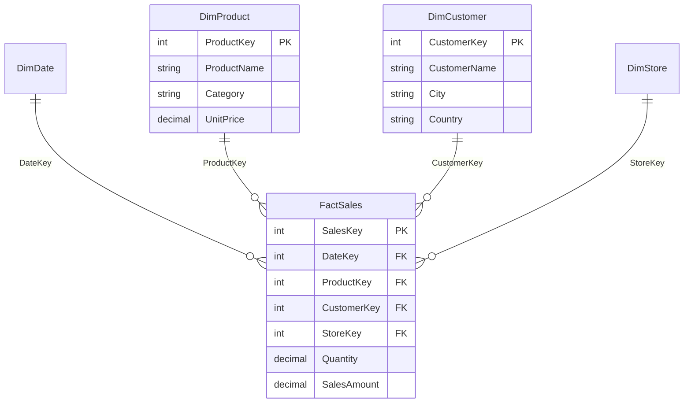

# Data Modeling — Fundamentals

## What Is a Data Model in Power BI?

A data model in Power BI is a structured collection of tables, relationships, and calculations that defines how your data is organized and how tables connect to each other. Power BI uses a columnar in-memory engine called **VertiPaq** to store and compress the model.

When you load data into Power BI Desktop, you are building a model that the DAX engine queries when visuals render.

---

## Why Does Data Modeling Matter?

- **Performance**: A well-structured model compresses better and queries faster.
- **Correctness**: Wrong relationships produce wrong numbers.
- **Maintainability**: A clean model is easier to extend and debug.
- **DAX simplicity**: Good model design keeps DAX measures simple.

---

## Core Concepts

### Tables

| Table Type | Purpose | Examples |
|---|---|---|
| Fact table | Stores measurable events/transactions | Sales, Orders, PageViews |
| Dimension table | Stores descriptive attributes | Customer, Product, Date |
| Bridge table | Resolves many-to-many relationships | CustomerProduct, TagMap |
| Parameter table | Holds user-selectable values | Metric Selector, What-If |

### Keys

- **Primary key**: Unique identifier in a dimension table (e.g., `CustomerID`)
- **Foreign key**: Reference to a dimension's primary key in a fact table
- **Surrogate key**: System-generated integer key (preferred over natural/business keys)

---

## Star Schema

The star schema is the recommended pattern for Power BI. One central fact table connects to multiple dimension tables.

```
         DimDate
            |
DimProduct--FactSales--DimCustomer
            |
         DimStore
```

**Benefits:**
- Fewer joins at query time
- Simpler DAX (RELATED works cleanly)
- Better VertiPaq compression (low-cardinality dimension columns)

### Example Tables

**FactSales**

| SalesKey | DateKey | ProductKey | CustomerKey | Quantity | SalesAmount |
|---|---|---|---|---|---|
| 1 | 20240101 | 101 | 501 | 2 | 49.98 |
| 2 | 20240101 | 203 | 502 | 1 | 199.00 |

**DimProduct**

| ProductKey | ProductName | Category | SubCategory | UnitPrice |
|---|---|---|---|---|
| 101 | Widget A | Electronics | Gadgets | 24.99 |
| 203 | Desk Chair | Furniture | Seating | 199.00 |

**DimDate**

| DateKey | Date | Year | Quarter | Month | MonthName | DayOfWeek |
|---|---|---|---|---|---|---|
| 20240101 | 2024-01-01 | 2024 | Q1 | 1 | January | Monday |

---

## Snowflake Schema

A snowflake schema normalizes dimension tables into sub-dimensions.

```
DimSubCategory
      |
DimCategory
      |
DimProduct--FactSales
```

**When to avoid in Power BI:**
- More relationships = more complex DAX
- Power BI's VertiPaq handles denormalization efficiently
- Extra joins degrade performance

**Best practice**: Flatten snowflake dimensions into a single denormalized dimension table using Power Query before loading to the model.

---

## Relationships

### Creating a Relationship

In Power BI Desktop:
1. Go to **Model view**
2. Drag a column from one table to another, or
3. Use **Manage Relationships** dialog

### Relationship Properties

| Property | Options | Notes |
|---|---|---|
| Cardinality | One-to-many, Many-to-one, One-to-one, Many-to-many | One-to-many is the default and most common |
| Cross-filter direction | Single, Both | Single is safer; Both can cause ambiguity |
| Active/Inactive | Active (solid line), Inactive (dashed line) | Only active relationships filter automatically |

### Cardinality Types

**One-to-Many (1:*)** — Most common
- The "one" side is a dimension table (unique key)
- The "many" side is a fact table (repeated foreign key)
- Filters flow from dimension → fact

**Many-to-Many (*:*)** — Requires care
- Direct many-to-many (Power BI handles natively since 2019)
- Or use a bridge table to resolve

**One-to-One (1:1)** — Rare
- Usually indicates tables should be merged

---

## Mermaid Diagram: Star Schema



---

## Calculated Columns vs Measures

This is one of the most important distinctions in Power BI.

| Aspect | Calculated Column | Measure |
|---|---|---|
| Evaluated | At data refresh (row by row) | At query time (aggregated) |
| Storage | Stored in the model, uses RAM | Not stored, computed on demand |
| Row context | Yes — operates row by row | No row context by default |
| Filter context | Uses current row only | Uses full filter context from visuals |
| Use case | Categorize, slice, filter | Aggregate, calculate KPIs |
| DAX example | `= [Price] * [Quantity]` | `= SUM(FactSales[SalesAmount])` |

### When to Use a Calculated Column
- You need to **slice or filter** by the result (e.g., price band, age group)
- The value is **row-specific** and does not aggregate

### When to Use a Measure
- You are **aggregating** data (SUM, COUNT, AVERAGE)
- The result should change based on filters applied by the user

```dax
-- Calculated Column (in DimProduct table)
Price Band =
IF(DimProduct[UnitPrice] < 50, "Budget",
   IF(DimProduct[UnitPrice] < 200, "Mid-Range", "Premium"))

-- Measure (in a measure table)
Total Sales = SUM(FactSales[SalesAmount])

Average Order Value =
DIVIDE(SUM(FactSales[SalesAmount]), COUNTROWS(FactSales))
```

---

## Relationships and Filter Direction

By default, filters flow **from the one side to the many side** (from dimension to fact).

```
DimProduct (one) ──► FactSales (many)
```

- When you filter DimProduct by Category = "Electronics", FactSales automatically shows only electronics sales.
- This is **single cross-filter direction**.

**Bidirectional filtering** allows filters to flow both ways. Use with caution:
- Can cause **ambiguity** in complex models (circular paths)
- Can produce **unexpected results** in DAX
- Only use when absolutely necessary (e.g., many-to-many with bridge tables)

---

## Role-Playing Dimensions

A single dimension table can be related to a fact table **multiple times** through different roles.

Common example: a `DimDate` table joined to `FactSales` via both `OrderDate` and `ShipDate`.

Since Power BI allows only **one active relationship** between two tables, you mark one as active and the others as inactive.

```dax
-- Uses active relationship (OrderDate)
Sales by Order Date = SUM(FactSales[SalesAmount])

-- Uses inactive relationship (ShipDate) via USERELATIONSHIP
Sales by Ship Date =
CALCULATE(
    SUM(FactSales[SalesAmount]),
    USERELATIONSHIP(FactSales[ShipDateKey], DimDate[DateKey])
)
```

---

## Date Table Best Practices

Always create a dedicated date table marked as a **Date Table** in Power BI. This enables time intelligence DAX functions.

**Requirements for a date table:**
- Must have a column of type `Date`
- Must have **no gaps** (every date from min to max)
- Must be marked as "Mark as date table" in Power BI Desktop

```dax
-- Example: Create a date table in DAX
DateTable =
ADDCOLUMNS(
    CALENDAR(DATE(2020, 1, 1), DATE(2026, 12, 31)),
    "Year", YEAR([Date]),
    "Quarter", "Q" & QUARTER([Date]),
    "Month", MONTH([Date]),
    "MonthName", FORMAT([Date], "MMMM"),
    "Weekday", WEEKDAY([Date], 2),
    "IsWeekend", IF(WEEKDAY([Date], 2) >= 6, TRUE, FALSE)
)
```

---

## Naming Conventions

| Object | Convention | Example |
|---|---|---|
| Fact tables | `Fact` prefix | `FactSales`, `FactOrders` |
| Dimension tables | `Dim` prefix | `DimCustomer`, `DimProduct` |
| Bridge tables | `Bridge` prefix | `BridgeCustomerSegment` |
| Measures | Plain descriptive name | `Total Revenue`, `Gross Margin %` |
| Calculated columns | Plain descriptive name | `Price Band`, `Full Name` |
| Measure tables | `_Measures` suffix | `Sales_Measures` |

---

## Hidden Columns

Hide foreign key columns (like `ProductKey` in `FactSales`) from report view — end users should filter by name, not by key.

- Right-click a column in Model view → **Hide in report view**
- Keeps the model clean and user-friendly
- Keys still work for relationships even when hidden

---

## Common Beginner Mistakes

| Mistake | Problem | Fix |
|---|---|---|
| Snowflake dimensions | Complex DAX, slower queries | Flatten in Power Query |
| Bidirectional on all relationships | Ambiguity, wrong results | Single-direction by default |
| No date table | Time intelligence breaks | Create a proper date table |
| Using calculated columns for metrics | Wastes RAM, context issues | Use measures instead |
| Many-to-many without bridge | Unexpected cross-filtering | Use bridge table or evaluate necessity |
| Mixed granularity in fact table | Double-counting | Separate fact tables per granularity |

---

## Summary

- Use **star schema** with fact and dimension tables
- **Flatten** snowflake dimensions in Power Query
- Prefer **single cross-filter direction** on relationships
- Use **measures** for aggregations, **calculated columns** for row-level attributes
- Always have a proper **date table**
- Use **surrogate keys** for relationships
- **Hide** technical key columns from report view
