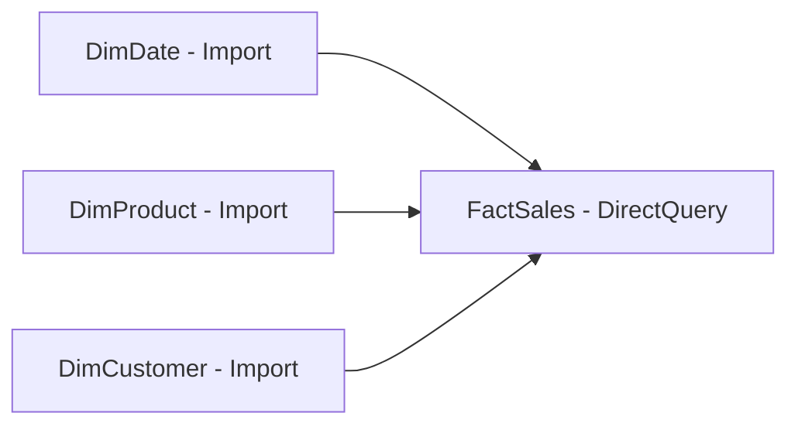

# Data Modeling — Intermediate

## Many-to-Many Relationships

### Direct Many-to-Many (Power BI Native)

Since Power BI Desktop 2019, you can create a many-to-many relationship directly between two tables without a bridge table. Power BI uses **limited relationships** internally.

**When it works:**
- Lookup-style scenarios (territory/product assignment)
- Budget vs actuals at different granularities

**Risks:**
- Unexpected blank rows in visuals
- Double-counting if not carefully managed
- Cross-filtering behavior can be unintuitive

```
DimSalesperson (*) ──── (*) DimTerritory
```

### Bridge Table Pattern (Recommended)

For reliable many-to-many, use a bridge table:

```
DimCustomer (1) ──── (*) BridgeCustomerSegment (*) ──── (1) DimSegment
```

```dax
-- Measure that works correctly with bridge table
Revenue by Segment =
CALCULATE(
    SUM(FactSales[SalesAmount]),
    TREATAS(
        VALUES(DimSegment[SegmentKey]),
        BridgeCustomerSegment[SegmentKey]
    )
)
```

The bridge table `BridgeCustomerSegment` contains one row per (CustomerKey, SegmentKey) combination.

---

## Composite Models

A **Composite Model** in Power BI combines Import mode and DirectQuery mode tables in the same model.



**Benefits:**
- Large fact tables stay in the source database (no import size limit)
- Dimension tables are cached in-memory for fast filtering
- Best of both worlds

**Limitations:**
- Some DAX functions behave differently with DirectQuery tables
- Relationships between DirectQuery and Import tables have restrictions
- Not all data sources support composite models

### Storage Modes

| Mode | Data Location | Refresh | Speed |
|---|---|---|---|
| Import | VertiPaq (in-memory) | On-demand | Fastest |
| DirectQuery | Source database | Real-time | Depends on source |
| Dual | Both (acts as Import when possible) | On-demand | Fast |

**Dual mode** tables (typically dimensions) can serve either Import or DirectQuery queries depending on which tables they join with in a given query.

```
-- Set via Properties pane in Model view
-- No DAX code needed — configuration only
```

---

## Aggregation Tables

Aggregation tables pre-summarize large fact tables at a higher grain, dramatically improving query performance for common aggregations.

### Setup Pattern

```
FactSales (100M rows, DirectQuery)
    |
AggSalesByMonth (1,200 rows, Import) -- 12 months × 100 products
```

**Steps:**
1. Create an aggregation table (pre-aggregated, often in the source or via Power Query)
2. Load it as Import mode
3. In Model view, right-click the agg table → **Manage Aggregations**
4. Map each aggregated column back to the detail table

| Agg Column | Summarization | Detail Table | Detail Column |
|---|---|---|---|
| SalesAmount | Sum | FactSales | SalesAmount |
| Quantity | Sum | FactSales | Quantity |
| DateKey | GroupBy | FactSales | DateKey |
| ProductKey | GroupBy | FactSales | ProductKey |

Power BI automatically uses the agg table when a query can be satisfied by it (higher-grain queries), and falls back to the detail table only when needed.

---

## Calculated Tables

Calculated tables are created entirely in DAX. They are computed at refresh time and stored in the model.

```dax
-- Date table
DimDate =
ADDCOLUMNS(
    CALENDAR(DATE(2020,1,1), DATE(2026,12,31)),
    "Year",        YEAR([Date]),
    "YearMonth",   FORMAT([Date], "YYYY-MM"),
    "Quarter",     "Q" & FORMAT([Date], "Q"),
    "MonthNum",    MONTH([Date]),
    "MonthName",   FORMAT([Date], "MMMM"),
    "WeekNum",     WEEKNUM([Date]),
    "DayName",     FORMAT([Date], "dddd"),
    "IsWeekend",   WEEKDAY([Date], 2) >= 6,
    "FiscalYear",  IF(MONTH([Date]) >= 7, YEAR([Date]) + 1, YEAR([Date]))
)

-- Union table combining two regional sales tables
AllSales =
UNION(
    SELECTCOLUMNS(SalesNorth, "Region", "North", "SalesAmount", SalesNorth[SalesAmount], "DateKey", SalesNorth[DateKey]),
    SELECTCOLUMNS(SalesSouth, "Region", "South", "SalesAmount", SalesSouth[SalesAmount], "DateKey", SalesSouth[DateKey])
)
```

---

## Model Relationships: Advanced Patterns

### Inactive Relationship + USERELATIONSHIP

```dax
-- FactOrders has both OrderDate and ShipDate foreign keys to DimDate
-- Only OrderDate relationship is active

Shipped Revenue =
CALCULATE(
    SUM(FactOrders[Revenue]),
    USERELATIONSHIP(FactOrders[ShipDateKey], DimDate[DateKey])
)

-- In a report, this measure uses the ShipDate axis
-- even though the slicer is connected to the active OrderDate relationship
```

### Cross-Table Filtering with CROSSFILTER

```dax
-- Temporarily change cross-filter direction within a measure
Customers with Sales =
CALCULATE(
    DISTINCTCOUNT(DimCustomer[CustomerKey]),
    CROSSFILTER(FactSales[CustomerKey], DimCustomer[CustomerKey], Both)
)
```

### Disconnected Tables (Parameter/Slicer Tables)

A disconnected table has no relationship to the rest of the model. It is used to drive dynamic behavior through `SELECTEDVALUE`.

```dax
-- Metric Selector table (no relationships)
-- Columns: MetricID, MetricName
-- Values: 1-Revenue, 2-Quantity, 3-Profit

Dynamic Metric =
VAR SelectedMetric = SELECTEDVALUE('MetricSelector'[MetricID], 1)
RETURN
    SWITCH(
        SelectedMetric,
        1, [Total Revenue],
        2, [Total Quantity],
        3, [Gross Profit],
        [Total Revenue]  -- default
    )
```

---

## Data Granularity

Mixing granularities in a single fact table causes double-counting. Separate concerns into different fact tables.

### Example: Sales vs Targets

| Scenario | Wrong Approach | Right Approach |
|---|---|---|
| Sales (daily) + Targets (monthly) | One table, nulls for missing granularity | Two fact tables, different grain |
| Orders + Order Lines | Mix header and line data | Separate FactOrders + FactOrderLines |

```dax
-- Correct: Targets at monthly grain joined to DimDate at month level
-- Create a bridge from monthly targets to daily sales via DimDate

Target Attainment % =
DIVIDE(
    [Total Revenue],
    [Monthly Target]
)

Monthly Target =
CALCULATE(
    SUM(FactTargets[TargetAmount]),
    TREATAS(VALUES(DimDate[YearMonth]), FactTargets[YearMonth])
)
```

---

## Handling Ambiguous Relationships

When multiple relationship paths exist between two tables, Power BI may produce an error or use the wrong path.

**Example:** FactSales → DimDate (via OrderDate) AND FactSales → DimDate (via ShipDate)

Only one can be active. The other becomes inactive (dashed line in diagram).

**Resolution strategies:**
1. Use `USERELATIONSHIP` in measures that need the inactive path
2. Create **role-playing dimension** copies (DimOrderDate, DimShipDate) — same data, different table names, each with its own active relationship

```dax
-- Role-playing dimension approach
-- DimOrderDate and DimShipDate are both copies of the calendar table

Sales by Ship Date =
CALCULATE(
    SUM(FactSales[SalesAmount]),
    USERELATIONSHIP(FactSales[ShipDateKey], DimShipDate[DateKey])
)
```

---

## Model Size Optimization

### Column Cardinality

High-cardinality columns (like GUIDs, timestamps with milliseconds) compress poorly.

| Strategy | Technique |
|---|---|
| Remove unused columns | Only import what you need |
| Round timestamps | Store as date only if time not needed |
| Remove duplicate columns | E.g., don't keep both OrderDate and OrderDateKey if you have DimDate |
| Integer keys | Replace string keys with integers |
| Summarize in Power Query | Pre-aggregate before loading |

### Measuring Model Size

Use **DAX Studio** → **Advanced** → **View Metrics** to see:
- Table size in bytes
- Column cardinality
- Dictionary size
- Segment count

---

## Relationships Checklist

```
✅ One active relationship between any two tables
✅ Dimension primary keys are unique (no duplicates)
✅ Foreign keys in fact table reference valid dimension keys
✅ Date table is marked as "Date Table"
✅ Single cross-filter direction (unless bidirectional is explicitly needed)
✅ Hidden FK columns in fact tables
✅ Surrogate integer keys for all relationships
✅ No circular relationships
✅ Bridge tables used for many-to-many
```

---

## Common Intermediate Patterns

### Slowly Changing Dimension (SCD) Type 2

Track historical changes by adding effective date columns:

```
DimCustomer_SCD2
┌──────────────┬─────────────┬──────────────┬────────────┬──────────────┐
│ CustomerKey  │ CustomerID  │ City         │ ValidFrom  │ ValidTo      │
│ (surrogate)  │ (natural)   │              │            │              │
├──────────────┼─────────────┼──────────────┼────────────┼──────────────┤
│ 101          │ C001        │ New York     │ 2020-01-01 │ 2023-06-30   │
│ 102          │ C001        │ Boston       │ 2023-07-01 │ 9999-12-31   │
└──────────────┴─────────────┴──────────────┴────────────┴──────────────┘
```

Relate `FactSales[CustomerKey]` to `DimCustomer_SCD2[CustomerKey]` to get the correct city at time of sale.

### Measure Table (Organizational Best Practice)

Create an empty table named `_Measures` (or per-subject measure tables) to keep all measures organized:

```dax
-- Create via: Enter Data → empty table named _Measures
-- Move all measures into this table
-- Hide the table's columns (no actual columns, just measures)
```

---

## Summary

- Use **composite models** to combine large DirectQuery facts with small Import dimensions
- **Aggregation tables** dramatically speed up high-level queries
- Use **bridge tables** for reliable many-to-many
- Manage **inactive relationships** with `USERELATIONSHIP`
- **Disconnected tables** enable dynamic metric selection
- Separate **granularities** into different fact tables
- Optimize model size by reducing column **cardinality**
