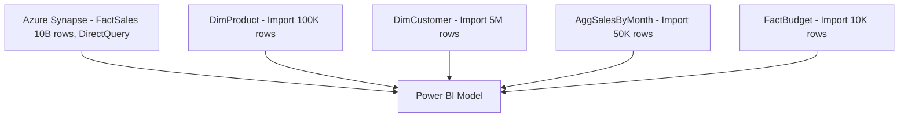

# Data Modeling — Senior Deep Dive

## VertiPaq Engine Internals

Power BI's in-memory engine, **VertiPaq** (also called xVelocity), stores data in a column-oriented format. Understanding its internals is critical for enterprise-scale model optimization.

### Columnar Storage Architecture

Each column is stored independently, compressed using:

1. **Value Encoding** — integers stored as offsets from a base value
2. **Hash Encoding** — strings stored as integer references to a dictionary
3. **RLE (Run-Length Encoding)** — repeated values stored as count+value pairs

**Compression ratio depends on:**
- Column cardinality (low cardinality = better compression)
- Sort order of the table
- Data type (integers compress better than strings)

### Segment Structure

VertiPaq divides table data into **segments** of up to 8 million rows each. Each segment is processed independently. The engine reads only segments that satisfy filter predicates.

```
Table (50M rows)
├── Segment 0 (8M rows)
├── Segment 1 (8M rows)
├── Segment 2 (8M rows)
├── Segment 3 (8M rows)
├── Segment 4 (8M rows)
├── Segment 5 (8M rows)
└── Segment 6 (2M rows)
```

**Optimization**: Sort fact tables by the most-filtered dimension key (e.g., DateKey) before loading to improve segment skipping.

### Relationship Internals

Relationships are stored as **bitmap indexes** mapping fact rows to dimension rows. During a query:
1. Filter on dimension → produces a bitmap of dimension rows
2. Bitmap joined to fact table → produces filtered fact rows
3. Aggregation applied to filtered fact rows

This is why **high-cardinality relationship keys** are expensive — larger bitmaps, more memory.

---

## Advanced Composite Model Architecture

### Hub-and-Spoke with DirectQuery

Enterprise pattern for very large datasets:



**Query routing logic:**
- Report filtered by year → routed to `AggSalesByMonth` (Import, fast)
- Report filtered by individual product → falls through to `FactSales` (DirectQuery, slow but necessary)
- Budget comparison → uses `FactBudget` (Import, fast)

### Agg Table Design Decisions

When designing agg tables, consider which combinations of dimensions analysts commonly slice by:

| Agg Table | Dimensions | Rows | Acceleration |
|---|---|---|---|
| AggByDay | DateKey | 2,190 | Date-only queries |
| AggByDayProduct | DateKey, ProductKey | 500K | Product+date queries |
| AggByDayCustomer | DateKey, CustomerKey | 10M | May not be worth it |
| AggByMonth | YearMonth | 72 | All monthly dashboards |

**Decision rule**: Create an agg table when the agg table row count is < 1% of the detail table row count AND the query pattern uses those dimensions frequently.

---

## DAX Evaluation Context Deep Dive (Model Impact)

The data model structure fundamentally determines how DAX evaluation context flows.

### Filter Context Propagation

Filters propagate along relationship paths in the direction of the cross-filter arrow.

```
DimDate → FactSales → (bidirectional) → DimProduct
```

With bidirectional filtering enabled, filtering FactSales by SalesAmount > 1000 would also filter DimProduct — potentially surprising behavior.

**Senior pattern: Explicit CROSSFILTER control**

```dax
-- Prevent unintended filter propagation
Distinct Products Sold =
CALCULATE(
    DISTINCTCOUNT(FactSales[ProductKey]),
    CROSSFILTER(FactSales[ProductKey], DimProduct[ProductKey], OneWay)
)
```

### Context Transition in Calculated Columns

Context transition (row context → filter context via CALCULATE) is expensive in calculated columns because it runs for every row.

```dax
-- Expensive: context transition for each row
Rank by Revenue =
RANKX(
    ALL(DimProduct),
    CALCULATE(SUM(FactSales[SalesAmount]))  -- context transition here
)

-- Better: pre-compute in Power Query if the rank is static
```

---

## Model Roles and Security Architecture

### Row-Level Security Integration with Model Design

Security roles require careful model design:

```dax
-- Dynamic RLS using hierarchy
[SalesRegion] = LOOKUPVALUE(
    DimEmployee[Region],
    DimEmployee[Email],
    USERPRINCIPALNAME()
)
```

**Design consideration**: For hierarchical security (manager sees all subordinates' data), you need a self-referencing employee dimension or a separate org hierarchy table.

```
DimEmployee
┌─────────────┬───────────────┬──────────────────┐
│ EmployeeKey │ EmployeeName  │ ManagerKey       │
├─────────────┼───────────────┼──────────────────┤
│ 1           │ CEO           │ NULL             │
│ 2           │ VP Sales      │ 1                │
│ 3           │ Sales Manager │ 2                │
└─────────────┴───────────────┴──────────────────┘
```

Implementing "manager sees all subordinates" requires a recursive PATH() function:

```dax
-- Add hierarchy path to DimEmployee
EmployeePath = PATH(DimEmployee[EmployeeKey], DimEmployee[ManagerKey])

-- RLS filter
[EmployeeKey] IN
    PATHITEM(
        FILTER(DimEmployee, PATHCONTAINS([EmployeePath], LOOKUPVALUE(DimEmployee[EmployeeKey], DimEmployee[Email], USERPRINCIPALNAME()))),
        [EmployeePath],
        1
    )
```

---

## Advanced Many-to-Many Patterns

### Shared Dimension (Conformed Dimension)

Multiple fact tables sharing the same dimension enables cross-fact analysis.

```
DimDate ──── FactSales
DimDate ──── FactBudget
DimDate ──── FactInventory
```

```dax
-- Budget vs Actual using shared DimDate
Variance =
[Total Revenue] - [Total Budget]

-- Both measures use the same DimDate filter context
-- No special handling needed with conformed dimensions
```

### Fact-to-Fact Relationships (Anti-Pattern)

**Never create direct relationships between two fact tables.** Instead, use dimensions as intermediaries.

```
-- WRONG: Direct fact-to-fact
FactSales ──── FactReturns  -- Ambiguous, performance issues

-- CORRECT: Both relate to shared dimension
DimOrder ──── FactSales
DimOrder ──── FactReturns
```

---

## Object-Level Security (OLS)

OLS hides entire tables or columns from specific roles, even in DAX.

```
-- Configured in Tabular Editor or XMLA endpoint
-- Cannot be done in Power BI Desktop UI alone (as of 2024)

-- Example: Hide sensitive salary column from non-HR roles
Table: DimEmployee
Column: AnnualSalary
Metadata Permission: None (for all roles except HR)
```

**Important**: OLS prevents the column from appearing in visuals, filter panes, and DAX. If a measure references a hidden column for a user without access, the measure returns a blank/error, not an error message.

---

## Tabular Object Model (TOM) and XMLA

For enterprise deployments, manage models programmatically via the **XMLA endpoint** (Premium/PPU only).

```csharp
// C# example: Connecting to XMLA endpoint
var server = new Microsoft.AnalysisServices.Tabular.Server();
server.Connect("powerbi://api.powerbi.com/v1.0/myorg/WorkspaceName");

var database = server.Databases["DatasetName"];
var model = database.Model;

// Add a measure programmatically
var table = model.Tables["_Measures"];
var measure = new Microsoft.AnalysisServices.Tabular.Measure {
    Name = "New Measure",
    Expression = "SUM(FactSales[SalesAmount])"
};
table.Measures.Add(measure);
model.SaveChanges();
```

**XMLA use cases:**
- CI/CD deployments of Power BI models
- Source-controlling model definitions
- Programmatic partition management
- Applying changes across many reports at once

---

## Performance Optimization Framework

### Query Plan Analysis

Use **DAX Studio** to inspect query plans:

1. **Storage Engine (SE) queries** — fast, parallel, uses VertiPaq cache
2. **Formula Engine (FE) queries** — slow, serial, computed row by row

Goal: maximize SE work, minimize FE work.

```
-- Slow measure: forces FE
Slow Rank =
RANKX(ALL(DimProduct), [Total Revenue])

-- The RANKX iterates every product in FE — acceptable but expensive at scale
-- Mitigate: Limit the table being ranked (don't use ALL for huge dimensions)
```

### Cold vs Warm Cache

Power BI has two cache layers:
- **VertiPaq Cache**: In-memory compressed data (always present after load)
- **Visual Cache**: Cached query results per visual (cleared on model refresh)

For benchmarking, always clear cache in DAX Studio before measuring:

```
-- DAX Studio: Clear cache before benchmarking
CLEAR CACHE;
EVALUATE SUMMARIZECOLUMNS(DimDate[Year], "Revenue", [Total Revenue])
```

### Model Design Anti-Patterns and Their Costs

| Anti-Pattern | VertiPaq Impact | Fix |
|---|---|---|
| Calculated columns with CALCULATE | Context transition per row | Move to Power Query |
| Datetime columns in fact tables | High cardinality, poor compression | Split to date + time integer columns |
| String FK columns | Large dictionary, slow joins | Convert to integer surrogate keys |
| Many-to-many without agg tables | Full scan of both tables | Add agg table or pre-aggregate |
| Bidirectional + complex model | Ambiguous paths, slow FE | Single direction + explicit CROSSFILTER |
| Unused columns loaded | Wasted RAM | Remove in Power Query before load |

---

## Enterprise Model Governance

### Certified Datasets and Endorsement

In large organizations, use the Power BI Service endorsement workflow:

```
Developer creates dataset
    → Data owner promotes to "Promoted"
    → BI governance team certifies as "Certified"
    → End users see certified badge in data hub
```

**Model versioning with deployment pipelines:**

```
Development workspace → Test workspace → Production workspace
    ↑ Dev makes changes      ↑ QA validates      ↑ End users connect
```

### Large Model Storage Format

For models > 1 GB (Premium only), enable **Large Model Storage Format**:
- Removes the 1 GB RAM limit on models
- Stores model in Azure Premium Files
- Supports models up to 400 GB
- Requires Premium capacity P1 or higher

---

## Summary

- Master VertiPaq internals to **optimize compression and segment skipping**
- Design **composite models** with agg tables for large DirectQuery datasets
- Control filter propagation explicitly with **CROSSFILTER** in complex models
- Implement **hierarchical RLS** using PATH functions
- Use **XMLA endpoints and TOM** for enterprise CI/CD of models
- Analyze query plans in **DAX Studio** to minimize Formula Engine work
- Enforce **OLS** for column/table-level security beyond row-level security
